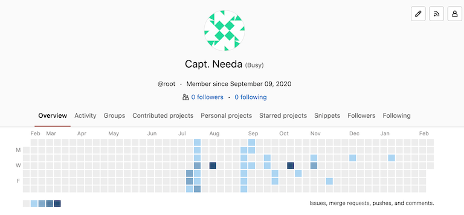
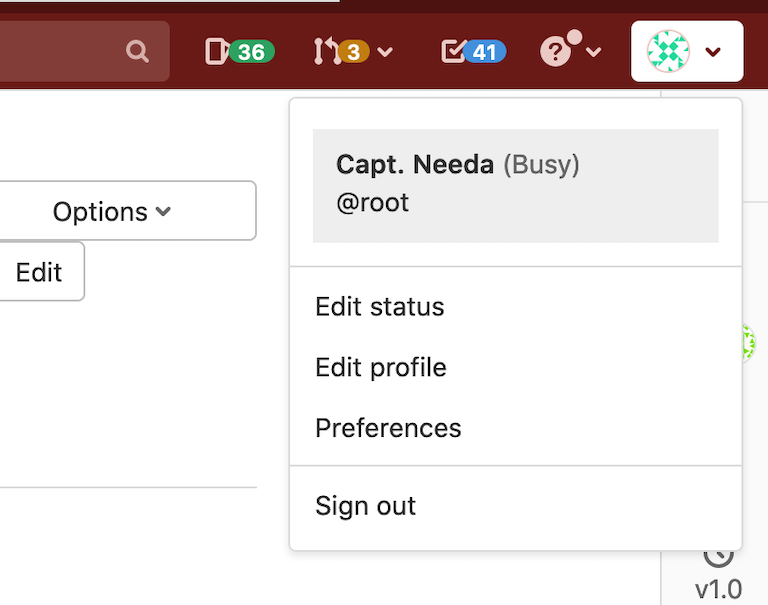
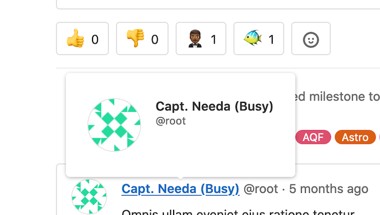
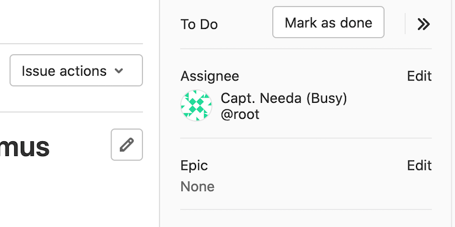
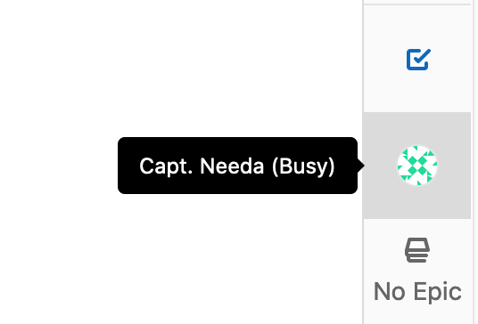
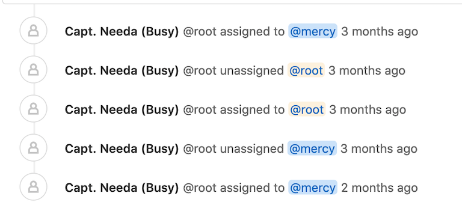
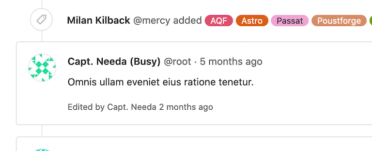

# User account

Each GitLab account has a user profile, which contains information about you and your GitLab activity.

Your profile also includes settings, which you use to customize your GitLab experience.

## Access your user profile

To access your profile:

1. In the top-right corner, select your avatar.
1. Select your name or username.

## Access your user settings

To access your user settings:

1. In the top-right corner, select your avatar.
1. Select **Edit profile**.

## Change your password

To change your password:

1. In the top-right corner, select your avatar.
1. Select **Edit profile**.
1. In the left sidebar, select **Password**.
1. In the **Current password** field, enter your current password.
1. In the **New password** and **Password confirmation** field, enter your new password.
1. Select **Save password**.

If you don't know your current password, select the **I forgot my password** link.

## Change your username

Your username has a unique [namespace](../group/index.md#namespaces),
which is updated when you change your username. Before you change your username, read about
[how redirects behave](../project/repository/index.md#what-happens-when-a-repository-path-changes).
If you do not want to update the namespace, you can create a new user or group and transfer projects to it instead.

Prerequisites:

- Your namespace cannot contain a project with [Container Registry](../packages/container_registry/index.md) tags.
- Your namespace cannot have a project that hosts [GitLab Pages](../project/pages/index.md). For more information,
  see [this procedure in the GitLab Team Handbook](https://about.gitlab.com/handbook/tools-and-tips/#how-to-change-your-username-at-gitlabcom).

To change your username:

1. In the top-right corner, select your avatar.
1. Select **Edit profile**.
1. In the left sidebar, select **Account**.
1. In the **Change username** section, enter a new username as the path.
1. Select **Update username**.

## Make your user profile page private

You can make your user profile visible to only you and GitLab administrators.

To make your profile private:

1. In the top-right corner, select your avatar.
1. Select **Edit profile**.
1. Select the **Private profile** checkbox.
1. Select **Update profile settings**.

The following is hidden from your user profile page (`https://gitlab.example.com/username`):

- Atom feed
- Date when account was created
- Tabs for activity, groups, contributed projects, personal projects, starred projects, snippets

NOTE:
Making your user profile page private does not hide your public resources from the REST or GraphQL APIs.

### User visibility

The public page of a user, located at `/username`, is always visible whether you are signed-in or
not.

When visiting the public page of a user, you can only see the projects which you have privileges to.

If the [public level is restricted](../admin_area/settings/visibility_and_access_controls.md#restricted-visibility-levels),
user profiles are only visible to signed-in users.

## Add external accounts to your user profile page

You can add links to certain other external accounts you might have, like Skype and Twitter.
They can help other users connect with you on other platforms.

To add links to other accounts:

1. In the top-right corner, select your avatar.
1. Select **Edit profile**.
1. In the **Main settings** section, add your information from:
   - Skype
   - LinkedIn
   - Twitter
1. Select **Update profile settings**.

## Show private contributions on your user profile page

> [Introduced](https://gitlab.com/gitlab-org/gitlab-foss/-/issues/14078) in GitLab 11.3.

In the user contribution calendar graph and recent activity list, you can see your [contribution actions](../../api/events.md#action-types) to private projects.

To show private contributions:

1. In the top-right corner, select your avatar.
1. Select **Edit profile**.
1. In the **Main settings** section, select the **Include private contributions on my profile** checkbox.
1. Select **Update profile settings**.

## Add your gender pronouns

> [Introduced](https://gitlab.com/gitlab-org/gitlab/-/issues/332405) in GitLab 14.0.

You can add your gender pronouns to your GitLab account to be displayed next to
your name in your profile.

To specify your pronouns:

1. In the top-right corner, select your avatar.
1. Select **Edit profile**.
1. In the **Pronouns** field, enter your pronouns.
1. Select **Update profile settings**.

## Set your current status

> - Introduced in GitLab 11.2.
> - [Improved](https://gitlab.com/gitlab-org/gitlab/-/merge_requests/56649) in GitLab 13.10.

You can provide a custom status message for your user profile along with an emoji that describes it.
This may be helpful when you are out of office or otherwise not available.

Your status is publicly visible even if your [profile is private](#make-your-user-profile-page-private).

To set your current status:

1. In the top-right corner, select your avatar.
1. Select **Set status** or, if you have already set a status, **Edit status**.
1. Set the desired emoji and status message. Status messages must be plain text and 100 characters or less.
   They can also contain emoji codes like, `I'm on vacation :palm_tree:`.
1. Select a value from the **Clear status after** dropdown.
1. Select **Set status**. Alternatively, you can select **Remove status** to remove your user status entirely.

You can also set your current status by [using the API](../../api/users.md#user-status).

If you select the **Busy** checkbox, remember to clear it when you become available again.

## Set a busy status indicator

> - [Introduced](https://gitlab.com/gitlab-org/gitlab/-/issues/259649) in GitLab 13.6.
> - It was [deployed behind a feature flag](../feature_flags.md), disabled by default.
> - [Became enabled by default](https://gitlab.com/gitlab-org/gitlab/-/issues/281073) in GitLab 13.8.
> - [Feature flag removed](https://gitlab.com/gitlab-org/gitlab/-/issues/329163) in GitLab 13.12.

To indicate to others that you are busy, you can set an indicator.

To set the busy status indicator, either:

- Set it directly:
  1. In the top-right corner, select your avatar.
  1. Select **Set status** or, if you have already set a status, **Edit status**.
  1. Select the **Busy** checkbox.

- Set it on your profile:
  1. In the top-right corner, select your avatar.
  1. Select **Edit profile**.
  1. In the **Current status** section, select the **Busy** checkbox.

  The busy status is displayed in the user interface.

  Username:

  | Profile page | Settings menu | User popovers |
  | --- | --- | --- |
  |  |  |  |

  Issue and merge request sidebar:

  | Sidebar| Collapsed sidebar |
  | --- | --- |
  |  |  |

  Notes:

  | Notes | Note headers |
  | --- | --- |
  |  |  |

## Change the email displayed on your commits

> [Introduced](https://gitlab.com/gitlab-org/gitlab-foss/-/merge_requests/21598) in GitLab 11.4.

A commit email is an email address displayed in every Git-related action carried out through the GitLab interface.

Any of your own verified email addresses can be used as the commit email.

To change your commit email:

1. In the top-right corner, select your avatar.
1. Select **Edit profile**.
1. In the **Commit email** list, select an email address.
1. Select **Update profile settings**.

### Use an automatically-generated private commit email

> [Introduced](https://gitlab.com/gitlab-org/gitlab-foss/-/merge_requests/22560) in GitLab 11.5.

GitLab provides an automatically-generated private commit email address,
so you can keep your email information private.

To use a private commit email:

1. In the top-right corner, select your avatar.
1. Select **Edit profile**.
1. In the **Commit email** list, select the **Use a private email** option.
1. Select **Update profile settings**.

Every Git-related action uses the private commit email.

To stay fully anonymous, you can also copy the private commit email
and configure it on your local machine by using the following command:

```shell
git config --global user.email <your email address>
```

## Troubleshooting

### Why do I keep getting signed out?

When you sign in to the main GitLab application, a `_gitlab_session` cookie is
set. When you close your browser, the cookie is cleared client-side
and it expires after "Application settings > Session duration (minutes)"/`session_expire_delay`
(defaults to `10080` minutes = 7 days) of no activity.

When you sign in to the main GitLab application, you can also check the
**Remember me** option. This sets the `remember_user_token`
cookie via [`devise`](https://github.com/heartcombo/devise).
The `remember_user_token` cookie expires after
`config/initializers/devise.rb` -> `config.remember_for`. The default is 2 weeks.

When the `_gitlab_session` expires or isn't available, GitLab uses the `remember_user_token`
to get you a new `_gitlab_session` and keep you signed in through browser restarts.

After your `remember_user_token` expires and your `_gitlab_session` is cleared/expired,
you are asked to sign in again to verify your identity for security reasons.

NOTE:
When any session is signed out, or when a session is revoked
via [Active Sessions](active_sessions.md), all **Remember me** tokens are revoked.
While other sessions remain active, the **Remember me** feature doesn't restore
a session if the browser is closed or the existing session expires.

### Increased sign-in time

> [Introduced](https://gitlab.com/gitlab-org/gitlab/-/issues/20340) in GitLab 13.1.

The `remember_user_token` lifetime of a cookie can now extend beyond the deadline set by `config.remember_for`, as the `config.extend_remember_period` flag is now set to true.

GitLab uses both session and persistent cookies:

- Session cookie: Session cookies are normally removed at the end of the browser session when
  the browser is closed. The `_gitlab_session` cookie has no fixed expiration date. However,
  it expires based on its [`session_expire_delay`](#why-do-i-keep-getting-signed-out).
- Persistent cookie: The `remember_user_token` is a cookie with an expiration date of two weeks.
  GitLab activates this cookie if you select **Remember Me** when you sign in.

By default, the server sets a time-to-live (TTL) of 1-week on any session that is used.

When you close a browser, the session cookie may still remain. For example, Chrome has the "Continue where you left off" option that restores session cookies.
In other words, as long as you access GitLab at least once every 2 weeks, you could remain signed in with GitLab, as long as your browser tab is open.
The server continues to reset the TTL for that session, independent of whether 2FA is installed,
If you close your browser and open it up again, the `remember_user_token` cookie allows your user to reauthenticate itself.

Without the `config.extend_remember_period` flag, you would be forced to sign in again after two weeks.

## Related topics

- [Create users](account/create_accounts.md)
- [Sign in to your GitLab account](../../topics/authentication/index.md)
- [Receive emails for sign-ins from unknown IP addresses or devices](unknown_sign_in_notification.md)
- Manage applications that can [use GitLab as an OAuth provider](../../integration/oauth_provider.md#introduction-to-oauth)
- Manage [personal access tokens](personal_access_tokens.md) to access your account via API and authorized applications
- Manage [SSH keys](../../ssh/index.md) to access your account via SSH
- Change your [syntax highlighting theme](preferences.md#syntax-highlighting-theme)
- [View your active sessions](active_sessions.md) and revoke any of them if necessary
