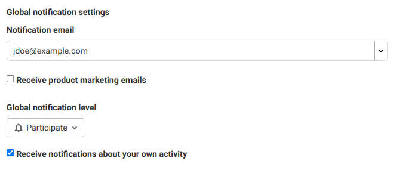
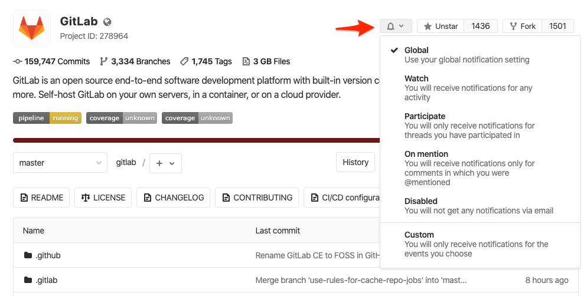
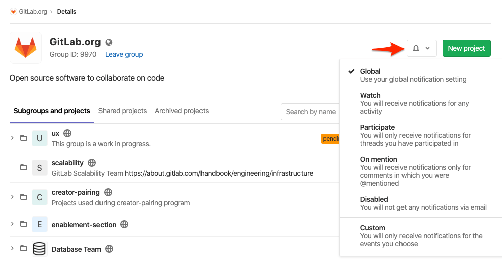

# GitLab Notification Emails **(FREE)**

GitLab Notifications allow you to stay informed about what's happening in GitLab. With notifications
enabled, you can receive updates about activity in issues, merge requests, epics, and designs.
Notifications are sent via email.

For the tool that enables GitLab administrators to send messages to users, read
[Email from GitLab](../../tools/email.md).

## Receiving notifications

You receive notifications for one of the following reasons:

- You participate in an issue, merge request, epic, or design. In this context, _participate_ means comment, or edit.
- You [enable notifications in an issue, merge request, or epic](#notifications-on-issues-merge-requests-and-epics).
- You configured notifications at the [project](#project-notifications) and/or [group](#group-notifications) level.

While notifications are enabled, you receive notification of actions occurring in that issue, merge request, or epic.

NOTE:
Notifications can be blocked by an administrator, preventing them from being sent.

## Tuning your notifications

The number of notifications can be overwhelming. GitLab allows you to tune the notifications you receive.
For example, you might want to be notified about all activity in a specific project.
For other projects, you only need to be notified when you are mentioned by name.

You can tune the notifications you receive by combining your notification settings:

- [Global notification settings](#global-notification-settings)
- [Notification scope](#notification-scope)
- [Notification levels](#notification-levels)

## Editing notification settings

To edit your notification settings:

1. In the top-right corner, select your avatar.
1. Select **Preferences**.
1. In the left sidebar, select **Notifications**.
1. Edit the desired notification settings. Edited settings are automatically saved and enabled.

These notification settings apply only to you. They do not affect the notifications received by anyone else in the same project or group.

## Global notification settings

Your **Global notification settings** are the default settings unless you select
different values for a project or a group.

- **Notification email**: the email address your notifications are sent to.
- **Receive product marketing emails**: select this check box to receive
  [periodic emails](#product-marketing-emails) about GitLab features.
- **Global notification level**: the default [notification level](#notification-levels)
  which applies to all your notifications.
- **Receive notifications about your own activity**: select this check box to receive
  notifications about your own activity. Not selected by default.

### Notification scope

You can tune the scope of your notifications by selecting different notification levels for each project and group.

Notification scope is applied in order of precedence (highest to lowest):

- **Project**: For each project, you can select a notification level. Your project
  setting overrides the group setting.
- **Group**: For each group, you can select a notification level. Your group setting
  overrides your default setting.
- **Global (default)**: Your global, or _default_, notification level applies if you
  have not selected a notification level for the project or group in which the activity occurred.

#### Project notifications

You can select a notification level for each project to help you closely monitor activity in select projects.

To select a notification level for a project, use either of these methods:

1. In the top-right corner, select your avatar.
1. Select **Preferences**.
1. In the left sidebar, select **Notifications**.
1. Locate the project in the **Projects** section.
1. Select the desired [notification level](#notification-levels).

Or:

1. Go to your project.
1. Select the notification dropdown, marked with a bell icon (**{notifications}**).
1. Select the desired [notification level](#notification-levels).

<i class="fa fa-youtube-play youtube" aria-hidden="true"></i>
For a demonstration of how to be notified when a new release is available, see [Notification for releases](https://www.youtube.com/watch?v=qyeNkGgqmH4).

#### Group notifications

You can select a notification level and email address for each group.

##### Group notification level

To select a notification level for a group, use either of these methods:

1. In the top-right corner, select your avatar.
1. Select **Preferences**.
1. In the left sidebar, select **Notifications**.
1. Locate the project in the **Groups** section.
1. Select the desired [notification level](#notification-levels).

---

1. Go to your group.
1. Select the notification dropdown, marked with a bell icon (**{notifications}**).
1. Select the desired [notification level](#notification-levels).

##### Group notification email address

> Introduced in GitLab 12.0

You can select an email address to receive notifications for each group you belong to. This could be useful, for example, if you work freelance, and want to keep email about clients' projects separate.

1. In the top-right corner, select your avatar.
1. Select **Preferences**.
1. In the left sidebar, select **Notifications**.
1. Locate the project in the **Groups** section.
1. Select the desired email address.

### Notification levels

For each project and group you can select one of the following levels:

| Level       | Description |
|:------------|:------------|
| Global      | Your global settings apply. |
| Watch       | Receive notifications for any activity. |
| On mention  | Receive notifications when `@mentioned` in comments. |
| Participate | Receive notifications for threads you have participated in. |
| Disabled    | Turns off notifications. |
| Custom      | Receive notifications for custom selected events. |

### Product marketing emails

You can receive emails that teach you about various GitLab features.
This is enabled by default.

To opt out, [edit your notification settings](#editing-notification-settings) and clear the
**Receive product marketing emails** checkbox.

Disabling these emails does not disable all emails.
Learn how to [opt out of all emails from GitLab](#opt-out-of-all-gitlab-emails).

#### Self-managed product marketing emails **(FREE SELF)**

The self-managed installation generates and automatically sends these emails based on user actions.
Turning this on does not cause your GitLab instance or your company to send any personal information to
GitLab Inc.

An instance administrator can configure this setting for all users. If you choose to opt out, your
setting overrides the instance-wide setting, even when an administrator later enables these emails
for all users.

## Notification events

Users are notified of the following events:

| Event                        | Sent to             | Settings level               |
|------------------------------|---------------------|------------------------------|
| New SSH key added            | User                | Security email, always sent. |
| SSH key has expired          | User                | Security email, always sent. [Introduced](https://gitlab.com/gitlab-org/gitlab/-/issues/322637) in GitLab 13.12 |
| New email added              | User                | Security email, always sent. |
| Email changed                | User                | Security email, always sent. |
| Password changed             | User                | Security email, always sent when user changes their own password |
| Password changed by administrator | User           | Security email, always sent when an administrator changes the password of another user |
| Two-factor authentication disabled | User          | Security email, always sent. |
| New user created             | User                | Sent on user creation, except for OmniAuth (LDAP)|
| New SAML/SCIM user provisioned | User            | Sent when a user is provisioned through SAML/SCIM. [Introduced](https://gitlab.com/gitlab-org/gitlab/-/issues/276018) in GitLab 13.8 |
| User added to project        | User                | Sent when user is added to project |
| Project access level changed | User                | Sent when user project access level is changed |
| User added to group          | User                | Sent when user is added to group |
| Group access level changed   | User                | Sent when user group access level is changed |
| Personal Access Tokens expiring soon <!-- Do not delete or lint this instance of future tense --> | User          | Security email, always sent. |
| Personal Access Tokens have expired | User         | Security email, always sent. |
| Project moved                | Project members (1) | (1) not disabled             |
| New release                  | Project members     | Custom notification          |

## Notifications on issues, merge requests, and epics

To enable notifications on one specific issue, merge request or epic, you need to enable the **Notifications** toggle in the right sidebar.

- **Enable**: If you are not a participant in the discussion on that issue, but
  want to receive notifications on each update, subscribe to it.
- **Disable**: If you are receiving notifications for updates to that issue but no
  longer want to receive them, unsubscribe from it.

Disabling this toggle only unsubscribes you from updates related to this issue, merge request, or epic.
Learn how to [opt out of all emails from GitLab](#opt-out-of-all-gitlab-emails).

Enabling this notification on an epic doesn't automatically subscribe you to the issues linked
to the epic.

For most events, the notification is sent to:

- Participants:
  - The author and assignee of the issue/merge request.
  - Authors of comments on the issue/merge request.
  - Anyone mentioned by `@username` in the title or description of the issue, merge request or epic.
  - Anyone with notification level "Participating" or higher that is mentioned by `@username` in any of the comments on the issue, merge request, or epic.
- Watchers: users with notification level "Watch".
- Subscribers: anyone who manually subscribed to the issue, merge request, or epic.
- Custom: Users with notification level "custom" who turned on notifications for any of the events present in the table below.

NOTE:
To minimize the number of notifications that do not require any action, in
[GitLab versions 12.9 and later](https://gitlab.com/gitlab-org/gitlab/-/issues/616), eligible
approvers are no longer notified for all the activities in their projects. To receive them they have
to change their user notification settings to **Watch** instead.

The following table presents the events that generate notifications for issues, merge requests, and
epics:

| Event                  | Sent to |
|------------------------|---------|
| Change milestone issue | Subscribers, participants mentioned, and Custom notification level with this event selected |
| Change milestone merge request | Subscribers, participants mentioned, and Custom notification level with this event selected |
| Close epic             |         |
| Close issue            |         |
| Close merge request    |         |
| Due issue              | Participants and Custom notification level with this event selected |
| Failed pipeline        | The author of the pipeline |
| Fixed pipeline         | The author of the pipeline. Enabled by default. [Introduced](https://gitlab.com/gitlab-org/gitlab/-/issues/24309) in GitLab 13.1 |
| Merge merge request    |         |
| Merge when pipeline succeeds | Author, Participants, Watchers, Subscribers, and Custom notification level with this event selected. Custom notification level is ignored for Author, Watchers and Subscribers. [Introduced](https://gitlab.com/gitlab-org/gitlab/-/issues/211961) in GitLab 13.4 |
| Merge request [marked as ready](../project/merge_requests/drafts.md) | Watchers and participants. [Introduced](https://gitlab.com/gitlab-org/gitlab/-/issues/15332) in GitLab 13.10 |
| New comment            | Participants, Watchers, Subscribers, and Custom notification level with this event selected, plus anyone mentioned by `@username` in the comment, with notification level "Mention" or higher |
| New epic               |         |
| New issue              |         |
| New merge request      |         |
| Push to merge request  | Participants and Custom notification level with this event selected |
| Reassign issue         | Participants, Watchers, Subscribers, and Custom notification level with this event selected, plus the old assignee |
| Reassign merge request | Participants, Watchers, Subscribers, and Custom notification level with this event selected, plus the old assignee |
| Remove milestone issue | Subscribers, participants mentioned, and Custom notification level with this event selected |
| Remove milestone merge request | Subscribers, participants mentioned, and Custom notification level with this event selected |
| Reopen epic            |         |
| Reopen issue           |         |
| Reopen merge request   |         |
| Successful pipeline    | The author of the pipeline, if they have the custom notification setting for successful pipelines set. If the pipeline failed previously, a `Fixed pipeline` message is sent for the first successful pipeline after the failure, then a `Successful pipeline` message for any further successful pipelines. |

If the title or description of an issue or merge request is
changed, notifications are sent to any **new** mentions by `@username` as
if they had been mentioned in the original text.

You don't receive notifications for issues, merge requests or milestones created
by yourself (except when an issue is due). You only receive automatic
notifications when somebody else comments or adds changes to the ones that
you've created or mentions you.

If an open merge request becomes unmergeable due to conflict, its author is notified about the cause.
If a user has also set the merge request to automatically merge once pipeline succeeds,
then that user is also notified.

## Design email notifications

> [Introduced](https://gitlab.com/gitlab-org/gitlab/-/issues/217095) in GitLab 13.6.

Email notifications are sent to the participants when comments are made on a design.

The participants are:

- Authors of the design (can be multiple people if different authors have uploaded different versions of the design).
- Authors of comments on the design.
- Anyone that is `@mentioned` in a comment on the design.

## Opt out of all GitLab emails

If you no longer wish to receive any email notifications:

1. [Go to the Notifications settings page.](#editing-notification-settings)
1. Clear the **Receive product marketing emails** checkbox.
1. Set your **Global notification level** to **Disabled**.
1. Clear the **Receive notifications about your own activity** checkbox.
1. If you belong to any groups or projects, set their notification setting to **Global** or
   **Disabled**.

On self-managed installations, even after doing this, your instance administrator
[can still email you](../../tools/email.md).
To unsubscribe, select the unsubscribe link in one of these emails.

## Filtering email

Notification email messages include GitLab-specific headers. You can filter the notification emails based on the content of these headers to better manage your notifications. For example, you could filter all emails for a specific project where you are being assigned either a merge request or issue.

The following table lists all GitLab-specific email headers:

| Header                      | Description                                                             |
|------------------------------------|-------------------------------------------------------------------------|
| `X-GitLab-Group-Id` **(PREMIUM)**    | The group's ID. Only present on notification emails for epics.         |
| `X-GitLab-Group-Path` **(PREMIUM)**  | The group's path. Only present on notification emails for epics.       |
| `X-GitLab-Project`                   | The name of the project the notification belongs to.                     |
| `X-GitLab-Project-Id`                | The project's ID.                                                   |
| `X-GitLab-Project-Path`              | The project's path.                                                 |
| `X-GitLab-(Resource)-ID`             | The ID of the resource the notification is for. The resource, for example, can be `Issue`, `MergeRequest`, `Commit`, or another such resource. |
| `X-GitLab-Discussion-ID`             | The ID of the thread the comment belongs to, in notification emails for comments.    |
| `X-GitLab-Pipeline-Id`               | The ID of the pipeline the notification is for, in notification emails for pipelines. |
| `X-GitLab-Reply-Key`                 | A unique token to support reply by email.                                |
| `X-GitLab-NotificationReason`        | The reason for the notification. This can be `mentioned`, `assigned`, or `own_activity`. |
| `List-Id`                            | The path of the project in an RFC 2919 mailing list identifier. This is useful for email organization with filters, for example. |

### X-GitLab-NotificationReason

The `X-GitLab-NotificationReason` header contains the reason for the notification. The value is one of the following, in order of priority:

- `own_activity`
- `assigned`
- `mentioned`

The reason for the notification is also included in the footer of the notification email. For example an email with the
reason `assigned` has this sentence in the footer:

- `You are receiving this email because you have been assigned an item on <configured GitLab hostname>.`

NOTE:
Notification of other events is being considered for inclusion in the `X-GitLab-NotificationReason` header. For details, see this [related issue](https://gitlab.com/gitlab-org/gitlab/-/issues/20689).
