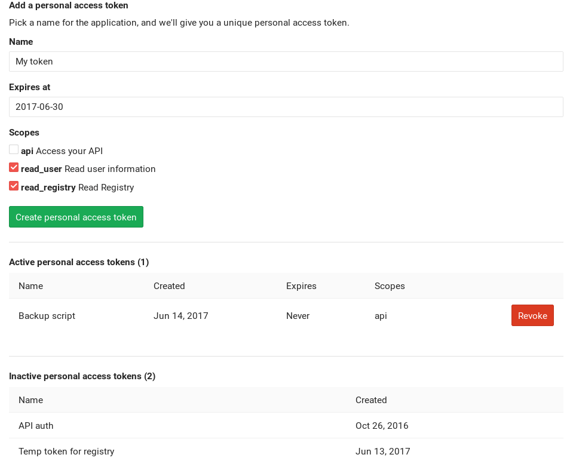

# Personal access tokens

> [Introduced][ce-3749] in GitLab 8.8.

Personal access tokens are the preferred way for third party applications and scripts to
authenticate with the [GitLab API][api], if using [OAuth2](../../api/oauth2.md) is not practical.

You can also use them to authenticate against Git over HTTP. They are the only
accepted method of authentication when you have
[Two-Factor Authentication (2FA)][2fa] enabled.

Once you have your token, [pass it to the API][usage] using either the
`private_token` parameter or the `Private-Token` header.

The expiration of personal access tokens happens on the date you define,
at midnight UTC.

## Creating a personal access token

You can create as many personal access tokens as you like from your GitLab
profile.

1. Log in to your GitLab account.
1. Go to your **Profile settings**.
1. Go to **Access tokens**.
1. Choose a name and optionally an expiry date for the token.
1. Choose the [desired scopes](#limiting-scopes-of-a-personal-access-token).
1. Click on **Create personal access token**.
1. Save the personal access token somewhere safe. Once you leave or refresh
   the page, you won't be able to access it again.

## Revoking a personal access token

At any time, you can revoke any personal access token by just clicking the
respective **Revoke** button under the 'Active personal access tokens' area.

## Limiting scopes of a personal access token

Personal access tokens can be created with one or more scopes that allow various
actions that a given token can perform. The available scopes are depicted in
the following table.

| Scope | Description |
| ----- | ----------- |
|`read_user` | Allows access to the read-only endpoints under `/users`. Essentially, any of the `GET` requests in the [Users API][users] are allowed ([introduced][ce-5951] in GitLab 8.15). |
| `api` | Grants complete access to the API (read/write) ([introduced][ce-5951] in GitLab 8.15). Required for accessing Git repositories over HTTP when 2FA is enabled. |
| `read_registry` | Allows to read [container registry] images if a project is private and authorization is required ([introduced][ce-11845] in GitLab 9.3). |
| `sudo` | Allows performing API actions as any user in the system (if the authenticated user is an admin) ([introduced][ce-14838] in GitLab 10.2). |

[2fa]: ../account/two_factor_authentication.md
[api]: ../../api/README.md
[ce-3749]: https://gitlab.com/gitlab-org/gitlab-ce/merge_requests/3749
[ce-5951]: https://gitlab.com/gitlab-org/gitlab-ce/merge_requests/5951
[ce-11845]: https://gitlab.com/gitlab-org/gitlab-ce/merge_requests/11845
[ce-14838]: https://gitlab.com/gitlab-org/gitlab-ce/merge_requests/14838
[container registry]: ../project/container_registry.md
[users]: ../../api/users.md
[usage]: ../../api/README.md#personal-access-tokens
