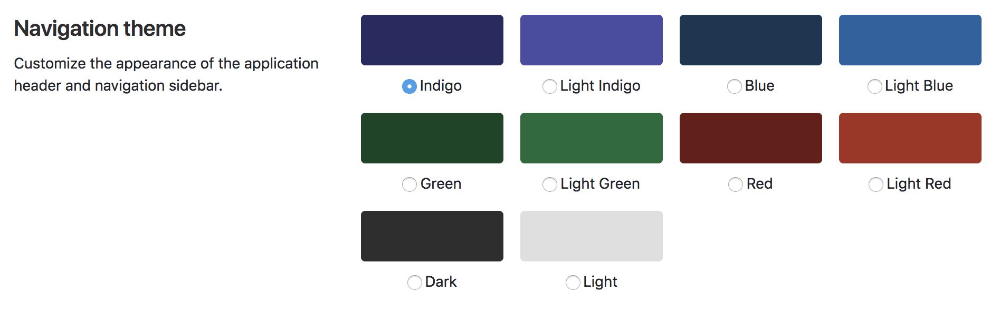

# Profile preferences

A user's profile preferences page allows the user to customize various aspects
of GitLab to their liking.

To navigate to your profile's preferences:

1. Click your avatar.
1. Select **Settings**.
1. Click **Preferences** in the sidebar.

## Navigation theme

The GitLab navigation theme setting allows you to personalize your GitLab experience.
You can choose from several color themes that add unique colors to the top navigation
and left side navigation.
Using individual color themes might help you differentiate between your different
GitLab instances.

The default theme is Indigo. You can choose between 10 themes:

- Indigo
- Light Indigo
- Blue
- Light Blue
- Green
- Light Green
- Red
- Light Red
- Dark
- Light

## Syntax highlighting theme

NOTE: **Note:**
GitLab uses the [rouge Ruby library](http://rouge.jneen.net/ "Rouge website")
for syntax highlighting. For a list of supported languages visit the rouge website.

Changing this setting allows you to customize the color theme when viewing any
syntax highlighted code on GitLab.

The default syntax theme is White, and you can choose among 5 different themes:

- White
- Dark
- Solarized light
- Solarized dark
- Monokai

## Behavior

The following settings allow you to customize the behavior of GitLab's layout
and default views of your dashboard and the projects' landing pages.

### Layout width

GitLab can be set up to use different widths depending on your liking. Choose
between the fixed (max. `1280px`) and the fluid (`100%`) application layout.

NOTE: **Note:**
While `1280px` is the standard max width when using fixed layout, some pages still use 100% width, depending on the content.

### Default dashboard

For users who have access to a large number of projects but only keep up with a
select few, the amount of activity on the default Dashboard page can be
overwhelming. Changing this setting allows you to redefine what your default
dashboard will be.

You have 8 options here that you can use for your default dashboard view:

- Your projects (default)
- Starred projects
- Your projects' activity
- Starred projects' activity
- Your groups
- Your [Todos](../todos.md)
- Assigned Issues
- Assigned Merge Requests
- Operations Dashboard **(PREMIUM)**

### Group overview content

The **Group overview content** dropdown allows you to choose what information is
displayed on a group’s home page.

You can choose between 2 options:

- Details (default)
- [Security dashboard](../application_security/security_dashboard/index.md) **(ULTIMATE)**

### Project overview content

The project overview content setting allows you to choose what content you want to
see on a project’s home page.

You can choose between 3 options:

- Files and Readme (default)
- Readme
- Activity

## Localization

### Language

Select your preferred language from a list of supported languages.

*This feature is experimental and translations are not complete yet.*

### First day of the week

The first day of the week can be customized for calendar views and date pickers.

You can choose one of the following options as the first day of the week:

- Saturday
- Sunday
- Monday

If you select **System Default**, the system-wide default setting will be used.

## Integrations

Configure your preferences with third-party services which provide enhancements to your GitLab experience.

### Sourcegraph

NOTE: **Note:**
This setting is only visible if Sourcegraph has been enabled by a GitLab administrator.

Manage the availability of integrated code intelligence features powered by
Sourcegraph. View [the Sourcegraph feature documentation](../../integration/sourcegraph.md#enable-sourcegraph-in-user-preferences)
for more information.

<!-- ## Troubleshooting

Include any troubleshooting steps that you can foresee. If you know beforehand what issues
one might have when setting this up, or when something is changed, or on upgrading, it's
important to describe those, too. Think of things that may go wrong and include them here.
This is important to minimize requests for support, and to avoid doc comments with
questions that you know someone might ask.

Each scenario can be a third-level heading, e.g. `### Getting error message X`.
If you have none to add when creating a doc, leave this section in place
but commented out to help encourage others to add to it in the future. -->
