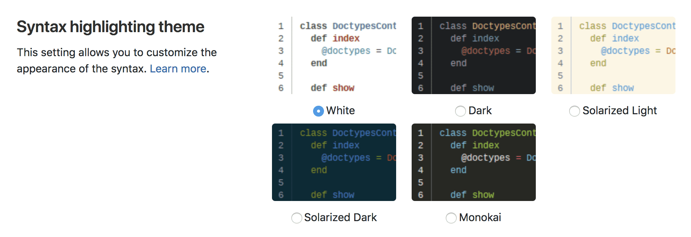

# Profile preferences

A user's profile preferences page allows the user to customize various aspects
of GitLab to their liking.

To navigate to your profile's preferences:

1. In the top-right corner, select your avatar.
1. Select **Preferences**.

## Navigation theme

The GitLab navigation theme setting allows you to personalize your GitLab experience.
You can choose from several color themes that add unique colors to the top navigation
and left side navigation.
Using individual color themes might help you differentiate between your different
GitLab instances.

The default theme is Indigo. You can choose between 10 themes:

- Indigo
- Light Indigo
- Blue
- Light Blue
- Green
- Light Green
- Red
- Light Red
- Dark
- Light
- [Dark Mode](#dark-mode)

## Dark mode

> [Introduced](https://gitlab.com/gitlab-org/gitlab/-/merge_requests/28252) in GitLab 13.1 as an Alpha release.

GitLab has started work on dark mode! The dark mode Alpha release is available in the
spirit of iteration and the lower expectations of
[Alpha versions](https://about.gitlab.com/handbook/product/gitlab-the-product/#alpha).

Progress on dark mode is tracked in the [Dark theme epic](https://gitlab.com/groups/gitlab-org/-/epics/2902).
See the epic for:

- A list of known issues.
- Our planned direction and next steps.

If you find an issue that isn't listed, please leave a comment on the epic or create a
new issue.

Dark mode is available as a navigation theme, for MVC and compatibility reasons. In
the future, we plan to make it configurable in its own section along with support for
[different navigation themes](https://gitlab.com/gitlab-org/gitlab/-/issues/219512).

Dark theme only works with the **Dark** syntax highlighting theme.

## Syntax highlighting theme

GitLab uses the [rouge Ruby library](http://rouge.jneen.net/ "Rouge website")
for syntax highlighting outside of any Editor context. The WebIDE (like Snippets)
uses [Monaco Editor](https://microsoft.github.io/monaco-editor/) and it's provided
[Monarch](https://microsoft.github.io/monaco-editor/monarch.html) library for
syntax highlighting. For a list of supported languages, visit the documentation of
the respective libraries.

Changing this setting allows you to customize the color theme when viewing any
syntax highlighted code on GitLab.

The default syntax theme is White, and you can choose among 5 different themes:

<!-- vale gitlab.Spelling = NO -->

- White
- Dark
- Solarized light
- Solarized dark
- Monokai

<!-- vale gitlab.Spelling = YES -->

Introduced in GitLab 13.6, the themes [Solarized](https://gitlab.com/gitlab-org/gitlab/-/issues/221034) and [Monokai](https://gitlab.com/gitlab-org/gitlab/-/issues/221034) also apply to the [Web IDE](../project/web_ide/index.md) and [Snippets](../snippets.md).

## Behavior

The following settings allow you to customize the behavior of the GitLab layout
and default views of your dashboard and the projects' landing pages.

### Layout width

GitLab can be set up to use different widths depending on your liking. Choose
between the fixed (max. `1280px`) and the fluid (`100%`) application layout.

NOTE:
While `1280px` is the standard max width when using fixed layout, some pages still use 100% width, depending on the content.

### Default dashboard

For users who have access to a large number of projects but only keep up with a
select few, the amount of activity on the default Dashboard page can be
overwhelming. Changing this setting allows you to redefine your default
dashboard.

You can include the following options for your default dashboard view:

- Your projects (default)
- Starred projects
- Your projects' activity
- Starred projects' activity
- Followed Users' Activity
- Your groups
- Your [To-Do List](../todos.md)
- Assigned Issues
- Assigned Merge Requests
- Operations Dashboard **(PREMIUM)**

### Group overview content

The **Group overview content** dropdown allows you to choose what information is
displayed on a group's home page.

You can choose between 2 options:

- Details (default)
- [Security dashboard](../application_security/security_dashboard/index.md) **(ULTIMATE)**

### Project overview content

The **Project overview content** setting allows you to choose what content you want to
see on a project's home page.

### Tab width

You can set the displayed width of tab characters across various parts of
GitLab, for example, blobs, diffs, and snippets.

NOTE:
Some parts of GitLab do not respect this setting, including the WebIDE, file
editor and Markdown editor.

## Localization

### Language

Select your preferred language from a list of supported languages.

*This feature is experimental and translations are not complete yet.*

### First day of the week

The first day of the week can be customized for calendar views and date pickers.

You can choose one of the following options as the first day of the week:

- Saturday
- Sunday
- Monday

If you select **System Default**, the [instance default](../admin_area/settings/index.md#default-first-day-of-the-week) setting is used.

## Time preferences

### Use relative times

> [Introduced](https://gitlab.com/gitlab-org/gitlab/-/merge_requests/65570) in GitLab 14.1.

You can select your preferred time format for the GitLab user interface:

- Relative times, for example, `30 minutes ago`.
- Absolute times, for example, `May 18, 2021, 3:57 PM`.

The times are formatted depending on your chosen language.

To set your time preference:

1. On the **Preferences** page, go to **Time preferences**.
1. Select the **Use relative times** checkbox to use relative times,
   or clear the checkbox to use absolute times.
1. Select **Save changes**.

NOTE:
This feature is experimental, and choosing absolute times might break certain layouts.
Please open an issue if you notice that using absolute times breaks a layout.

## Integrations

Configure your preferences with third-party services which provide enhancements to your GitLab experience.

### Sourcegraph

NOTE:
This setting is only visible if Sourcegraph has been enabled by a GitLab administrator.

Manage the availability of integrated code intelligence features powered by
Sourcegraph. View [the Sourcegraph feature documentation](../../integration/sourcegraph.md#enable-sourcegraph-in-user-preferences)
for more information.

### Gitpod

Enable and disable the [GitLab-Gitpod integration](../../integration/gitpod.md). This is only
visible after the integration is configured by a GitLab administrator. View
[the Gitpod feature documentation](../../integration/gitpod.md) for more information.

<!-- ## Troubleshooting

Include any troubleshooting steps that you can foresee. If you know beforehand what issues
one might have when setting this up, or when something is changed, or on upgrading, it's
important to describe those, too. Think of things that may go wrong and include them here.
This is important to minimize requests for support, and to avoid doc comments with
questions that you know someone might ask.

Each scenario can be a third-level heading, e.g. `### Getting error message X`.
If you have none to add when creating a doc, leave this section in place
but commented out to help encourage others to add to it in the future. -->
