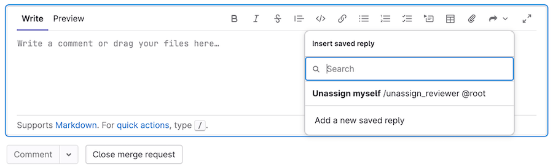

# Saved replies **(FREE)**

> [Introduced](https://gitlab.com/gitlab-org/gitlab/-/issues/352956) in GitLab 14.9 [with a flag](../../administration/feature_flags.md) named `saved_replies`. Disabled by default.

With saved replies, create and reuse text for any text area in:

- Merge requests, including diffs.
- Issues, including design management comments.
- Epics.
- Work items.

Saved replies can be small, like approving a merge request and unassigning yourself from it,
or large, like chunks of boilerplate text you use frequently:

## Use saved replies in a text area

To include the text of a saved reply in your comment:

1. In the editor toolbar for your comment, select **Saved replies** (**{symlink}**).
1. Select your desired saved reply.

## Create saved replies

To create a saved reply for future use:

1. On the top bar, in the upper-right corner, select your avatar.
1. From the dropdown list, select **Preferences**.
1. On the left sidebar, select **Saved replies** (**{symlink}**).
1. Provide a **Name** for your saved reply.
1. Enter the **Content** of your reply. You can use any formatting you use in
   other GitLab text areas.
1. Select **Save**, and the page reloads with your saved reply shown.

## View your saved replies

To go to your saved replies:

1. On the top bar, in the upper-right corner, select your avatar.
1. From the dropdown list, select **Preferences**.
1. On the left sidebar, select **Saved replies** (**{symlink}**).
1. Scroll to **My saved replies**.

## Edit or delete saved replies

To edit or delete a previously saved reply:

1. On the top bar, in the upper-right corner, select your avatar.
1. From the dropdown list, select **Preferences**.
1. On the left sidebar, select **Saved replies** (**{symlink}**).
1. Scroll to **My saved replies**, and identify the saved reply you want to edit.
1. To edit, select **Edit** (**{pencil}**).
1. To delete, select **Delete** (**{remove}**), then select **Delete** again from the modal window.
