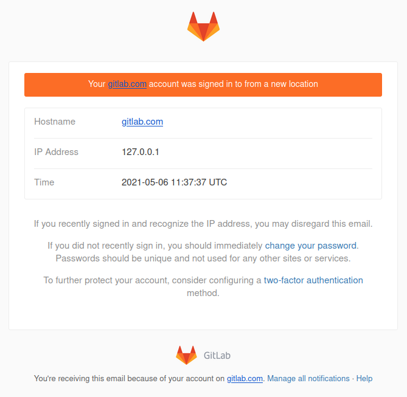

# Email notification for unknown sign-ins

> [Introduced](https://gitlab.com/gitlab-org/gitlab/-/issues/27211) in GitLab 13.0.

NOTE:
This feature is enabled by default for self-managed instances. Administrators may disable this feature
through the [Sign-in restrictions](../admin_area/settings/sign_in_restrictions.md#email-notification-for-unknown-sign-ins) section of the UI.
The feature is always enabled on GitLab.com.

When a user successfully signs in from a previously unknown IP address or device,
GitLab notifies the user by email. In this way, GitLab proactively alerts users of potentially
malicious or unauthorized sign-ins.

There are several methods used to identify a known sign-in. All methods must fail
for a notification email to be sent.

- Last sign-in IP: The current sign-in IP address is checked against the last sign-in
  IP address.
- Current active sessions: If the user has an existing active session from the
  same IP address. See [Active Sessions](active_sessions.md).
- Cookie: After successful sign in, an encrypted cookie is stored in the browser.
  This cookie is set to expire 14 days after the last successful sign in.

## Example email

