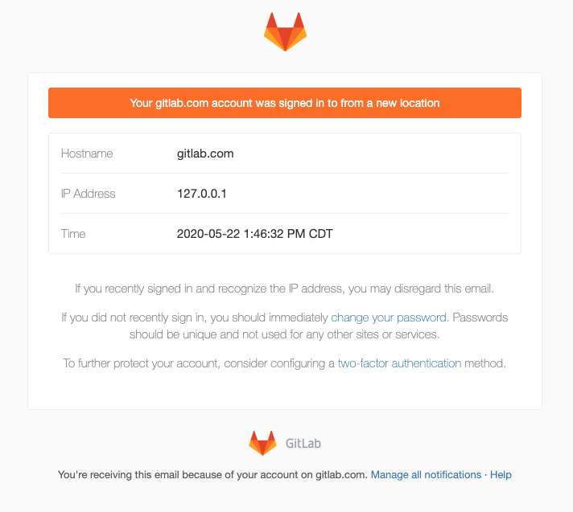

# Email notification for unknown sign-ins

> [Introduced](https://gitlab.com/gitlab-org/gitlab/-/issues/27211) in GitLab 13.0.

When a user successfully signs in from a previously unknown IP address,
GitLab notifies the user by email. In this way, GitLab proactively alerts users of potentially
malicious or unauthorized sign-ins.

There are two methods used to identify a known sign-in:

- Last sign-in IP: The current sign-in IP address is checked against the last sign-in
  IP address.
- Current active sessions: If the user has an existing active session from the
  same IP address. See [Active Sessions](active_sessions.md).

## Example email

