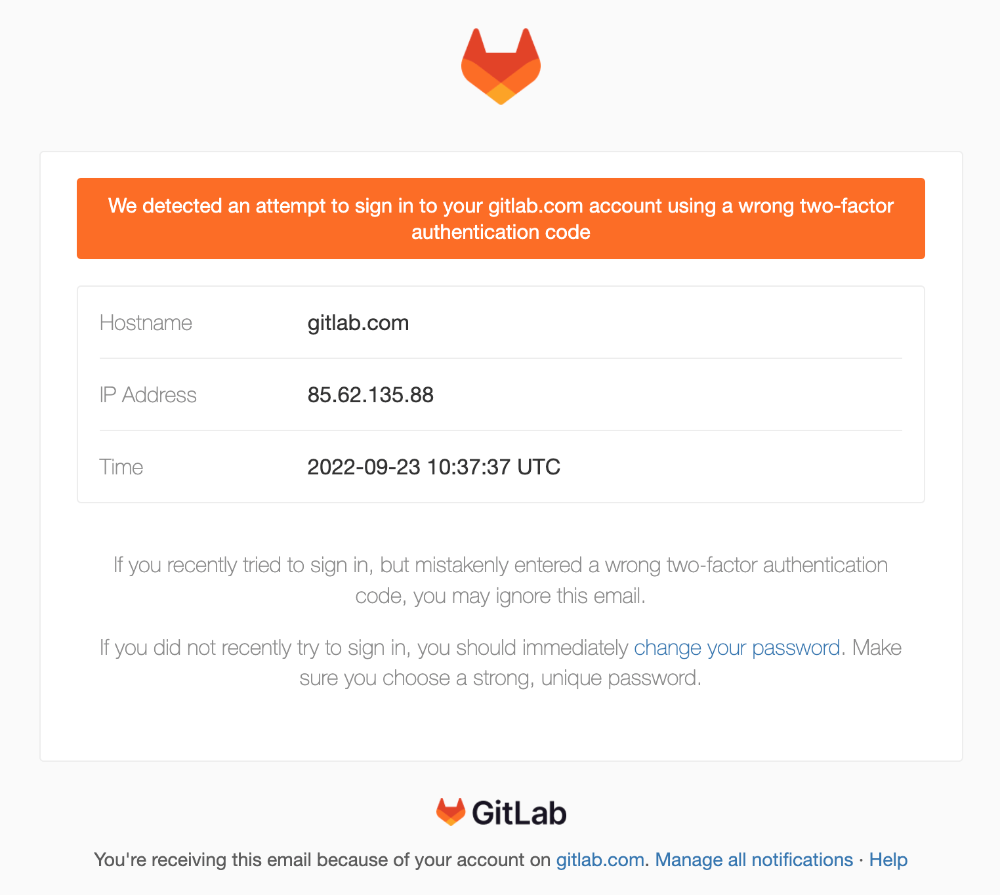

# Email notification for attempted sign-in using wrong two-factor authentication code **(FREE)**

> [Introduced](https://gitlab.com/gitlab-org/gitlab/-/issues/374740) in GitLab 15.5.

GitLab sends you an email notification if it detects an attempt to sign in to your account using a wrong two-factor authentication code. This way, GitLab proactively alerts you of potentially malicious or unauthorized sign-ins, in case a bad actor gained access to your username and password, and is trying to bruteforce two-factor authentication.

## Example notification email

