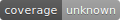
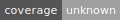



- Tier: Free, Premium, Ultimate
- Offering: GitLab.com, GitLab Self-Managed, GitLab Dedicated



Badges are a unified way to present condensed pieces of information about your projects.
A badge consists of a small image and a URL that the image points to.
In GitLab, badges are displayed on the project overview page, below the project description.
You can use badges at the [project](#project-badges) and [group](#group-badges) level.

## Available badges

GitLab provides the following pipeline badges:

- [Pipeline status badges](#pipeline-status-badges)
- [Test coverage report badges](#test-coverage-report-badges)
- [Latest release badges](#latest-release-badges)

GitLab also supports [adjusting badge style](#customize-badges).

## Pipeline status badges

The pipeline status badge indicates the status of the latest pipeline in a project.
Depending on the status of your pipeline, the badge can have one of the following values:

- `pending`
- `running`
- `passed`
- `failed`
- `skipped`
- `manual`
- `canceled`
- `unknown`

You can access a pipeline status badge image by using the following link:

```plaintext
https://gitlab.example.com/<namespace>/<project>/badges/<branch>/pipeline.svg
```

### Display only non-skipped status

To make the pipeline status badge display only the last non-skipped status, use the `?ignore_skipped=true` query parameter:

```plaintext
https://gitlab.example.com/<namespace>/<project>/badges/<branch>/pipeline.svg?ignore_skipped=true
```

## Test coverage report badges

The test coverage report badge indicates the percentage of code that is tested in a project.
The value is calculated based on the latest successful pipeline.

You can access a test coverage report badge image by using the following link:

```plaintext
https://gitlab.example.com/<namespace>/<project>/badges/<branch>/coverage.svg
```

You can define the regular expression for the [code coverage](../../ci/testing/code_coverage/_index.md#configure-coverage-reporting)
that each job log is matched against.
This means that each job in the pipeline can have the test coverage percentage value defined.

To get the coverage report from a specific job, add the `job=coverage_job_name` parameter to the URL.
For example, you can use code similar to the following to add the test coverage report badge of the
`coverage` job to a Markdown file:

```markdown

```

### Test coverage limits and badge colors

The following table shows the default test coverage limits and badge colors:

| Test coverage | Percentage limits           | Badge color |
|---------------|-----------------------------|-------------|
| Good          | 95 up to and including 100% | <span style="color: #4c1">■</span> `#4c1` |
| Acceptable    | 90 up to 95%                | <span style="color:#a3c51c"> ■</span> `#a3c51c` |
| Medium        | 75 up to 90%                | <span style="color: #dfb317">■</span> `#dfb317` |
| Low           | 0 up to 75%                 | <span style="color: #e05d44">■</span> `#e05d44` |
| Unknown       | No coverage                 | <span style="color: #9f9f9f">■</span> `#9f9f9f` |



*Up to* means up to, but not including, the upper bound.



### Change the default limits

You can override the default limits by passing the following query parameters in the coverage report badge URL:

| Query parameter  | Acceptable values                            | Default |
|------------------|----------------------------------------------|---------|
| `min_good`       | Any value between `3` and `100`              | `95`    |
| `min_acceptable` | Any value between `2` and `min_good`−1       | `90`    |
| `min_medium`     | Any value between `1` and `min_acceptable`−1 | `75`    |

For example:

```plaintext
https://gitlab.example.com/<namespace>/<project>/badges/<branch>/coverage.svg?min_good=98&min_acceptable=75
```

If you set an invalid boundary, GitLab automatically adjusts it to be valid. For example,
if you set `min_good` to `80` and `min_acceptable` to `85`, GitLab sets `min_acceptable`
to `79` (`min_good - 1`) because the minimum acceptable value cannot be higher than
the minimum good value.

## Latest release badges

The latest release badge indicates the latest release tag name for your project.
If there is no release, it shows `none`.

You can access a latest release badge image by using the following link:

```plaintext
https://gitlab.example.com/<namespace>/<project>/-/badges/release.svg
```

By default, the badge fetches the release sorted using the [`released_at`](../../api/releases/_index.md#create-a-release)
time with the `?order_by` query parameter.

```plaintext
https://gitlab.example.com/<namespace>/<project>/-/badges/release.svg?order_by=release_at
```

You can change the width of the release name field by using the `value_width` parameter ([Introduced](https://gitlab.com/gitlab-org/gitlab/-/merge_requests/113615) in GitLab 15.10).
The value must be between 1 and 200, and the default value is 54.
If you set an out of range value, GitLab automatically adjusts it to the default value.

## Project badges

Badges can be added to a project by Maintainers or Owners, and are visible on the project's **Overview** page.
If you find that you have to add the same badges to several projects, you may want to add them at the [group level](#group-badges).

### Example project badge: Pipeline Status

A common project badge presents the GitLab CI pipeline status.

To add this badge to a project:

1. On the left sidebar, select **Search or go to** and find your project. If you've [turned on the new navigation](../interface_redesign.md#turn-new-navigation-on-or-off), this field is on the top bar.
1. Select **Settings** > **General**.
1. Expand **Badges**.
1. Under **Name**, enter _Pipeline Status_.
1. Under **Link**, enter the following URL:
   `https://gitlab.com/%{project_path}/-/commits/%{default_branch}`
1. Under **Badge image URL**, enter the following URL:
   `https://gitlab.com/%{project_path}/badges/%{default_branch}/pipeline.svg`
1. Select **Add badge**.

## Group badges

Badges can be added to a group by Owners, and are visible on the **Overview**
page of any project that belongs to the group.
By adding a badge to a group, you add and enforce a project-level badge
for all projects in the group.



While these badges appear as project-level badges in the codebase, they
cannot be edited or deleted at the project level.



If you need individual badges for each project, either:

- Add the badge at the [project level](#project-badges).
- Use [placeholders](#placeholders).

## View badges

To view badges available in a project or group:

1. On the left sidebar, select **Search or go to** and find your project or group. If you've [turned on the new navigation](../interface_redesign.md#turn-new-navigation-on-or-off), this field is on the top bar.
1. Select **Settings** > **General**.
1. Expand **Badges**.

## Add a badge

To add a new badge to a project or group:

1. On the left sidebar, select **Search or go to** and find your project or group. If you've [turned on the new navigation](../interface_redesign.md#turn-new-navigation-on-or-off), this field is on the top bar.
1. Select **Settings** > **General**.
1. Expand **Badges**.
1. Select **Add badge**.
1. In the **Name** text box, enter the name of your badge.
1. In the **Link** text box, enter the URL that the badges should point to.
1. In the **Badge image URL** text box, enter the URL of the image you want to display for the badge.
1. Select **Add badge**.

## View the URL of pipeline badges

You can view the exact link for your badges.
Then you can use the link to embed the badge in your HTML or Markdown pages.

1. On the left sidebar, select **Search or go to** and find your project. If you've [turned on the new navigation](../interface_redesign.md#turn-new-navigation-on-or-off), this field is on the top bar.
1. Select **Settings** > **CI/CD**.
1. Expand **General pipelines**.
1. In the **Pipeline status**, **Coverage report**, or **Latest release** sections, view the URLs for the images.



The pipeline status badge is based on specific Git revisions (branches). Ensure you select the appropriate branch to view the correct pipeline status.



## Customize badges



- [Introduced](https://gitlab.com/gitlab-org/gitlab/-/merge_requests/180832) in GitLab 18.5 [with a flag](../../administration/feature_flags/_index.md) named `custom_project_badges`. Disabled by default.
- [Enabled on GitLab.com, GitLab Self-Managed, and GitLab Dedicated](https://gitlab.com/gitlab-org/gitlab/-/issues/574344) in GitLab 18.6.



Custom badges is in beta. Track the development of badges improvements in [epic 9904](https://gitlab.com/groups/gitlab-org/-/epics/9904).

You can customize how badges appear in your project:

- [Basic customization](#basic-customization) works for all badge types.
- [Advanced customization](#custom-badges) is available only for custom badges.

### Basic customization

You can customize the following aspects of all badge types:

- [Style](#style)
- [Key text](#key-text)
- [Key width](#key-width)
- [Value width](#value-width)

#### Style

Pipeline, coverage, release, and custom badges can be rendered in different styles by adding the `style=style_name` parameter to the URL. Two styles are available:

- Flat (default):

  ```plaintext
  https://gitlab.example.com/<namespace>/<project>/badges/<branch>/coverage.svg?style=flat
  ```

  

- Flat square:

  ```plaintext
  https://gitlab.example.com/<namespace>/<project>/badges/<branch>/coverage.svg?style=flat-square
  ```

  

#### Key text

The text for the left side on the badge can be customize. For example, to differentiate between multiple coverage jobs that run in the same pipeline.

Customize the badge key text by adding the `key_text=custom_text` parameter to the URL:

```plaintext
https://gitlab.com/gitlab-org/gitlab/badges/main/coverage.svg?job=karma&key_text=Frontend+Coverage&key_width=130
```


#### Key width

Customize the badge key width by adding the `key_width=width` parameter to the URL:

```plaintext
https://gitlab.com/%{project_path}/-/badges/coverage.svg?key_width=130
```

#### Value width

Customize the badge value width by adding the `value_width=width` parameter to the URL:

```plaintext
https://gitlab.com/%{project_path}/-/badges/coverage.svg?value_width=130
```

### Custom badges

Custom badges give you complete control over both sides of the badge. Unlike standard badges that show predefined information (like pipeline status), custom badges let you:

- Display any text on either side of the badge
- Use custom colors
- Show project-specific information
- Create dynamic badges using [placeholders](#placeholders)

In addition to the [basic customization options](#basic-customization), custom badges support these additional customization options:

- [Key color](#key-color)
- [Value color](#value-color)
- [Value text](#value-text)

You can add a custom badge by using the following link:

```plaintext
https://gitlab.com/%{project_path}/badges/%{default_branch}/custom.svg
```

For example, you can use [placeholders](#placeholders) to create a badge for the latest tag:

```plaintext
https://%{gitlab_server}/%{project_path}/badges/custom.svg?key_text=Latest_tag&key_value=%{latest_tag}&key_color=white&value_color=7bc043
```



Placeholders allow badges to expose otherwise-private information, such as the default branch or commit SHA when the project is configured to have a private repository. This behavior is intentional, as badges are intended to be used publicly. Avoid using these placeholders if the information is sensitive.



#### Value text

Customize the text displayed on the right side by adding the `value_text=text` parameter to the URL:

```plaintext
https://gitlab.com/%{project_path}/-/badges/custom.svg?value_text=badge
```

#### Value color

Customize the background color on the right side by adding the `value_color=color` parameter to the URL:

Colors can be passed as:

- [A named color](https://developer.mozilla.org/en-US/docs/Web/CSS/named-color), for example `blue`
- Hexadecimal representation like `fff` or `7bc043` (without leading `#`)

```plaintext
https://gitlab.com/%{project_path}/-/badges/custom.svg?value_color=red
```

#### Key color

Customize the background color on the left side by adding the `value_color=color` parameter to the URL:

Colors can be passed as:

- [A named color](https://developer.mozilla.org/en-US/docs/Web/CSS/named-color), for example `blue`
- Hexadecimal representation like `fff` or `7bc043` (without leading `#`)

```plaintext
https://gitlab.com/%{project_path}/-/badges/custom.svg?key_color=green
```

### Add a custom badge image

Prerequisites:

- You must have at least the Developer role for the project or group.
- You must have a valid URL that points directly to the desired image for the badge. If the image is in a GitLab repository, use the raw link to the image.

To add a custom badge with an image:

1. On the left sidebar, select **Search or go to** and find your project or group. If you've [turned on the new navigation](../interface_redesign.md#turn-new-navigation-on-or-off), this field is on the top bar.
1. Select **Settings > General**.
1. Expand **Badges**.
1. Under **Name**, enter the name for the badge.
1. Under **Link**, enter the URL that the badge should point to.
1. Under **Badge image URL**, enter the URL for your custom image. For example, to use an image from your repository:

   ```plaintext
   https://gitlab.example.com/<project_path>/-/raw/<default_branch>/custom-image.svg
   ```

1. Select **Add badge**.

To use custom images generated through a pipeline, see [accessing the latest job artifacts by URL](../../ci/jobs/job_artifacts.md#from-a-url).

## Edit a badge

To edit a badge in a project or group:

1. On the left sidebar, select **Search or go to** and find your project or group. If you've [turned on the new navigation](../interface_redesign.md#turn-new-navigation-on-or-off), this field is on the top bar.
1. Select **Settings** > **General**.
1. Expand **Badges**.
1. Next to the badge you want to edit, select **Edit** ().
1. Edit the **Name**, **Link**, or **Badge image URL**.
1. Select **Save changes**.

## Delete a badge

To delete a badge in a project or group:

1. On the left sidebar, select **Search or go to** and find your project or group. If you've [turned on the new navigation](../interface_redesign.md#turn-new-navigation-on-or-off), this field is on the top bar.
1. Select **Settings** > **General**.
1. Expand **Badges**.
1. Next to the badge you want to delete, select **Delete** ().
1. On the confirmation dialog, select **Delete badge**.



Badges associated with a group can be edited or deleted only at the [group level](#group-badges).



## Placeholders

Both the URL a badge points to and the image URL can contain placeholders,
which are evaluated when displaying the badge.
The following placeholders are available:

- `%{project_path}`: Path of a project including the parent groups
- `%{project_title}`: Title of a project
- `%{project_name}`: Name of a project
- `%{project_id}`: Database ID associated with a project
- `%{project_namespace}`: Project namespace of a project
- `%{group_name}`: Group of a project
- `%{gitlab_server}`: Server of a project
- `%{gitlab_pages_domain}`: Domain hosting GitLab Pages
- `%{default_branch}`: Default branch name configured for a project's repository
- `%{commit_sha}`: ID of the most recent commit to the default branch of a
  project's repository
- `%{latest_tag}`: Latest tag added to the project's repository



Placeholders allow badges to expose otherwise-private information, such as the
default branch or commit SHA when the project is configured to have a private
repository. This behavior is intentional, as badges are intended to be used publicly. Avoid
using these placeholders if the information is sensitive.


