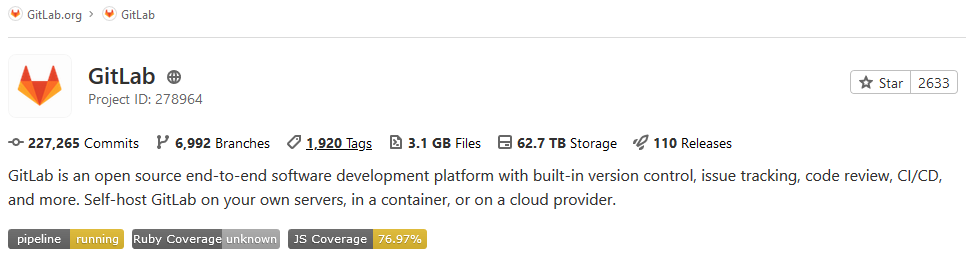

# Badges

DETAILS:
**Tier:** Free, Premium, Ultimate
**Offering:** GitLab.com, Self-managed, GitLab Dedicated

Badges are a unified way to present condensed pieces of information about your projects.
A badge consists of a small image and a URL that the image points to.
In GitLab, badges are displayed below the project description.
You can use badges at the [project](#project-badges) and [group](#group-badges) level.



## Available badges

GitLab provides the following pipeline badges:

- [Pipeline status badge](#pipeline-status-badges)
- [Test coverage report badge](#test-coverage-report-badges)
- [Latest release badge](#latest-release-badges)

GitLab also supports [custom badges](#customize-badges).

## Pipeline status badges

The pipeline status badge indicates the status of the latest pipeline in a project.
Depending on the status of your pipeline, the badge can have one of the following values:

- `pending`
- `running`
- `passed`
- `failed`
- `skipped`
- `manual`
- `canceled`
- `unknown`

You can access a pipeline status badge image by using the following link:

```plaintext
https://gitlab.example.com/<namespace>/<project>/badges/<branch>/pipeline.svg
```

### Display only non-skipped status

To make the pipeline status badge display only the last non-skipped status, use the `?ignore_skipped=true` query parameter:

```plaintext
https://gitlab.example.com/<namespace>/<project>/badges/<branch>/pipeline.svg?ignore_skipped=true
```

## Test coverage report badges

The test coverage report badge indicates the percentage of code that is tested in a project.
The value is calculated based on the latest successful pipeline.

You can access a test coverage report badge image by using the following link:

```plaintext
https://gitlab.example.com/<namespace>/<project>/badges/<branch>/coverage.svg
```

You can define the regular expression for the [coverage report](../../ci/testing/code_coverage.md#view-code-coverage-results-in-the-mr)
that each job log is matched against.
This means that each job in the pipeline can have the test coverage percentage value defined.

To get the coverage report from a specific job, add the `job=coverage_job_name` parameter to the URL.
For example, you can use code similar to the following to add the test coverage report badge of the
`coverage` job to a Markdown file:

```markdown

```

### Test coverage report badge colors and limits

The default colors and limits for the badge are as follows:

- 95 up to and including 100% - good (`#4c1`)
- 90 up to 95% - acceptable (`#a3c51c`)
- 75 up to 90% - medium (`#dfb317`)
- 0 up to 75% - low (`#e05d44`)
- no coverage - unknown (`#9f9f9f`)

NOTE:
*Up to* means up to, but not including, the upper bound.

You can overwrite the limits by using the following additional parameters ([Introduced](https://gitlab.com/gitlab-org/gitlab/-/issues/28317) in GitLab 14.4):

- `min_good` (default 95, can use any value between 3 and 100)
- `min_acceptable` (default 90, can use any value between 2 and min_good-1)
- `min_medium` (default 75, can use any value between 1 and min_acceptable-1)

If an invalid boundary is set, GitLab automatically adjusts it to be valid. For example,
if `min_good` is set `80`, and `min_acceptable` is set to `85` (too high), GitLab automatically
sets `min_acceptable` to `79` (`min_good` - `1`).

## Latest release badges

> - [Introduced](https://gitlab.com/gitlab-org/gitlab/-/issues/33368) in GitLab 14.8.

The latest release badge indicates the latest release tag name for your project.
If there is no release, it shows `none`.

You can access a latest release badge image by using the following link:

```plaintext
https://gitlab.example.com/<namespace>/<project>/-/badges/release.svg
```

By default, the badge fetches the release sorted using the [`released_at`](../../api/releases/index.md#create-a-release)
time with the `?order_by` query parameter.

```plaintext
https://gitlab.example.com/<namespace>/<project>/-/badges/release.svg?order_by=release_at
```

You can change the width of the release name field by using the `value_width` parameter ([Introduced](https://gitlab.com/gitlab-org/gitlab/-/merge_requests/113615) in GitLab 15.10).
The value must be between 1 and 200, and the default value is 54.
If you set an out of range value, GitLab automatically adjusts it to the default value.

## Project badges

Badges can be added to a project by Maintainers or Owners, and are visible on the project's overview page.
If you find that you have to add the same badges to several projects, you may want to add them at the [group level](#group-badges).

### Example project badge: Pipeline Status

A common project badge presents the GitLab CI pipeline status.

To add this badge to a project:

1. On the left sidebar, select **Search or go to** and find your project.
1. Select **Settings > General**.
1. Expand **Badges**.
1. Under **Name**, enter _Pipeline Status_.
1. Under **Link**, enter the following URL:
   `https://gitlab.com/%{project_path}/-/commits/%{default_branch}`
1. Under **Badge image URL**, enter the following URL:
   `https://gitlab.com/%{project_path}/badges/%{default_branch}/pipeline.svg`
1. Select **Add badge**.

## Group badges

By adding a badge to a group, you add and enforce a project-level badge
for all projects in the group. The group badge is visible on the **Overview**
page of any project that belongs to the group.

NOTE:
While these badges appear as project-level badges in the codebase, they
cannot be edited or deleted at the project level.

If you need individual badges for each project, either:

- Add the badge at the [project level](#project-badges).
- Use [placeholders](#placeholders).

## View badges

To view badges available in a project or group:

1. On the left sidebar, select **Search or go to** and find your project or group.
1. Select **Settings > General**.
1. Expand **Badges**.

## Add a badge

To add a new badge to a project or group:

1. On the left sidebar, select **Search or go to** and find your project or group.
1. Select **Settings > General**.
1. Expand **Badges**.
1. Select **Add badge**.
1. In the **Name** text box, enter the name of your badge.
1. In the **Link** text box, enter the URL that the badges should point to.
1. In the **Badge image URL** text box, enter the URL of the image you want to display for the badge.
1. Select **Add badge**.

## View the URL of pipeline badges

You can view the exact link for your badges.
Then you can use the link to embed the badge in your HTML or Markdown pages.

1. On the left sidebar, select **Search or go to** and find your project.
1. Select **Settings > CI/CD**.
1. Expand **General pipelines**.
1. In the **Pipeline status**, **Coverage report**, or **Latest release** sections, view the URLs for the images.


## Customize badges

You can customize the following aspects of a badge:

- Style
- Text
- Width
- Image

### Customize badge style

Pipeline badges can be rendered in different styles by adding the `style=style_name` parameter to the URL. Two styles are available:

- Flat (default):

  ```plaintext
  https://gitlab.example.com/<namespace>/<project>/badges/<branch>/coverage.svg?style=flat
  ```

  

- Flat square ([Introduced](https://gitlab.com/gitlab-org/gitlab-foss/-/issues/30120) in GitLab 11.8):

  ```plaintext
  https://gitlab.example.com/<namespace>/<project>/badges/<branch>/coverage.svg?style=flat-square
  ```

  

### Customize badge text

> - [Introduced](https://gitlab.com/gitlab-org/gitlab/-/issues/17555) in GitLab 13.1.

The text for a badge can be customized to differentiate between multiple coverage jobs that run in the same pipeline.
Customize the badge text and width by adding the `key_text=custom_text` and `key_width=custom_key_width` parameters to the URL:

```plaintext
https://gitlab.com/gitlab-org/gitlab/badges/main/coverage.svg?job=karma&key_text=Frontend+Coverage&key_width=130
```


### Customize badge image

Use custom badge images in a project or a group if you want to use badges other than the default
ones.

Prerequisites:

- A valid URL that points directly to the desired image for the badge.
  If the image is located in a GitLab repository, use the raw link to the image.

Using placeholders, here is an example badge image URL referring to a raw image at the root of a repository:

```plaintext
https://gitlab.example.com/<project_path>/-/raw/<default_branch>/my-image.svg
```

To add a new badge with a custom image to a group or project:

1. On the left sidebar, select **Search or go to** and find your project or
   group.
1. Select **Settings > General**.
1. Expand **Badges**.
1. Under **Name**, enter the name for the badge.
1. Under **Link**, enter the URL that the badge should point to.
1. Under **Badge image URL**, enter the URL that points directly to the custom image that should be
   displayed.
1. Select **Add badge**.

To learn how to use custom images generated through a pipeline, see the documentation on
[accessing the latest job artifacts by URL](../../ci/jobs/job_artifacts.md#from-a-url).

## Edit a badge

To edit a badge in a project or group:

1. On the left sidebar, select **Search or go to** and find your project or group.
1. Select **Settings > General**.
1. Expand **Badges**.
1. Next to the badge you want to edit, select **Edit** (**{pencil}**).
1. Edit the **Name**, **Link**, or **Badge image URL**.
1. Select **Save changes**.

## Delete a badge

To delete a badge in a project or group:

1. On the left sidebar, select **Search or go to** and find your project or group.
1. Select **Settings > General**.
1. Expand **Badges**.
1. Next to the badge you want to delete, select **Delete** (**{remove}**).
1. On the confirmation dialog, select **Delete badge**.
1. Select **Save changes**.

NOTE:
Badges associated with a group can be edited or deleted only at the [group level](#group-badges).

## Placeholders

Both the URL a badge points to and the image URL can contain placeholders,
which are evaluated when displaying the badge.
The following placeholders are available:

- `%{project_path}`: Path of a project including the parent groups
- `%{project_title}`: Title of a project
- `%{project_name}`: Name of a project
- `%{project_id}`: Database ID associated with a project
- `%{default_branch}`: Default branch name configured for a project's repository
- `%{commit_sha}`: ID of the most recent commit to the default branch of a
  project's repository

NOTE:
Placeholders allow badges to expose otherwise-private information, such as the
default branch or commit SHA when the project is configured to have a private
repository. This behavior is intentional, as badges are intended to be used publicly. Avoid
using these placeholders if the information is sensitive.
