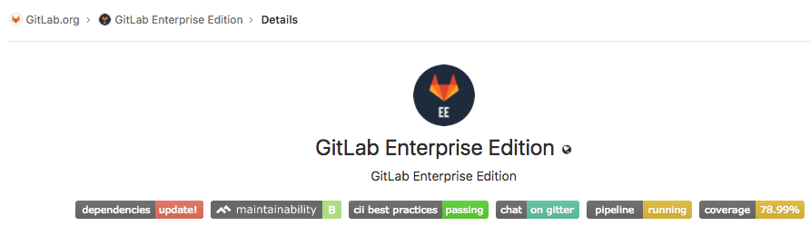

# Badges

> [Introduced](https://gitlab.com/gitlab-org/gitlab-ce/issues/41174)
in GitLab 10.7.

Badges are a unified way to present condensed pieces of information about your
projects. They consist of a small image and additionally a URL that the image
points to. Examples for badges can be the [pipeline status], [test coverage],
or ways to contact the project maintainers.

## Project badges

Badges can be added to a project and will then be visible on the project's overview page.
If you find that you have to add the same badges to several projects, you may want to add them at the [group level](#group-badges).

To add a new badge to a project:

1.  Navigate to your project's **Settings > Badges**.
1.  Under "Link", enter the URL that the badges should point to and under
    "Badge image URL" the URL of the image that should be displayed.
1.  Submit the badge by clicking the **Add badge** button.

After adding a badge to a project, you can see it in the list below the form.
You can edit it by clicking on the pen icon next to it or to delete it by
clicking on the trash icon.

Badges associated with a group can only be edited or deleted on the
[group level](#group-badges).

## Group badges

Badges can be added to a group and will then be visible on every project's
overview page that's under that group. In this case, they cannot be edited or
deleted on the project level. If you need to have individual badges for each
project, consider adding them on the [project level](#project-badges) or use
[placeholders](#placeholders).

To add a new badge to a group:

1.  Navigate to your group's **Settings > Project Badges**.
1.  Under "Link", enter the URL that the badges should point to and under
    "Badge image URL" the URL of the image that should be displayed.
1.  Submit the badge by clicking the **Add badge** button.

After adding a badge to a group, you can see it in the list below the form.
You can edit the badge by clicking on the pen icon next to it or to delete it
by clicking on the trash icon.

Badges directly associated with a project can be configured on the
[project level](#project-badges).

## Placeholders

The URL a badge points to, as well as the image URL, can contain placeholders
which will be evaluated when displaying the badge. The following placeholders
are available:

- `%{project_path}`: Path of a project including the parent groups
- `%{project_id}`: Database ID associated with a project
- `%{default_branch}`: Default branch name configured for a project's repository
- `%{commit_sha}`: ID of the most recent commit to the default branch of a
  project's repository

## API

You can also configure badges via the GitLab API. As in the settings, there is
a distinction between endpoints for badges on the
[project level](../../api/project_badges.md) and [group level](../../api/group_badges.md).

[pipeline status]: pipelines/settings.md#pipeline-status-badge
[test coverage]: pipelines/settings.md#test-coverage-report-badge
