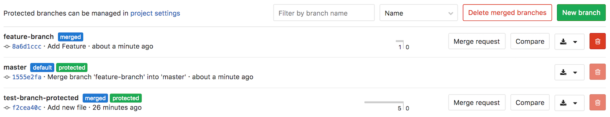

# Branches

## Delete Merged Branches

> [Introduced][ce-6449] in GitLab 8.14.

This feature allows merged branches to be deleted in bulk. Only branches that have been merged and are not protected will be deleted as part of this operation.

It's particularly useful to clean up old branches that were not deleting automatically when a Merge Request was merged. 

---

[ce-6449]: https://gitlab.com/gitlab-org/gitlab-ce/merge_requests/6449 "Add button to delete all merged branches"
