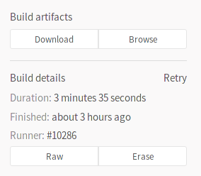
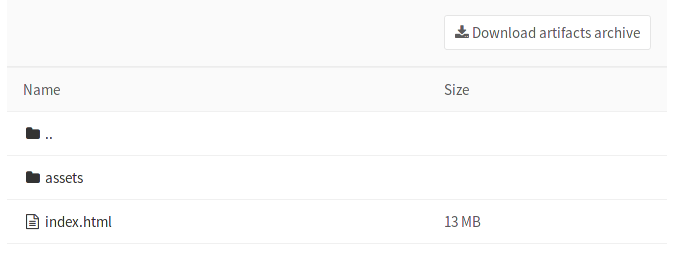
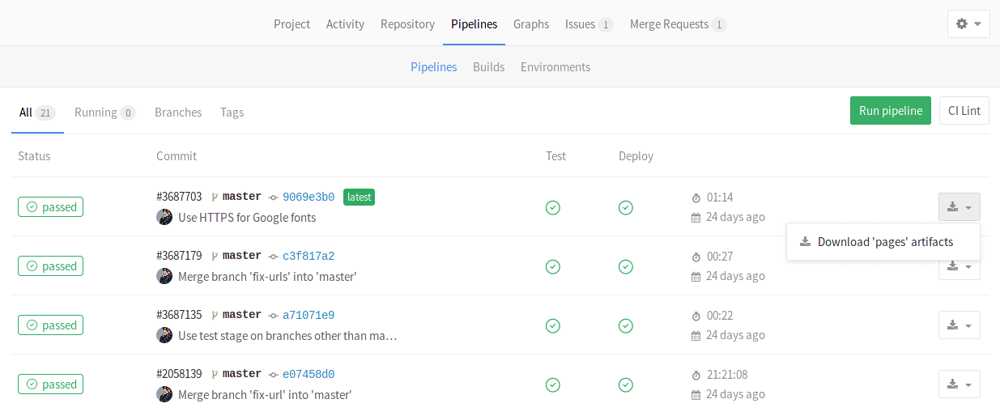
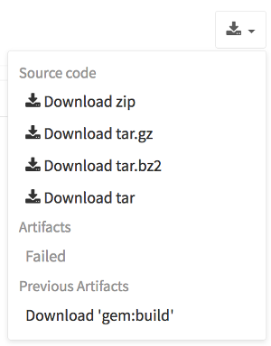

# Introduction to build artifacts

>**Notes:**
>- Since GitLab 8.2 and GitLab Runner 0.7.0, build artifacts that are created by
   GitLab Runner are uploaded to GitLab and are downloadable as a single archive
   (`tar.gz`) using the GitLab UI.
>- Starting from GitLab 8.4 and GitLab Runner 1.0, the artifacts archive format
   changed to `ZIP`, and it is now possible to browse its contents, with the added
   ability of downloading the files separately.
>- The artifacts browser will be available only for new artifacts that are sent
   to GitLab using GitLab Runner version 1.0 and up. It will not be possible to
   browse old artifacts already uploaded to GitLab.
>- This is the user documentation. For the administration guide see
   [administration/build_artifacts.md](../../../administration/build_artifacts.md).

Artifacts is a list of files and directories which are attached to a build
after it completes successfully.  This feature is enabled by default in all GitLab installations.

## Defining artifacts in `.gitlab-ci.yml`

A simple example of using the artifacts definition in `.gitlab-ci.yml` would be
the following:

```yaml
pdf:
  script: xelatex mycv.tex
  artifacts:
    paths:
    - mycv.pdf
```

A job named `pdf` calls the `xelatex` command in order to build a pdf file from
the latex source file `mycv.tex`. We then define the `artifacts` paths which in
turn are defined with the `paths` keyword. All paths to files and directories
are relative to the repository that was cloned during the build.

For more examples on artifacts, follow the artifacts reference in
[`.gitlab-ci.yml` documentation](../../../ci/yaml/README.md#artifacts).

## Browsing build artifacts

When GitLab receives an artifacts archive, an archive metadata file is also
generated. This metadata file describes all the entries that are located in the
artifacts archive itself. The metadata file is in a binary format, with
additional GZIP compression.

GitLab does not extract the artifacts archive in order to save space, memory
and disk I/O. It instead inspects the metadata file which contains all the
relevant information. This is especially important when there is a lot of
artifacts, or an archive is a very large file.

---

After a build finishes, if you visit the build's specific page, you can see
that there are two buttons. One is for downloading the artifacts archive and
the other for browsing its contents.



---

The archive browser shows the name and the actual file size of each file in the
archive. If your artifacts contained directories, then you are also able to
browse inside them.

Below you can see how browsing looks like. In this case we have browsed inside
the archive and at this point there is one directory and one HTML file.



---

## Downloading build artifacts

>**Note:**
GitLab does not extract the entire artifacts archive to send just a single file
to the user. When clicking on a specific file, [GitLab Workhorse] extracts it
from the archive and the download begins. This implementation saves space,
memory and disk I/O.

If you need to download the whole archive, there are buttons in various places
inside GitLab that make that possible.

1. While on the pipelines page, you can see the download icon for each build's
   artifacts archive in the right corner:

    

1. While on the builds page, you can see the download icon for each build's
   artifacts archive in the right corner:

    

1. While inside a specific build, you are presented with a download button
   along with the one that browses the archive:

    

1. And finally, when browsing an archive you can see the download button at
   the top right corner:

    

## Downloading the latest build artifacts

It is possible to download the latest artifacts of a build via a well known URL
so you can use it for scripting purposes.

The structure of the URL is the following:

```
https://example.com/<namespace>/<project>/builds/artifacts/<ref>/download?job=<job_name>
```

For example, to download the latest artifacts of the job named `rspec 6 20` of
the `master` branch of the `gitlab-ce` project that belongs to the `gitlab-org`
namespace, the URL would be:

```
https://gitlab.com/gitlab-org/gitlab-ce/builds/artifacts/master/download?job=rspec+6+20
```

The latest builds are also exposed in the UI in various places. Specifically,
look for the download button in:

- the main project's page
- the branches page
- the tags page

If the latest build has failed to upload the artifacts, you can see that
information in the UI.




[gitlab workhorse]: https://gitlab.com/gitlab-org/gitlab-workhorse "GitLab Workhorse repository"
