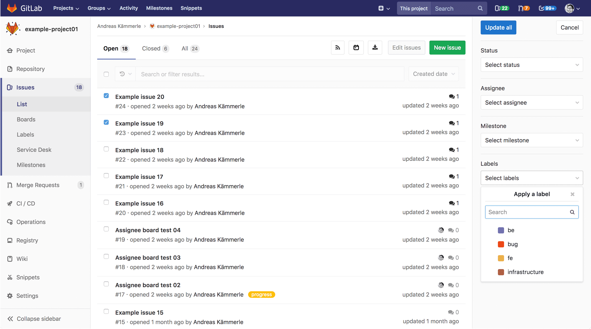

# Bulk editing issues and merge requests

NOTE: **Note:**
- A permission level of `Reporter` or higher is required in order to manage
issues.
- A permission level of `Developer` or higher is required in order to manage
merge requests.

Attributes can be updated simultaneously across multiple issues or merge requests
by using the bulk editing feature.

NOTE: **Note:**
- Bulk editing of issues and merge requests is only available at the project level.

To update multiple project issues or merge requests at the same time, navigate to
their respective lists and click **Edit issues** or **Edit merge requests** available
in the tab bar. This will open a sidebar on the right-hand side of your screen
where editable fields will be displayed. Checkboxes will also appear to the left-hand
side of eachissue or merge request for you to select the items you want to update.

Once you have selected all relevant items, choose the appropriate fields and their
values from the sidebar and click **Update all** to apply your changes.
