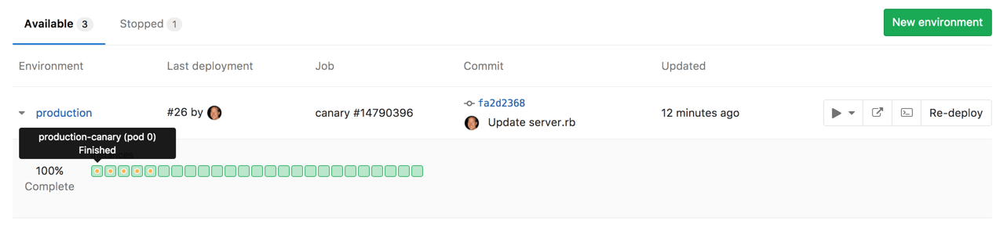
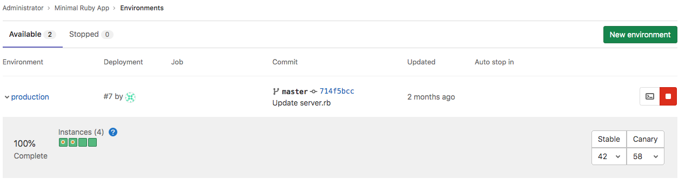

# Canary Deployments **(FREE)**

> - [Introduced](https://gitlab.com/gitlab-org/gitlab/-/issues/1659) in [GitLab Premium](https://about.gitlab.com/pricing/) 9.1.
> - [Moved](https://gitlab.com/gitlab-org/gitlab/-/issues/212320) to GitLab Free in 13.8.

A popular [Continuous Deployment](https://en.wikipedia.org/wiki/Continuous_deployment)
strategy, where a small portion of the fleet is updated to the new version of
your application.

## Overview

When embracing [Continuous Delivery](https://about.gitlab.com/blog/2016/08/05/continuous-integration-delivery-and-deployment-with-gitlab/), a company needs to decide what
type of deployment strategy to use. One of the most popular strategies is canary
deployments, where a small portion of the fleet is updated to the new version
first. This subset, the canaries, then serve as the proverbial
[canary in the coal mine](https://en.wiktionary.org/wiki/canary_in_a_coal_mine).

If there is a problem with the new version of the application, only a small
percentage of users are affected and the change can either be fixed or quickly
reverted.

Leveraging [Kubernetes' Canary deployments](https://kubernetes.io/docs/concepts/cluster-administration/manage-deployment/#canary-deployments), visualize your canary
deployments right inside the [Deploy Board](deploy_boards.md), without the need to leave GitLab.

## Use cases

Canary deployments can be used when you want to ship features to only a portion of
your pods fleet and watch their behavior as a percentage of your user base
visits the temporarily deployed feature. If all works well, you can deploy the
feature to production knowing that it shouldn't cause any problems.

Canary deployments are also especially useful for backend refactors, performance
improvements, or other changes where the user interface doesn't change, but you
want to make sure the performance stays the same, or improves. Developers need
to be careful when using canaries with user-facing changes, because by default,
requests from the same user are randomly distributed between canary and
non-canary pods, which could result in confusion or even errors. If needed, you
may want to consider [setting `service.spec.sessionAffinity` to `ClientIP` in
your Kubernetes service definitions](https://kubernetes.io/docs/concepts/services-networking/service/#virtual-ips-and-service-proxies), but that is beyond the scope of
this document.

## Enabling Canary Deployments

Canary deployments require that you properly configure Deploy Boards:

1. Follow the steps to [enable Deploy Boards](deploy_boards.md#enabling-deploy-boards).
1. To track canary deployments you need to label your Kubernetes deployments and
   pods with `track: canary`. To get started quickly, you can use the [Auto Deploy](../../topics/autodevops/stages.md#auto-deploy)
   template for canary deployments that GitLab provides.

Depending on the deploy, the label should be either `stable` or `canary`.
GitLab assumes the track label is `stable` if the label is blank or missing.
Any other track label is considered `canary` (temporary).
This allows GitLab to discover whether a deployment is stable or canary (temporary).

Once all of the above are set up and the pipeline has run at least once,
navigate to the environments page under **Pipelines > Environments**.
As the pipeline executes, Deploy Boards clearly mark canary pods, enabling
quick and easy insight into the status of each environment and deployment.

Canary deployments are marked with a yellow dot in the Deploy Board so that you
can easily notice them.



### Advanced traffic control with Canary Ingress

> - [Introduced](https://gitlab.com/gitlab-org/gitlab/-/issues/215501) in [GitLab Premium](https://about.gitlab.com/pricing/) 13.6.
> - [Moved](https://gitlab.com/gitlab-org/gitlab/-/issues/212320) to Free in GitLab 13.8.

Canary deployments can be more strategic with [Canary Ingress](https://kubernetes.github.io/ingress-nginx/user-guide/nginx-configuration/annotations/#canary),
which is an advanced traffic routing service that controls incoming HTTP
requests between stable and canary deployments based on factors such as weight, sessions, cookies,
and others. GitLab uses this service in its [Auto Deploy architecture](../../topics/autodevops/upgrading_auto_deploy_dependencies.md#v2-chart-resource-architecture)
to let users easily and safely roll out their new deployments.

#### How to set up a Canary Ingress in a canary deployment

A Canary Ingress is installed by default if your Auto DevOps pipeline uses
[`v2.0.0+` of `auto-deploy-image`](../../topics/autodevops/upgrading_auto_deploy_dependencies.md#verify-dependency-versions).
A Canary Ingress becomes available when you create a new canary deployment and is destroyed when the
canary deployment is promoted to production.

Here's an example setup flow from scratch:

1. Prepare an [Auto DevOps-enabled](../../topics/autodevops/index.md) project.
1. Set up a [Kubernetes Cluster](../../user/project/clusters/index.md) in your project.
1. Install [NGINX Ingress](https://github.com/kubernetes/ingress-nginx/tree/master/charts/ingress-nginx) in your cluster.
1. Set up [the base domain](../../user/project/clusters/gitlab_managed_clusters.md#base-domain) based on the Ingress
   Endpoint assigned above.
1. Check if [`v2.0.0+` of `auto-deploy-image` is used in your Auto DevOps pipelines](../../topics/autodevops/upgrading_auto_deploy_dependencies.md#verify-dependency-versions).
   If it isn't, follow the documentation to specify the image version.
1. [Run a new Auto DevOps pipeline](../../ci/pipelines/index.md#run-a-pipeline-manually)
   and make sure that the `production` job succeeds and creates a production environment.
1. Configure a [`canary` deployment job for Auto DevOps pipelines](../../topics/autodevops/customize.md#deploy-policy-for-canary-environments).
1. [Run a new Auto DevOps pipeline](../../ci/pipelines/index.md#run-a-pipeline-manually)
   and make sure that the `canary` job succeeds and creates a canary deployment with Canary Ingress.

#### How to check the current traffic weight on a Canary Ingress

1. Visit the [Deploy Board](../../user/project/deploy_boards.md).
1. View the current weights on the right.

   

#### How to change the traffic weight on a Canary Ingress

You can change the traffic weight within your environment's Deploy Board by using [GraphiQL](../../api/graphql/getting_started.md#graphiql),
or by sending requests to the [GraphQL API](../../api/graphql/getting_started.md#command-line).

To use your [Deploy Board](../../user/project/deploy_boards.md):

1. Navigate to **Deployments > Environments** for your project.
1. Set the new weight with the dropdown on the right side.
1. Confirm your selection.

Here's an example using [GraphiQL](../../api/graphql/getting_started.md#graphiql):

1. Visit [GraphiQL Explorer](https://gitlab.com/-/graphql-explorer).
1. Execute the `environmentsCanaryIngressUpdate` GraphQL mutation:

   ```shell
   mutation {
     environmentsCanaryIngressUpdate(input:{
       id: "gid://gitlab/Environment/29",              # Your Environment ID. You can get the ID from the URL of the environment page.
       weight: 45                                      # The new traffic weight. e.g. If you set `45`, 45% of traffic goes to a canary deployment and 55% of traffic goes to a stable deployment.
     }) {
       errors
     }
   }
   ```

1. If the request succeeds, the `errors` response contains an empty array. GitLab sends a `PATCH`
   request to your Kubernetes cluster for updating the weight parameter on a Canary Ingress.
