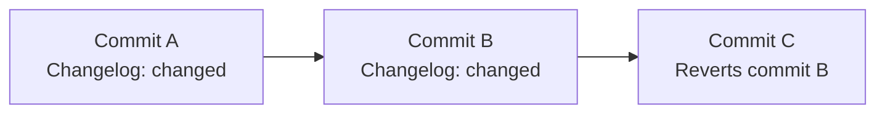
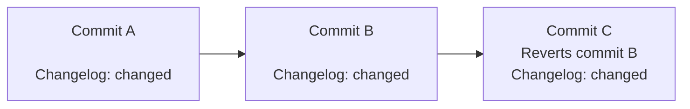

# Changelogs **(FREE)**

Changelogs are generated based on commit titles and Git trailers. To be included
in a changelog, a commit must contain a specific Git trailer. Changelogs are generated
from commit titles, and categorized by Git trailer type. You can enrich changelog entries
with additional data, such as a link to the merge request or details about the
commit author. Changelog formats [can be customized](#customize-the-changelog-output) with a template.

Each section in the default changelog has a title containing the version
number and release date, like this:

````markdown
## 1.0.0 (2021-01-05)

### Features (4 changes)

- [Feature 1](gitlab-org/gitlab@123abc) by @alice ([merge request](gitlab-org/gitlab!123))
- [Feature 2](gitlab-org/gitlab@456abc) ([merge request](gitlab-org/gitlab!456))
- [Feature 3](gitlab-org/gitlab@234abc) by @steve
- [Feature 4](gitlab-org/gitlab@456)
````

The date format for sections can be customized, but the rest of the title cannot.
When adding new sections, GitLab parses these titles to determine where to place
the new information in the file. GitLab sorts sections according to their versions,
not their dates.

Each section contains changes sorted by category (like **Features**), and the format
of these sections can be changed. The section names derive from the values of the
Git trailer used to include or exclude commits.

Commits for changelogs can be retrieved when operating on a mirror. GitLab itself
uses this feature, because security releases can include changes from both public
projects and private security mirrors.

## Add a trailer to a Git commit

You can add trailers manually when you write a commit message. To include a commit
using the default trailer of `Changelog` and categorize it as a feature, add the
string `Changelog: feature` to your commit message, like this:

```plaintext
<Commit message subject>

<Commit message description>

Changelog: feature
```

## Create a changelog

To generate changelog data based on commits in a repository, see
[Add changelog data to a changelog file](../../api/repositories.md#add-changelog-data-to-a-changelog-file)
in the API documentation.

The changelog output is formatted in Markdown, and [you can customize it](#customize-the-changelog-output).

### Reverted commits

> [Introduced](https://gitlab.com/gitlab-org/gitlab/-/merge_requests/55537) in GitLab 13.10.

To be treated as a revert commit, the commit message must contain the string
`This reverts commit <SHA>`, where `SHA` is the SHA of the commit to be reverted.

When generating a changelog for a range, GitLab ignores commits both added and
reverted in that range. In this example, commit C reverts commit B. Because
commit C has no other trailer, only commit A is added to the changelog:



However, if the revert commit (commit C) _also_ contains a changelog trailer,
both commits A and C are included in the changelog:



Commit B is skipped.

### Customize the changelog output

To customize the changelog output, edit the changelog configuration file. The default
location for this configuration is `.gitlab/changelog_config.yml`. The file supports
these variables:

- `date_format`: The date format, in `strftime` format, used in the title of the newly added changelog data.
- `template`: A custom template to use when generating the changelog data.
- `include_groups`: A list of group full paths containing users whose contributions
  should be credited regardless of project membership. The user generating the changelog
  must have access to each group for credit to be given.
- `categories`: A hash that maps raw category names to the names to use in the changelog.
  To alter the names displayed in the changelog, add these lines to your configuration file
  and edit them to meet your needs. This example renders the category titles as
  `### Features`, `### Bug fixes`, and `### Performance improvements`:

  ```yaml
   ---
   categories:
     feature: Features
     bug: Bug fixes
     performance: Performance improvements
  ```

### Custom templates

Category sections are generated using a template. The default template:

```plaintext


### {{ title }} (1 change{{ count }} changes)


- [{{ title }}]({{ commit.reference }})\
 by {{ author.reference }}\
 ([merge request]({{ merge_request.reference }}))





No changes.

```

The `` tags are for statements, and `{{ ... }}` is used for printing
data. Statements must be terminated using a `` tag. Both the `if` and
`each` statements require a single argument.

For example, for a variable called `valid`, you can display "yes"
when this value is true, and display "nope" otherwise by doing the following:

```plaintext

yes

nope

```

The use of `else` is optional. A value is considered true when it's a non-empty
value or boolean `true`. Empty arrays and hashes are considered false.

Looping is done using `each`, and variables inside a loop are scoped to it.
Referring to the current value in a loop is done using the variable tag
`{{ it }}`. Other variables read their value from the current loop value. Take
this template for example:

```plaintext

{{name}}

```

Assuming `users` is an array of objects, each with a `name` field, this would
then print the name of every user.

Using variable tags, you can access nested objects. For example,
`{{ users.0.name }}` prints the name of the first user in the `users` variable.

If a line ends in a backslash, the next newline is ignored. This allows you to
wrap code across multiple lines, without introducing unnecessary newlines in the
Markdown output.

Tags that use `` (known as expression tags) consume the newline that
directly follows them, if any. This means that this:

```plaintext
---

bar

---
```

Compiles into this:

```plaintext
---
bar
---
```

Instead of this:

```plaintext
---

bar

---
```

You can specify a custom template in your configuration, like this:

```yaml
---
template: |
  
  
  ### {{ title }}

  
  - [{{ title }}]({{ commit.reference }})\
   by {{ author.reference }}

  

  
  
  No changes.
  
```

When specifying the template you should use `template: |` and not
`template: >`, as the latter doesn't preserve newlines in the template.

### Template data

At the top level, the following variable is available:

- `categories`: an array of objects, one for every changelog category.

In a category, the following variables are available:

- `count`: the number of entries in this category.
- `entries`: the entries that belong to this category.
- `single_change`: a boolean that indicates if there is only one change (`true`),
  or multiple changes (`false`).
- `title`: the title of the category (after it has been remapped).

In an entry, the following variables are available (here `foo.bar` means that
`bar` is a sub-field of `foo`):

- `author.contributor`: a boolean set to `true` when the author is not a project
  member, otherwise `false`.
- `author.credit`: a boolean set to `true` when `author.contributor` is `true` or
  when `include_groups` is configured, and the author is a member of one of the
  groups.
- `author.reference`: a reference to the commit author (for example, `@alice`).
- `commit.reference`: a reference to the commit, for example,
  `gitlab-org/gitlab@0a4cdd86ab31748ba6dac0f69a8653f206e5cfc7`.
- `commit.trailers`: an object containing all the Git trailers that were present
  in the commit body.
- `merge_request.reference`: a reference to the merge request that first
  introduced the change (for example, `gitlab-org/gitlab!50063`).
- `title`: the title of the changelog entry (this is the commit title).

The `author` and `merge_request` objects might not be present if the data
couldn't be determined. For example, when a commit is created without a
corresponding merge request, no merge request is displayed.

### Customize the tag format when extracting versions

> [Introduced](https://gitlab.com/gitlab-org/gitlab/-/merge_requests/56889) in GitLab 13.11.

GitLab uses a regular expression (using the
[re2](https://github.com/google/re2/) engine and syntax) to extract a semantic
version from tag names. The default regular expression is:

```plaintext
^v?(?P<major>0|[1-9]\d*)\.(?P<minor>0|[1-9]\d*)\.(?P<patch>0|[1-9]\d*)(?:-(?P<pre>(?:0|[1-9]\d*|\d*[a-zA-Z-][0-9a-zA-Z-]*)(?:\.(?:0|[1-9]\d*|\d*[a-zA-Z-][0-9a-zA-Z-]*))*))?(?:\+(?P<meta>[0-9a-zA-Z-]+(?:\.[0-9a-zA-Z-]+)*))?$
```

This regular expression is based on the official
[semantic versioning](https://semver.org/) regular expression, and also includes
support for tag names that start with the letter `v`.

If your project uses a different format for tags, you can specify a different
regular expression. The regular expression used _must_ produce the following
capture groups. If any of these capture groups are missing, the tag is ignored:

- `major`
- `minor`
- `patch`

The following capture groups are optional:

- `pre`: If set, the tag is ignored. Ignoring `pre` tags ensures release candidate
  tags and other pre-release tags are not considered when determining the range of
  commits to generate a changelog for.
- `meta`: Optional. Specifies build metadata.

Using this information, GitLab builds a map of Git tags and their release
versions. It then determines what the latest tag is, based on the version
extracted from each tag.

To specify a custom regular expression, use the `tag_regex` setting in your
changelog configuration YAML file. For example, this pattern matches tag names
such as `version-1.2.3` but not `version-1.2`.

```yaml
---
tag_regex: '^version-(?P<major>\d+)\.(?P<minor>\d+)\.(?P<patch>\d+)$'
```

To test if your regular expression is working, you can use websites such as
[regex101](https://regex101.com/). If the regular expression syntax is invalid,
an error is produced when generating a changelog.

## Related topics

- [Changelog-related endpoints](../../api/repositories.md) in the Repositories API
- Developer documentation for [changelog entries](../../development/changelog.md) in GitLab
