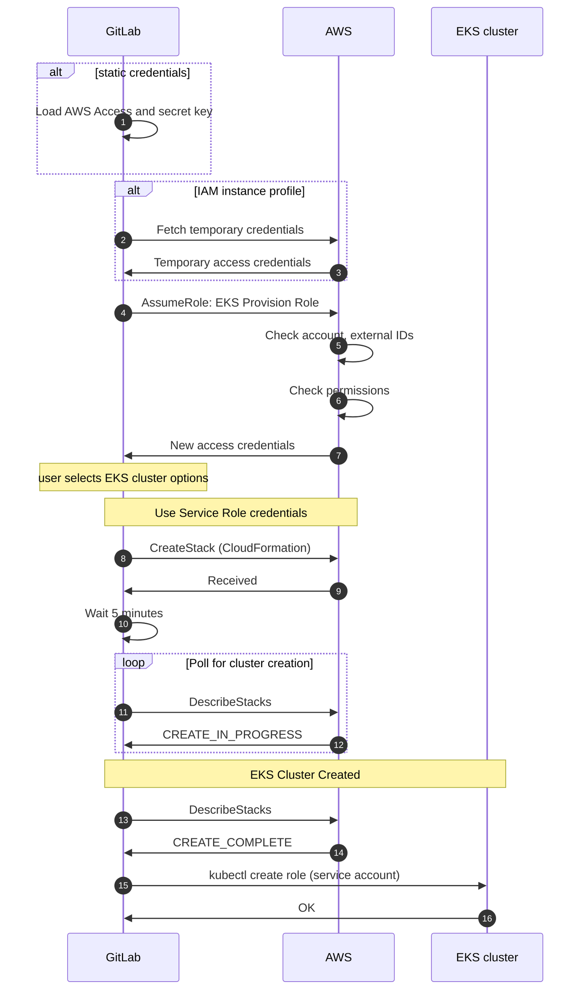

# Adding EKS clusters **(FREE)**

GitLab supports adding new and existing EKS clusters.

## EKS requirements

Before creating your first cluster on Amazon EKS with the GitLab integration, make sure the following
requirements are met:

- An [Amazon Web Services](https://aws.amazon.com/) account is set up and you are able to log in.
- You have permissions to manage IAM resources.
- If you want to use an [existing EKS cluster](#existing-eks-cluster):
  - An Amazon EKS cluster with worker nodes properly configured.
  - `kubectl` [installed and configured](https://docs.aws.amazon.com/eks/latest/userguide/getting-started.html#get-started-kubectl)
    for access to the EKS cluster.

### Additional requirements for self-managed instances **(FREE SELF)**

If you are using a self-managed GitLab instance, GitLab must first be configured with a set of
Amazon credentials. These credentials are used to assume an Amazon IAM role provided by the user
creating the cluster. Create an IAM user and ensure it has permissions to assume the role(s) that
your users need to create EKS clusters.

For example, the following policy document allows assuming a role whose name starts with
`gitlab-eks-` in account `123456789012`:

```json
{
  "Version": "2012-10-17",
  "Statement": {
    "Effect": "Allow",
    "Action": "sts:AssumeRole",
    "Resource": "arn:aws:iam::123456789012:role/gitlab-eks-*"
  }
}
```

### Configure Amazon authentication

To configure Amazon authentication in GitLab, generate an access key for the IAM user in the Amazon AWS console, and following the steps below.

1. Navigate to **Admin Area > Settings > General** and expand the **Amazon EKS** section.
1. Check **Enable Amazon EKS integration**.
1. Enter your **Account ID**.
1. Depending on your configuration, enter your access key and ID:

   - _GitLab 13.7 and later, and using an instance profile_: You may leave
     **Access key ID** and **Secret access key** blank.
     Read [Instance profiles](#instance-profiles) for more information.
   - _All GitLab versions_: Enter your access key credentials into
     **Access key ID** and **Secret access key**.

1. Click **Save changes**.

#### Instance profiles

> Introduced in [GitLab 13.7](https://gitlab.com/gitlab-org/gitlab/-/issues/291015).

You may leave `Access key ID` and `Secret access key` fields blank if
you are using an instance profile
[to pass an IAM role to an EC2 instance](https://docs.aws.amazon.com/IAM/latest/UserGuide/id_roles_use_switch-role-ec2_instance-profiles.html).
Instance profiles dynamically retrieve temporary credentials from AWS when needed.

## New EKS cluster

> [Introduced](https://gitlab.com/gitlab-org/gitlab/-/issues/22392) in GitLab 12.5.

To create and add a new Kubernetes cluster to your project, group, or instance:

1. Navigate to your:
   - Project's **Operations > Kubernetes** page, for a project-level cluster.
   - Group's **Kubernetes** page, for a group-level cluster.
   - **Admin Area > Kubernetes**, for an instance-level cluster.
1. Click **Add Kubernetes cluster**.
1. Under the **Create new cluster** tab, click **Amazon EKS** to display an
   `Account ID` and `External ID` needed for later steps.
1. In the [IAM Management Console](https://console.aws.amazon.com/iam/home), create an IAM policy:
   1. From the left panel, select **Policies**.
   1. Click **Create Policy**, which opens a new window.
   1. Select the **JSON** tab, and paste the following snippet in place of the
      existing content. These permissions give GitLab the ability to create
      resources, but not delete them:

      ```json
      {
          "Version": "2012-10-17",
          "Statement": [
              {
                  "Effect": "Allow",
                  "Action": [
                      "autoscaling:CreateAutoScalingGroup",
                      "autoscaling:DescribeAutoScalingGroups",
                      "autoscaling:DescribeScalingActivities",
                      "autoscaling:UpdateAutoScalingGroup",
                      "autoscaling:CreateLaunchConfiguration",
                      "autoscaling:DescribeLaunchConfigurations",
                      "cloudformation:CreateStack",
                      "cloudformation:DescribeStacks",
                      "ec2:AuthorizeSecurityGroupEgress",
                      "ec2:AuthorizeSecurityGroupIngress",
                      "ec2:RevokeSecurityGroupEgress",
                      "ec2:RevokeSecurityGroupIngress",
                      "ec2:CreateSecurityGroup",
                      "ec2:createTags",
                      "ec2:DescribeImages",
                      "ec2:DescribeKeyPairs",
                      "ec2:DescribeRegions",
                      "ec2:DescribeSecurityGroups",
                      "ec2:DescribeSubnets",
                      "ec2:DescribeVpcs",
                      "eks:CreateCluster",
                      "eks:DescribeCluster",
                      "iam:AddRoleToInstanceProfile",
                      "iam:AttachRolePolicy",
                      "iam:CreateRole",
                      "iam:CreateInstanceProfile",
                      "iam:CreateServiceLinkedRole",
                      "iam:GetRole",
                      "iam:listAttachedRolePolicies",
                      "iam:ListRoles",
                      "iam:PassRole",
                      "ssm:GetParameters"
                  ],
                  "Resource": "*"
              }
          ]
      }
      ```

      If an error is encountered during the creation process, changes will
      not be rolled back and you must remove resources manually. You can do this by deleting
      the relevant [CloudFormation stack](https://docs.aws.amazon.com/AWSCloudFormation/latest/UserGuide/cfn-console-delete-stack.html)

   1. Click **Review policy**.
   1. Enter a suitable name for this policy, and click **Create Policy**. You can now close this window.

1. In the [IAM Management Console](https://console.aws.amazon.com/iam/home), create an **EKS IAM role** following the [Amazon EKS cluster IAM role instructions](https://docs.aws.amazon.com/eks/latest/userguide/service_IAM_role.html). This role should exist so that Kubernetes clusters managed by Amazon EKS can make calls to other AWS services on your behalf to manage the resources that you use with the service.
   In addition to the policies that guide suggests, you must also include the `AmazonEKSClusterPolicy`
   policy for this role in order for GitLab to manage the EKS cluster correctly.
1. In the [IAM Management Console](https://console.aws.amazon.com/iam/home), create another IAM role which will be used by GitLab to authenticate with AWS. Follow these steps to create it:
   1. On the AWS IAM console, select **Roles** from the left panel.
   1. Click **Create role**.
   1. Under `Select type of trusted entity`, select **Another AWS account**.
   1. Enter the Account ID from GitLab into the `Account ID` field.
   1. Check **Require external ID**.
   1. Enter the External ID from GitLab into the `External ID` field.
   1. Click **Next: Permissions**, and select the policy you just created.
   1. Click **Next: Tags**, and optionally enter any tags you wish to associate with this role.
   1. Click **Next: Review**.
   1. Enter a role name and optional description into the fields provided.
   1. Click **Create role**, the new role name displays at the top. Click on its name and copy the `Role ARN` from the newly created role.
1. In GitLab, enter the copied role ARN into the `Role ARN` field.
1. In the **Cluster Region** field, enter the [region](https://docs.aws.amazon.com/AWSEC2/latest/UserGuide/using-regions-availability-zones.html) you plan to use for your new cluster. GitLab confirms you have access to this region when authenticating your role.
1. Click **Authenticate with AWS**.
1. Choose your cluster's settings:
   - **Kubernetes cluster name** - The name you wish to give the cluster.
   - **Environment scope** - The [associated environment](index.md#setting-the-environment-scope) to this cluster.
   - **Kubernetes version** - The [Kubernetes version](index.md#supported-cluster-versions) to use.
   - **Service role** - Select the **EKS IAM role** you created earlier to allow Amazon EKS
     and the Kubernetes control plane to manage AWS resources on your behalf.

     NOTE:
     This IAM role is _not_ the IAM role you created in the previous step. It should be
     the one you created much earlier by following the
     [Amazon EKS cluster IAM role](https://docs.aws.amazon.com/eks/latest/userguide/service_IAM_role.html)
     guide.
   - **Key pair name** - Select the [key pair](https://docs.aws.amazon.com/AWSEC2/latest/UserGuide/ec2-key-pairs.html)
     that you can use to connect to your worker nodes if required.
   - **VPC** - Select a [VPC](https://docs.aws.amazon.com/vpc/latest/userguide/what-is-amazon-vpc.html)
     to use for your EKS Cluster resources.
   - **Subnets** - Choose the [subnets](https://docs.aws.amazon.com/vpc/latest/userguide/VPC_Subnets.html)
     in your VPC where your worker nodes run. You must select at least two.
   - **Security group** - Choose the [security group](https://docs.aws.amazon.com/vpc/latest/userguide/VPC_SecurityGroups.html)
     to apply to the EKS-managed Elastic Network Interfaces that are created in your worker node subnets.
   - **Instance type** - The [instance type](https://aws.amazon.com/ec2/instance-types/) of your worker nodes.
   - **Node count** - The number of worker nodes.
   - **GitLab-managed cluster** - Leave this checked if you want GitLab to manage namespaces and service accounts for this cluster.
     See the [Managed clusters section](index.md#gitlab-managed-clusters) for more information.
1. Finally, click the **Create Kubernetes cluster** button.

After about 10 minutes, your cluster is ready to go. You can now proceed
to install some [pre-defined applications](index.md#installing-applications).

NOTE:
You must add your AWS external ID to the
[IAM Role in the AWS CLI](https://docs.aws.amazon.com/cli/latest/userguide/cli-configure-role.html#cli-configure-role-xaccount)
to manage your cluster using `kubectl`.

### Cluster creation flow

The following sequence illustrates how GitLab works with AWS to create an EKS cluster:



First, GitLab must obtain an initial set of credentials to communicate with the AWS API.
These credentials can be retrieved in one of two ways:

- Statically through the [Configure Amazon authentication](#configure-amazon-authentication).
- Dynamically via an IAM instance profile ([introduced](https://gitlab.com/gitlab-org/gitlab/-/issues/291015) in GitLab 13.7).

After GitLab retrieves the AWS credentials, it makes an
[AssumeRole](https://docs.aws.amazon.com/STS/latest/APIReference/API_AssumeRole.html)
API call to obtain credentials for the Provision Role. AWS confirms
the request has the correct account ID, external ID, and permissions.

If the request is valid, AWS returns a new set of temporary credentials GitLab
uses to load the **Create cluster** options page.

On the **Create cluster** page, the user must select a **Service Role**, which is
the IAM role that is actually used to create the cluster, and other options
such as the Kubernetes cluster name, Kubernetes version, and region.
After the user clicks the **Create Kubernetes cluster** button, GitLab
submits a CloudFormation API request to create an EKS cluster with the given parameters
from the user. GitLab waits 5 minutes before checking whether the cluster was created,
and polls once a minute for up to 30 minutes.

After GitLab receives a `CREATE_COMPLETE` message from AWS, GitLab talks
to the EKS cluster to create a Kubernetes service account with `cluster-admin`
privileges, and updates its internal database to reflect the newly-created
Kubernetes cluster. From this point forward, GitLab uses this service account to
interact with the cluster.

### Troubleshooting creating a new cluster

The following errors are commonly encountered when creating a new cluster.

#### Validation failed: Role ARN must be a valid Amazon Resource Name

Check that the `Provision Role ARN` is correct. An example of a valid ARN:

```plaintext
arn:aws:iam::123456789012:role/gitlab-eks-provision'
```

#### Access denied: User `arn:aws:iam::x` is not authorized to perform: `sts:AssumeRole` on resource: `arn:aws:iam::y`

This error occurs when the credentials defined in the
[Configure Amazon authentication](#configure-amazon-authentication) cannot assume the role defined by the
Provision Role ARN. Check that:

1. The initial set of AWS credentials [has the AssumeRole policy](#additional-requirements-for-self-managed-instances).
1. The Provision Role has access to create clusters in the given region.
1. The account ID and
   [external ID](https://docs.aws.amazon.com/IAM/latest/UserGuide/id_roles_create_for-user_externalid.html)
   match the value defined in the **Trust relationships** tab in AWS:

   

#### Could not load Security Groups for this VPC

When populating options in the configuration form, GitLab returns this error
because GitLab has successfully assumed your provided role, but the role has
insufficient permissions to retrieve the resources needed for the form. Make sure
you've assigned the role the correct permissions.

### Key Pairs are not loaded

GitLab loads the key pairs from the **Cluster Region** specified. Ensure that key pair exists in that region. 

#### `ROLLBACK_FAILED` during cluster creation

The creation process halted because GitLab encountered an error when creating
one or more resources. You can inspect the associated
[CloudFormation stack](https://docs.aws.amazon.com/AWSCloudFormation/latest/UserGuide/cfn-console-view-stack-data-resources.html)
to find the specific resources that failed to create.

If the `Cluster` resource failed with the error
`The provided role doesn't have the Amazon EKS Managed Policies associated with it.`,
the role specified in **Role name** is not configured correctly.

NOTE:
This role should be the role you created by following the
[EKS cluster IAM role](https://docs.aws.amazon.com/eks/latest/userguide/service_IAM_role.html) guide.
In addition to the policies that guide suggests, you must also include the
`AmazonEKSClusterPolicy` policy for this role in order for GitLab to manage the EKS cluster correctly.

## Existing EKS cluster

For information on adding an existing EKS cluster, see
[Existing Kubernetes cluster](add_remove_clusters.md#existing-kubernetes-cluster).

### Create a default Storage Class

Amazon EKS doesn't have a default Storage Class out of the box, which means
requests for persistent volumes are not automatically fulfilled. As part
of Auto DevOps, the deployed PostgreSQL instance requests persistent storage,
and without a default storage class it cannot start.

If a default Storage Class doesn't already exist and is desired, follow Amazon's
[guide on storage classes](https://docs.aws.amazon.com/eks/latest/userguide/storage-classes.html)
to create one.

Alternatively, disable PostgreSQL by setting the project variable
[`POSTGRES_ENABLED`](../../../topics/autodevops/customize.md#cicd-variables) to `false`.

### Deploy the app to EKS

With RBAC disabled and services deployed,
[Auto DevOps](../../../topics/autodevops/index.md) can now be leveraged
to build, test, and deploy the app.

[Enable Auto DevOps](../../../topics/autodevops/index.md#at-the-project-level)
if not already enabled. If a wildcard DNS entry was created resolving to the
Load Balancer, enter it in the `domain` field under the Auto DevOps settings.
Otherwise, the deployed app isn't externally available outside of the cluster.


GitLab creates a new pipeline, which begins to build, test, and deploy the app.

After the pipeline has finished, your app runs in EKS, and is available
to users. Click on **CI/CD > Environments**.


GitLab displays a list of the environments and their deploy status, as well as
options to browse to the app, view monitoring metrics, and even access a shell
on the running pod.
