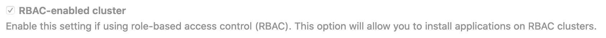

# Add an existing Kubernetes cluster

If you have an existing Kubernetes cluster, you can add it to a project, group,
or instance and benefit from the integration with GitLab.

## Prerequisites

See the prerequisites below to add existing clusters to GitLab.

### All clusters

To add any cluster to GitLab, you need:

- Either a GitLab.com account or an account for a self-managed installation
running GitLab 12.5 or later.
- The Maintainer role for group-level and project-level clusters.
- Access to the Admin area for instance-level clusters. **(FREE SELF)**
- A Kubernetes cluster.
- Cluster administration access to the cluster with `kubectl`.

You can host your cluster in [EKS](#eks-clusters), [GKE](#gke-clusters),
on premises, and with other providers.
To host them on premises and with other providers,
use either the EKS or GKE method to guide you through and enter your cluster's
settings manually.

WARNING:
GitLab doesn't support `arm64` clusters. See the issue
[Helm Tiller fails to install on `arm64` cluster](https://gitlab.com/gitlab-org/gitlab/-/issues/29838)
for details.

### EKS clusters

To add an existing **EKS** cluster, you need:

- An Amazon EKS cluster with worker nodes properly configured.
- `kubectl` [installed and configured](https://docs.aws.amazon.com/eks/latest/userguide/getting-started.html#get-started-kubectl)
for access to the EKS cluster.
- Ensure the token of the account has administrator privileges for the cluster.

### GKE clusters

To add an existing **GKE** cluster, you need:

- The `container.clusterRoleBindings.create` permission to create a cluster
role binding. You can follow the [Google Cloud documentation](https://cloud.google.com/iam/docs/granting-changing-revoking-access)
to grant access.

## How to add an existing cluster

<!-- (REVISE -  BREAK INTO SMALLER STEPS) -->

To add a Kubernetes cluster to your project, group, or instance:

1. Navigate to your:
   1. Project's **{cloud-gear}** **Infrastructure > Kubernetes clusters** page, for a project-level cluster.
   1. Group's **{cloud-gear}** **Kubernetes** page, for a group-level cluster.
   1. **Menu >** **{admin}** **Admin >** **{cloud-gear}** **Kubernetes** page, for an instance-level cluster.
1. Click **Add Kubernetes cluster**.
1. Click the **Add existing cluster** tab and fill in the details:
   1. **Kubernetes cluster name** (required) - The name you wish to give the cluster.
   1. **Environment scope** (required) - The
      [associated environment](multiple_kubernetes_clusters.md#setting-the-environment-scope) to this cluster.
   1. **API URL** (required) -
      It's the URL that GitLab uses to access the Kubernetes API. Kubernetes
      exposes several APIs, we want the "base" URL that is common to all of them.
      For example, `https://kubernetes.example.com` rather than `https://kubernetes.example.com/api/v1`.

      Get the API URL by running this command:

      ```shell
      kubectl cluster-info | grep -E 'Kubernetes master|Kubernetes control plane' | awk '/http/ {print $NF}'
      ```

   1. **CA certificate** (required) - A valid Kubernetes certificate is needed to authenticate to the cluster. We use the certificate created by default.
      1. List the secrets with `kubectl get secrets`, and one should be named similar to
         `default-token-xxxxx`. Copy that token name for use below.
      1. Get the certificate by running this command:

         ```shell
         kubectl get secret <secret name> -o jsonpath="{['data']['ca\.crt']}" | base64 --decode
         ```

         If the command returns the entire certificate chain, you must copy the Root CA
         certificate and any intermediate certificates at the bottom of the chain.
         A chain file has following structure:

         ```plaintext
            -----BEGIN MY CERTIFICATE-----
            -----END MY CERTIFICATE-----
            -----BEGIN INTERMEDIATE CERTIFICATE-----
            -----END INTERMEDIATE CERTIFICATE-----
            -----BEGIN INTERMEDIATE CERTIFICATE-----
            -----END INTERMEDIATE CERTIFICATE-----
            -----BEGIN ROOT CERTIFICATE-----
            -----END ROOT CERTIFICATE-----
         ```

   1. **Token** -
      GitLab authenticates against Kubernetes using service tokens, which are
      scoped to a particular `namespace`.
      **The token used should belong to a service account with
      [`cluster-admin`](https://kubernetes.io/docs/reference/access-authn-authz/rbac/#user-facing-roles)
      privileges.** To create this service account:
      1. Create a file called `gitlab-admin-service-account.yaml` with contents:

         ```yaml
         apiVersion: v1
         kind: ServiceAccount
         metadata:
           name: gitlab
           namespace: kube-system
         ---
         apiVersion: rbac.authorization.k8s.io/v1
         kind: ClusterRoleBinding
         metadata:
           name: gitlab-admin
         roleRef:
           apiGroup: rbac.authorization.k8s.io
           kind: ClusterRole
           name: cluster-admin
         subjects:
           - kind: ServiceAccount
             name: gitlab
             namespace: kube-system
         ```

      1. Apply the service account and cluster role binding to your cluster:

         ```shell
         kubectl apply -f gitlab-admin-service-account.yaml
         ```

         You need the `container.clusterRoleBindings.create` permission
         to create cluster-level roles. If you do not have this permission,
         you can alternatively enable Basic Authentication and then run the
         `kubectl apply` command as an administrator:

         ```shell
         kubectl apply -f gitlab-admin-service-account.yaml --username=admin --password=<password>
         ```

         NOTE:
         Basic Authentication can be turned on and the password credentials
         can be obtained using the Google Cloud Console.

         Output:

         ```shell
         serviceaccount "gitlab" created
         clusterrolebinding "gitlab-admin" created
         ```

      1. Retrieve the token for the `gitlab` service account:

         ```shell
         kubectl -n kube-system describe secret $(kubectl -n kube-system get secret | grep gitlab | awk '{print $1}')
         ```

         Copy the `<authentication_token>` value from the output:

         ```plaintext
         Name:         gitlab-token-b5zv4
         Namespace:    kube-system
         Labels:       <none>
         Annotations:  kubernetes.io/service-account.name=gitlab
                      kubernetes.io/service-account.uid=bcfe66ac-39be-11e8-97e8-026dce96b6e8

         Type:  kubernetes.io/service-account-token

         Data
         ====
         ca.crt:     1025 bytes
         namespace:  11 bytes
         token:      <authentication_token>
         ```

   1. **GitLab-managed cluster** - Leave this checked if you want GitLab to manage namespaces and service accounts for this cluster.
      See the [Managed clusters section](index.md#gitlab-managed-clusters) for more information.
   1. **Project namespace** (optional) - You don't have to fill this in. By leaving
      it blank, GitLab creates one for you. Also:
      - Each project should have a unique namespace.
      - The project namespace is not necessarily the namespace of the secret, if
        you're using a secret with broader permissions, like the secret from `default`.
      - You should **not** use `default` as the project namespace.
      - If you or someone created a secret specifically for the project, usually
        with limited permissions, the secret's namespace and project namespace may
        be the same.

1. Select the **Add Kubernetes cluster** button.

After about 10 minutes, your cluster is ready.

## Disable Role-Based Access Control (RBAC) (optional)

When connecting a cluster via GitLab integration, you may specify whether the
cluster is RBAC-enabled or not. This affects how GitLab interacts with the
cluster for certain operations. If you did *not* check the **RBAC-enabled cluster**
checkbox at creation time, GitLab assumes RBAC is disabled for your cluster
when interacting with it. If so, you must disable RBAC on your cluster for the
integration to work properly.



WARNING:
Disabling RBAC means that any application running in the cluster,
or user who can authenticate to the cluster, has full API access. This is a
[security concern](index.md#security-implications), and may not be desirable.

To effectively disable RBAC, global permissions can be applied granting full access:

```shell
kubectl create clusterrolebinding permissive-binding \
  --clusterrole=cluster-admin \
  --user=admin \
  --user=kubelet \
  --group=system:serviceaccounts
```
