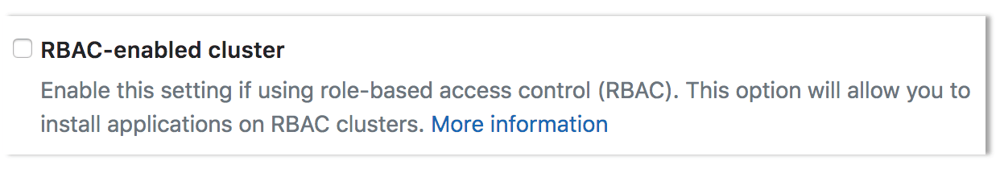
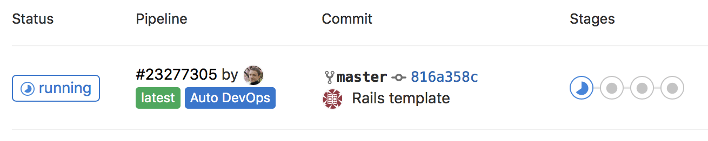

# Adding and removing Kubernetes clusters

GitLab can integrate with the following Kubernetes providers:

- Google Kubernetes Engine (GKE).
- Amazon Elastic Kubernetes Service (EKS).

TIP: **Tip:**
Every new Google Cloud Platform (GCP) account receives [$300 in credit upon sign up](https://console.cloud.google.com/freetrial),
and in partnership with Google, GitLab is able to offer an additional $200 for new GCP accounts to get started with GitLab's
Google Kubernetes Engine Integration. All you have to do is [follow this link](https://cloud.google.com/partners/partnercredit/?pcn_code=0014M00001h35gDQAQ#contact-form) and apply for credit.

## Access controls

When creating a cluster in GitLab, you will be asked if you would like to create either:

- A [Role-based access control (RBAC)](https://kubernetes.io/docs/reference/access-authn-authz/rbac/) cluster.
- An [Attribute-based access control (ABAC)](https://kubernetes.io/docs/reference/access-authn-authz/abac/) cluster.

NOTE: **Note:**
[RBAC](#rbac-cluster-resources) is recommended and the GitLab default.

GitLab creates the necessary service accounts and privileges to install and run
[GitLab managed applications](index.md#installing-applications). When GitLab creates the cluster,
a `gitlab` service account with `cluster-admin` privileges is created in the `default` namespace
to manage the newly created cluster.

NOTE: **Note:**
Restricted service account for deployment was [introduced](https://gitlab.com/gitlab-org/gitlab-foss/issues/51716) in GitLab 11.5.

When you install Helm into your cluster, the `tiller` service account
is created with `cluster-admin` privileges in the `gitlab-managed-apps`
namespace.

This service account will be:

- Added to the installed Helm Tiller.
- Used by Helm to install and run [GitLab managed applications](index.md#installing-applications).

Helm will also create additional service accounts and other resources for each
installed application. Consult the documentation of the Helm charts for each application
for details.

If you are [adding an existing Kubernetes cluster](add_remove_clusters.md#add-existing-cluster),
ensure the token of the account has administrator privileges for the cluster.

The resources created by GitLab differ depending on the type of cluster.

### Important notes

Note the following about access controls:

- Environment-specific resources are only created if your cluster is
  [managed by GitLab](index.md#gitlab-managed-clusters).
- If your cluster was created before GitLab 12.2, it will use a single namespace for all project
  environments.

### RBAC cluster resources

GitLab creates the following resources for RBAC clusters.

| Name                  | Type                 | Details                                                                                                    | Created when           |
|:----------------------|:---------------------|:-----------------------------------------------------------------------------------------------------------|:-----------------------|
| `gitlab`              | `ServiceAccount`     | `default` namespace                                                                                        | Creating a new cluster |
| `gitlab-admin`        | `ClusterRoleBinding` | [`cluster-admin`](https://kubernetes.io/docs/reference/access-authn-authz/rbac/#user-facing-roles) roleRef | Creating a new cluster |
| `gitlab-token`        | `Secret`             | Token for `gitlab` ServiceAccount                                                                          | Creating a new cluster |
| `tiller`              | `ServiceAccount`     | `gitlab-managed-apps` namespace                                                                            | Installing Helm Tiller |
| `tiller-admin`        | `ClusterRoleBinding` | `cluster-admin` roleRef                                                                                    | Installing Helm Tiller |
| Environment namespace | `Namespace`          | Contains all environment-specific resources                                                                | Deploying to a cluster |
| Environment namespace | `ServiceAccount`     | Uses namespace of environment                                                                              | Deploying to a cluster |
| Environment namespace | `Secret`             | Token for environment ServiceAccount                                                                       | Deploying to a cluster |
| Environment namespace | `RoleBinding`        | [`edit`](https://kubernetes.io/docs/reference/access-authn-authz/rbac/#user-facing-roles) roleRef          | Deploying to a cluster |

### ABAC cluster resources

GitLab creates the following resources for ABAC clusters.

| Name                  | Type                 | Details                              | Created when               |
|:----------------------|:---------------------|:-------------------------------------|:---------------------------|
| `gitlab`              | `ServiceAccount`     | `default` namespace                         | Creating a new cluster |
| `gitlab-token`        | `Secret`             | Token for `gitlab` ServiceAccount           | Creating a new cluster |
| `tiller`              | `ServiceAccount`     | `gitlab-managed-apps` namespace             | Installing Helm Tiller |
| `tiller-admin`        | `ClusterRoleBinding` | `cluster-admin` roleRef                     | Installing Helm Tiller |
| Environment namespace | `Namespace`          | Contains all environment-specific resources | Deploying to a cluster |
| Environment namespace | `ServiceAccount`     | Uses namespace of environment               | Deploying to a cluster |
| Environment namespace | `Secret`             | Token for environment ServiceAccount        | Deploying to a cluster |

### Security of GitLab Runners

GitLab Runners have the [privileged mode](https://docs.gitlab.com/runner/executors/docker.html#the-privileged-mode)
enabled by default, which allows them to execute special commands and running
Docker in Docker. This functionality is needed to run some of the
[Auto DevOps](../../../topics/autodevops/index.md)
jobs. This implies the containers are running in privileged mode and you should,
therefore, be aware of some important details.

The privileged flag gives all capabilities to the running container, which in
turn can do almost everything that the host can do. Be aware of the
inherent security risk associated with performing `docker run` operations on
arbitrary images as they effectively have root access.

If you don't want to use GitLab Runner in privileged mode, either:

- Use shared Runners on GitLab.com. They don't have this security issue.
- Set up your own Runners using configuration described at
  [Shared Runners](../../gitlab_com/index.md#shared-runners). This involves:
  1. Making sure that you don't have it installed via
     [the applications](index.md#installing-applications).
  1. Installing a Runner
     [using `docker+machine`](https://docs.gitlab.com/runner/executors/docker_machine.html).

## Add new cluster

New clusters can be added using GitLab for:

- Google Kubernetes Engine.
- Amazon Elastic Kubernetes Service.

### GKE cluster

GitLab supports:

- Creating a new GKE cluster using the GitLab UI.
- Providing credentials to add an [existing Kubernetes cluster](#add-existing-cluster).

Starting from [GitLab 12.4](https://gitlab.com/gitlab-org/gitlab/issues/25925), all the GKE clusters provisioned by GitLab are [VPC-native](https://cloud.google.com/kubernetes-engine/docs/how-to/alias-ips).

NOTE: **Note:**
The [Google authentication integration](../../../integration/google.md) must
be enabled in GitLab at the instance level. If that's not the case, ask your
GitLab administrator to enable it. On GitLab.com, this is enabled.

#### GKE Requirements

Before creating your first cluster on Google Kubernetes Engine with GitLab's
integration, make sure the following requirements are met:

- A [billing account](https://cloud.google.com/billing/docs/how-to/manage-billing-account)
  is set up and you have permissions to access it.
- The Kubernetes Engine API and related service are enabled. It should work immediately but may take up to 10 minutes after you create a project. For more information see the
  ["Before you begin" section of the Kubernetes Engine docs](https://cloud.google.com/kubernetes-engine/docs/quickstart#before-you-begin).

Also note the following:

- Starting from [GitLab 12.1](https://gitlab.com/gitlab-org/gitlab-foss/issues/55902), all GKE clusters
  created by GitLab are RBAC-enabled. Take a look at the [RBAC section](#rbac-cluster-resources) for
  more information.
- Starting from [GitLab 12.5](https://gitlab.com/gitlab-org/gitlab/merge_requests/18341), the
  cluster's pod address IP range will be set to /16 instead of the regular /14. /16 is a CIDR
  notation.

NOTE: **Note:**
GitLab requires basic authentication enabled and a client certificate issued for the cluster in
order to setup an [initial service account](#access-controls). Starting from [GitLab
11.10](https://gitlab.com/gitlab-org/gitlab-foss/issues/58208), the cluster creation process will
explicitly request that basic authentication and client certificate is enabled.

#### Creating the cluster on GKE

If all of the above requirements are met, you can proceed to create and add a
new Kubernetes cluster to your project:

1. Navigate to your project's **Operations > Kubernetes** page.

   NOTE: **Note:**
   You need Maintainer [permissions](../../permissions.md) and above to access the Kubernetes page.

1. Click **Add Kubernetes cluster**.
1. Click **Create with Google Kubernetes Engine**.
1. Connect your Google account if you haven't done already by clicking the
   **Sign in with Google** button.
1. Choose your cluster's settings:
   - **Kubernetes cluster name** - The name you wish to give the cluster.
   - **Environment scope** - The [associated environment](index.md#setting-the-environment-scope-premium) to this cluster.
   - **Google Cloud Platform project** - Choose the project you created in your GCP
     console that will host the Kubernetes cluster. Learn more about
     [Google Cloud Platform projects](https://cloud.google.com/resource-manager/docs/creating-managing-projects).
   - **Zone** - Choose the [region zone](https://cloud.google.com/compute/docs/regions-zones/)
     under which the cluster will be created.
   - **Number of nodes** - Enter the number of nodes you wish the cluster to have.
   - **Machine type** - The [machine type](https://cloud.google.com/compute/docs/machine-types)
     of the Virtual Machine instance that the cluster will be based on.
   - **Enable Cloud Run on GKE (beta)** - Check this if you want to use Cloud Run on GKE for this cluster.
     See the [Cloud Run on GKE section](#cloud-run-on-gke) for more information.
   - **GitLab-managed cluster** - Leave this checked if you want GitLab to manage namespaces and service accounts for this cluster.
     See the [Managed clusters section](index.md#gitlab-managed-clusters) for more information.
1. Finally, click the **Create Kubernetes cluster** button.

After a couple of minutes, your cluster will be ready to go. You can now proceed
to install some [pre-defined applications](index.md#installing-applications).

#### Cloud Run on GKE

> [Introduced](https://gitlab.com/gitlab-org/gitlab/merge_requests/16566) in GitLab 12.4.

You can choose to use Cloud Run on GKE in place of installing Knative and Istio
separately after the cluster has been created. This means that Cloud Run
(Knative), Istio, and HTTP Load Balancing will be enabled on the cluster at
create time and cannot be [installed or uninstalled](../../clusters/applications.md) separately.

### EKS Cluster

GitLab supports:

- Creating a new EKS cluster using the GitLab UI
  ([Introduced](https://gitlab.com/gitlab-org/gitlab/issues/22392) in GitLab 12.5).
- Providing credentials to add an [existing Kubernetes cluster](#add-existing-cluster).

#### EKS Requirements

Before creating your first cluster on Amazon EKS with GitLab's integration,
make sure the following requirements are met:

- An [Amazon Web Services](https://aws.amazon.com/) account is set up and you are able to log in.
- You have permissions to manage IAM resources.

##### Additional requirements for self-managed instances

If you are using a self-managed GitLab instance, GitLab must first
be configured with a set of Amazon credentials. These credentials
will be used to assume an Amazon IAM role provided by the user
creating the cluster. Create an IAM user and ensure it has permissions
to assume the role(s) that your users will use to create EKS clusters.

For example, the following policy document allows assuming a role whose name starts with
`gitlab-eks-` in account `123456789012`:

```json
{
  "Version": "2012-10-17",
  "Statement": {
    "Effect": "Allow",
    "Action": "sts:AssumeRole",
    "Resource": "arn:aws:iam::123456789012:role/gitlab-eks-*"
  }
}
```

Generate an access key for the IAM user, and configure GitLab with the credentials:

1. Navigate to **Admin Area > Settings > Integrations** and expand the **Amazon EKS** section.
1. Check **Enable Amazon EKS integration**.
1. Enter the account ID and access key credentials into the respective
   `Account ID`, `Access key ID` and `Secret access key` fields.
1. Click **Save changes**.

#### Creating the cluster on EKS

If all of the above requirements are met, you can proceed to create and add a
new Kubernetes cluster to your project:

1. Navigate to your project's **Operations > Kubernetes** page.

   NOTE: **Note:**
   You need Maintainer [permissions](../../permissions.md) and above to access the Kubernetes page.

1. Click **Add Kubernetes cluster**.
1. Click **Amazon EKS**. You will be provided with an `Account ID` and `External ID` to use in the next step.
1. In the [IAM Management Console](https://console.aws.amazon.com/iam/home), create an IAM role:
   1. From the left panel, select **Roles**.
   1. Click **Create role**.
   1. Under `Select type of trusted entity`, select **Another AWS account**.
   1. Enter the Account ID from GitLab into the `Account ID` field.
   1. Check **Require external ID**.
   1. Enter the External ID from GitLab into the `External ID` field.
   1. Click **Next: Permissions**.
   1. Click **Create Policy**, which will open a new window.
   1. Select the **JSON** tab, and paste in the following snippet in place of the existing content:

      ```json
      {
          "Version": "2012-10-17",
          "Statement": [
              {
                  "Effect": "Allow",
                  "Action": [
                      "autoscaling:CreateAutoScalingGroup",
                      "autoscaling:DescribeAutoScalingGroups",
                      "autoscaling:DescribeScalingActivities",
                      "autoscaling:UpdateAutoScalingGroup",
                      "autoscaling:CreateLaunchConfiguration",
                      "autoscaling:DescribeLaunchConfigurations",
                      "cloudformation:CreateStack",
                      "cloudformation:DescribeStacks",
                      "ec2:AuthorizeSecurityGroupEgress",
                      "ec2:AuthorizeSecurityGroupIngress",
                      "ec2:RevokeSecurityGroupEgress",
                      "ec2:RevokeSecurityGroupIngress",
                      "ec2:CreateSecurityGroup",
                      "ec2:createTags",
                      "ec2:DescribeImages",
                      "ec2:DescribeKeyPairs",
                      "ec2:DescribeRegions",
                      "ec2:DescribeSecurityGroups",
                      "ec2:DescribeSubnets",
                      "ec2:DescribeVpcs",
                      "eks:CreateCluster",
                      "eks:DescribeCluster",
                      "iam:AddRoleToInstanceProfile",
                      "iam:AttachRolePolicy",
                      "iam:CreateRole",
                      "iam:CreateInstanceProfile",
                      "iam:CreateServiceLinkedRole",
                      "iam:GetRole",
                      "iam:ListRoles",
                      "iam:PassRole",
                      "ssm:GetParameters"
                  ],
                  "Resource": "*"
              }
          ]
      }
      ```

      NOTE: **Note:**
      These permissions give GitLab the ability to create resources, but not delete them.
      This means that if an error is encountered during the creation process, changes will
      not be rolled back and you must remove resources manually. You can do this by deleting
      the relevant [CloudFormation stack](https://docs.aws.amazon.com/AWSCloudFormation/latest/UserGuide/cfn-console-delete-stack.html)

   1. Click **Review policy**.
   1. Enter a suitable name for this policy, and click **Create Policy**. You can now close this window.
   1. Switch back to the "Create role" window, and select the policy you just created.
   1. Click **Next: Tags**, and optionally enter any tags you wish to associate with this role.
   1. Click **Next: Review**.
   1. Enter a role name and optional description into the fields provided.
   1. Click **Create role**, the new role name will appear at the top. Click on its name and copy the `Role ARN` from the newly created role.
1. In GitLab, enter the copied role ARN into the `Role ARN` field.
1. Click **Authenticate with AWS**.
1. Choose your cluster's settings:
   - **Kubernetes cluster name** - The name you wish to give the cluster.
   - **Environment scope** - The [associated environment](index.md#setting-the-environment-scope-premium) to this cluster.
   - **Kubernetes version** - The Kubernetes version to use. Currently the only version supported is 1.14.
   - **Role name** - Select the [IAM role](https://docs.aws.amazon.com/IAM/latest/UserGuide/id_roles.html)
     to allow Amazon EKS and the Kubernetes control plane to manage AWS resources on your behalf.
   - **Region** - The [region](https://docs.aws.amazon.com/AWSEC2/latest/UserGuide/using-regions-availability-zones.html)
     in which the cluster will be created.
   - **Key pair name** - Select the [key pair](https://docs.aws.amazon.com/AWSEC2/latest/UserGuide/ec2-key-pairs.html)
     that you can use to connect to your worker nodes if required.
   - **VPC** - Select a [VPC](https://docs.aws.amazon.com/vpc/latest/userguide/what-is-amazon-vpc.html)
     to use for your EKS Cluster resources.
   - **Subnets** - Choose the [subnets](https://docs.aws.amazon.com/vpc/latest/userguide/VPC_Subnets.html)
     in your VPC where your worker nodes will run.
   - **Security group** - Choose the [security group](https://docs.aws.amazon.com/vpc/latest/userguide/VPC_SecurityGroups.html)
     to apply to the EKS-managed Elastic Network Interfaces that are created in your worker node subnets.
   - **Instance type** - The [instance type](https://aws.amazon.com/ec2/instance-types/) of your worker nodes.
   - **Node count** - The number of worker nodes.
   - **GitLab-managed cluster** - Leave this checked if you want GitLab to manage namespaces and service accounts for this cluster.
     See the [Managed clusters section](index.md#gitlab-managed-clusters) for more information.
1. Finally, click the **Create Kubernetes cluster** button.

After about 10 minutes, your cluster will be ready to go. You can now proceed
to install some [pre-defined applications](index.md#installing-applications).

## Add existing cluster

If you have either of the following types of clusters already, you can add them to a project:

- [Google Kubernetes Engine cluster](#add-existing-gke-cluster).
- [Amazon Elastic Kubernetes Service](#add-existing-eks-cluster).

NOTE: **Note:**
Kubernetes integration is not supported for arm64 clusters. See the issue
[Helm Tiller fails to install on arm64 cluster](https://gitlab.com/gitlab-org/gitlab-foss/issues/64044) for details.

### Add existing GKE cluster

To add an existing Kubernetes cluster to your project:

1. Navigate to your project's **Operations > Kubernetes** page.

   NOTE: **Note:**
   You need Maintainer [permissions](../../permissions.md) and above to access the Kubernetes page.

1. Click **Add Kubernetes cluster**.
1. Click **Add an existing Kubernetes cluster** and fill in the details:
   - **Kubernetes cluster name** (required) - The name you wish to give the cluster.
   - **Environment scope** (required) - The
     [associated environment](index.md#setting-the-environment-scope-premium) to this cluster.
   - **API URL** (required) -
     It's the URL that GitLab uses to access the Kubernetes API. Kubernetes
     exposes several APIs, we want the "base" URL that is common to all of them,
     e.g., `https://kubernetes.example.com` rather than `https://kubernetes.example.com/api/v1`.

     Get the API URL by running this command:

     ```sh
     kubectl cluster-info | grep 'Kubernetes master' | awk '/http/ {print $NF}'
     ```

   - **CA certificate** (required) - A valid Kubernetes certificate is needed to authenticate to the cluster. We will use the certificate created by default.
     - List the secrets with `kubectl get secrets`, and one should named similar to
      `default-token-xxxxx`. Copy that token name for use below.
     - Get the certificate by running this command:

       ```sh

       kubectl get secret <secret name> -o jsonpath="{['data']['ca\.crt']}" | base64 --decode

       ```

       NOTE: **Note:**
       If the command returns the entire certificate chain, you need copy the *root ca*
       certificate at the bottom of the chain.

   - **Token** -
     GitLab authenticates against Kubernetes using service tokens, which are
     scoped to a particular `namespace`.
     **The token used should belong to a service account with
     [`cluster-admin`](https://kubernetes.io/docs/reference/access-authn-authz/rbac/#user-facing-roles)
     privileges.** To create this service account:

     1. Create a file called `gitlab-admin-service-account.yaml` with contents:

        ```yaml
        apiVersion: v1
        kind: ServiceAccount
        metadata:
          name: gitlab-admin
          namespace: kube-system
        ---
        apiVersion: rbac.authorization.k8s.io/v1beta1
        kind: ClusterRoleBinding
        metadata:
          name: gitlab-admin
        roleRef:
          apiGroup: rbac.authorization.k8s.io
          kind: ClusterRole
          name: cluster-admin
        subjects:
        - kind: ServiceAccount
          name: gitlab-admin
          namespace: kube-system
        ```

     1. Apply the service account and cluster role binding to your cluster:

        ```bash
        kubectl apply -f gitlab-admin-service-account.yaml
        ```

        You will need the `container.clusterRoleBindings.create` permission
        to create cluster-level roles. If you do not have this permission,
        you can alternatively enable Basic Authentication and then run the
        `kubectl apply` command as an admin:

        ```bash
        kubectl apply -f gitlab-admin-service-account.yaml --username=admin --password=<password>
        ```

        NOTE: **Note:**
        Basic Authentication can be turned on and the password credentials
        can be obtained using the Google Cloud Console.

        Output:

        ```bash
        serviceaccount "gitlab-admin" created
        clusterrolebinding "gitlab-admin" created
        ```

     1. Retrieve the token for the `gitlab-admin` service account:

        ```bash
        kubectl -n kube-system describe secret $(kubectl -n kube-system get secret | grep gitlab-admin | awk '{print $1}')
        ```

        Copy the `<authentication_token>` value from the output:

        ```yaml
        Name:         gitlab-admin-token-b5zv4
        Namespace:    kube-system
        Labels:       <none>
        Annotations:  kubernetes.io/service-account.name=gitlab-admin
                      kubernetes.io/service-account.uid=bcfe66ac-39be-11e8-97e8-026dce96b6e8

        Type:  kubernetes.io/service-account-token

        Data
        ====
        ca.crt:     1025 bytes
        namespace:  11 bytes
        token:      <authentication_token>
        ```

     NOTE: **Note:**
     For GKE clusters, you will need the
     `container.clusterRoleBindings.create` permission to create a cluster
     role binding. You can follow the [Google Cloud
     documentation](https://cloud.google.com/iam/docs/granting-changing-revoking-access)
     to grant access.

   - **GitLab-managed cluster** - Leave this checked if you want GitLab to manage namespaces and service accounts for this cluster.
     See the [Managed clusters section](index.md#gitlab-managed-clusters) for more information.

   - **Project namespace** (optional) - You don't have to fill it in; by leaving
     it blank, GitLab will create one for you. Also:
     - Each project should have a unique namespace.
     - The project namespace is not necessarily the namespace of the secret, if
       you're using a secret with broader permissions, like the secret from `default`.
     - You should **not** use `default` as the project namespace.
     - If you or someone created a secret specifically for the project, usually
       with limited permissions, the secret's namespace and project namespace may
       be the same.

1. Finally, click the **Create Kubernetes cluster** button.

After a couple of minutes, your cluster will be ready to go. You can now proceed
to install some [pre-defined applications](index.md#installing-applications).

### Add existing EKS cluster

In this section, we will show how to integrate an [Amazon EKS](https://aws.amazon.com/eks/) cluster with GitLab and begin
deploying applications.

#### Requirements

To integrate with with EKS, you will need:

- An account on GitLab, like [GitLab.com](https://gitlab.com).
- An Amazon EKS cluster (with worker nodes properly configured).
- `kubectl` [installed and configured for access to the EKS cluster](https://docs.aws.amazon.com/eks/latest/userguide/getting-started.html#get-started-kubectl).

If you don't have an Amazon EKS cluster, one can be created by following the
[EKS getting started guide](https://docs.aws.amazon.com/eks/latest/userguide/getting-started.html).

#### Configuring and connecting the EKS cluster

From the left side bar, hover over **Operations > Kubernetes > Add Kubernetes cluster**,
then click **Add an existing Kubernetes cluster**.

A few details from the EKS cluster will be required to connect it to GitLab:

1. **Retrieve the certificate**: A valid Kubernetes certificate is needed to
   authenticate to the EKS cluster. We will use the certificate created by default.
   Open a shell and use `kubectl` to retrieve it:

   - List the secrets with `kubectl get secrets`, and one should named similar to
     `default-token-xxxxx`. Copy that token name for use below.
   - Get the certificate with:

     ```sh
     kubectl get secret <secret name> -o jsonpath="{['data']['ca\.crt']}" | base64 --decode
     ```

1. **Create admin token**: A `cluster-admin` token is required to install and
   manage Helm Tiller. GitLab establishes mutual SSL auth with Helm Tiller
   and creates limited service accounts for each application. To create the
   token we will create an admin service account as follows:

   1. Create a file called `eks-admin-service-account.yaml` with contents:

      ```yaml
      apiVersion: v1
      kind: ServiceAccount
      metadata:
        name: eks-admin
        namespace: kube-system
      ```

   1. Apply the service account to your cluster:

      ```bash
      kubectl apply -f eks-admin-service-account.yaml
      ```

      Output:

      ```bash
      serviceaccount "eks-admin" created
      ```

   1. Create a file called `eks-admin-cluster-role-binding.yaml` with contents:

      ```yaml
      apiVersion: rbac.authorization.k8s.io/v1beta1
      kind: ClusterRoleBinding
      metadata:
        name: eks-admin
      roleRef:
        apiGroup: rbac.authorization.k8s.io
        kind: ClusterRole
        name: cluster-admin
      subjects:
      - kind: ServiceAccount
        name: eks-admin
        namespace: kube-system
      ```

   1. Apply the cluster role binding to your cluster:

      ```bash
      kubectl apply -f eks-admin-cluster-role-binding.yaml
      ```

      Output:

      ```bash
      clusterrolebinding "eks-admin" created
      ```

   1. Retrieve the token for the `eks-admin` service account:

      ```bash
      kubectl -n kube-system describe secret $(kubectl -n kube-system get secret | grep eks-admin | awk '{print $1}')
      ```

      Copy the `<authentication_token>` value from the output:

      ```yaml
      Name:         eks-admin-token-b5zv4
      Namespace:    kube-system
      Labels:       <none>
      Annotations:  kubernetes.io/service-account.name=eks-admin
                    kubernetes.io/service-account.uid=bcfe66ac-39be-11e8-97e8-026dce96b6e8

      Type:  kubernetes.io/service-account-token

      Data
      ====
      ca.crt:     1025 bytes
      namespace:  11 bytes
      token:      <authentication_token>
      ```

1. The API server endpoint is also required, so GitLab can connect to the cluster.
   This is displayed on the AWS EKS console, when viewing the EKS cluster details.

You now have all the information needed to connect the EKS cluster:

- Kubernetes cluster name: Provide a name for the cluster to identify it within GitLab.
- Environment scope: Leave this as `*` for now, since we are only connecting a single cluster.
- API URL: Paste in the API server endpoint retrieved above.
- CA Certificate: Paste the certificate data from the earlier step, as-is.
- Paste the admin token value.
- Project namespace: This can be left blank to accept the default namespace, based on the project name.


Click on **Add Kubernetes cluster**, the cluster is now connected to GitLab.
At this point, [Kubernetes deployment variables](index.md#deployment-variables) will
automatically be available during CI/CD jobs, making it easy to interact with the cluster.

If you would like to utilize your own CI/CD scripts to deploy to the cluster, you can stop here.

#### Disable Role-Based Access Control (RBAC) (optional)

When connecting a cluster via GitLab integration, you may specify whether the
cluster is RBAC-enabled or not. This will affect how GitLab interacts with the
cluster for certain operations. If you **did not** check the "RBAC-enabled cluster"
checkbox at creation time, GitLab will assume RBAC is disabled for your cluster
when interacting with it. If so, you must disable RBAC on your cluster for the
integration to work properly.



NOTE: **Note**: Disabling RBAC means that any application running in the cluster,
or user who can authenticate to the cluster, has full API access. This is a
[security concern](index.md#security-implications), and may not be desirable.

To effectively disable RBAC, global permissions can be applied granting full access:

```bash
kubectl create clusterrolebinding permissive-binding \
  --clusterrole=cluster-admin \
  --user=admin \
  --user=kubelet \
  --group=system:serviceaccounts
```

#### Create a default Storage Class

Amazon EKS doesn't have a default Storage Class out of the box, which means
requests for persistent volumes will not be automatically fulfilled. As part
of Auto DevOps, the deployed Postgres instance requests persistent storage,
and without a default storage class it will fail to start.

If a default Storage Class doesn't already exist and is desired, follow Amazon's
[guide on storage classes](https://docs.aws.amazon.com/eks/latest/userguide/storage-classes.html)
to create one.

Alternatively, disable Postgres by setting the project variable
[`POSTGRES_ENABLED`](../../../topics/autodevops/#environment-variables) to `false`.

#### Deploy the app to EKS

With RBAC disabled and services deployed,
[Auto DevOps](../../../topics/autodevops/index.md) can now be leveraged
to build, test, and deploy the app.

[Enable Auto DevOps](../../../topics/autodevops/index.md#at-the-project-level)
if not already enabled. If a wildcard DNS entry was created resolving to the
Load Balancer, enter it in the `domain` field under the Auto DevOps settings.
Otherwise, the deployed app will not be externally available outside of the cluster.



A new pipeline will automatically be created, which will begin to build, test,
and deploy the app.

After the pipeline has finished, your app will be running in EKS and available
to users. Click on **CI/CD > Environments**.


You will see a list of the environments and their deploy status, as well as
options to browse to the app, view monitoring metrics, and even access a shell
on the running pod.

## Enabling or disabling integration

After you have successfully added your cluster information, you can enable the
Kubernetes cluster integration:

1. Click the **Enabled/Disabled** switch
1. Hit **Save** for the changes to take effect

To disable the Kubernetes cluster integration, follow the same procedure.

## Removing integration

To remove the Kubernetes cluster integration from your project, simply click the
**Remove integration** button. You will then be able to follow the procedure
and add a Kubernetes cluster again.

When removing the cluster integration, note:

- You need Maintainer [permissions](../../permissions.md) and above to remove a Kubernetes cluster
  integration.
- When you remove a cluster, you only remove its relationship to GitLab, not the cluster itself. To
  remove the cluster, you can do so by visiting the GKE or EKS dashboard, or using `kubectl`.

[From GitLab 12.6](https://gitlab.com/gitlab-org/gitlab/issues/26815), you can also remove all
related GitLab cluster resources (for example, namespaces, roles, and bindings) when removing the
integration.

## Learn more

To learn more on automatically deploying your applications,
read about [Auto DevOps](../../../topics/autodevops/index.md).
