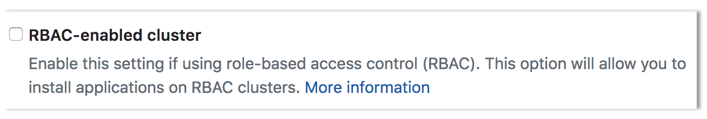

# Connecting and deploying to an Amazon EKS cluster

In this tutorial, we will show how to integrate an
[Amazon EKS](https://aws.amazon.com/eks/) cluster with GitLab and begin
deploying applications.

## Introduction

For an end-to-end walkthrough we will:

1. Start with a new project based on the sample Ruby on Rails template.
1. Integrate an EKS cluster.
1. Utilize [Auto DevOps](../../../../topics/autodevops/) to build, test, and deploy our application.

You will need:

1. An account on GitLab, like [GitLab.com](https://gitlab.com).
1. An Amazon EKS cluster (with worker nodes properly configured).
1. `kubectl` [installed and configured for access to the EKS cluster](https://docs.aws.amazon.com/eks/latest/userguide/getting-started.html#get-started-kubectl).

If you don't have an Amazon EKS cluster, one can be created by following the
[EKS getting started guide](https://docs.aws.amazon.com/eks/latest/userguide/getting-started.html).

## Creating a new project

On GitLab, create a new project by clicking on the `+` icon in the top navigation
bar and selecting **New project**.

On the new project screen, click on the **Create from template** tab, and select
"Use template" for the Ruby on Rails sample project.

Give the project a name, and then select **Create project**.


## Configuring and connecting the EKS cluster

From the left side bar, hover over **Operations > Kubernetes > Add Kubernetes cluster**,
then click **Add an existing Kubernetes cluster**.

A few details from the EKS cluster will be required to connect it to GitLab:

1. **Retrieve the certificate**: A valid Kubernetes certificate is needed to
   authenticate to the EKS cluster. We will use the certificate created by default.
   Open a shell and use `kubectl` to retrieve it:

   - List the secrets with `kubectl get secrets`, and one should named similar to
     `default-token-xxxxx`. Copy that token name for use below.
   - Get the certificate with:

     ```sh
     kubectl get secret <secret name> -o jsonpath="{['data']['ca\.crt']}" | base64 --decode
     ```

1. **Create admin token**: A `cluster-admin` token is required to install and
   manage Helm Tiller. GitLab establishes mutual SSL auth with Helm Tiller
   and creates limited service accounts for each application. To create the
   token we will create an admin service account as follows:

   2.1. Create a file called `eks-admin-service-account.yaml` with contents:

   ```yaml
   apiVersion: v1
   kind: ServiceAccount
   metadata:
     name: eks-admin
     namespace: kube-system
   ```

   2.2. Apply the service account to your cluster:

   ```bash
   kubectl apply -f eks-admin-service-account.yaml
   ```

   Output:

   ```bash
   serviceaccount "eks-admin" created
   ```

   2.3. Create a file called `eks-admin-cluster-role-binding.yaml` with contents:

   ```yaml
   apiVersion: rbac.authorization.k8s.io/v1beta1
   kind: ClusterRoleBinding
   metadata:
     name: eks-admin
   roleRef:
     apiGroup: rbac.authorization.k8s.io
     kind: ClusterRole
     name: cluster-admin
   subjects:
   - kind: ServiceAccount
     name: eks-admin
     namespace: kube-system
   ```

   2.4. Apply the cluster role binding to your cluster:

   ```bash
   kubectl apply -f eks-admin-cluster-role-binding.yaml
   ```

   Output:

   ```bash
   clusterrolebinding "eks-admin" created
   ```

   2.5. Retrieve the token for the `eks-admin` service account:

   ```bash
   kubectl -n kube-system describe secret $(kubectl -n kube-system get secret | grep eks-admin | awk '{print $1}')
   ```

   Copy the `<authentication_token>` value from the output:

   ```yaml
   Name:         eks-admin-token-b5zv4
   Namespace:    kube-system
   Labels:       <none>
   Annotations:  kubernetes.io/service-account.name=eks-admin
                 kubernetes.io/service-account.uid=bcfe66ac-39be-11e8-97e8-026dce96b6e8

   Type:  kubernetes.io/service-account-token

   Data
   ====
   ca.crt:     1025 bytes
   namespace:  11 bytes
   token:      <authentication_token>
   ```

1. The API server endpoint is also required, so GitLab can connect to the cluster.
   This is displayed on the AWS EKS console, when viewing the EKS cluster details.

You now have all the information needed to connect the EKS cluster:

- Kubernetes cluster name: Provide a name for the cluster to identify it within GitLab.
- Environment scope: Leave this as `*` for now, since we are only connecting a single cluster.
- API URL: Paste in the API server endpoint retrieved above.
- CA Certificate: Paste the certificate data from the earlier step, as-is.
- Paste the admin token value.
- Project namespace: This can be left blank to accept the default namespace, based on the project name.


Click on **Add Kubernetes cluster**, the cluster is now connected to GitLab.
At this point, [Kubernetes deployment variables](../#deployment-variables) will
automatically be available during CI/CD jobs, making it easy to interact with the cluster.

If you would like to utilize your own CI/CD scripts to deploy to the cluster, you can stop here.

## Disable Role-Based Access Control (RBAC) (optional)

When connecting a cluster via GitLab integration, you may specify whether the
cluster is RBAC-enabled or not. This will affect how GitLab interacts with the
cluster for certain operations. If you **did not** check the "RBAC-enabled cluster"
checkbox at creation time, GitLab will assume RBAC is disabled for your cluster
when interacting with it. If so, you must disable RBAC on your cluster for the
integration to work properly.



NOTE: **Note**: Disabling RBAC means that any application running in the cluster,
or user who can authenticate to the cluster, has full API access. This is a
[security concern](../index.md#security-implications), and may not be desirable.

To effectively disable RBAC, global permissions can be applied granting full access:

```bash
kubectl create clusterrolebinding permissive-binding \
  --clusterrole=cluster-admin \
  --user=admin \
  --user=kubelet \
  --group=system:serviceaccounts
```

## Deploy services to the cluster

GitLab supports one-click deployment of helpful services to the cluster, many of
which support Auto DevOps. Back on the Kubernetes cluster screen in GitLab, a
list of applications is now available to deploy.

First, install Helm Tiller, a package manager for Kubernetes. This enables
deployment of the other applications.


### Deploying NGINX Ingress (optional)

Next, if you would like the deployed app to be reachable on the internet, deploy
the Ingress. Note that this will also cause an
[Elastic Load Balancer](https://aws.amazon.com/documentation/elastic-load-balancing/)
to be created, which will incur additional AWS costs.

Once installed, you may see a `?` for "Ingress IP Address". This is because the
created ELB is available at a DNS name, not an IP address. To get the DNS name,
run:

```sh
kubectl get service ingress-nginx-ingress-controller -n gitlab-managed-apps -o jsonpath="{.status.loadBalancer.ingress[0].hostname}"
```

Note that you may see a trailing `%` on some Kubernetes versions, **do not include it**.

The Ingress is now available at this address and will route incoming requests to
the proper service based on the DNS name in the request. To support this, a
wildcard DNS CNAME record should be created for the desired domain name. For example,
`*.myekscluster.com` would point to the Ingress hostname obtained earlier.


### Deploying the GitLab Runner (optional)

If the project is on GitLab.com, free shared Runners are available and you do
not have to deploy one. If a project specific Runner is desired, or there are no
shared Runners, it is easy to deploy one.

Simply click on the **Install** button for the GitLab Runner. It is important to
note that the Runner deployed is set as **privileged**, which means it essentially
has root access to the underlying machine. This is required to build docker images,
and so is on by default.

### Deploying Prometheus (optional)

GitLab is able to monitor applications automatically, utilizing
[Prometheus](../../integrations/prometheus.html). Kubernetes container CPU and
memory metrics are automatically collected, and response metrics are retrieved
from NGINX Ingress as well.

To enable monitoring, simply install Prometheus into the cluster with the
**Install** button.

## Create a default Storage Class

Amazon EKS doesn't have a default Storage Class out of the box, which means
requests for persistent volumes will not be automatically fulfilled. As part
of Auto DevOps, the deployed Postgres instance requests persistent storage,
and without a default storage class it will fail to start.

If a default Storage Class doesn't already exist and is desired, follow Amazon's
[guide on storage classes](https://docs.aws.amazon.com/eks/latest/userguide/storage-classes.html)
to create one.

Alternatively, disable Postgres by setting the project variable
[`POSTGRES_ENABLED`](../../../../topics/autodevops/#environment-variables) to `false`.

## Deploy the app to EKS

With RBAC disabled and services deployed,
[Auto DevOps](../../../../topics/autodevops/index.md) can now be leveraged
to build, test, and deploy the app.

[Enable Auto DevOps](../../../../topics/autodevops/index.md#enablingdisabling-auto-devops-at-the-project-level)
if not already enabled. If a wildcard DNS entry was created resolving to the
Load Balancer, enter it in the `domain` field under the Auto DevOps settings.
Otherwise, the deployed app will not be externally available outside of the cluster.


A new pipeline will automatically be created, which will begin to build, test,
and deploy the app.

After the pipeline has finished, your app will be running in EKS and available
to users. Click on **CI/CD > Environments**.


You will see a list of the environments and their deploy status, as well as
options to browse to the app, view monitoring metrics, and even access a shell
on the running pod.

## Learn more

To learn more on automatically deploying your applications,
read about [Auto DevOps](../../../../topics/autodevops/index.md).
