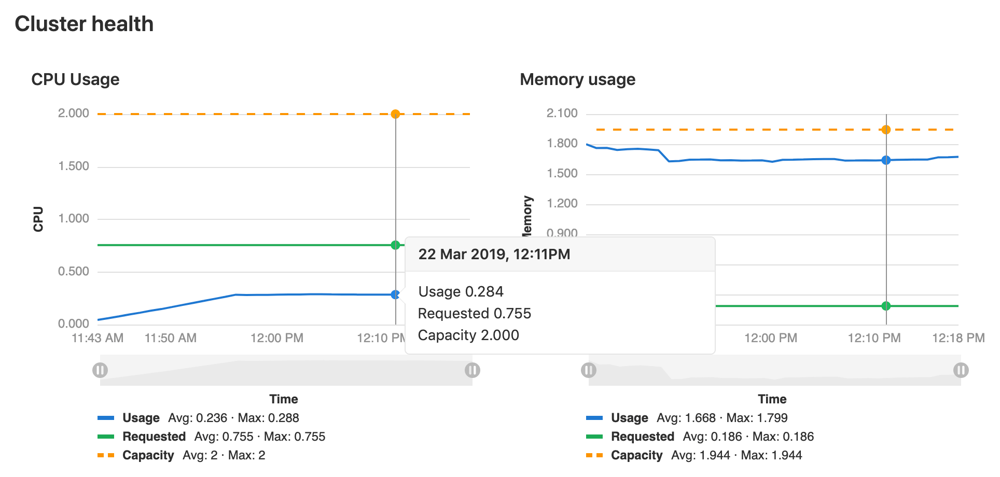

# Kubernetes clusters

> - [Introduced](https://gitlab.com/gitlab-org/gitlab-foss/issues/35954) in GitLab 10.1 for projects.
> - [Introduced](https://gitlab.com/gitlab-org/gitlab-foss/issues/34758) in
>   GitLab 11.6 for [groups](../../group/clusters/index.md).
> - [Introduced](https://gitlab.com/gitlab-org/gitlab-foss/issues/39840) in
>   GitLab 11.11 for [instances](../../instance/clusters/index.md).

GitLab provides many features with a Kubernetes integration. Kubernetes can be
integrated with projects, but also:

- [Groups](../../group/clusters/index.md).
- [Instances](../../instance/clusters/index.md).

NOTE: **Scalable app deployment with GitLab and Google Cloud Platform**
[Watch the webcast](https://about.gitlab.com/webcast/scalable-app-deploy/) and learn how to spin up a Kubernetes cluster managed by Google Cloud Platform (GCP) in a few clicks.

## Overview

Using the GitLab project Kubernetes integration, you can:

- Use [Review Apps](../../../ci/review_apps/index.md).
- Run [pipelines](../../../ci/pipelines.md).
- [Deploy](#deploying-to-a-kubernetes-cluster) your applications.
- Detect and [monitor Kubernetes](#kubernetes-monitoring).
- Use it with [Auto DevOps](#auto-devops).
- Use [Web terminals](#web-terminals).
- Use [Deploy Boards](#deploy-boards-premium). **(PREMIUM)**
- Use [Canary Deployments](#canary-deployments-premium). **(PREMIUM)**
- View [Pod logs](#pod-logs-ultimate). **(ULTIMATE)**
- Run serverless workloads on [Kubernetes with Knative](serverless/index.md).

See [Adding and removing Kubernetes clusters](add_remove_clusters.md) for details on how to
set up integrations.

### Deploy Boards **(PREMIUM)**

GitLab's Deploy Boards offer a consolidated view of the current health and
status of each CI [environment](../../../ci/environments.md) running on Kubernetes,
displaying the status of the pods in the deployment. Developers and other
teammates can view the progress and status of a rollout, pod by pod, in the
workflow they already use without any need to access Kubernetes.

[Read more about Deploy Boards](../deploy_boards.md)

### Canary Deployments **(PREMIUM)**

Leverage [Kubernetes' Canary deployments](https://kubernetes.io/docs/concepts/cluster-administration/manage-deployment/#canary-deployments)
and visualize your canary deployments right inside the Deploy Board, without
the need to leave GitLab.

[Read more about Canary Deployments](../canary_deployments.md)

### Pod logs **(ULTIMATE)**

GitLab makes it easy to view the logs of running pods in connected Kubernetes clusters. By displaying the logs directly in GitLab, developers can avoid having to manage console tools or jump to a different interface.

[Read more about Kubernetes pod logs](kubernetes_pod_logs.md)

### Kubernetes monitoring

Automatically detect and monitor Kubernetes metrics. Automatic monitoring of
[NGINX Ingress](../integrations/prometheus_library/nginx.md) is also supported.

[Read more about Kubernetes monitoring](../integrations/prometheus_library/kubernetes.md)

### Auto DevOps

Auto DevOps automatically detects, builds, tests, deploys, and monitors your
applications.

To make full use of Auto DevOps(Auto Deploy, Auto Review Apps, and Auto Monitoring)
you will need the Kubernetes project integration enabled.

[Read more about Auto DevOps](../../../topics/autodevops/index.md)

NOTE: **Note**
Kubernetes clusters can be used without Auto DevOps.

### Web terminals

NOTE: **Note:**
Introduced in GitLab 8.15. You must be the project owner or have `maintainer` permissions
to use terminals. Support is limited to the first container in the
first pod of your environment.

When enabled, the Kubernetes service adds [web terminal](../../../ci/environments.md#web-terminals)
support to your [environments](../../../ci/environments.md). This is based on the `exec` functionality found in
Docker and Kubernetes, so you get a new shell session within your existing
containers. To use this integration, you should deploy to Kubernetes using
the deployment variables above, ensuring any deployments, replica sets, and
pods are annotated with:

- `app.gitlab.com/env: $CI_ENVIRONMENT_SLUG`
- `app.gitlab.com/app: $CI_PROJECT_PATH_SLUG`

`$CI_ENVIRONMENT_SLUG` and `$CI_PROJECT_PATH_SLUG` are the values of
the CI variables.

## Cluster configuration

After [adding a Kubernetes cluster](add_remove_clusters.md) to GitLab, read this section that covers
important considerations for configuring Kubernetes clusters with GitLab.

### Security implications

CAUTION: **Important:**
The whole cluster security is based on a model where [developers](../../permissions.md)
are trusted, so **only trusted users should be allowed to control your clusters**.

The default cluster configuration grants access to a wide set of
functionalities needed to successfully build and deploy a containerized
application. Bear in mind that the same credentials are used for all the
applications running on the cluster.

### GitLab-managed clusters

> [Introduced](https://gitlab.com/gitlab-org/gitlab-foss/merge_requests/22011) in GitLab 11.5.
> Became [optional](https://gitlab.com/gitlab-org/gitlab-foss/merge_requests/26565) in GitLab 11.11.

You can choose to allow GitLab to manage your cluster for you. If your cluster is
managed by GitLab, resources for your projects will be automatically created. See the
[Access controls](add_remove_clusters.md#access-controls) section for details on which resources will
be created.

If you choose to manage your own cluster, project-specific resources will not be created
automatically. If you are using [Auto DevOps](../../../topics/autodevops/index.md), you will
need to explicitly provide the `KUBE_NAMESPACE` [deployment variable](#deployment-variables)
that will be used by your deployment jobs, otherwise a namespace will be created for you.

#### Important notes

Note the following with GitLab and clusters:

- If you [install applications](#installing-applications) on your cluster, GitLab will
  create the resources required to run these even if you have chosen to manage your own
  cluster.
- Be aware that manually managing resources that have been created by GitLab, like
  namespaces and service accounts, can cause unexpected errors. If this occurs, try
  [clearing the cluster cache](#clearing-the-cluster-cache).

#### Clearing the cluster cache

> [Introduced](https://gitlab.com/gitlab-org/gitlab/issues/31759) in GitLab 12.6.

If you choose to allow GitLab to manage your cluster for you, GitLab stores a cached
version of the namespaces and service accounts it creates for your projects. If you
modify these resources in your cluster manually, this cache can fall out of sync with
your cluster, which can cause deployment jobs to fail.

To clear the cache:

1. Navigate to your project’s **Operations > Kubernetes** page, and select your cluster.
1. Expand the **Advanced settings** section.
1. Click **Clear cluster cache**.

### Base domain

> [Introduced](https://gitlab.com/gitlab-org/gitlab-foss/merge_requests/24580) in GitLab 11.8.

NOTE: **Note:**
You do not need to specify a base domain on cluster settings when using GitLab Serverless. The domain in that case
will be specified as part of the Knative installation. See [Installing Applications](#installing-applications).

Specifying a base domain will automatically set `KUBE_INGRESS_BASE_DOMAIN` as an environment variable.
If you are using [Auto DevOps](../../../topics/autodevops/index.md), this domain will be used for the different
stages. For example, Auto Review Apps and Auto Deploy.

The domain should have a wildcard DNS configured to the Ingress IP address. After Ingress has been installed (see [Installing Applications](#installing-applications)),
you can either:

- Create an `A` record that points to the Ingress IP address with your domain provider.
- Enter a wildcard DNS address using a service such as nip.io or xip.io. For example, `192.168.1.1.xip.io`.

### Setting the environment scope **(PREMIUM)**

When adding more than one Kubernetes cluster to your project, you need to differentiate
them with an environment scope. The environment scope associates clusters with [environments](../../../ci/environments.md) similar to how the
[environment-specific variables](../../../ci/variables/README.md#limiting-environment-scopes-of-environment-variables) work.

The default environment scope is `*`, which means all jobs, regardless of their
environment, will use that cluster. Each scope can only be used by a single
cluster in a project, and a validation error will occur if otherwise.
Also, jobs that don't have an environment keyword set will not be able to access any cluster.

For example, let's say the following Kubernetes clusters exist in a project:

| Cluster     | Environment scope |
| ----------- | ----------------- |
| Development | `*`               |
| Production  | `production`      |

And the following environments are set in
[`.gitlab-ci.yml`](../../../ci/yaml/README.md):

```yaml
stages:
- test
- deploy

test:
  stage: test
  script: sh test

deploy to staging:
  stage: deploy
  script: make deploy
  environment:
    name: staging
    url: https://staging.example.com/

deploy to production:
  stage: deploy
  script: make deploy
  environment:
    name: production
    url: https://example.com/
```

The result will then be:

- The Development cluster details will be available in the `deploy to staging`
  job.
- The production cluster details will be available in the `deploy to production`
  job.
- No cluster details will be available in the `test` job because it doesn't
  define any environment.

### Multiple Kubernetes clusters **(PREMIUM)**

> Introduced in [GitLab Premium](https://about.gitlab.com/pricing/) 10.3.

With GitLab Premium, you can associate more than one Kubernetes cluster to your
project. That way you can have different clusters for different environments,
like dev, staging, production, etc.

Simply add another cluster, like you did the first time, and make sure to
[set an environment scope](#setting-the-environment-scope-premium) that will
differentiate the new cluster with the rest.

## Installing applications

GitLab can install and manage some applications like Helm, GitLab Runner, Ingress,
Prometheus, etc., in your project-level cluster. For more information on
installing, upgrading, uninstalling, and troubleshooting applications for
your project cluster, see
[GitLab Managed Apps](../../clusters/applications.md).

## Deploying to a Kubernetes cluster

A Kubernetes cluster can be the destination for a deployment job. If

- The cluster is integrated with GitLab, special
  [deployment variables](#deployment-variables) are made available to your job
  and configuration is not required. You can immediately begin interacting with
  the cluster from your jobs using tools such as `kubectl` or `helm`.
- You don't use GitLab's cluster integration you can still deploy to your
  cluster. However, you will need configure Kubernetes tools yourself
  using [environment variables](../../../ci/variables/README.md#creating-a-custom-environment-variable)
  before you can interact with the cluster from your jobs.

### Deployment variables

The Kubernetes cluster integration exposes the following
[deployment variables](../../../ci/variables/README.md#deployment-environment-variables) in the
GitLab CI/CD build environment.

| Variable | Description |
| -------- | ----------- |
| `KUBE_URL` | Equal to the API URL. |
| `KUBE_TOKEN` | The Kubernetes token of the [environment service account](add_remove_clusters.md#access-controls). |
| `KUBE_NAMESPACE` | The namespace associated with the project's deployment service account. In the format `<project_name>-<project_id>-<environment>`. For GitLab-managed clusters, a matching namespace is automatically created by GitLab in the cluster. |
| `KUBE_CA_PEM_FILE` | Path to a file containing PEM data. Only present if a custom CA bundle was specified. |
| `KUBE_CA_PEM` | (**deprecated**) Raw PEM data. Only if a custom CA bundle was specified. |
| `KUBECONFIG` | Path to a file containing `kubeconfig` for this deployment. CA bundle would be embedded if specified. This config also embeds the same token defined in `KUBE_TOKEN` so you likely will only need this variable. This variable name is also automatically picked up by `kubectl` so you won't actually need to reference it explicitly if using `kubectl`. |
| `KUBE_INGRESS_BASE_DOMAIN` | From GitLab 11.8, this variable can be used to set a domain per cluster. See [cluster domains](#base-domain) for more information. |

NOTE: **NOTE:**
Prior to GitLab 11.5, `KUBE_TOKEN` was the Kubernetes token of the main
service account of the cluster integration.

NOTE: **Note:**
If your cluster was created before GitLab 12.2, default `KUBE_NAMESPACE` will be set to `<project_name>-<project_id>`.

When deploying a custom namespace:

- The custom namespace must exist in your cluster.
- The project's deployment service account must have permission to deploy to the namespace.
- `KUBECONFIG` must be updated to use the custom namespace instead of the GitLab-provided default (this is [not automatic](https://gitlab.com/gitlab-org/gitlab/issues/31519)).
- If deploying with Auto DevOps, you must *also* override `KUBE_NAMESPACE` with the custom namespace.

CAUTION: **Caution:**
GitLab does not save custom namespaces in the database. So while deployments work with custom namespaces, GitLab's integration for already-deployed environments will not pick up the customized values. For example, [Deploy Boards](../deploy_boards.md) will not work as intended for those deployments. For more information, see the [related issue](https://gitlab.com/gitlab-org/gitlab/issues/27630).

### Troubleshooting

Before the deployment jobs starts, GitLab creates the following specifically for
the deployment job:

- A namespace.
- A service account.

However, sometimes GitLab can not create them. In such instances, your job will fail with the message:

```text
This job failed because the necessary resources were not successfully created.
```

To find the cause of this error when creating a namespace and service account, check the [logs](../../../administration/logs.md#kuberneteslog).

Reasons for failure include:

- The token you gave GitLab does not have [`cluster-admin`](https://kubernetes.io/docs/reference/access-authn-authz/rbac/#user-facing-roles)
  privileges required by GitLab.
- Missing `KUBECONFIG` or `KUBE_TOKEN` variables. To be passed to your job, they must have a matching
  [`environment:name`](../../../ci/environments.md#defining-environments). If your job has no
  `environment:name` set, it will not be passed the Kubernetes credentials.

NOTE: **NOTE:**
Project-level clusters upgraded from GitLab 12.0 or older may be configured
in a way that causes this error. Ensure you deselect the
[GitLab-managed cluster](#gitlab-managed-clusters) option if you want to manage
namespaces and service accounts yourself.

## Monitoring your Kubernetes cluster **(ULTIMATE)**

> [Introduced](https://gitlab.com/gitlab-org/gitlab/merge_requests/4701) in [GitLab Ultimate](https://about.gitlab.com/pricing/) 10.6.

When [Prometheus is deployed](#installing-applications), GitLab will automatically monitor the cluster's health. At the top of the cluster settings page, CPU and Memory utilization is displayed, along with the total amount available. Keeping an eye on cluster resources can be important, if the cluster runs out of memory pods may be shutdown or fail to start.


