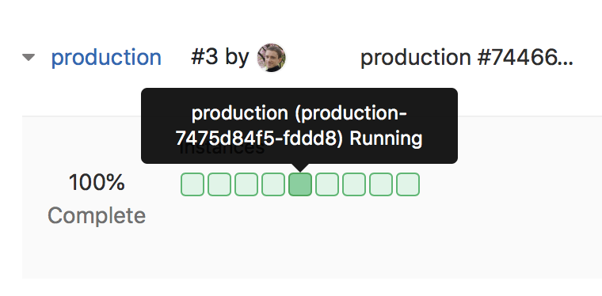

# Kubernetes Logs **(FREE)**

> - [Introduced](https://gitlab.com/gitlab-org/gitlab/-/issues/4752) in [GitLab Ultimate](https://about.gitlab.com/pricing/) 11.0.
> - [Moved](https://gitlab.com/gitlab-org/gitlab/-/merge_requests/26383) to [GitLab Free](https://about.gitlab.com/pricing/) 12.9.

GitLab makes it easy to view the logs of running pods in
[connected Kubernetes clusters](index.md). By displaying the logs directly in GitLab
in the **Log Explorer**, developers can avoid managing console tools or jumping
to a different interface. The **Log Explorer** interface provides a set of filters
above the log file data, depending on your configuration:

- **Namespace** - Select the environment to display. Users with Maintainer or
  greater [permissions](../../permissions.md) can also see pods in the
  `gitlab-managed-apps` namespace.
- **Search** - Only available if the [Elastic Stack integration](../../clusters/integrations.md#elastic-stack-cluster-integration) is enabled.
- **Select time range** - Select the range of time to display.
  Only available if the [Elastic Stack integration](../../clusters/integrations.md#elastic-stack-cluster-integration) is enabled.
- **Scroll to bottom** **{scroll_down}** - Scroll to the end of the displayed logs.
- **Refresh** **{retry}** - Reload the displayed logs.

<i class="fa fa-youtube-play youtube" aria-hidden="true"></i>
To learn more about the Log Explorer, see [APM - Log Explorer](https://www.youtube.com/watch?v=hWclZHA7Dgw).

[Learn more about Kubernetes + GitLab](https://about.gitlab.com/solutions/kubernetes/).
Everything you need to build, test, deploy, and run your application at scale.

## Requirements

[Deploying to a Kubernetes environment](../deploy_boards.md#enabling-deploy-boards)
is required to use Logs.

## Accessing the log explorer

To access the **Log explorer**, click the **More actions** **{ellipsis_v}** menu on
a [metrics dashboard](../../../operations/metrics/index.md) and select **View logs**, or:

1. Sign in as a user with the _View pod logs_
   [permissions](../../permissions.md#project-members-permissions) in the project.
1. To navigate to the **Log Explorer** from the sidebar menu, go to **Monitor > Logs**
   ([Introduced](https://gitlab.com/gitlab-org/gitlab-foss/-/merge_requests/22011) in GitLab 12.5.).
1. To navigate to the **Log Explorer** from a specific pod on a [Deploy Board](../deploy_boards.md):

   1. Go to **Deployments > Environments** and find the environment
      which contains the desired pod, like `production`.
   1. On the **Environments** page, you should see the status of the environment's
      pods with [Deploy Boards](../deploy_boards.md).
   1. When mousing over the list of pods, GitLab displays a tooltip with the exact pod name
      and status.
      
   1. Click on the desired pod to display the **Log Explorer**.

### Logs view

The **Log Explorer** lets you filter the logs by:

- Pods.
- [From GitLab 12.4](https://gitlab.com/gitlab-org/gitlab/-/issues/5769), environments.
- [From GitLab 12.7](https://gitlab.com/gitlab-org/gitlab/-/merge_requests/21656),
  [full text search](#full-text-search).
- [From GitLab 12.8](https://gitlab.com/gitlab-org/gitlab/-/issues/197879), dates.
- [From GitLab 13.2](https://gitlab.com/gitlab-org/gitlab/-/issues/208790), managed apps.

Loading more than 500 log lines is possible from
[GitLab 12.9](https://gitlab.com/gitlab-org/gitlab/-/issues/198050) onward.

Support for pods with multiple containers is coming
[in a future release](https://gitlab.com/gitlab-org/gitlab/-/issues/13404).

Support for historical data is coming
[in a future release](https://gitlab.com/gitlab-org/gitlab/-/issues/196191).

### Filter by date

> [Introduced](https://gitlab.com/gitlab-org/gitlab/-/issues/197879) in GitLab 12.8.

When you enable [Elastic Stack](../../clusters/integrations.md#elastic-stack-cluster-integration)
on your cluster, you can filter logs displayed in the **Log Explorer** by date.

Click **Show last** in the **Log Explorer** to see the available options.

### Full text search

> [Introduced](https://gitlab.com/gitlab-org/gitlab/-/merge_requests/21656) in GitLab 12.7.

When you enable [Elastic Stack](../../clusters/integrations.md#elastic-stack-cluster-integration) on your cluster,
you can search the content of your logs through a search bar. The search is passed
to Elasticsearch using the
[simple_query_string](https://www.elastic.co/guide/en/elasticsearch/reference/current/query-dsl-simple-query-string-query.html)
Elasticsearch function, which supports the following operators:

| Operator                   | Description                                                 |
|----------------------------|-------------------------------------------------------------|
|  `\|`                      | An `OR` operation.                                          |
| `-`                        | Negates a single token.                                     |
| `+`                        | An `AND` operation.                                         |
| `"`                        | Wraps a number of tokens to signify a phrase for searching. |
| `*` (at the end of a term) | A prefix query.                                             |
| `(` and `)`                | Precedence.                                                 |
| `~N` (after a word)        | Edit distance (fuzziness).                                  |
| `~N` (after a phrase)      | Slop amount.                                                |
