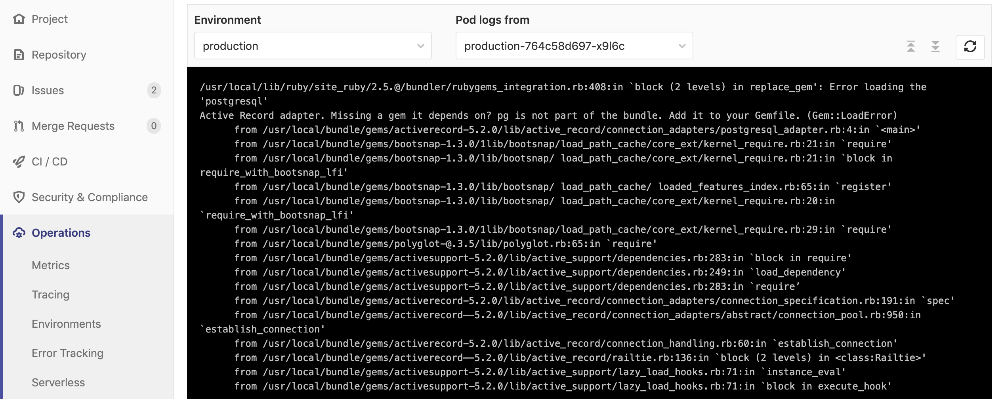

# Kubernetes Pod Logs **[ULTIMATE]**

> [Introduced](https://gitlab.com/gitlab-org/gitlab-ee/issues/4752) in [GitLab Ultimate](https://about.gitlab.com/pricing/) 11.0.

GitLab makes it easy to view the logs of running pods in [connected Kubernetes clusters](index.md).
By displaying the logs directly in GitLab, developers can avoid having to manage console tools or jump to a different interface.

## Overview

[Kubernetes](https://kubernetes.io) pod logs can be viewed directly within GitLab. Logs can be displayed by clicking on a specific pod from [Deploy Boards](../deploy_boards.md):

1. Go to **Operations > Environments** and find the environment which contains the desired pod, like `production`.
1. On the **Environments** page, you should see the status of the environment's pods with [Deploy Boards](../deploy_boards.md).
1. When mousing over the list of pods, a tooltip will appear with the exact pod name and status.
   
1. Click on the desired pod to bring up the logs view, which will contain the last 500 lines for that pod. Support for pods with multiple containers is coming [in a future release](https://gitlab.com/gitlab-org/gitlab-ee/issues/6502).
   

## Requirements

[Enabling Deploy Boards](../deploy_boards.md#enabling-deploy-boards) is required in order to be able to use Pod Logs.
