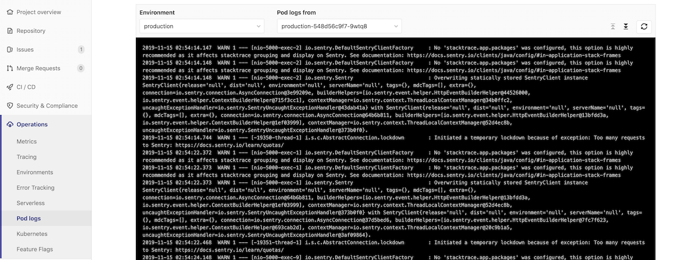
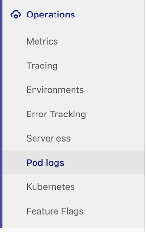

# Kubernetes Pod Logs **(ULTIMATE)**

> [Introduced](https://gitlab.com/gitlab-org/gitlab/issues/4752) in [GitLab Ultimate](https://about.gitlab.com/pricing/) 11.0.

GitLab makes it easy to view the logs of running pods in [connected Kubernetes clusters](index.md).
By displaying the logs directly in GitLab, developers can avoid having to manage console tools or jump to a different interface.

NOTE: **Kubernetes + GitLab**
Everything you need to build, test, deploy, and run your app at scale.
[Learn more](https://about.gitlab.com/solutions/kubernetes/).

## Overview

[Kubernetes](https://kubernetes.io) pod logs can be viewed directly within GitLab.



## Requirements

[Deploying to a Kubernetes environment](../deploy_boards.md#enabling-deploy-boards) is required in order to be able to use Pod Logs.

## Usage

To access pod logs, you must have the right [permissions](../../permissions.md#project-members-permissions).

You can access them in two ways.

### From the project sidebar

> [Introduced](https://gitlab.com/gitlab-org/gitlab-foss/merge_requests/22011) in GitLab 12.5.

Go to **Operations > Pod logs** on the sidebar menu.



### From Deploy Boards

Logs can be displayed by clicking on a specific pod from [Deploy Boards](../deploy_boards.md):

1. Go to **Operations > Environments** and find the environment which contains the desired pod, like `production`.
1. On the **Environments** page, you should see the status of the environment's pods with [Deploy Boards](../deploy_boards.md).
1. When mousing over the list of pods, a tooltip will appear with the exact pod name and status.
   
1. Click on the desired pod to bring up the logs view.

### Logs view

The logs view will contain the last 500 lines for a pod, and has control to filter via:

- Pods.
- [From GitLab 12.4](https://gitlab.com/gitlab-org/gitlab/issues/5769), environments.
- [From GitLab 12.7](https://gitlab.com/gitlab-org/gitlab/merge_requests/21656), [full text search](#full-text-search).

Support for pods with multiple containers is coming [in a future release](https://gitlab.com/gitlab-org/gitlab/issues/13404).

Support for historical data is coming [in a future release](https://gitlab.com/gitlab-org/gitlab/issues/196191).

### Full text search

> [Introduced](https://gitlab.com/gitlab-org/gitlab/merge_requests/21656) in GitLab 12.7.

When you enable [Elastic Stack](../../clusters/applications.md#elastic-stack) on your cluster,
you can search the content of your logs via a search bar.

The search is passed on to Elasticsearch using the [simple_query_string](https://www.elastic.co/guide/en/elasticsearch/reference/current/query-dsl-simple-query-string-query.html)
Elasticsearch function, which supports the following operators:

```
+ signifies AND operation
| signifies OR operation
- negates a single token
" wraps a number of tokens to signify a phrase for searching
* at the end of a term signifies a prefix query
( and ) signify precedence
~N after a word signifies edit distance (fuzziness)
~N after a phrase signifies slop amount
```
