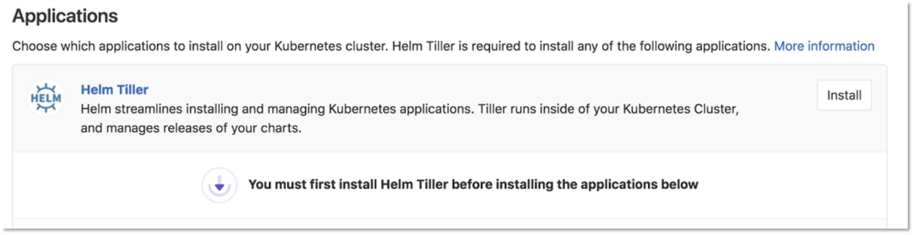
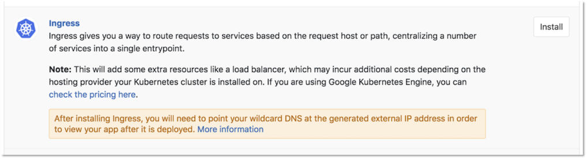
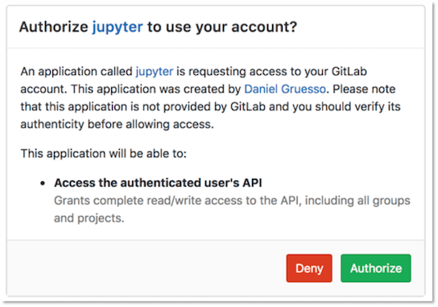
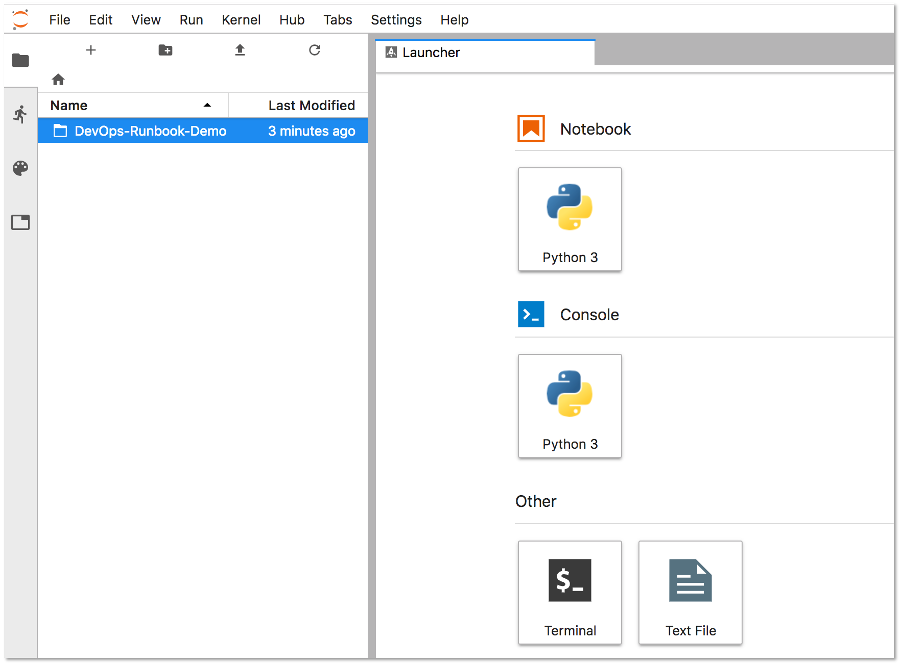
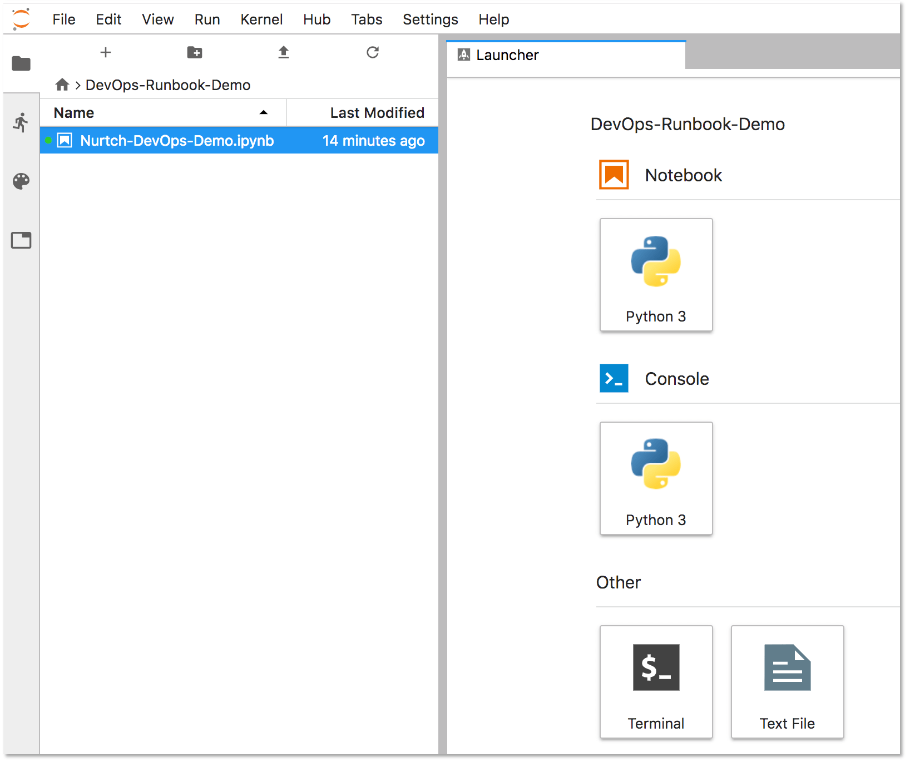
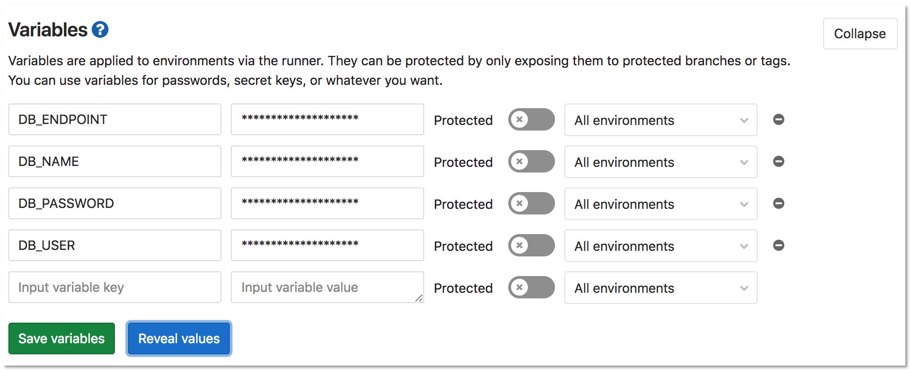
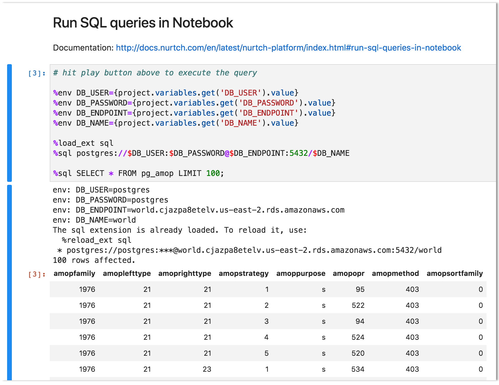

# Runbooks

Runbooks are a collection of documented procedures that explain how to
carry out a particular process, be it starting, stopping, debugging,
or troubleshooting a particular system.

Using [Jupyter Notebooks](https://jupyter.org/) and the [Rubix library](https://github.com/Nurtch/rubix),
users can get started writing their own executable runbooks.

## Overview

Historically, runbooks took the form of a decision tree or a detailed
step-by-step guide depending on the condition or system.

Modern implementations have introduced the concept of an "executable
runbooks", where, along with a well-defined process, operators can execute
pre-written code blocks or database queries against a given environment.

## Executable Runbooks

> [Introduced](https://gitlab.com/gitlab-org/gitlab-foss/issues/45912) in GitLab 11.4.

The JupyterHub app offered via GitLab’s Kubernetes integration now ships
with Nurtch’s Rubix library, providing a simple way to create DevOps
runbooks. A sample runbook is provided, showcasing common operations. While Rubix makes it
simple to create common Kubernetes and AWS workflows, you can also create them manually without
Rubix.

**<i class="fa fa-youtube-play youtube" aria-hidden="true"></i>
Watch this [video](https://www.youtube.com/watch?v=Q_OqHIIUPjE)
for an overview of how this is accomplished in GitLab!**

## Requirements

To create an executable runbook, you will need:

1. **Kubernetes** - A Kubernetes cluster is required to deploy the rest of the applications.
    The simplest way to get started is to add a cluster using one of [GitLab's integrations](../add_remove_clusters.md#add-new-cluster).
1. **Helm Tiller** - Helm is a package manager for Kubernetes and is required to install
    all the other applications. It is installed in its own pod inside the cluster which
    can run the Helm CLI in a safe environment.
1. **Ingress** - Ingress can provide load balancing, SSL termination, and name-based
    virtual hosting. It acts as a web proxy for your applications.
1. **JupyterHub** - [JupyterHub](https://jupyterhub.readthedocs.io/) is a multi-user service for managing notebooks across
    a team. Jupyter Notebooks provide a web-based interactive programming environment
    used for data analysis, visualization, and machine learning.

## Nurtch

Nurtch is the company behind the [Rubix library](https://github.com/Nurtch/rubix). Rubix is
an open-source Python library that makes it easy to perform common DevOps tasks inside Jupyter Notebooks.
Tasks such as plotting Cloudwatch metrics and rolling your ECS/Kubernetes app are simplified
down to a couple of lines of code. See the [Nurtch Documentation](http://docs.nurtch.com/en/latest/)
for more information.

## Configure an executable runbook with GitLab

Follow this step-by-step guide to configure an executable runbook in GitLab using
the components outlined above and the preloaded demo runbook.

### 1. Add a Kubernetes cluster

Follow the steps outlined in [Add new cluster](../add_remove_clusters.md#add-new-cluster)
to add a Kubernetes cluster to your project.

### 2. Install Helm Tiller, Ingress, and JupyterHub

Once the cluster has been provisioned in GKE, click the **Install** button next to the **Helm Tiller** app.



Once Tiller has been installed successfully, click the **Install** button next to the **Ingress** app.



Once Ingress has been installed successfully, click the **Install** button next to the **JupyterHub** app.


### 3. Login to JupyterHub and start the server

Once JupyterHub has been installed successfully, navigate to the displayed **Jupyter Hostname** URL and click
**Sign in with GitLab**. Authentication is automatically enabled for any user of the GitLab instance via OAuth2. This
will redirect to GitLab in order to authorize JupyterHub to use your GitLab account. Click **Authorize**.



Once the application has been authorized you will taken back to the JupyterHub application. Click **Start My Server**.
The server will take a couple of seconds to start.

### 4. Configure access

In order for the runbook to access your GitLab project, you will need to enter a
[GitLab Access Token](../../../profile/personal_access_tokens.md)
as well as your Project ID in the **Setup** section of the demo runbook.

Double-click the **DevOps-Runbook-Demo** folder located on the left panel.



Double-click the "Nurtch-DevOps-Demo.ipynb" runbook.



The contents on the runbook will be displayed on the right side of the screen. Under the "Setup" section, you will find
entries for both your `PRIVATE_TOKEN` and your `PROJECT_ID`. Enter both these values, conserving the single quotes as follows:

```sql
PRIVATE_TOKEN = 'n671WNGecHugsdEDPsyo'
PROJECT_ID = '1234567'
```

Update the `VARIABLE_NAME` on the last line of this section to match the name of the variable you are using for your
access token. In this example our variable name is `PRIVATE_TOKEN`.

```sql
VARIABLE_VALUE = project.variables.get('PRIVATE_TOKEN').value
```

### 5. Configure an operation

For this example we'll use the "**Run SQL queries in Notebook**" section in the sample runbook to query
a postgres database. The first 4 lines of the section define the variables that are required for this query to function.

```sql
%env DB_USER={project.variables.get('DB_USER').value}
%env DB_PASSWORD={project.variables.get('DB_PASSWORD').value}
%env DB_ENDPOINT={project.variables.get('DB_ENDPOINT').value}
%env DB_NAME={project.variables.get('DB_NAME').value}
```

Create the matching variables in your project's **Settings >> CI/CD >> Variables**



Back in Jupyter, click the "Run SQL queries in Notebook" heading and the click *Run*. The results will be
displayed in-line as follows:



You can try other operations such as running shell scripts or interacting with a Kubernetes cluster. Visit the
[Nurtch Documentation](http://docs.nurtch.com/) for more information.
