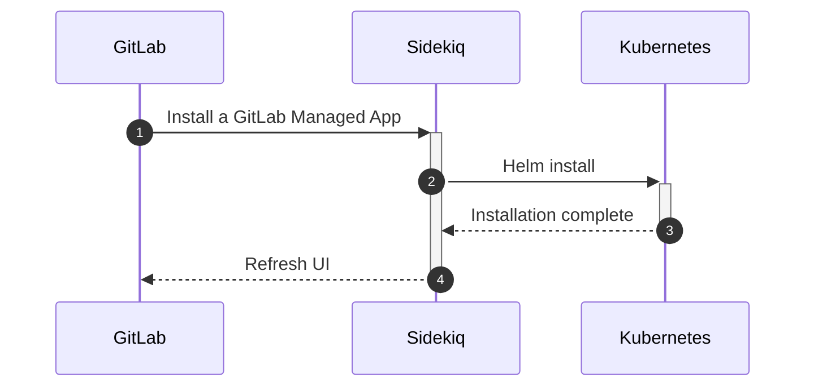
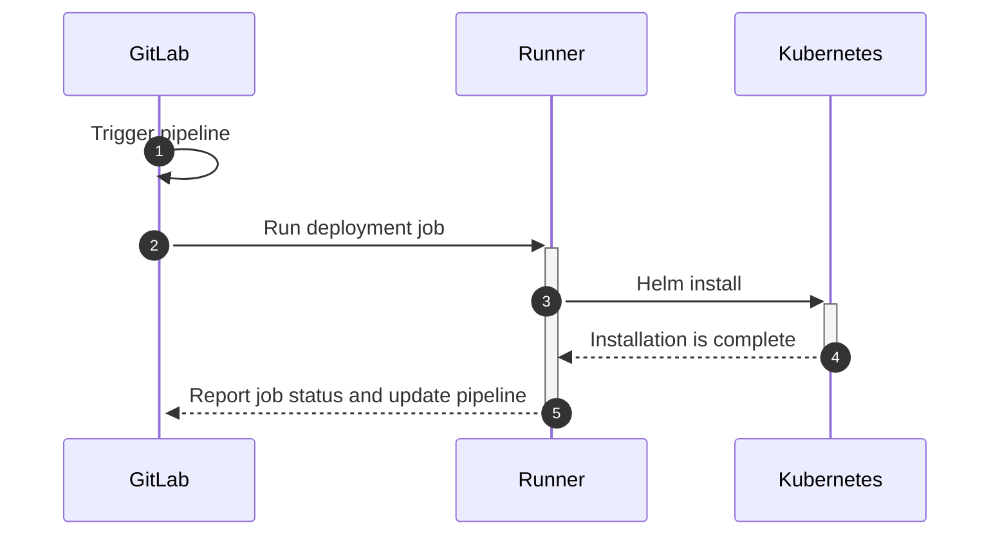

# Securing your deployed applications

GitLab makes it easy to secure applications deployed in [connected Kubernetes clusters](index.md).
You can benefit from the protection of a [Web Application Firewall](../../../topics/web_application_firewall/quick_start_guide.md),
[Network Policies](../../../topics/autodevops/stages.md#network-policy),
and [Container Host Security](../../clusters/applications.md#install-falco-using-gitlab-cicd).

This page contains full end-to-end steps and instructions to connect your cluster to GitLab and
install these features, whether or not your applications are deployed through GitLab CI/CD. If you
use [Auto DevOps](../../../topics/autodevops/index.md)
to build and deploy your application with GitLab, see the documentation for the respective
[GitLab Managed Applications](../../clusters/applications.md)
above.

## Overview

At a high level, the required steps include the following:

- Connect the cluster to GitLab.
- Set up one or more runners.
- Set up a cluster management project.
- Install a Web Application Firewall, and/or Network Policies, and/or Container Host
  Security.
- Install Prometheus to get statistics and metrics in the
  [threat monitoring](../../application_security/threat_monitoring/)
  dashboard.

### Requirements

Minimum requirements (depending on the GitLab Manage Application you want to install):

- Your cluster is connected to GitLab (ModSecurity, Cilium, and Falco).
- At least one runner is installed (Cilium and Falco only).

### Understanding how GitLab Managed Apps are installed

NOTE: **Note:**
These diagrams use the term _Kubernetes_ for simplicity. In practice, Sidekiq connects to a Helm
command runner pod in the cluster.

You install GitLab Managed Apps from the GitLab web interface with a one-click setup process. GitLab
uses Sidekiq (a background processing service) to facilitate this.



Although this installation method is easier because it's a point-and-click action in the user
interface, it's inflexible and harder to debug. If something goes wrong, you can't see the
deployment logs. The Web Application Firewall feature uses this installation method.

However, the next generation of GitLab Managed Apps V2 ([CI/CD-based GitLab Managed Apps](https://gitlab.com/groups/gitlab-org/-/epics/2103))
don't use Sidekiq to deploy. All the applications are deployed using a GitLab CI/CD pipeline and
therefore, by runners.



Debugging is easier because you have access to the raw logs of these jobs (the Helm Tiller output is
available as an artifact in case of failure), and the flexibility is much better. Since these
deployments are only triggered when a pipeline is running (most likely when there's a new commit in
the cluster management repository), every action has a paper trail and follows the classic merge
request workflow (approvals, merge, deploy). The Network Policy (Cilium) Managed App, and Container
Host Security (Falco) are deployed with this model.

## Connect the cluster to GitLab

To deploy GitLab Managed Apps to your cluster, you must first
[add your cluster](add_remove_clusters.md)
to GitLab. Then [install](../../clusters/applications.md#install-with-one-click)
the Web Application Firewall from the project or group Kubernetes page.

Note that your project doesn't have to be hosted or deployed through GitLab. You can manage a
cluster independent of the applications that use the cluster.

## Set up a runner

To install CI/CD-based GitLab Managed Apps, a pipeline using a runner must be running in
GitLab. You can [install a runner](../../clusters/applications.md#gitlab-runner)
in the Kubernetes cluster added in the previous step, or use one of the shared runners provided by
GitLab if you're using GitLab.com.

With your cluster connected to GitLab and a runner in place, you can proceed to the next
steps and start installing the Cilium and Falco GitLab Managed Apps to secure your applications
hosted on this cluster.

## Create a Cluster Management Project

A [Cluster Management Project](../../clusters/management_project.md)
is a GitLab project that contains a `.gitlab-ci.yml` file to deploy GitLab Managed Apps to your
cluster. This project runs the required charts with the Kubernetes
[`cluster-admin`](https://kubernetes.io/docs/reference/access-authn-authz/rbac/#user-facing-roles)
privileges.

The creation of this project starts like any other GitLab project. Use an empty
project and add a `gitlab-ci.yml` file at the root, containing this template:

```yaml
include:
  - template: Managed-Cluster-Applications.gitlab-ci.yml
```

To make this project a Cluster Management Project, follow these
[instructions](../../clusters/management_project.md#selecting-a-cluster-management-project).
This project can be designated as such even if your application isn't hosted on GitLab. In this
case, create a new empty project where you can select your newly created Cluster Management Project.

## Install GitLab Container Network Policy

GitLab Container Network Policy is based on [Cilium](https://cilium.io/). To
install the Cilium GitLab Managed App, add a
`.gitlab/managed-apps/config.yaml` file to your Cluster Management project:

```yaml
# possible values are gke, eks or you can leave it blank
clusterType: gke

cilium:
  installed: true
```

Your application doesn't have to be managed or deployed by GitLab to leverage this feature.
[Read more](../../clusters/applications.md#install-cilium-using-gitlab-cicd)
about configuring Container Network Policy.

## Install GitLab Container Host Security

Similarly, you can install Container Host Security, based on
[Falco](https://falco.org/), in your `.gitlab/managed-apps/config.yaml`:

```yaml
falco:
  installed: true
```

[Read more](../../clusters/applications.md#install-falco-using-gitlab-cicd)
about configuring Container Host Security.
