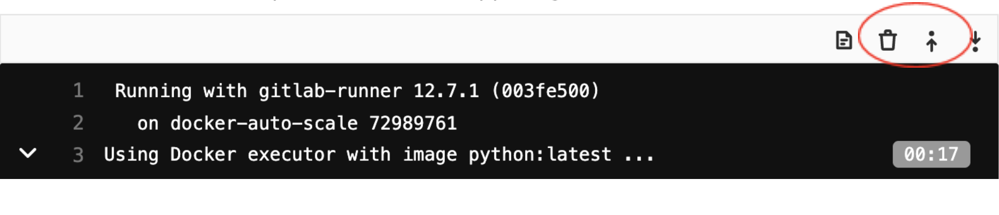
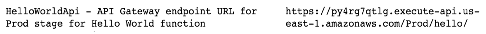

# Deploying AWS Lambda function using GitLab CI/CD **(FREE)**

GitLab allows users to easily deploy AWS Lambda functions and create rich serverless applications.

GitLab supports deployment of AWS Lambda functions through GitLab CI/CD using the following Serverless frameworks:

- [Serverless Framework with AWS](#serverless-framework)
- [AWS' Serverless Application Model (SAM)](#aws-serverless-application-model)

## Serverless Framework

The [Serverless Framework can deploy to AWS](https://www.serverless.com/framework/docs/providers/aws/).

We have prepared an example with a step-by-step guide to create a simple function and deploy it on AWS.

Additionally, in the [How To section](#how-to), you can read about different use cases like:

- Running a function locally.
- Working with secrets.
- Setting up CORS.

Alternatively, you can quickly [create a new project with a template](../../working_with_projects.md#create-a-project). The [`Serverless Framework/JS` template](https://gitlab.com/gitlab-org/project-templates/serverless-framework/) already includes all parts described below.

### Example

This example shows you how to:

1. Create a basic AWS Lambda Node.js function.
1. Link the function to an API Gateway `GET` endpoint.

#### Steps

The example consists of the following steps:

1. Creating a Lambda handler function.
1. Creating a `serverless.yml` file.
1. Crafting the `.gitlab-ci.yml` file.
1. Setting up your AWS credentials with your GitLab account.
1. Deploying your function.
1. Testing the deployed function.

Lets take it step by step.

#### Creating a Lambda handler function

Your Lambda function is the primary handler of requests. In this case, create a very simple Node.js `hello` function:

```javascript
'use strict';

module.exports.hello = async event => {
  return {
    statusCode: 200,
    body: JSON.stringify(
      {
        message: 'Your function executed successfully!'
      },
      null,
      2
    ),
  };
};
```

Place this code in the file `src/handler.js`.

`src` is the standard location for serverless functions, but is customizable should you desire that.

In our case, `module.exports.hello` defines the `hello` handler to reference later in the `serverless.yml`.

You can learn more about the [AWS Lambda Node.js function handler](https://docs.aws.amazon.com/lambda/latest/dg/nodejs-prog-model-handler.html) and all its various options in its documentation.

#### Creating a `serverless.yml` file

In the root of your project, create a `serverless.yml` file containing configuration specifics for the Serverless Framework.

Put the following code in the file:

```yaml
service: gitlab-example
provider:
  name: aws
  runtime: nodejs14.x

functions:
  hello:
    handler: src/handler.hello
    events:
      - http: GET hello
```

Our function contains a handler and a event.

The handler definition provisions the Lambda function using the source code located `src/handler.hello`.

The `events` declaration creates an AWS API Gateway `GET` endpoint to receive external requests and hand them over to the Lambda function via a service integration.

You can read more about the [available properties and additional configuration possibilities](https://www.serverless.com/framework/docs/providers/aws/guide/serverless.yml/) of the Serverless Framework.

#### Crafting the `.gitlab-ci.yml` file

In a `.gitlab-ci.yml` file in the root of your project, place the following code:

```yaml
image: node:latest

stages:
  - deploy

production:
  stage: deploy
  before_script:
    - npm config set prefix /usr/local
    - npm install -g serverless
  script:
    - serverless deploy --stage production --verbose
  environment: production
```

This example code does the following:

1. Uses the `node:latest` image for all GitLab CI/CD builds
1. The `deploy` stage:
   - Installs the Serverless Framework.
   - Deploys the serverless function to your AWS account using the AWS credentials
     defined above.

#### Setting up your AWS credentials with your GitLab account

In order to interact with your AWS account, the GitLab CI/CD pipelines require both `AWS_ACCESS_KEY_ID` and `AWS_SECRET_ACCESS_KEY` to be defined in your GitLab settings under **Settings > CI/CD > Variables**.
For more information please see [Create a custom variable in the UI](../../../../ci/variables/index.md#custom-variables-validated-by-gitlab).

 The AWS credentials you provide must include IAM policies that provision correct
 access control to AWS Lambda, API Gateway, CloudFormation, and IAM resources.

#### Deploying your function

`git push` the changes to your GitLab repository and the GitLab build pipeline deploys your function.

Your GitLab deploy stage log contains output containing your AWS Lambda endpoint URL,
with log lines similar to this:

```plaintext
endpoints:
  GET - https://u768nzby1j.execute-api.us-east-1.amazonaws.com/production/hello
```

#### Manually testing your function

Running the following `curl` command should trigger your function.
Your URL should be the one retrieved from the GitLab deploy stage log:

```shell
curl "https://u768nzby1j.execute-api.us-east-1.amazonaws.com/production/hello"
```

That should output:

```json
{
  "message": "Your function executed successfully!"
}
```

Hooray! You now have a AWS Lambda function deployed via GitLab CI/CD.

Nice work!

### How To

In this section, we show you how to build on the basic example to:

- Run the function locally.
- Set up secret variables.
- Set up CORS.

#### Running function locally

The `serverless-offline` plugin allows to run your code locally. To run your code locally:

1. Add the following to your `serverless.yml`:

   ```yaml
   plugins:
     - serverless-offline
   ```

1. Start the service by running the following command:

   ```shell
   serverless offline
   ```

Running the following `curl` command should trigger your function.

```shell
curl "http://localhost:3000/hello"
```

It should output:

```json
{
  "message": "Your function executed successfully!"
}
```

#### Secret variables

Secrets are injected into your functions using environment variables.

By defining variables in the provider section of the `serverless.yml`, you add them to
the environment of the deployed function:

```yaml
provider:
  # Other configuration omitted
  # ...
  environment:
    A_VARIABLE: ${env:A_VARIABLE}
```

From there, you can reference them in your functions as well.
Remember to add `A_VARIABLE` to your GitLab CI/CD variables under **Settings > CI/CD > Variables** to be picked up and deployed with your function.

NOTE:
Anyone with access to the AWS environment may be able to see the values of those
variables persisted in the lambda definition.

#### Setting up CORS

If you want to set up a web page that makes calls to your function, like we have done in the [template](https://gitlab.com/gitlab-org/project-templates/serverless-framework/), you need to deal with the Cross-Origin Resource Sharing (CORS).

The quick way to do that is to add the `cors: true` flag to the HTTP endpoint in your `serverless.yml`:

```yaml
functions:
  hello:
    handler: src/handler.hello
    events:
      - http:  # Rewrite this part to enable CORS
          path: hello
          method: get
          cors: true  # <-- CORS here
```

You also need to return CORS specific headers in your function response:

```javascript
'use strict';

module.exports.hello = async event => {
  return {
    statusCode: 200,
    headers: {
      // Uncomment the line below if you need access to cookies or authentication
      // 'Access-Control-Allow-Credentials': true,
      'Access-Control-Allow-Origin': '*'
    },
    body: JSON.stringify(
      {
        message: 'Your function executed successfully!'
      },
      null,
      2
    ),
  };
};
```

For more information, see the [Your CORS and API Gateway survival guide](https://www.serverless.com/blog/cors-api-gateway-survival-guide/)
blog post written by the Serverless Framework team.

#### Writing automated tests

The [Serverless Framework](https://gitlab.com/gitlab-org/project-templates/serverless-framework/)
example project shows how to use Jest, Axios, and `serverless-offline` plugin to do
automated testing of both local and deployed serverless function.

### Examples and template

The example code is available:

- As a [clonable repository](https://gitlab.com/gitlab-org/serverless/examples/serverless-framework-js).
- In a version with [tests and secret variables](https://gitlab.com/gitlab-org/project-templates/serverless-framework/).

You can also use a [template](../../working_with_projects.md#project-templates)
(based on the version with tests and secret variables) from within the GitLab UI (see
the `Serverless Framework/JS` template).

## AWS Serverless Application Model

AWS Serverless Application Model is an open source framework for building serverless
applications. It makes it easier to build and deploy serverless applications. For more
details, please take a look at AWS documentation on [AWS Serverless Application Model](https://docs.aws.amazon.com/serverless-application-model/).

### Deploying AWS Lambda function using AWS SAM and GitLab CI/CD

GitLab allows developers to build and deploy serverless applications using the combination of:

- [AWS Serverless Application Model (AWS SAM)](https://aws.amazon.com/serverless/sam/).
- GitLab CI/CD.

### Example

This example shows you how to:

- Install SAM CLI.
- Create a sample SAM application including a Lambda function and API Gateway.
- Build and deploy the application to your AWS account using GitLab CI/CD.

### Steps

The example consists of the following steps:

1. Installing SAM CLI.
1. Creating an AWS SAM application using SAM CLI.
1. Crafting the `.gitlab-ci.yml` file.
1. Setting up your AWS credentials with your GitLab account.
1. Deploying your application.
1. Testing the deployed function.

### Installing SAM CLI

AWS SAM provides a CLI called AWS SAM CLI to make it easier to create and manage
applications.

Some steps in this documentation use SAM CLI. Follow the instructions for
[installing SAM CLI](https://docs.aws.amazon.com/serverless-application-model/latest/developerguide/serverless-sam-cli-install.html)
to install and configure SAM CLI.

If you use [AWS Cloud9](https://aws.amazon.com/cloud9/) as your integrated development
environment (IDE), the following are installed for you:

- [AWS Command Line Interface](https://docs.aws.amazon.com/en_pv/cli/latest/userguide/cli-chap-install.html)
- [SAM CLI](https://docs.aws.amazon.com/en_pv/serverless-application-model/latest/developerguide/serverless-sam-cli-install.html)
- [Docker](https://docs.docker.com/install/) and necessary Docker images.

### Creating an AWS SAM application using SAM CLI

To create a new AWS SAM application:

1. Create a new GitLab project.
1. `git clone` the project into your local environment.
1. Change to the newly cloned project and create a new SAM app using the following command:

   ```shell
   sam init -r python3.8 -n gitlabpoc --app-template "hello-world"
   ```

1. `git push` the application back to the GitLab project.

This creates a SAM app named `gitlabpoc` using the default configuration, a single
Python 3.8 function invoked by an [Amazon API Gateway](https://aws.amazon.com/api-gateway/)
endpoint. To see additional runtimes supported by SAM and options for `sam init`, run:

```shell
sam init -h
```

### Setting up your AWS credentials with your GitLab account

In order to interact with your AWS account, the GitLab CI/CD pipelines require both
`AWS_ACCESS_KEY_ID` and `AWS_SECRET_ACCESS_KEY` to be set in the project's CI/CD variables.

To set these:

1. Navigate to the project's **Settings > CI/CD**.
1. Expand the **Variables** section and create entries for `AWS_ACCESS_KEY_ID` and
   `AWS_SECRET_ACCESS_KEY`.
1. Mask the credentials so they do not show in logs using the **Masked** toggle.

The AWS credentials you provide must include IAM policies that provision correct access
control to AWS Lambda, API Gateway, CloudFormation, and IAM resources.

### Crafting the `.gitlab-ci.yml` file

In a [`.gitlab-ci.yml`](../../../../ci/yaml/index.md) file in the root of your project,
add the following and replace `<S3_bucket_name>` with the name of the S3 bucket where you
want to store your package:

```yaml
image: python:latest

stages:
  - deploy

production:
  stage: deploy
  before_script:
    - pip3 install awscli --upgrade
    - pip3 install aws-sam-cli --upgrade
  script:
    - sam build
    - sam package --output-template-file packaged.yaml --s3-bucket <S3_bucket_name>
    - sam deploy --template-file packaged.yaml --stack-name gitlabpoc  --s3-bucket <S3_bucket_name> --capabilities CAPABILITY_IAM --region us-east-1
  environment: production
```

Let's examine the configuration file more closely:

- `image` specifies the Docker image to use for this build. This is the latest Python
  image since the sample application is written in Python.
- AWS CLI and AWS SAM CLI are installed in the `before_script` section.
- SAM build, package, and deploy commands are used to build, package, and deploy the
  application.

### Deploying your application

Push changes to your GitLab repository and the GitLab build pipeline
deploys your application. If your:

- Build and deploy are successful, [test your deployed application](#testing-the-deployed-application).
- Build fails, look at the build log to see why the build failed. Some common reasons
  the build might fail are:

  - Incompatible versions of software. For example, Python runtime version might be
    different from the Python on the build machine. Address this by installing the
    required versions of the software.
  - You may not be able to access your AWS account from GitLab. Check the CI/CD variables
    you set up with AWS credentials.
  - You may not have permission to deploy a serverless application. Make sure you
    provide all required permissions to deploy a serverless application.

### Testing the deployed application

To test the application you deployed, please go to the build log and follow the following steps:

1. Click on "Show complete raw" on the upper right-hand corner:

   

1. Look for HelloWorldApi – API Gateway endpoint similar to shown below:

   

1. Use curl to test the API. For example:

   ```shell
   curl "https://py4rg7qtlg.execute-api.us-east-1.amazonaws.com/Prod/hello/"
   ```

Output should be:

```json
{"message": "hello world"}
```

### Testing Locally

AWS SAM provides functionality to test your applications locally. You must have AWS SAM
CLI installed locally for you to test locally.

First, test the function.

SAM provides a default event in `events/event.json` that includes a message body of:

```plaintext
{\"message\": \"hello world\"}
```

If you pass that event into the `HelloWorldFunction`, it should respond with the same
body.

Invoke the function by running:

```shell
sam local invoke HelloWorldFunction -e events/event.json
```

Output should be:

```json
{"message": "hello world"}
```

After you confirm that Lambda function is working as expected, test the API Gateway
using following steps.

Start the API locally by running:

```shell
sam local start-api
```

SAM again launches a Docker container, this time with a mocked Amazon API Gateway
listening on `localhost:3000`.

Call the `hello` API by running:

```shell
curl "http://127.0.0.1:3000/hello"
```

Output again should be:

```json
{"message": "hello world"}
```
