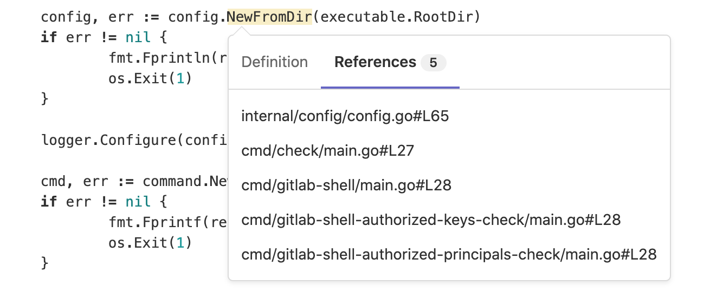

# Code Intelligence **(FREE)**

> [Introduced](https://gitlab.com/groups/gitlab-org/-/epics/1576) in GitLab 13.1.

Code Intelligence adds code navigation features common to interactive
development environments (IDE), including:

- Type signatures and symbol documentation.
- Go-to definition.

Code Intelligence is built into GitLab and powered by [LSIF](https://lsif.dev/)
(Language Server Index Format), a file format for precomputed code
intelligence data.

NOTE:
You can automate this feature in your applications by using [Auto DevOps](../../topics/autodevops/index.md).

## Configuration

Enable code intelligence for a project by adding a GitLab CI/CD job to the project's
`.gitlab-ci.yml` which generates the LSIF artifact:

```yaml
code_navigation:
  image: sourcegraph/lsif-go:v1
  allow_failure: true # recommended
  script:
    - lsif-go
  artifacts:
    reports:
      lsif: dump.lsif
```

The generated LSIF file size may be limited by
the [artifact application limits (`ci_max_artifact_size_lsif`)](../../administration/instance_limits.md#maximum-file-size-per-type-of-artifact),
default to 100MB (configurable by an instance administrator).

After the job succeeds, code intelligence data can be viewed while browsing the code:


## Find references

> - [Introduced](https://gitlab.com/gitlab-org/gitlab/-/issues/217392) in GitLab 13.2.
> - [Feature flag removed](https://gitlab.com/gitlab-org/gitlab/-/issues/235735) in GitLab 13.4.

To find where a particular object is being used, you can see links to specific lines of code
under the **References** tab:



## Language support

Generating an LSIF file requires a language server indexer implementation for the
relevant language.

| Language | Implementation |
|---|---|
| Go | [`sourcegraph/lsif-go`](https://github.com/sourcegraph/lsif-go) |
| JavaScript | [`sourcegraph/lsif-node`](https://github.com/sourcegraph/lsif-node) |
| TypeScript | [`sourcegraph/lsif-node`](https://github.com/sourcegraph/lsif-node) |

View a complete list of [available LSIF indexers](https://lsif.dev/#implementations-server) on their website and
refer to their documentation to see how to generate an LSIF file for your specific language.
