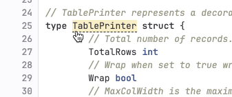
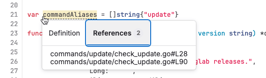

DETAILS:
**Tier:** Free, Premium, Ultimate
**Offering:** GitLab.com, GitLab Self-Managed, GitLab Dedicated

Code intelligence adds code navigation features common to interactive
development environments (IDE), including:

- Type signatures and symbol documentation.
- Go-to definition.

Code intelligence is built into GitLab and powered by [LSIF](https://lsif.dev/)
(Language Server Index Format), a file format for precomputed code
intelligence data. GitLab processes one LSIF file per project, and
Code intelligence does not support different LSIF files per branch.

[SCIP](https://github.com/sourcegraph/scip/) is the next evolution of tooling
for indexing source code. You can use it to power code navigation features,
such as:

- Go to definition
- Find references

GitLab does not natively support SCIP for code intelligence. However, you can use the
[SCIP CLI](https://github.com/sourcegraph/scip/blob/main/docs/CLI.md) to convert
indexes generated with SCIP tooling into a LSIF-compatible file. For discussions on native
SCIP support, see [issue 412981](https://gitlab.com/gitlab-org/gitlab/-/issues/412981).

For progress on upcoming code intelligence enhancements, see
[epic 4212](https://gitlab.com/groups/gitlab-org/-/epics/4212).

## Configure code intelligence

Prerequisites:

- You've checked to ensure there is a compatible indexer for your project's languages:
  - [LSIF indexers](https://lsif.dev/#implementations-server)
  - [SCIP indexers](https://github.com/sourcegraph/scip/#tools-using-scip)

To see how your language is best supported, review the
[indexers recommended by Sourcegraph](https://sourcegraph.com/docs/code-search/code-navigation/writing_an_indexer#sourcegraph-recommended-indexers).

### With the CI/CD component

> - Python support [introduced](https://gitlab.com/gitlab-org/gitlab/-/issues/301111) in GitLab 17.9.

GitLab provides a [CI/CD component](../../ci/components/_index.md) to configure code intelligence
in your `.gitlab-ci.yml` file. The component supports these languages:

- Go version 1.21 or later.
- TypeScript or JavaScript.
- Java 8, 11, 17, and 21.
- Python

To contribute more languages to the component, open a merge request in the
[Code intelligence component project](https://gitlab.com/components/code-intelligence).

1. Add a GitLab CI/CD component to your project's `.gitlab-ci.yml`. For example, this job generates
   the LSIF artifact for `golang`:

   ```yaml
   - component: ${CI_SERVER_FQDN}/components/code-intelligence/golang-code-intel@v0.0.3
    inputs:
      golang_version: ${GO_VERSION}
   ```

1. For configuration instructions for the [code intelligence component](https://gitlab.com/components/code-intelligence),
   check the `README` for each supported language.
1. For more configuration details, see [Use a component](../../ci/components/_index.md#use-a-component).

### Add CI/CD jobs for code intelligence

To enable code intelligence for a project, add GitLab CI/CD jobs to your project's `.gitlab-ci.yml`.

::Tabs

:::TabTitle With a SCIP indexer

1. Add a job to your `.gitlab-ci.yml` configuration. This job generates the
SCIP index and converts it to LSIF for use in GitLab:

   ```yaml
   "code_navigation":
      rules:
      - if: $CI_COMMIT_REF_NAME == $CI_DEFAULT_BRANCH # the job only needs to run against the default branch
      image: node:latest
      stage: test
      allow_failure: true # recommended
      script:
         - npm install -g @sourcegraph/scip-typescript
         - npm install
         - scip-typescript index
         - |
            env \
            TAG="v0.4.0" \
            OS="$(uname -s | tr '[:upper:]' '[:lower:]')" \
            ARCH="$(uname -m | sed -e 's/x86_64/amd64/')" \
            bash -c 'curl --location "https://github.com/sourcegraph/scip/releases/download/$TAG/scip-$OS-$ARCH.tar.gz"' \
            | tar xzf - scip
         - chmod +x scip
         - ./scip convert --from index.scip --to dump.lsif
      artifacts:
         reports:
            lsif: dump.lsif
   ```

1. Depending on your CI/CD configuration, you might need to run the job manually,
   or wait for it to run as part of an existing pipeline.

:::TabTitle With a LSIF indexer

1. Add a job (`code_navigation`) to your `.gitlab-ci.yml` configuration to generate the index:

   ```yaml
   code_navigation:
      rules:
      - if: $CI_COMMIT_REF_NAME == $CI_DEFAULT_BRANCH # the job only needs to run against the default branch
     image: sourcegraph/lsif-go:v1
     allow_failure: true # recommended
     script:
       - lsif-go
     artifacts:
       reports:
         lsif: dump.lsif
   ```

1. Depending on your CI/CD configuration, you might need to run the job manually,
   or wait for it to run as part of an existing pipeline.

::EndTabs

NOTE:
GitLab limits the artifact produced by the code generation jobs to 200 MB by the
[(`ci_max_artifact_size_lsif`)](../../administration/instance_limits.md#maximum-file-size-per-type-of-artifact)
artifact application limit. On GitLab Self-Managed instances, an instance administrator
can change this value.

## View code intelligence results

After the job succeeds, browse your repository to see code intelligence information:

1. On the left sidebar, select **Search or go to** and find your project.
1. Select **Code > Repository**.
1. Go to the file in your repository. If you know the filename, either:
   - Enter the `/~` keyboard shortcut to open the file finder, and enter the file's name.
   - In the upper right, select **Find file**.
1. Point to lines of code. Items on that line with information from code intelligence display a dotted line underneath them:

   

1. Select the item to learn more information about it.

## Find references

Use code intelligence to see all uses of an object:

1. On the left sidebar, select **Search or go to** and find your project.
1. Select **Code > Repository**.
1. Go to the file in your repository. If you know the filename, either:
   - Enter the `/~` keyboard shortcut to open the file finder, and enter the file's name.
   - In the upper right, select **Find file**.
1. Point to the object, then select it.
1. In the dialog, select:
   - **Definition** to see a definition of this object.
   - **References** to view a list of the files that use this object.

   
