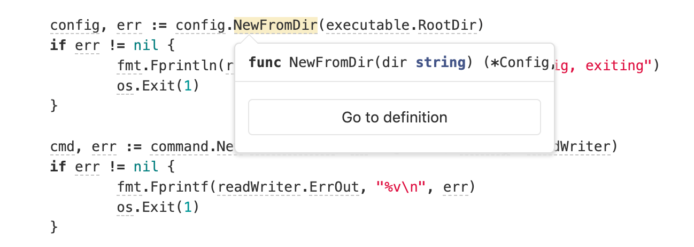

# Code Intelligence

> [Introduced](https://gitlab.com/groups/gitlab-org/-/epics/1576) in GitLab 13.1.

Code Intelligence adds code navigation features common to interactive
development environments (IDE), including:

- Type signatures and symbol documentation.
- Go-to definition

Code Intelligence is built into GitLab and powered by [LSIF](https://lsif.dev/)
(Language Server Index Format), a file format for precomputed code
intelligence data.

## Configuration

Enable code intelligence for a project by adding a GitLab CI/CD job to the project's
`.gitlab-ci.yml` which will generate the LSIF artifact:

```yaml
code_navigation:
  image: golang:1.14.0
  allow_failure: true # recommended
  script:
    - go get github.com/sourcegraph/lsif-go/cmd/lsif-go
    - lsif-go
  artifacts:
    reports:
      lsif: dump.lsif
```

The generated LSIF file must be less than 170MiB.

After the job succeeds, code intelligence data can be viewed while browsing the code:



## Language support

Generating an LSIF file requires a language server indexer implementation for the
relevant language.

| Language | Implementation |
|---|---|
| Go | [sourcegraph/lsif-go](https://github.com/sourcegraph/lsif-go) |
| JavaScript | [sourcegraph/lsif-node](https://github.com/sourcegraph/lsif-node) |
| TypeScript | [sourcegraph/lsif-node](https://github.com/sourcegraph/lsif-node) |

View a complete list of [available LSIF indexers](https://lsif.dev/#implementations-server) on their website and
refer to their documentation to see how to generate an LSIF file for your specific language.
