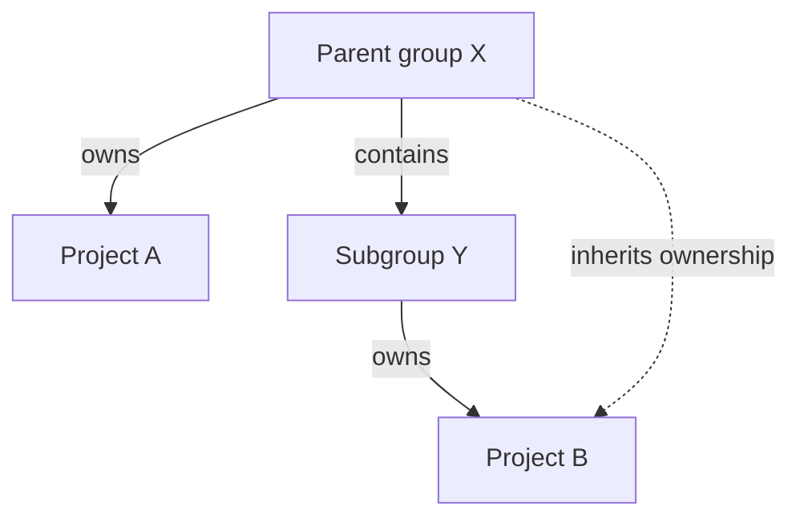
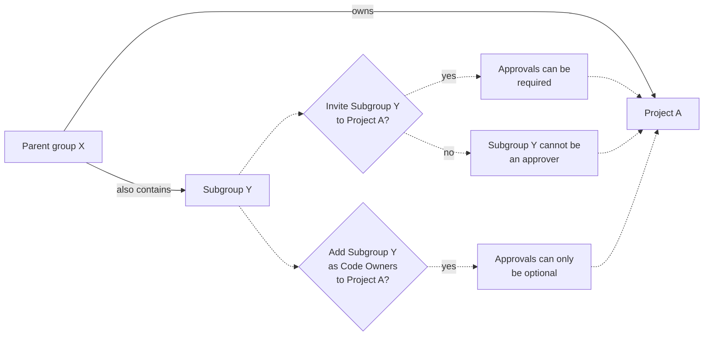

# Code Owners **(PREMIUM)**

> Moved to GitLab Premium in 13.9.

Code Owners define who develops and maintains a feature, and own the resulting
files or directories in a repository.

- The users you define as Code Owners are displayed in the UI when you browse directories.
- You can set your merge requests so they must be approved by Code Owners before merge.
- You can protect a branch and allow only Code Owners to approve changes to the branch.

Use Code Owners and approvers together with
[approval rules](merge_requests/approvals/rules.md) to build a flexible approval
workflow:

- Use **Code Owners** to define the users who have domain expertise for specific paths in your repository.
- Use **Approvers** and **Approval rules** to define domains of expertise (such as a security team)
  that are not scoped to specific file paths in your repository.
  - **Approvers** define the users.
  - **Approval rules** define when these users can approve work, and whether or not their approval is required.

For example:

| Type | Name | Scope  | Comment    |
|------|------|--------|------------|
| Approval rule            | UX                   | All files     | A user experience (UX) team member reviews the user experience of all changes made in your project. |
| Approval rule            | Security             | All files     | A security team member reviews all changes for vulnerabilities.                                     |
| Code Owner approval rule | Frontend: Code Style | `*.css` files | A frontend engineer reviews CSS file changes for adherence to project style standards.              |
| Code Owner approval rule | Backend: Code Review | `*.rb` files  | A backend engineer reviews the logic and code style of Ruby files.                                  |

## Set up Code Owners

Create a `CODEOWNERS` file to specify users or [shared groups](members/share_project_with_groups.md)
that are responsible for specific files and directories in a repository. Each repository
can have a single `CODEOWNERS` file. To create it:

1. Choose the location where you want to specify Code Owners:
   - In the root directory of the repository
   - In the `.gitlab/` directory
   - In the `docs/` directory

1. In that location, create a file named `CODEOWNERS`.

1. In the file, enter text that follows one of these patterns:

   ```plaintext
   # Code Owners for a file
   filename @username1 @username2

   # Code Owners for a directory
   directoryname/ @username1 @username2

   # All group members as Code Owners for a file
   filename @groupname

   # All group members as Code Owners for a directory
   directoryname/ @groupname
   ```

The Code Owners are now displayed in the UI. They apply to the current branch only.

Next steps:

- [Add Code Owners as merge request approvers](merge_requests/approvals/rules.md#code-owners-as-eligible-approvers).
- Set up [Code Owner approval on a protected branch](protected_branches.md#require-code-owner-approval-on-a-protected-branch).

## Groups as Code Owners

> - [Introduced](https://gitlab.com/gitlab-org/gitlab-foss/-/issues/53182) in GitLab 12.1.
> - Group and subgroup hierarchy support was [introduced](https://gitlab.com/gitlab-org/gitlab/-/issues/32432) in GitLab 13.0.

You can use members of groups and subgroups as Code Owners for projects:



In this example:

- **Parent group X** (`group-x`) owns **Project A**.
- **Parent group X** also contains a subgroup, **Subgroup Y**. (`group-x/subgroup-y`)
- **Subgroup Y** owns **Project B**.

The eligible Code Owners are:

- **Project A**: the members of **Group X** only, because **Project A** doesn't belong to **Subgroup Y**.
- **Project B**: the members of both **Group X** and **Subgroup Y**.

You can [invite](members/share_project_with_groups.md) **Subgroup Y** to **Project A**
so that their members also become eligible Code Owners.



If you do not invite **Subgroup Y** to **Project A**, but make them Code Owners, their approval
of the merge request becomes optional.

Inviting **Subgroup Y** to a parent group of **Project A**
[is not supported](https://gitlab.com/gitlab-org/gitlab/-/issues/288851). To set **Subgroup Y** as
Code Owners, add this group directly to the project itself.

NOTE:
For approval to be required, groups as Code Owners must have a direct membership
(not inherited membership) in the project. Approval can only be optional for groups
that inherit membership. Members in the Code Owners group also must be direct members,
and not inherit membership from any parent groups.

### Add a group as a Code Owner

To set a group as a Code Owner:

In the `CODEOWNERS` file, enter text that follows one of these patterns:

```plaintext
# All group members as Code Owners for a file
file.md @group-x

# All subgroup members as Code Owners for a file
file.md @group-x/subgroup-y

# All group and subgroup members as Code Owners for a file
file.md @group-x @group-x/subgroup-y
```

## When a file matches multiple `CODEOWNERS` entries

When a file matches multiple entries in the `CODEOWNERS` file,
the users from last pattern matching the file are used.

For example, in the following `CODEOWNERS` file:

```plaintext
README.md @user1

# This line would also match the file README.md
*.md @user2
```

The Code Owner for `README.md` would be `@user2`.

If you use sections, the last user _for each section_ is used.

Only one CODEOWNERS pattern can match per file path.

### Organize Code Owners by putting them into sections

> - [Introduced](https://gitlab.com/gitlab-org/gitlab/-/issues/12137) in GitLab 13.2 [with a flag](../../administration/feature_flags.md) named `sectional_codeowners`. Disabled by default.
> - [Generally available](https://gitlab.com/gitlab-org/gitlab/-/merge_requests/42389) in GitLab 13.4. Feature flag `sectional_codeowners` removed.

You can organize Code Owners by putting them into named sections.

You can use sections for shared directories, so that multiple
teams can be reviewers.

To add a section to the `CODEOWNERS` file, enter a section name in brackets,
followed by the files or directories, and users, groups, or subgroups:

```plaintext
[README Owners]
README.md @user1 @user2
internal/README.md @user2
```

Each Code Owner in the merge request widget is listed under a label.
The following image shows a **Groups** and **Documentation** section:


### Sections with duplicate names

If multiple sections have the same name, they are combined.
Also, section headings are not case-sensitive. For example:

```plaintext
[Documentation]
ee/docs/    @docs
docs/       @docs

[Database]
README.md  @database
model/db/   @database

[DOCUMENTATION]
README.md  @docs
```

This code results in three entries under the **Documentation** section header, and two
entries under **Database**. The entries defined under the sections **Documentation** and
**DOCUMENTATION** are combined, using the case of the first section.

### Make a Code Owners section optional

> [Introduced](https://gitlab.com/gitlab-org/gitlab/-/issues/232995) in GitLab 13.8.

You can designate optional sections in your Code Owners file. Prepend the
section name with the caret `^` character to treat the entire section as optional.
Optional sections enable you to designate responsible parties for various parts
of your codebase, but not require approval from them. This approach provides
a more relaxed policy for parts of your project that are frequently updated,
but don't require stringent reviews.

In this example, the `[Go]` section is optional:

```plaintext
[Documentation]
*.md @root

[Ruby]
*.rb @root

^[Go]
*.go @root
```

The optional Code Owners section displays in merge requests under the **Approval Rules** area:


If a section is duplicated in the file, and one of them is marked as optional and the other isn't, the section is required.

Optional sections in the `CODEOWNERS` file are treated as optional only
when changes are submitted by using merge requests. If a change is submitted directly
to the protected branch, approval from Code Owners is still required, even if the
section is marked as optional.

### Allowed to Push

The Code Owner approval and protected branch features do not apply to users who
are **Allowed to push**.

## Example `CODEOWNERS` file

```plaintext
# This is an example of a CODEOWNERS file.
# Lines that start with `#` are ignored.

# app/ @commented-rule

# Specify a default Code Owner by using a wildcard:
* @default-codeowner

# Specify multiple Code Owners by using a tab or space:
* @multiple @code @owners

# Rules defined later in the file take precedence over the rules
# defined before.
# For example, for all files with a filename ending in `.rb`:
*.rb @ruby-owner

# Files with a `#` can still be accessed by escaping the pound sign:
\#file_with_pound.rb @owner-file-with-pound

# Specify multiple Code Owners separated by spaces or tabs.
# In the following case the CODEOWNERS file from the root of the repo
# has 3 Code Owners (@multiple @code @owners):
CODEOWNERS @multiple @code @owners

# You can use both usernames or email addresses to match
# users. Everything else is ignored. For example, this code
# specifies the `@legal` and a user with email `janedoe@gitlab.com` as the
# owner for the LICENSE file:
LICENSE @legal this_does_not_match janedoe@gitlab.com

# Use group names to match groups, and nested groups to specify
# them as owners for a file:
README @group @group/with-nested/subgroup

# End a path in a `/` to specify the Code Owners for every file
# nested in that directory, on any level:
/docs/ @all-docs

# End a path in `/*` to specify Code Owners for every file in
# a directory, but not nested deeper. This code matches
# `docs/index.md` but not `docs/projects/index.md`:
/docs/* @root-docs

# Include `/**` to specify Code Owners for all subdirectories
# in a directory. This rule matches `docs/projects/index.md` or
# `docs/development/index.md`
/docs/**/*.md @root-docs

# This code makes matches a `lib` directory nested anywhere in the repository:
lib/ @lib-owner

# This code match only a `config` directory in the root of the repository:
/config/ @config-owner

# If the path contains spaces, escape them like this:
path\ with\ spaces/ @space-owner

# Code Owners section:
[Documentation]
ee/docs    @docs
docs       @docs

[Database]
README.md  @database
model/db   @database

# This section is combined with the previously defined [Documentation] section:
[DOCUMENTATION]
README.md  @docs
```

## Troubleshooting

### Approvals shown as optional

A Code Owner approval rule is optional if any of these conditions are true:

- The user or group are not a member of the project. Code Owners [cannot inherit from parent groups](https://gitlab.com/gitlab-org/gitlab/-/issues/288851/).
- [Code Owner approval on a protected branch](protected_branches.md#require-code-owner-approval-on-a-protected-branch) has not been set up.
- The section is [marked as optional](#make-a-code-owners-section-optional).

### Approvals do not show

Code Owner approval rules only update when the merge request is created.
If you update the `CODEOWNERS` file, close the merge request and create a new one.

### User not shown as possible approver

A user might not show as an approver on the Code Owner merge request approval rules
if any of these conditions are true:

- A rule prevents the specific user from approving the merge request.
  Check the project [merge request approval](merge_requests/approvals/settings.md#edit-merge-request-approval-settings) settings.
- A Code Owner group has a visibility of **private**, and the current user is not a
  member of the Code Owner group.
