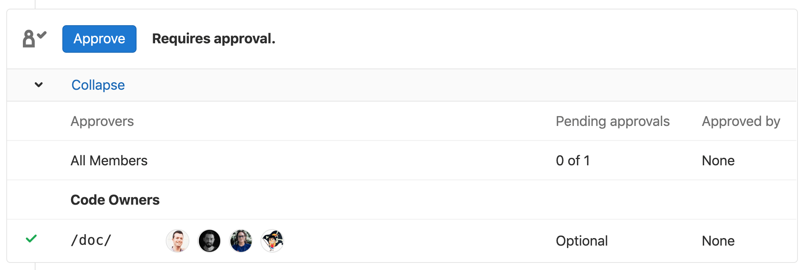

# Code Owners **(STARTER)**

> - [Introduced](https://gitlab.com/gitlab-org/gitlab/-/merge_requests/6916)
in [GitLab Starter](https://about.gitlab.com/pricing/) 11.3.
> - [Support for group namespaces](https://gitlab.com/gitlab-org/gitlab-foss/-/issues/53182) added in GitLab Starter 12.1.
> - Code Owners for Merge Request approvals was [introduced](https://gitlab.com/gitlab-org/gitlab/-/issues/4418) in [GitLab Premium](https://about.gitlab.com/pricing/) 11.9.

## Introduction

When contributing to a project, it can often be difficult
to find out who should review or approve merge requests.
Additionally, if you have a question over a specific file or
code block, it may be difficult to know who to find the answer from.

GitLab Code Owners is a feature to define who owns specific
files or paths in a repository, allowing other users to understand
who is responsible for each file or path.

## Why is this useful?

Code Owners allows for a version controlled, single source of
truth file outlining the exact GitLab users or groups that
own certain files or paths in a repository. Code Owners can be
utilized in the merge request approval process which can streamline
the process of finding the right reviewers and approvers for a given
merge request.

In larger organizations or popular open source projects, Code Owners
can also be useful to understand who to contact if you have
a question that may not be related to code review or a merge request
approval.

## How to set up Code Owners

You can use a `CODEOWNERS` file to specify users or
[shared groups](members/share_project_with_groups.md)
that are responsible for specific files and directories in a repository.

You can choose to add the `CODEOWNERS` file in three places:

- To the root directory of the repository
- Inside the `.gitlab/` directory
- Inside the `docs/` directory

The `CODEOWNERS` file is scoped to a branch, which means that as
new files are introduced, the user adding the new content can
specify themselves as a code owner, all before the new changes
get merged to the target branch.

When a file matches multiple entries in the `CODEOWNERS` file,
the users from last pattern matching the file are displayed on the
blob page of the given file. For example, you have the following
`CODEOWNERS` file:

```plaintext
README.md @user1

# This line would also match the file README.md
*.md @user2
```

The user that would show for `README.md` would be `@user2`.

## Approvals by Code Owners

Once you've added Code Owners to a project, you can configure it to
be used for merge request approvals:

- As [merge request eligible approvers](merge_requests/merge_request_approvals.md#code-owners-as-eligible-approvers).
- As required approvers for [protected branches](protected_branches.md#protected-branches-approval-by-code-owners-premium). **(PREMIUM)**

NOTE: **Note:**
Developer or higher [permissions](../permissions.md) are required in order to
approve a merge request.

Once set, Code Owners are displayed in merge requests widgets:



While the `CODEOWNERS` file can be used in addition to Merge Request [Approval Rules](merge_requests/merge_request_approvals.md#approval-rules),
it can also be used as the sole driver of merge request approvals
(without using [Approval Rules](merge_requests/merge_request_approvals.md#approval-rules)).
To do so, create the file in one of the three locations specified above and
set the code owners as required approvers for [protected branches](protected_branches.md#protected-branches-approval-by-code-owners-premium).
Use [the syntax of Code Owners files](code_owners.md#the-syntax-of-code-owners-files)
to specify the actual owners and granular permissions.

Using Code Owners in conjunction with [Protected Branches](protected_branches.md#protected-branches-approval-by-code-owners-premium)
will prevent any user who is not specified in the `CODEOWNERS` file from pushing
changes for the specified files/paths, even if their role is included in the
**Allowed to push** column. This allows for a more inclusive push strategy, as
administrators don't have to restrict developers from pushing directly to the
protected branch, but can restrict pushing to certain files where a review by
Code Owners is required.

## The syntax of Code Owners files

Files can be specified using the same kind of patterns you would use
in the `.gitignore` file followed by one or more of:

- A user's `@username`.
- A user's email address.
- The `@name` of one or more groups that should be owners of the file.

Groups must be added as [members of the project](members/index.md),
or they will be ignored.

Starting in [GitLab 13.0](https://gitlab.com/gitlab-org/gitlab/-/issues/32432),
you can additionally specify groups or subgroups from the project's upper group
hierarchy as potential code owners, without having to invite them specifically
to the project. Groups outside the project's hierarchy or children beneath the
hierarchy must still be explicitly invited to the project in order to show as
Code Owners.

For example, consider the following hierarchy for the example project
`example_project`:

```plaintext
group >> sub-group >> sub-subgroup >> example_project >> file.md
```

Any of the following groups would be eligible to be specified as code owners:

- `@group`
- `@group/sub-group`
- `@group/sub-group/sub-subgroup`

In addition, any groups that have been invited to the project using the
**Members** tool will also be recognized as eligible code owners.

The order in which the paths are defined is significant: the last
pattern that matches a given path will be used to find the code
owners.

Starting a line with a `#` indicates a comment. This needs to be
escaped using `\#` to address files for which the name starts with a
`#`.

### Code Owners Sections **(PREMIUM)**

> - [Introduced](https://gitlab.com/gitlab-org/gitlab/-/issues/12137) in [GitLab Premium](https://about.gitlab.com/pricing/) 13.2.
> - It's deployed behind a feature flag, enabled by default.
> - It's enabled on GitLab.com.
> - It can be enabled or disabled per-project.
> - It's recommended for production use.
> - For GitLab self-managed instances, GitLab administrators can opt to [disable it](#enable-or-disable-code-owner-sections-core-only). **(CORE ONLY)**

Code Owner rules can be grouped into named sections. This allows for better
organization of broader categories of Code Owner rules to be applied.
Additionally, the usual guidance that only the last pattern matching the file is
applied is expanded such that the last pattern matching _for each section_ is
applied.

For example, in a large organization, independent teams may have a common interest
in parts of the application, for instance, a payment processing company may have
"development", "security", and "compliance" teams looking after common parts of
the codebase. All three teams may need to approve changes. Although approval rules
make this possible, they apply to every merge request. Also, while Code Owners are
applied based on which files are changed, only one CODEOWNERS pattern can match per
file path.

Using `CODEOWNERS` sections allows multiple teams that only need to approve certain
changes, to set their own independent patterns by specifying discrete sections in the
`CODEOWNERS` file. The section rules may be used for shared paths so that multiple
teams can be added as reviewers.

Sections can be added to `CODEOWNERS` files as a new line with the name of the
section inside square brackets. Every entry following it is assigned to that
section. The following example would create 2 Code Owner rules for the "README
Owners" section:

```plaintext
[README Owners]
README.md @user1 @user 2
internal/README.md @user2
```

Multiple sections can be used, even with matching file or directory patterns.
Reusing the same section name will group the results together under the same
section, with the most specific rule or last matching pattern being used. For
example, consider the following entries in a `CODEOWNERS` file:

```plaintext
[Documentation]
ee/docs    @gl-docs
docs       @gl-docs

[Database]
README.md  @gl-database
model/db   @gl-database

[DOCUMENTATION]
README.md  @gl-docs
```

This will result in 3 entries under the "Documentation" section header, and 2
entries under "Database". Case is not considered when combining sections, so in
this example, entries defined under the sections "Documentation" and
"DOCUMENTATION" would be combined into one, using the case of the first instance
of the section encountered in the file.

When assigned to a section, each code owner rule displayed in merge requests
widget is sorted under a "section" label. In the screenshot below, we can see
the rules for "Groups" and "Documentation" sections:


#### Enable or disable Code Owner Sections **(CORE ONLY)**

Sections is under development but ready for production use.
It is deployed behind a feature flag that is **enabled by default**.
[GitLab administrators with access to the GitLab Rails console](../../administration/feature_flags.md)
can opt to disable it for your instance.

To disable it:

```ruby
Feature.disable(:sectional_codeowners)
```

To enable it:

```ruby
Feature.enable(:sectional_codeowners)
```

CAUTION: **Caution:**
Disabling Sections will **not** refresh Code Owner Approval Rules on existing merge requests.

## Example `CODEOWNERS` file

```plaintext
# This is an example of a code owners file
# lines starting with a `#` will be ignored.

# app/ @commented-rule

# We can specify a default match using wildcards:
* @default-codeowner

# We can also specify "multiple tab or space" separated codeowners:
* @multiple @code @owners

# Rules defined later in the file take precedence over the rules
# defined before.
# This will match all files for which the file name ends in `.rb`
*.rb @ruby-owner

# Files with a `#` can still be accessed by escaping the pound sign
\#file_with_pound.rb @owner-file-with-pound

# Multiple codeowners can be specified, separated by spaces or tabs
# In the following case the CODEOWNERS file from the root of the repo
# has 3 code owners (@multiple @code @owners)
CODEOWNERS @multiple @code @owners

# Both usernames or email addresses can be used to match
# users. Everything else will be ignored. For example this will
# specify `@legal` and a user with email `janedoe@gitlab.com` as the
# owner for the LICENSE file
LICENSE @legal this_does_not_match janedoe@gitlab.com

# Group names can be used to match groups and nested groups to specify
# them as owners for a file
README @group @group/with-nested/subgroup

# Ending a path in a `/` will specify the code owners for every file
# nested in that directory, on any level
/docs/ @all-docs

# Ending a path in `/*` will specify code owners for every file in
# that directory, but not nested deeper. This will match
# `docs/index.md` but not `docs/projects/index.md`
/docs/* @root-docs

# This will make a `lib` directory nested anywhere in the repository
# match
lib/ @lib-owner

# This will only match a `config` directory in the root of the
# repository
/config/ @config-owner

# If the path contains spaces, these need to be escaped like this:
path\ with\ spaces/ @space-owner

# Code Owners section:
[Documentation]
ee/docs    @gl-docs
docs       @gl-docs

[Database]
README.md  @gl-database
model/db   @gl-database

# This section will be joined with the [Documentation] section previously defined:
[DOCUMENTATION]
README.md  @gl-docs
```
