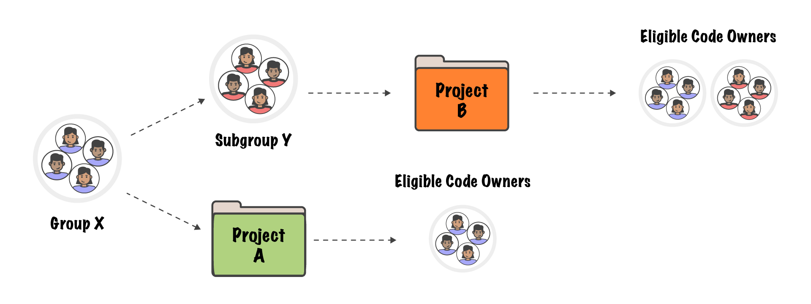

# Code Owners **(PREMIUM)**

> - [Introduced](https://gitlab.com/gitlab-org/gitlab/-/merge_requests/6916) in GitLab 11.3.
> - Code Owners for merge request approvals was [introduced](https://gitlab.com/gitlab-org/gitlab/-/issues/4418) in GitLab Premium 11.9.
> - Moved to GitLab Premium in 13.9.

Code Owners define who owns specific files or folders in a repository.

- The users you define as Code Owners are displayed in the UI when you browse directories.
- You can set your merge requests so they must be approved by Code Owners before merge.
- You can protect a branch and allow only Code Owners to approve changes to the branch.

If you don't want to use Code Owners for approvals, you can
[configure rules](merge_requests/approvals/rules.md) instead.

## Set up Code Owners

You can use Code Owners to specify users or [shared groups](members/share_project_with_groups.md)
that are responsible for specific files and folders in a repository.

To set up Code Owners:

1. Choose the location where you want to specify Code Owners:
   - In the root directory of the repository
   - In the `.gitlab/` directory
   - In the `docs/` directory

1. In that location, create a file named `CODEOWNERS`.

1. In the file, enter text that follows one of these patterns:

   ```plaintext
   # Code Owners for a file
   filename @username1 @username2

   # Code Owners for a directory
   foldername @username1 @username2

   # All group members as Code Owners for a file
   filename @groupname

   # All group members as Code Owners for a folder
   foldername @groupname
   ```

The Code Owners are now displayed in the UI.

Next steps:

- [Add Code Owners as merge request approvers](merge_requests/approvals/rules.md#code-owners-as-eligible-approvers).
- Set up [Code Owner approval on a protected branch](protected_branches.md#require-code-owner-approval-on-a-protected-branch).

NOTE:
The Code Owners apply to the current branch only.

## When a file matches multiple `CODEOWNERS` entries

When a file matches multiple entries in the `CODEOWNERS` file,
the users from last pattern matching the file are used.

For example, in the following `CODEOWNERS` file:

```plaintext
README.md @user1

# This line would also match the file README.md
*.md @user2
```

The user that would show for `README.md` would be `@user2`.

## Groups as Code Owners

> - [Introduced](https://gitlab.com/gitlab-org/gitlab-foss/-/issues/53182) in GitLab 12.1.
> - Group and subgroup hierarchy support was [introduced](https://gitlab.com/gitlab-org/gitlab/-/issues/32432) in GitLab 13.0.

Groups and subgroups members are inherited as eligible Code Owners to a
project, as long as the hierarchy is respected.

For example, consider a given group called "Group X" (slug `group-x`) and a
"Subgroup Y" (slug `group-x/subgroup-y`) that belongs to the Group X, and
suppose you have a project called "Project A" within the group and a
"Project B" within the subgroup.

The eligible Code Owners to Project B are both the members of the Group X and
the Subgroup Y. The eligible Code Owners to the Project A are just the
members of the Group X, given that Project A doesn't belong to the Subgroup Y:



But you have the option to [invite](members/share_project_with_groups.md)
the Subgroup Y to the Project A so that their members also become eligible
Code Owners:

NOTE:
If you do not invite Subgroup Y to Project A, but make them Code Owners, their approval
of the merge request becomes optional.


After being invited, any member (`@user`) of the group or subgroup can be set
as Code Owner to files of the Project A or B, and the entire Group X
(`@group-x`) or Subgroup Y (`@group-x/subgroup-y`), as follows:

```plaintext
# A member of the group or subgroup as Code Owner to a file
file.md @user

# All group members as Code Owners to a file
file.md @group-x

# All subgroup members as Code Owners to a file
file.md @group-x/subgroup-y

# All group and subgroup members as Code Owners to a file
file.md @group-x @group-x/subgroup-y
```

### Code Owners sections **(PREMIUM)**

> - [Introduced](https://gitlab.com/gitlab-org/gitlab/-/issues/12137) in GitLab Premium 13.2 behind a feature flag, enabled by default.
> - [Feature flag removed](https://gitlab.com/gitlab-org/gitlab/-/merge_requests/42389) in GitLab 13.4.

Code Owner rules can be grouped into named sections. This allows for better
organization of broader categories of Code Owner rules to be applied.
Additionally, the usual guidance that only the last pattern matching the file is
applied is expanded such that the last pattern matching _for each section_ is
applied.

For example, in a large organization, independent teams may have a common interest
in parts of the application, for instance, a payment processing company may have
"development", "security", and "compliance" teams looking after common parts of
the codebase. All three teams may need to approve changes. Although approval rules
make this possible, they apply to every merge request. Also, while Code Owners are
applied based on which files are changed, only one CODEOWNERS pattern can match per
file path.

Using `CODEOWNERS` sections allows multiple teams that only need to approve certain
changes, to set their own independent patterns by specifying discrete sections in the
`CODEOWNERS` file. The section rules may be used for shared paths so that multiple
teams can be added as reviewers.

Sections can be added to `CODEOWNERS` files as a new line with the name of the
section inside square brackets. Every entry following is assigned to that
section. The following example would create two Code Owner rules for the "README
Owners" section:

```plaintext
[README Owners]
README.md @user1 @user2
internal/README.md @user2
```

Multiple sections can be used, even with matching file or directory patterns.
Reusing the same section name groups the results together under the same
section, with the most specific rule or last matching pattern being used. For
example, consider the following entries in a `CODEOWNERS` file:

```plaintext
[Documentation]
ee/docs    @gl-docs
docs       @gl-docs

[Database]
README.md  @gl-database
model/db   @gl-database

[DOCUMENTATION]
README.md  @gl-docs
```

This results in three entries under the "Documentation" section header, and two
entries under "Database". Case is not considered when combining sections, so in
this example, entries defined under the sections "Documentation" and
"DOCUMENTATION" would be combined into one, using the case of the first instance
of the section encountered in the file.

When assigned to a section, each Code Owner rule displayed in merge requests
widget is sorted under a "section" label. In the screenshot below, we can see
the rules for "Groups" and "Documentation" sections:


#### Optional Code Owners sections **(PREMIUM)**

> - [Introduced](https://gitlab.com/gitlab-org/gitlab/-/issues/232995) in GitLab Premium 13.8 behind a feature flag, enabled by default.
> - [Feature flag removed](https://gitlab.com/gitlab-org/gitlab/-/merge_requests/53227) in GitLab 13.9.

To make a certain section optional, add a Code Owners section prepended with the
caret `^` character. Approvals from owners listed in the section are **not** required. For example:

```plaintext
[Documentation]
*.md @root

[Ruby]
*.rb @root

^[Go]
*.go @root
```

The optional Code Owners section displays in merge requests under the **Approval Rules** area:


If a section is duplicated in the file, and one of them is marked as optional and the other isn't, the requirement prevails.

For example, the Code Owners of the "Documentation" section below is still required to approve merge requests:

```plaintext
[Documentation]
*.md @root

[Ruby]
*.rb @root

^[Go]
*.go @root

^[Documentation]
*.txt @root
```

Optional sections in the `CODEOWNERS` file are treated as optional only
when changes are submitted by using merge requests. If a change is submitted directly
to the protected branch, approval from Code Owners is still required, even if the
section is marked as optional. We plan to change this behavior in a
[future release](https://gitlab.com/gitlab-org/gitlab/-/issues/297638),
and allow direct pushes to the protected branch for sections marked as optional.

## Example `CODEOWNERS` file

```plaintext
# This is an example of a CODEOWNERS file
# lines starting with a `#` will be ignored.

# app/ @commented-rule

# We can specify a default match using wildcards:
* @default-codeowner

# We can also specify "multiple tab or space" separated codeowners:
* @multiple @code @owners

# Rules defined later in the file take precedence over the rules
# defined before.
# This will match all files for which the file name ends in `.rb`
*.rb @ruby-owner

# Files with a `#` can still be accessed by escaping the pound sign
\#file_with_pound.rb @owner-file-with-pound

# Multiple codeowners can be specified, separated by spaces or tabs
# In the following case the CODEOWNERS file from the root of the repo
# has 3 Code Owners (@multiple @code @owners)
CODEOWNERS @multiple @code @owners

# Both usernames or email addresses can be used to match
# users. Everything else will be ignored. For example this will
# specify `@legal` and a user with email `janedoe@gitlab.com` as the
# owner for the LICENSE file
LICENSE @legal this_does_not_match janedoe@gitlab.com

# Group names can be used to match groups and nested groups to specify
# them as owners for a file
README @group @group/with-nested/subgroup

# Ending a path in a `/` will specify the Code Owners for every file
# nested in that directory, on any level
/docs/ @all-docs

# Ending a path in `/*` will specify Code Owners for every file in
# that directory, but not nested deeper. This will match
# `docs/index.md` but not `docs/projects/index.md`
/docs/* @root-docs

# This will make a `lib` directory nested anywhere in the repository
# match
lib/ @lib-owner

# This will only match a `config` directory in the root of the
# repository
/config/ @config-owner

# If the path contains spaces, escape them like this:
path\ with\ spaces/ @space-owner

# Code Owners section:
[Documentation]
ee/docs    @gl-docs
docs       @gl-docs

[Database]
README.md  @gl-database
model/db   @gl-database

# This section will be joined with the [Documentation] section previously defined:
[DOCUMENTATION]
README.md  @gl-docs
```
