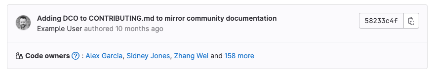

DETAILS:
**Tier:** Premium, Ultimate
**Offering:** GitLab.com, GitLab Self-Managed, GitLab Dedicated

Use the Code Owners feature to define who has expertise for specific parts of your project's codebase.
Define the owners of files and directories in a repository to:

- **Require owners to approve changes.** Combine protected branches with Code Owners to require
  experts to approve merge requests before they merge into a protected branch. For more information,
  see [Code Owners and protected branches](#code-owners-and-protected-branches).
- **Identify owners.** Code Owner names are displayed on the files and directories they own:

  

## Code Owners and approval rules

Combine Code Owners with merge request
[approval rules](../merge_requests/approvals/rules.md) (either optional or required)
to build a flexible approval workflow:

- Use **Code Owners** to ensure quality. Define the users who have domain expertise
  for specific paths in your repository.
- Use **Approval rules** to define areas of expertise that don't correspond to specific
  file paths in your repository. Approval rules help guide merge request creators to
  the correct set of reviewers, such as frontend developers or a security team.

For example:

| Type | Name | Scope  | Comment    |
|------|------|--------|------------|
| Approval rule            | UX                   | All files     | A user experience (UX) team member reviews the user experience of all changes made in your project. |
| Approval rule            | Security             | All files     | A security team member reviews all changes for vulnerabilities. |
| Code Owner approval rule | Frontend: Code Style | `*.css` files | A frontend engineer reviews CSS file changes for adherence to project style standards. |
| Code Owner approval rule | Backend: Code Review | `*.rb` files  | A backend engineer reviews the logic and code style of Ruby files. |

  Video introduction: <a href="https://www.youtube.com/watch?v=RoyBySTUSB0">Code Owners</a>.

<figure class="video-container">
  <iframe src="https://www.youtube-nocookie.com/embed/RoyBySTUSB0" frameborder="0" allowfullscreen> </iframe>
</figure>

## Code Owners and protected branches

To ensure merge request changes are reviewed and approved by Code Owners, specified in the
[`CODEOWNERS` file](#codeowners-file), the merge request's target branch must be
[protected](../repository/branches/protected.md)
and [Code Owner approval](../repository/branches/protected.md#require-code-owner-approval-on-a-protected-branch) must be enabled.

The following features are available when you enable Code Owner approvals on protected branches:

- [Require approvals from Code Owners](../repository/branches/protected.md#require-code-owner-approval-on-a-protected-branch).
- [Require multiple approvals from Code Owners](advanced.md#require-multiple-approvals-from-code-owners).
- [Optional approvals from Code Owners](reference.md#optional-sections).

### Practical example

Your project contains sensitive and important information in a `config/` directory. You can:

1. Assign ownership of the directory. To do this, set up a `CODEOWNERS` file.
1. Create a protected branch for your default branch. For example, `main`.
1. Enable **Required approval from code owners** on the protected branch.
1. Optional. Edit the `CODEOWNERS` file to add a rule for multiple approvals.

With this configuration, merge requests that change files in the `config/`directory and target the `main` branch
require approval from the designated Code Owners before merging.

## View Code Owners of a file or directory

To view the Code Owners of a file or directory:

1. On the left sidebar, select **Search or go to** and find your project.
1. Select **Code > Repository**.
1. Go to the file or directory you want to see the Code Owners for.
1. Optional. Select a branch or tag.

GitLab shows the Code Owners at the top of the page.

## Set up Code Owners

Prerequisites:

- You must have permissions to push to the default branch or to create a merge request.

1. Create a `CODEOWNERS` file in your [preferred location](#codeowners-file).
1. Define some rules in the file following the [`CODEOWNERS` syntax](reference.md).
   Some suggestions:
   - Configure [All eligible approvers](../merge_requests/approvals/rules.md#code-owners-as-eligible-approvers) approval rule.
   - [Require Code Owner approval](../repository/branches/protected.md#require-code-owner-approval-on-a-protected-branch) on a protected branch.
1. Commit your changes, and push them up to GitLab.

## `CODEOWNERS` file

The `CODEOWNERS` file defines who is responsible for code in a GitLab project.
Its purpose is to:

- Automatically assign reviewers to merge requests based on the files changed.
- Enforce approval requirements for protected branches.
- Communicate code ownership in a project.

This file determines who should review and approve changes and ensures the right
experts are involved in code changes.

Each repository uses a single `CODEOWNERS` file. GitLab checks these locations
in your repository in this order. The first `CODEOWNERS` file found is used, and
all others are ignored:

1. In the root directory: `./CODEOWNERS`.
1. In the `docs` directory: `./docs/CODEOWNERS`.
1. In the `.gitlab` directory: `./.gitlab/CODEOWNERS`.

For more information, see [`CODEOWNERS` syntax](reference.md) and [Advanced `CODEOWNERS` configuration](advanced.md).

## Allowed to push

Users who are **Allowed to push** can choose to create a merge request
for their changes, or push the changes directly to a branch. If the user
skips the merge request process, the protected branch features
and Code Owner approvals built into merge requests are also skipped.

This permission is often granted to accounts associated with
automation ([internal users](../../../administration/internal_users.md))
and release tooling.

All changes from users _without_ the **Allowed to push** permission must be routed through a merge request.

## Related topics

- [`CODEOWNERS` syntax](reference.md)
- [Advanced `CODEOWNERS` configuration](advanced.md)
- [Development guidelines](../../../development/code_owners/_index.md)
- [Protected branches](../repository/branches/protected.md)
- [Troubleshooting Code Owners](troubleshooting.md)
