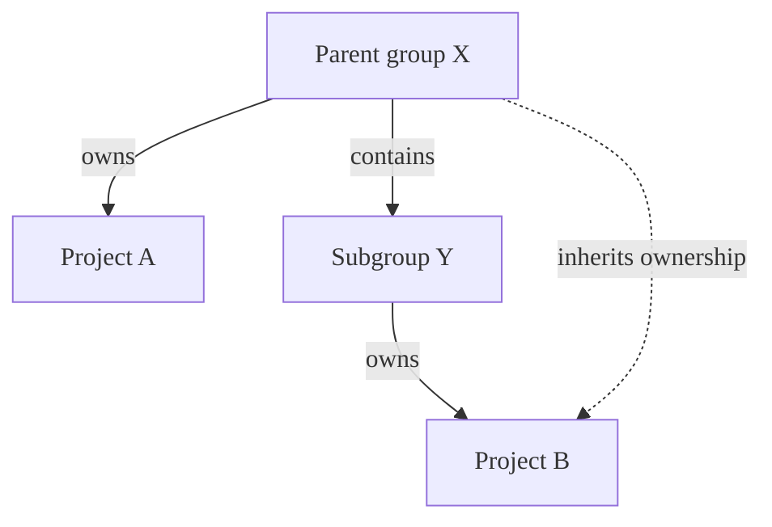
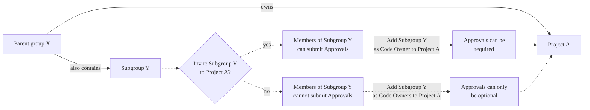

This page describes advanced configuration options for Code Owners in GitLab.

## Pattern matching

GitLab uses `File::fnmatch` with the `File::FNM_DOTMATCH` and `File::FNM_PATHNAME` flags set for pattern matching:

- The repository structure is treated like an isolated file system.
- The patterns follow a subset of shell filename globbing rules, and are not regular expressions.
- The `File::FNM_DOTMATCH` flag allows `*` to match dotfiles like `.gitignore`.
- The `File::FNM_PATHNAME` flag prevents `*` from matching the `/` path separator.
- `**` matches directories recursively. For example, `**/*.rb` matches `config/database.rb`
  and `app/controllers/users/stars_controller.rb`.

## Default Code Owners and optional sections

To combine the syntax for default owners with [optional sections](reference.md#optional-sections)
and required approvals, place default owners at the end:

```plaintext
[Documentation][2] @docs-team
docs/
README.md

^[Database] @database-team
model/db/
config/db/database-setup.md @docs-team
```

## Regular entries and sections

If you set a default Code Owner for a path **outside a section**, their approval is always required.
Such entries aren't overridden by sections.
Entries without sections are treated as if they were another, unnamed section:

```plaintext
# Required for all files
* @general-approvers

[Documentation] @docs-team
docs/
README.md
*.txt

[Database] @database-team
model/db/
config/db/database-setup.md @docs-team
```

In this example:

- `@general-approvers` owns all items everywhere, without overrides.
- `@docs-team` owns all items in the `Documentation` section.
- `@database-team` owns all items in the `Database` section except
  `config/db/database-setup.md`, which has an override assigning it to `@docs-team`.
- A merge request that modifies `model/db/CHANGELOG.txt` would require three approvals: one from each
  of the `@general-approvers`,`@docs-team`, and `@database-team` groups.

Compare this behavior to when you use only [default owners for sections](reference.md#set-default-code-owner-for-a-section),
when specific entries in a section override the section default.

## Sections with duplicate names

If multiple sections have the same name, they are combined.
Also, section headings are not case-sensitive. For example:

```plaintext
[Documentation]
ee/docs/    @docs
docs/       @docs

[Database]
README.md  @database
model/db/   @database

[DOCUMENTATION]
README.md  @docs
```

This code results in three entries under the **Documentation** section header, and two
entries under **Database**. The entries defined under the sections **Documentation** and
**DOCUMENTATION** are combined, using the case of the first section.

## Define Code Owners for specific files or directories

When a file or directory matches multiple entries in the `CODEOWNERS` file,
the users from last pattern matching the file or directory are used. This enables you
to define more specific owners for more specifically defined files or directories, when
you order the entries in a sensible way.

For example, in the following `CODEOWNERS` file:

```plaintext
# This line would match the file terms.md
*.md @doc-team

# This line would also match the file terms.md
terms.md @legal-team
```

The Code Owner for `terms.md` would be `@legal-team`.

## Require multiple approvals from Code Owners

> - [Introduced](https://gitlab.com/gitlab-org/gitlab/-/issues/335451) in GitLab 15.9.

You can require multiple approvals for the Code Owners sections in the Approvals area in merge requests.
Append the section name with a number `n` in brackets, for example, `[2]` or `[3]`.
This requires `n` approvals from the Code Owners in this section.
Valid entries for `n` are integers `≥ 1`. `[1]` is optional because it is the default. Invalid values for `n` are treated as `1`.

WARNING:
[Issue 384881](https://gitlab.com/gitlab-org/gitlab/-/issues/385881) proposes changes
to the behavior of this setting. Do not intentionally set invalid values. They may
become valid in the future and cause unexpected behavior.

To require multiple approvals from Code Owners:

1. On the left sidebar, select **Search or go to** and find your project.
1. Select **Settings > Repository**.
1. Expand **Protected branches**.
1. Next to the default branch, turn on the toggle under **Code owner approval**.
1. Edit the `CODEOWNERS` file to add a rule for multiple approvals.

For example, to require two approvals for the `[Documentation]` section:

```plaintext
[Documentation][2]
*.md @tech-writer-team

[Ruby]
*.rb @dev-team
```

The `Documentation` Code Owners section in the Approvals area displays two approvals are required:


## Group inheritance and eligibility



In this example:

- **Parent group X** (`group-x`) owns **Project A**.
- **Parent group X** also contains a subgroup, **Subgroup Y**. (`group-x/subgroup-y`)
- **Subgroup Y** owns **Project B**.

The eligible Code Owners are:

- **Project A**: the members of **Group X** only, because **Project A** doesn't belong to **Subgroup Y**.
- **Project B**: the members of both **Group X** and **Subgroup Y**.

### Invite subgroups to parent groups

Inviting **Subgroup Y** to a parent group of **Project A**
[is not supported](https://gitlab.com/gitlab-org/gitlab/-/issues/288851). To set **Subgroup Y** as
Code Owners, [invite this group directly to the project](#invite-subgroups-to-projects-in-parent-groups) itself.

NOTE:
For approval to be required, groups as Code Owners must have a direct membership
(not inherited membership) in the project. Approval can only be optional for groups
that inherit membership. Members in the Code Owners group also must be direct members,
and not inherit membership from any parent groups.

### Invite subgroups to projects in parent groups

You can [invite](../members/sharing_projects_groups.md) **Subgroup Y** to **Project A**
so that their members also become eligible Code Owners.



If you do not invite **Subgroup Y** to **Project A**, but make them Code Owners, their approval
of the merge request becomes optional.

## Error handling

> - Error validation [introduced](https://gitlab.com/gitlab-org/gitlab/-/issues/216066) in GitLab 16.3.

### Entries with spaces

Escape whitespace in paths with backslashes:

```plaintext
path\ with\ spaces/*.md @owner
```

Without escaping, GitLab parses `folder with spaces/*.md @group` as: `path: "folder", owners: " with spaces/*.md @group"`.

### Unparsable sections

If a section heading cannot be parsed, the section is:

1. Parsed as an entry.
1. Added to the previous section.
1. If no previous section exists, the section is added to the default section.

#### After the default section

```plaintext
* @group

[Section name
docs/ @docs_group
```

GitLab recognizes the heading `[Section name` as an entry. The default section includes 3 rules:

- Default section
  - `*` owned by `@group`
  - `[Section` owned by `name`
  - `docs/` owned by `@docs_group`

#### After a named section

```plaintext
[Docs]
docs/**/* @group

[Section name
docs/ @docs_group
```

GitLab recognizes the heading `[Section name` as an entry. The `[Docs]` section includes 3 rules:

- `docs/**/*` owned by `@group`
- `[Section` owned by `name`
- `docs/` owned by `@docs_group`

### Malformed owners

Each entry must contain one or more owners. Malformed owners are invalid and ignored:

```plaintext
/path/* @group user_without_at_symbol @user_with_at_symbol
```

This entry is owned by `@group` and `@user_with_at_symbol`.

### Inaccessible or incorrect owners

GitLab ignores inaccessible or incorrect owners. For example:

```plaintext
* @group @grou @username @i_left @i_dont_exist example@gitlab.com invalid@gitlab.com
```

If only `@group`, `@username`, and `example@gitlab.com` are accessible, GitLab ignores the others.

### Zero owners

If an entry includes no owners, or zero [accessible owners](#inaccessible-or-incorrect-owners)
exist, the entry is invalid. Because this rule can never be satisfied, GitLab
auto-approves it in merge requests.

NOTE:
When a protected branch has `Require code owner approval` enabled, rules with
zero owners are still honored.

### Minimum approvals

When [defining the number of approvals](advanced.md#require-multiple-approvals-from-code-owners) for a section,
the minimum number of approvals is `1`. Setting the number of approvals to
`0` results in GitLab requiring one approval.
