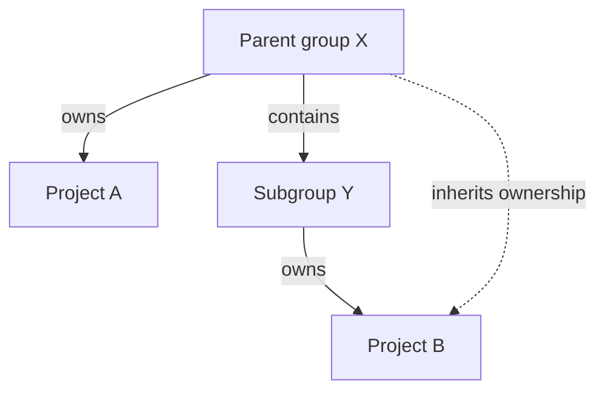
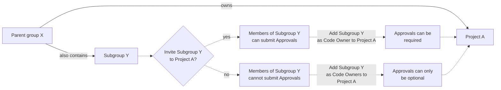
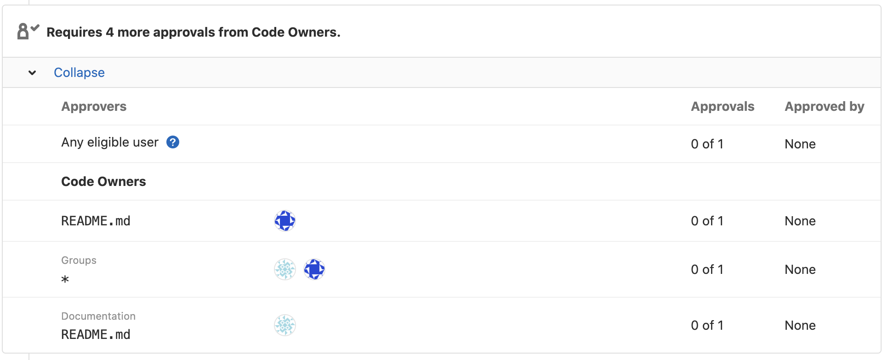
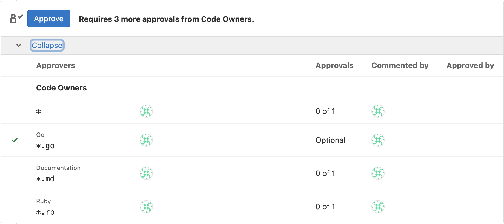

# Code Owners **(PREMIUM)**

> Moved to GitLab Premium in 13.9.

Use the Code Owners feature to define who has expertise for specific parts of your project's codebase.
Define the owners of files and directories in a repository to:

- **Require owners to approve changes.** Combine protected branches with Code Owners to require
  experts to approve merge requests before they merge into a protected branch.
- **Identify owners.** Code Owner names are displayed on the files and directories they own:
  

Use Code Owners in combination with merge request
[approval rules](../merge_requests/approvals/rules.md) (either optional or required)
to build a flexible approval workflow:

- Use **Code Owners** to ensure quality. Define the users who have domain expertise
  for specific paths in your repository.
- Use **Approval rules** to define areas of expertise that don't correspond to specific
  file paths in your repository. Approval rules help guide merge request creators to
  the correct set of reviewers, such as frontend developers or a security team.

For example:

| Type | Name | Scope  | Comment    |
|------|------|--------|------------|
| Approval rule            | UX                   | All files     | A user experience (UX) team member reviews the user experience of all changes made in your project.
| Approval rule            | Security             | All files     | A security team member reviews all changes for vulnerabilities.
| Code Owner approval rule | Frontend: Code Style | `*.css` files | A frontend engineer reviews CSS file changes for adherence to project style standards.
| Code Owner approval rule | Backend: Code Review | `*.rb` files  | A backend engineer reviews the logic and code style of Ruby files.

<div class="video-fallback">
  Video introduction: <a href="https://www.youtube.com/watch?v=RoyBySTUSB0">Code Owners</a>.
</div>
<figure class="video-container">
  <iframe src="https://www.youtube-nocookie.com/embed/RoyBySTUSB0" frameborder="0" allowfullscreen> </iframe>
</figure>

<i class="fa fa-youtube-play youtube" aria-hidden="true"></i>

## View Code Owners of a file or directory

To view the Code Owners of a file or directory:

1. On the top bar, select **Main menu > Projects** and find your project.
1. On the left sidebar, select **Repository > Files**.
1. Go to the file or directory you want to see the Code Owners for.
1. Optional. Select a branch or tag.

GitLab shows the Code Owners at the top of the page.

## Set up Code Owners

1. Create a `CODEOWNERS` file in your [preferred location](#code-owners-file).
1. Define some rules in the file following the [Code Owners syntax reference](reference.md).
   Some suggestions:
   - Configure [All eligible approvers](../merge_requests/approvals/rules.md#code-owners-as-eligible-approvers) approval rule.
   - [Require Code Owner approval](../protected_branches.md#require-code-owner-approval-on-a-protected-branch) on a protected branch.
1. Commit your changes, and push them up to GitLab.

### Code Owners file

A `CODEOWNERS` file (with no extension) specifies the users or
[shared groups](../members/share_project_with_groups.md) responsible for
specific files and directories in a repository.

Each repository uses a single `CODEOWNERS` file. GitLab checks these locations
in your repository in this order. The first `CODEOWNERS` file found is used, and
all others are ignored:

1. In the root directory: `./CODEOWNERS`.
1. In the `docs` directory: `./docs/CODEOWNERS`.
1. In the `.gitlab` directory: `./.gitlab/CODEOWNERS`.

### Add a group as a Code Owner

> Group and subgroup hierarchy support was [introduced](https://gitlab.com/gitlab-org/gitlab/-/issues/32432) in GitLab 13.0.

To set the members of a group or subgroup as a Code Owner:

In the `CODEOWNERS` file, enter text that follows one of these patterns:

```plaintext
# All group members as Code Owners for a file
file.md @group-x

# All subgroup members as Code Owners for a file
file.md @group-x/subgroup-y

# All group and subgroup members as Code Owners for a file
file.md @group-x @group-x/subgroup-y
```

#### Group inheritance and eligibility

> Group and subgroup hierarchy support was [introduced](https://gitlab.com/gitlab-org/gitlab/-/issues/32432) in GitLab 13.0.



In this example:

- **Parent group X** (`group-x`) owns **Project A**.
- **Parent group X** also contains a subgroup, **Subgroup Y**. (`group-x/subgroup-y`)
- **Subgroup Y** owns **Project B**.

The eligible Code Owners are:

- **Project A**: the members of **Group X** only, because **Project A** doesn't belong to **Subgroup Y**.
- **Project B**: the members of both **Group X** and **Subgroup Y**.

##### Inviting subgroups to projects in parent groups

You can [invite](../members/share_project_with_groups.md) **Subgroup Y** to **Project A**
so that their members also become eligible Code Owners.



If you do not invite **Subgroup Y** to **Project A**, but make them Code Owners, their approval
of the merge request becomes optional.

##### Inviting subgroups to parent groups

Inviting **Subgroup Y** to a parent group of **Project A**
[is not supported](https://gitlab.com/gitlab-org/gitlab/-/issues/288851). To set **Subgroup Y** as
Code Owners [invite this group directly to the project](#inviting-subgroups-to-projects-in-parent-groups) itself.

NOTE:
For approval to be required, groups as Code Owners must have a direct membership
(not inherited membership) in the project. Approval can only be optional for groups
that inherit membership. Members in the Code Owners group also must be direct members,
and not inherit membership from any parent groups.

### Define more specific owners for more specifically defined files or directories

When a file or directory matches multiple entries in the `CODEOWNERS` file,
the users from last pattern matching the file or directory are used. This enables you
to define more specific owners for more specifically defined files or directories, when
you order the entries in a sensible way.

For example, in the following `CODEOWNERS` file:

```plaintext
# This line would match the file terms.md
*.md @doc-team

# This line would also match the file terms.md
terms.md @legal-team
```

The Code Owner for `terms.md` would be `@legal-team`.

If you use sections, the last pattern matching the file or directory for each section is used.
For example, in a `CODEOWNERS` file using sections:

```plaintext
[README Owners]
README.md @user1 @user2
internal/README.md @user4

[README other owners]
README.md @user3
```

The Code Owners for the `README.md` in the root directory are `@user1`, `@user2`,
and `@user3`. The Code Owners for `internal/README.md` are `@user4` and `@user3`.

Only one CODEOWNERS pattern per section is matched to a file path.

### Organize Code Owners by putting them into sections

> - [Introduced](https://gitlab.com/gitlab-org/gitlab/-/issues/12137) in GitLab 13.2 [with a flag](../../../administration/feature_flags.md) named `sectional_codeowners`. Disabled by default.
> - [Generally available](https://gitlab.com/gitlab-org/gitlab/-/merge_requests/42389) in GitLab 13.4. Feature flag `sectional_codeowners` removed.

You can organize Code Owners by putting them into named sections.

You can use sections for shared directories, so that multiple
teams can be reviewers.

To add a section to the `CODEOWNERS` file, enter a section name in brackets,
followed by the files or directories, and users, groups, or subgroups:

```plaintext
[README Owners]
README.md @user1 @user2
internal/README.md @user2
```

Each Code Owner in the merge request widget is listed under a label.
The following image shows a **Groups** and **Documentation** section:



#### Set default owner for a section

> - [Introduced](https://gitlab.com/gitlab-org/gitlab/-/issues/371711) in GitLab 15.11 [with a flag](../../../administration/feature_flags.md) named `codeowners_default_owners`. Disabled by default.
> - [Generally available](https://gitlab.com/gitlab-org/gitlab/-/merge_requests/115888) in GitLab 15.11. Feature flag `codeowners_default_owners` removed.

If multiple file paths inside a section share the same ownership, define a default
Code Owner for the section. All paths in that section inherit this default, unless
you override the section default on a specific line.

Default owners are applied when specific owners are not specified for file paths.
Specific owners defined beside the file path override default owners:

```plaintext
[Documentation] @docs-team
docs/
README.md

[Database] @database-team
model/db/
config/db/database-setup.md @docs-team
```

In this example:

- `@docs-team` owns all items in the `Documentation` section.
- `@database-team` owns all items in the `Database` section except
  `config/db/database-setup.md`, which has an override assigning it to `@docs-team`.

To combine the syntax for default owners with [optional sections](#make-a-code-owners-section-optional)
and required approvals, place default owners at the end:

```plaintext
[Documentation][2] @docs-team
docs/
README.md

^[Database] @database-team
model/db/
config/db/database-setup.md @docs-team
```

#### Sections with duplicate names

If multiple sections have the same name, they are combined.
Also, section headings are not case-sensitive. For example:

```plaintext
[Documentation]
ee/docs/    @docs
docs/       @docs

[Database]
README.md  @database
model/db/   @database

[DOCUMENTATION]
README.md  @docs
```

This code results in three entries under the **Documentation** section header, and two
entries under **Database**. The entries defined under the sections **Documentation** and
**DOCUMENTATION** are combined, using the case of the first section.

#### Make a Code Owners section optional

> [Introduced](https://gitlab.com/gitlab-org/gitlab/-/issues/232995) in GitLab 13.8.

You can designate optional sections in your Code Owners file. Prepend the
section name with the caret `^` character to treat the entire section as optional.
Optional sections enable you to designate responsible parties for various parts
of your codebase, but not require approval from them. This approach provides
a more relaxed policy for parts of your project that are frequently updated,
but don't require stringent reviews.

In this example, the `[Go]` section is optional:

```plaintext
[Documentation]
*.md @root

[Ruby]
*.rb @root

^[Go]
*.go @root
```

The optional Code Owners section displays in merge requests under the **Approval Rules** area:



If a section is duplicated in the file, and one of them is marked as optional and the other isn't, the section is required.

Optional sections in the `CODEOWNERS` file are treated as optional only
when changes are submitted by using merge requests. If a change is submitted directly
to the protected branch, approval from Code Owners is still required, even if the
section is marked as optional.

### Require multiple approvals from Code Owners

> [Introduced](https://gitlab.com/gitlab-org/gitlab/-/issues/335451) in GitLab 15.9.

You can require multiple approvals for the Code Owners sections under the Approval Rules area in merge requests.
Append the section name with a number `n` in brackets. This requires `n` approvals from the Code Owners in this section.
Please note valid entries for `n` are integers `≥ 1`. `[1]` is optional as it is the default. Invalid values for `n` are treated as `1`.

WARNING:
[Issue #384881](https://gitlab.com/gitlab-org/gitlab/-/issues/385881) proposes changes
to the behavior of this setting. Do not intentionally set invalid values. They may
become valid in the future, and cause unexpected behavior.

Please confirm you enabled `Require approval from code owners` in `Settings > Repository > Protected branches`, otherwise the Code Owner approvals will be optional.

In this example, the `[Documentation]` section requires 2 approvals:

```plaintext
[Documentation][2]
*.md @tech-writer-team

[Ruby]
*.rb @dev-team
```

The `Documentation` Code Owners section under the **Approval Rules** area displays 2 approvals are required:


### Allowed to Push

The Code Owner approval and protected branch features do not apply to users who
are **Allowed to push**.

## Technical Resources

[Code Owners development guidelines](../../../development/code_owners/index.md)

## Troubleshooting

For more information about how the Code Owners feature handles errors, see the
[Code Owners reference](reference.md).

### Approvals shown as optional

A Code Owner approval rule is optional if any of these conditions are true:

- The user or group are not a member of the project. Code Owners [cannot inherit from parent groups](https://gitlab.com/gitlab-org/gitlab/-/issues/288851/).
- [Code Owner approval on a protected branch](../protected_branches.md#require-code-owner-approval-on-a-protected-branch) has not been set up.
- The section is [marked as optional](#make-a-code-owners-section-optional).

### Approvals do not show

Code Owner approval rules only update when the merge request is created.
If you update the `CODEOWNERS` file, close the merge request and create a new one.

### User not shown as possible approver

A user might not show as an approver on the Code Owner merge request approval rules
if any of these conditions are true:

- A rule prevents the specific user from approving the merge request.
  Check the project [merge request approval](../merge_requests/approvals/settings.md#edit-merge-request-approval-settings) settings.
- A Code Owner group has a visibility of **private**, and the current user is not a
  member of the Code Owner group.
- Current user is an external user who does not have permission to the internal Code Owner group.

### Approval rule is invalid. GitLab has approved this rule automatically to unblock the merge request

This message may appear if an approval rule uses a Code Owner that is not a direct member of the project.
Check that the group or user has been invited to the project.
