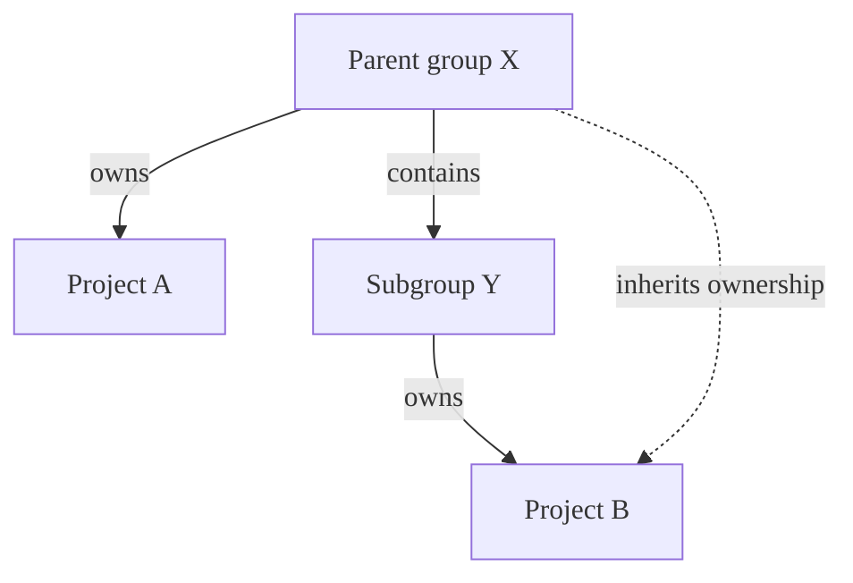
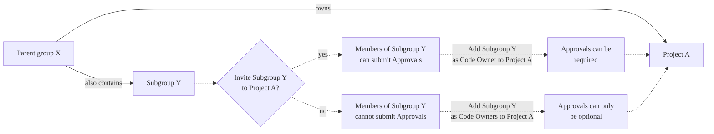

# Code Owners

DETAILS:
**Tier:** Premium, Ultimate
**Offering:** GitLab.com, Self-managed, GitLab Dedicated

Use the Code Owners feature to define who has expertise for specific parts of your project's codebase.
Define the owners of files and directories in a repository to:

- **Require owners to approve changes.** Combine protected branches with Code Owners to require
  experts to approve merge requests before they merge into a protected branch.
- **Identify owners.** Code Owner names are displayed on the files and directories they own:

  

Combine Code Owners with merge request
[approval rules](../merge_requests/approvals/rules.md) (either optional or required)
to build a flexible approval workflow:

- Use **Code Owners** to ensure quality. Define the users who have domain expertise
  for specific paths in your repository.
- Use **Approval rules** to define areas of expertise that don't correspond to specific
  file paths in your repository. Approval rules help guide merge request creators to
  the correct set of reviewers, such as frontend developers or a security team.

For example:

| Type | Name | Scope  | Comment    |
|------|------|--------|------------|
| Approval rule            | UX                   | All files     | A user experience (UX) team member reviews the user experience of all changes made in your project. |
| Approval rule            | Security             | All files     | A security team member reviews all changes for vulnerabilities. |
| Code Owner approval rule | Frontend: Code Style | `*.css` files | A frontend engineer reviews CSS file changes for adherence to project style standards. |
| Code Owner approval rule | Backend: Code Review | `*.rb` files  | A backend engineer reviews the logic and code style of Ruby files. |

<div class="video-fallback">
  Video introduction: <a href="https://www.youtube.com/watch?v=RoyBySTUSB0">Code Owners</a>.
</div>
<figure class="video-container">
  <iframe src="https://www.youtube-nocookie.com/embed/RoyBySTUSB0" frameborder="0" allowfullscreen> </iframe>
</figure>

## View Code Owners of a file or directory

To view the Code Owners of a file or directory:

1. On the left sidebar, select **Search or go to** and find your project.
1. Select **Code > Repository**.
1. Go to the file or directory you want to see the Code Owners for.
1. Optional. Select a branch or tag.

GitLab shows the Code Owners at the top of the page.

## Set up Code Owners

Prerequisites:

- You must be able to either push to the default branch or create a merge request.

1. Create a `CODEOWNERS` file in your [preferred location](#codeowners-file).
1. Define some rules in the file following the [Code Owners syntax reference](reference.md).
   Some suggestions:
   - Configure [All eligible approvers](../merge_requests/approvals/rules.md#code-owners-as-eligible-approvers) approval rule.
   - [Require Code Owner approval](../repository/branches/protected.md#require-code-owner-approval-on-a-protected-branch) on a protected branch.
1. Commit your changes, and push them up to GitLab.

### `CODEOWNERS` file

A `CODEOWNERS` file (with no extension) specifies the users or
[shared groups](../members/sharing_projects_groups.md) responsible for
specific files and directories in a repository.

Each repository uses a single `CODEOWNERS` file. GitLab checks these locations
in your repository in this order. The first `CODEOWNERS` file found is used, and
all others are ignored:

1. In the root directory: `./CODEOWNERS`.
1. In the `docs` directory: `./docs/CODEOWNERS`.
1. In the `.gitlab` directory: `./.gitlab/CODEOWNERS`.

For more information, see [Code Owners syntax and error handling](reference.md).

#### When user or group change names

When a user or group change their names, the `CODEOWNERS` isn't automatically updated with the new names.
To enter the new names, you must edit the file.

Organizations using SAML SSO can [set usernames](../../../integration/saml.md#set-a-username) to
prevent users from being able to change their usernames.

### Add a group as a Code Owner

To set the members of a group or subgroup as a Code Owner:

In the `CODEOWNERS` file, enter text that follows one of these patterns:

```plaintext
# All group members as Code Owners for a file
file.md @group-x

# All subgroup members as Code Owners for a file
file.md @group-x/subgroup-y

# All group and subgroup members as Code Owners for a file
file.md @group-x @group-x/subgroup-y
```

#### Group inheritance and eligibility



In this example:

- **Parent group X** (`group-x`) owns **Project A**.
- **Parent group X** also contains a subgroup, **Subgroup Y**. (`group-x/subgroup-y`)
- **Subgroup Y** owns **Project B**.

The eligible Code Owners are:

- **Project A**: the members of **Group X** only, because **Project A** doesn't belong to **Subgroup Y**.
- **Project B**: the members of both **Group X** and **Subgroup Y**.

##### Inviting subgroups to projects in parent groups

You can [invite](../members/sharing_projects_groups.md) **Subgroup Y** to **Project A**
so that their members also become eligible Code Owners.



If you do not invite **Subgroup Y** to **Project A**, but make them Code Owners, their approval
of the merge request becomes optional.

##### Inviting subgroups to parent groups

Inviting **Subgroup Y** to a parent group of **Project A**
[is not supported](https://gitlab.com/gitlab-org/gitlab/-/issues/288851). To set **Subgroup Y** as
Code Owners, [invite this group directly to the project](#inviting-subgroups-to-projects-in-parent-groups) itself.

NOTE:
For approval to be required, groups as Code Owners must have a direct membership
(not inherited membership) in the project. Approval can only be optional for groups
that inherit membership. Members in the Code Owners group also must be direct members,
and not inherit membership from any parent groups.

### Define more specific owners for more specifically defined files or directories

When a file or directory matches multiple entries in the `CODEOWNERS` file,
the users from last pattern matching the file or directory are used. This enables you
to define more specific owners for more specifically defined files or directories, when
you order the entries in a sensible way.

For example, in the following `CODEOWNERS` file:

```plaintext
# This line would match the file terms.md
*.md @doc-team

# This line would also match the file terms.md
terms.md @legal-team
```

The Code Owner for `terms.md` would be `@legal-team`.

### Organize Code Owners by putting them into sections

In a Code Owners file, _sections_ are named areas of the file that are analyzed separately,
and always enforced. Until you define a section, GitLab treats your entire Code Owners file
as a single section. Adding more sections
[changes how GitLab evaluates your Code Owners file](#use-regular-entries-and-sections-together):

- GitLab treats [entries without sections](#use-regular-entries-and-sections-together), including rules defined
  before the first section header, as if they were another, unnamed section.
- Each section enforces its rules separately.
- Only one CODEOWNERS pattern per section is matched to a file path.
- In a section, GitLab uses the _last_ pattern matching the file or directory for each section.

For example, in a `CODEOWNERS` file using sections, let's look at the ownership of a `README` file:

```plaintext
* @admin

[README Owners]
README.md @user1 @user2
internal/README.md @user4

[README other owners]
README.md @user3
```

- The Code Owners for the `README.md` in the _root_ directory are:
  - `@admin`, from the unnamed section.
  - `@user1` and `@user2`, from `[README Owners]`.
  - `@user3`, from `[README other owners]`.
- The Code Owners for `internal/README.md` are:
  - `@admin`, from the unnamed section.
  - `@user4`, from the last entry in `[README Owners]`.
  - `@user3` from `[README other owners]`. (Both lines in `[README Owners]` match this file's name,
    but only the last line in the section is kept.)

To add a section to the `CODEOWNERS` file, enter a section name in square brackets,
followed by the files or directories, and users, groups, or subgroups:

```plaintext
[README Owners]
README.md @user1 @user2
internal/README.md @user2
```

Each Code Owner in the merge request widget is listed under a label.
The following image shows **Groups** and **Documentation** sections:


#### Set default owner for a section

> - [Introduced](https://gitlab.com/gitlab-org/gitlab/-/issues/371711) in GitLab 15.11 [with a flag](../../../administration/feature_flags.md) named `codeowners_default_owners`. Disabled by default.
> - [Generally available](https://gitlab.com/gitlab-org/gitlab/-/merge_requests/115888) in GitLab 15.11. Feature flag `codeowners_default_owners` removed.

If multiple file paths inside a section share the same ownership, define default
Code Owners for the section.
All paths in that section inherit this default, unless you override the section
default on a specific line.

Default owners are applied when specific owners are not specified for file paths.
Specific owners defined beside the file path override default owners.

For example:

```plaintext
[Documentation] @docs-team
docs/
README.md

[Database] @database-team @agarcia
model/db/
config/db/database-setup.md @docs-team
```

In this example:

- `@docs-team` owns all items in the `Documentation` section.
- `@database-team` and `@agarcia` own all items in the `Database` section except
  `config/db/database-setup.md`, which has an override assigning it to `@docs-team`.

Compare this behavior to when you use [regular entries and sections together](#use-regular-entries-and-sections-together),
when entries in sections don't override entries without sections.

#### Use default owners and optional sections together

To combine the syntax for default owners with [optional sections](#make-a-code-owners-section-optional)
and required approvals, place default owners at the end:

```plaintext
[Documentation][2] @docs-team
docs/
README.md

^[Database] @database-team
model/db/
config/db/database-setup.md @docs-team
```

#### Use regular entries and sections together

If you set a default Code Owner for a path **outside a section**, their approval is always required.
Such entries aren't overridden by sections.
Entries without sections are treated as if they were another, unnamed section:

```plaintext
# Required for all files
* @general-approvers

[Documentation] @docs-team
docs/
README.md
*.txt

[Database] @database-team
model/db/
config/db/database-setup.md @docs-team
```

In this example:

- `@general-approvers` owns all items everywhere, without overrides.
- `@docs-team` owns all items in the `Documentation` section.
- `@database-team` owns all items in the `Database` section except
  `config/db/database-setup.md`, which has an override assigning it to `@docs-team`.
- A merge request that modifies `model/db/CHANGELOG.txt` would require three approvals: one from each
  of the `@general-approvers`,`@docs-team`, and `@database-team` groups.

Compare this behavior to when you use only [default owners for sections](#set-default-owner-for-a-section),
when specific entries in a section override the section default.

#### Sections with duplicate names

If multiple sections have the same name, they are combined.
Also, section headings are not case-sensitive. For example:

```plaintext
[Documentation]
ee/docs/    @docs
docs/       @docs

[Database]
README.md  @database
model/db/   @database

[DOCUMENTATION]
README.md  @docs
```

This code results in three entries under the **Documentation** section header, and two
entries under **Database**. The entries defined under the sections **Documentation** and
**DOCUMENTATION** are combined, using the case of the first section.

#### Make a Code Owners section optional

You can designate optional sections in your Code Owners file.
Optional sections enable you to designate responsible parties for various parts
of your codebase, but not require approval from them. This approach provides
a more relaxed policy for parts of your project that are frequently updated,
but don't require stringent reviews.

To treat the entire section as optional, prepend the section name with the caret `^` character.

In this example, the `[Go]` section is optional:

```plaintext
[Documentation]
*.md @root

[Ruby]
*.rb @root

^[Go]
*.go @root
```

The optional Code Owners section displays in merge requests under the description:


If a section is duplicated in the file, and one of them is marked as optional and the other isn't, the section is required.

Optional sections in the `CODEOWNERS` file are treated as optional only
when changes are submitted by using merge requests. If a change is submitted directly
to the protected branch, approval from Code Owners is still required, even if the
section is marked as optional.

### Require multiple approvals from Code Owners

> - [Introduced](https://gitlab.com/gitlab-org/gitlab/-/issues/335451) in GitLab 15.9.

You can require multiple approvals for the Code Owners sections in the Approvals area in merge requests.
Append the section name with a number `n` in brackets, for example, `[2]` or `[3]`.
This requires `n` approvals from the Code Owners in this section.
Valid entries for `n` are integers `≥ 1`. `[1]` is optional because it is the default. Invalid values for `n` are treated as `1`.

WARNING:
[Issue 384881](https://gitlab.com/gitlab-org/gitlab/-/issues/385881) proposes changes
to the behavior of this setting. Do not intentionally set invalid values. They may
become valid in the future and cause unexpected behavior.

To require multiple approvals from Code Owners:

1. On the left sidebar, select **Search or go to** and find your project.
1. Select **Settings > Repository**.
1. Expand **Protected branches**.
1. Next to the default branch, turn on the toggle under **Code owner approval**.
1. Edit the `CODEOWNERS` file to add a rule for multiple approvals.

For example, to require two approvals for the `[Documentation]` section:

```plaintext
[Documentation][2]
*.md @tech-writer-team

[Ruby]
*.rb @dev-team
```

The `Documentation` Code Owners section in the Approvals area displays two approvals are required:


### Allowed to push

Users who are **Allowed to push** can choose to create a merge request
for their changes, or push the changes directly to a branch. If the user
skips the merge request process, the protected branch features
and Code Owner approvals built into merge requests are also skipped.

This permission is often granted to accounts associated with
automation ([internal users](../../../development/internal_users.md))
and release tooling.

All changes from users _without_ the **Allowed to push** permission must be routed through a merge request.

## Related topics

- [Syntax reference](reference.md)
- [Development guidelines](../../../development/code_owners/index.md)
