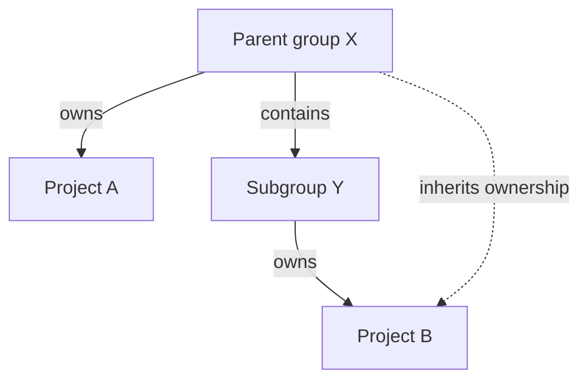
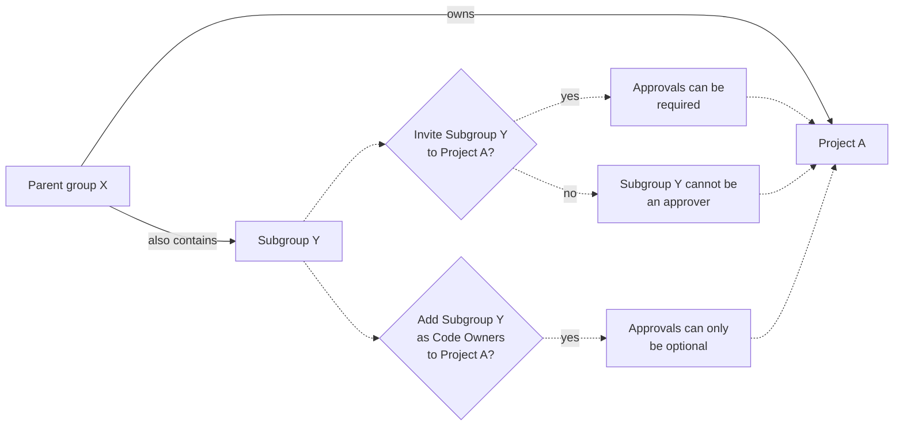

# Code Owners **(PREMIUM)**

> Moved to GitLab Premium in 13.9.

Use the Code Owners feature to define who has expertise for specific parts of your project's codebase.
Define the owners of files and directories in a repository to:

- **Require owners to approve changes.** Combine protected branches with Code Owners to require
  experts to approve merge requests before they merge into a protected branch.
- **Identify owners.** Code Owner names are displayed on the files and directories they own:
  

Use Code Owners in combination with merge request
[approval rules](../merge_requests/approvals/rules.md) (either optional or required)
to build a flexible approval workflow:

- Use **Code Owners** to ensure quality. Define the users who have domain expertise
  for specific paths in your repository.
- Use **Approval rules** to define areas of expertise that don't correspond to specific
  file paths in your repository. Approval rules help guide merge request creators to
  the correct set of reviewers, such as frontend developers or a security team.

For example:

| Type | Name | Scope  | Comment    |
|------|------|--------|------------|
| Approval rule            | UX                   | All files     | A user experience (UX) team member reviews the user experience of all changes made in your project.
| Approval rule            | Security             | All files     | A security team member reviews all changes for vulnerabilities.
| Code Owner approval rule | Frontend: Code Style | `*.css` files | A frontend engineer reviews CSS file changes for adherence to project style standards.
| Code Owner approval rule | Backend: Code Review | `*.rb` files  | A backend engineer reviews the logic and code style of Ruby files.

<div class="video-fallback">
  Video introduction: <a href="https://www.youtube.com/watch?v=RoyBySTUSB0">Code Owners</a>.
</div>
<figure class="video-container">
  <iframe src="https://www.youtube-nocookie.com/embed/RoyBySTUSB0" frameborder="0" allowfullscreen> </iframe>
</figure>

<i class="fa fa-youtube-play youtube" aria-hidden="true"></i>

## View Code Owners of a file or directory

To view the Code Owners of a file or directory:

1. On the top bar, select **Main menu > Projects** and find your project.
1. On the left sidebar, select **Repository > Files**.
1. Go to the file or directory you want to see the Code Owners for.
1. Optional. Select a branch or tag.

GitLab shows the Code Owners at the top of the page.

## Set up Code Owners

1. Create a `CODEOWNERS` file in your [preferred location](#code-owners-file).
1. Define some rules in the file following the [Code Owners syntax reference](#code-owners-syntax-reference).
   Some suggestions:
   - Configure [All eligible approvers](../merge_requests/approvals/rules.md#code-owners-as-eligible-approvers) approval rule.
   - [Require Code Owner approval](../protected_branches.md#require-code-owner-approval-on-a-protected-branch) on a protected branch.
1. Commit your changes, and push them up to GitLab.

### Code Owners file

A `CODEOWNERS` file (with no extension) specifies the users or
[shared groups](../members/share_project_with_groups.md) responsible for
specific files and directories in a repository.

Each repository uses a single `CODEOWNERS` file. GitLab checks these locations
in your repository in this order. The first `CODEOWNERS` file found is used, and
all others are ignored:

1. In the root directory: `./CODEOWNERS`.
1. In the `docs` directory: `./docs/CODEOWNERS`.
1. In the `.gitlab` directory: `./.gitlab/CODEOWNERS`.

### Groups as Code Owners

> Group and subgroup hierarchy support was [introduced](https://gitlab.com/gitlab-org/gitlab/-/issues/32432) in GitLab 13.0.

You can use members of groups and subgroups as Code Owners for projects:



In this example:

- **Parent group X** (`group-x`) owns **Project A**.
- **Parent group X** also contains a subgroup, **Subgroup Y**. (`group-x/subgroup-y`)
- **Subgroup Y** owns **Project B**.

The eligible Code Owners are:

- **Project A**: the members of **Group X** only, because **Project A** doesn't belong to **Subgroup Y**.
- **Project B**: the members of both **Group X** and **Subgroup Y**.

You can [invite](../members/share_project_with_groups.md) **Subgroup Y** to **Project A**
so that their members also become eligible Code Owners.



If you do not invite **Subgroup Y** to **Project A**, but make them Code Owners, their approval
of the merge request becomes optional.

Inviting **Subgroup Y** to a parent group of **Project A**
[is not supported](https://gitlab.com/gitlab-org/gitlab/-/issues/288851). To set **Subgroup Y** as
Code Owners, add this group directly to the project itself.

NOTE:
For approval to be required, groups as Code Owners must have a direct membership
(not inherited membership) in the project. Approval can only be optional for groups
that inherit membership. Members in the Code Owners group also must be direct members,
and not inherit membership from any parent groups.

#### Add a group as a Code Owner

To set a group as a Code Owner:

In the `CODEOWNERS` file, enter text that follows one of these patterns:

```plaintext
# All group members as Code Owners for a file
file.md @group-x

# All subgroup members as Code Owners for a file
file.md @group-x/subgroup-y

# All group and subgroup members as Code Owners for a file
file.md @group-x @group-x/subgroup-y
```

### Define more specific owners for more specifically defined files or directories

When a file or directory matches multiple entries in the `CODEOWNERS` file,
the users from last pattern matching the file or directory are used. This enables you
to define more specific owners for more specifically defined files or directories, when
you order the entries in a sensible way.

For example, in the following `CODEOWNERS` file:

```plaintext
# This line would match the file terms.md
*.md @doc-team

# This line would also match the file terms.md
terms.md @legal-team
```

The Code Owner for `terms.md` would be `@legal-team`.

If you use sections, the last pattern matching the file or directory for each section is used.
For example, in a `CODEOWNERS` file using sections:

```plaintext
[README Owners]
README.md @user1 @user2
internal/README.md @user4

[README other owners]
README.md @user3
```

The Code Owners for the `README.md` in the root directory are `@user1`, `@user2`,
and `@user3`. The Code Owners for `internal/README.md` are `@user4` and `@user3`.

Only one CODEOWNERS pattern per section is matched to a file path.

### Organize Code Owners by putting them into sections

> - [Introduced](https://gitlab.com/gitlab-org/gitlab/-/issues/12137) in GitLab 13.2 [with a flag](../../../administration/feature_flags.md) named `sectional_codeowners`. Disabled by default.
> - [Generally available](https://gitlab.com/gitlab-org/gitlab/-/merge_requests/42389) in GitLab 13.4. Feature flag `sectional_codeowners` removed.

You can organize Code Owners by putting them into named sections.

You can use sections for shared directories, so that multiple
teams can be reviewers.

To add a section to the `CODEOWNERS` file, enter a section name in brackets,
followed by the files or directories, and users, groups, or subgroups:

```plaintext
[README Owners]
README.md @user1 @user2
internal/README.md @user2
```

Each Code Owner in the merge request widget is listed under a label.
The following image shows a **Groups** and **Documentation** section:


#### Set default owner for a section

> - [Introduced](https://gitlab.com/gitlab-org/gitlab/-/issues/371711) in GitLab 15.11 [with a flag](../../../administration/feature_flags.md) named `codeowners_default_owners`. Disabled by default.
> - [Generally available](https://gitlab.com/gitlab-org/gitlab/-/merge_requests/115888) in GitLab 15.11. Feature flag `codeowners_default_owners` removed.

If multiple file paths inside a section share the same ownership, define a default
Code Owner for the section. All paths in that section inherit this default, unless
you override the section default on a specific line.

Default owners are applied when specific owners are not specified for file paths.
Specific owners defined beside the file path override default owners:

```plaintext
[Documentation] @docs-team
docs/
README.md

[Database] @database-team
model/db/
config/db/database-setup.md @docs-team
```

In this example:

- `@docs-team` owns all items in the `Documentation` section.
- `@database-team` owns all items in the `Database` section except
  `config/db/database-setup.md`, which has an override assigning it to `@docs-team`.

To combine the syntax for default owners with [optional sections](#make-a-code-owners-section-optional)
and required approvals, place default owners at the end:

```plaintext
[Documentation][2] @docs-team
docs/
README.md

^[Database] @database-team
model/db/
config/db/database-setup.md @docs-team
```

#### Sections with duplicate names

If multiple sections have the same name, they are combined.
Also, section headings are not case-sensitive. For example:

```plaintext
[Documentation]
ee/docs/    @docs
docs/       @docs

[Database]
README.md  @database
model/db/   @database

[DOCUMENTATION]
README.md  @docs
```

This code results in three entries under the **Documentation** section header, and two
entries under **Database**. The entries defined under the sections **Documentation** and
**DOCUMENTATION** are combined, using the case of the first section.

#### Make a Code Owners section optional

> [Introduced](https://gitlab.com/gitlab-org/gitlab/-/issues/232995) in GitLab 13.8.

You can designate optional sections in your Code Owners file. Prepend the
section name with the caret `^` character to treat the entire section as optional.
Optional sections enable you to designate responsible parties for various parts
of your codebase, but not require approval from them. This approach provides
a more relaxed policy for parts of your project that are frequently updated,
but don't require stringent reviews.

In this example, the `[Go]` section is optional:

```plaintext
[Documentation]
*.md @root

[Ruby]
*.rb @root

^[Go]
*.go @root
```

The optional Code Owners section displays in merge requests under the **Approval Rules** area:


If a section is duplicated in the file, and one of them is marked as optional and the other isn't, the section is required.

Optional sections in the `CODEOWNERS` file are treated as optional only
when changes are submitted by using merge requests. If a change is submitted directly
to the protected branch, approval from Code Owners is still required, even if the
section is marked as optional.

### Require multiple approvals from Code Owners

> [Introduced](https://gitlab.com/gitlab-org/gitlab/-/issues/335451) in GitLab 15.9.

You can require multiple approvals for the Code Owners sections under the Approval Rules area in merge requests.
Append the section name with a number `n` in brackets. This requires `n` approvals from the Code Owners in this section.
Please note valid entries for `n` are integers `≥ 1`. `[1]` is optional as it is the default. Invalid values for `n` are treated as `1`.

WARNING:
[Issue #384881](https://gitlab.com/gitlab-org/gitlab/-/issues/385881) proposes changes
to the behavior of this setting. Do not intentionally set invalid values. They may
become valid in the future, and cause unexpected behavior.

Please confirm you enabled `Require approval from code owners` in `Settings > Repository > Protected branches`, otherwise the Code Owner approvals will be optional.

In this example, the `[Documentation]` section requires 2 approvals:

```plaintext
[Documentation][2]
*.md @tech-writer-team

[Ruby]
*.rb @dev-team
```

The `Documentation` Code Owners section under the **Approval Rules** area displays 2 approvals are required:


### Allowed to Push

The Code Owner approval and protected branch features do not apply to users who
are **Allowed to push**.

## Error handling in Code Owners

### Entries with spaces

Paths containing whitespace must be escaped with backslashes: `path\ with\ spaces/*.md`.
Without the backslashes, the path after the first whitespace is parsed as an owner.
GitLab the parses `folder with spaces/*.md @group` into
`path: "folder", owners: " with spaces/*.md @group"`.

### Unparsable sections

If a section heading cannot be parsed, the section is:

1. Parsed as an entry.
1. Added to the previous section.
1. If no previous section exists, the section is added to the default section.

For example, this file is missing a square closing bracket:

```plaintext
* @group

[Section name
docs/ @docs_group
```

GitLab recognizes the heading `[Section name` as an entry. The default section includes 3 rules:

- Default section
  - `*` owned by `@group`
  - `[Section` owned by `name`
  - `docs/` owned by `@docs_group`

This file contains an unescaped space between the words `Section` and `name`.
GitLab recognizes the intended heading as an entry:

```plaintext
[Docs]
docs/**/* @group

[Section name]{2} @group
docs/ @docs_group
```

The `[Docs]` section then includes 3 rules:

- `docs/**/*` owned by `@group`
- `[Section` owned by `name]{2} @group`
- `docs/` owned by `@docs_group`

### Malformed owners

Each entry must contain 1 or more owners to be valid, malformed owners are ignored.
For example `/path/* @group user_without_at_symbol @user_with_at_symbol`
is owned by `@group` and `@user_with_at_symbol`.

### Inaccessible or incorrect owners

Inaccessible or incorrect owners are ignored. For example, if `@group`, `@username`,
and `example@gitlab.com` are accessible on the project and we create an entry:

```plaintext
* @group @grou @username @i_left @i_dont_exist example@gitlab.com invalid@gitlab.com
```

GitLab ignores `@grou`, `@i_left`, `@i_dont_exist`, and `invalid@gitlab.com`.

For more information on who is accessible, see [Groups as Code Owners](#groups-as-code-owners).

### Zero owners

If an entry includes no owners, or zero [accessible owners](#inaccessible-or-incorrect-owners)
exist, the entry is invalid. Because this rule can never be satisfied, GitLab
auto-approves it in merge requests.

NOTE:
When a protected branch has `Require code owner approval` enabled, rules with
zero owners are still honored.

### Less than 1 required approval

When [defining the number of approvals](#require-multiple-approvals-from-code-owners) for a section,
the minimum number of approvals is `1`. Setting the number of approvals to
`0` results in GitLab requiring one approval.

## Example `CODEOWNERS` file

```plaintext
# This is an example of a CODEOWNERS file.
# Lines that start with `#` are ignored.

# app/ @commented-rule

# Specify a default Code Owner by using a wildcard:
* @default-codeowner

# Specify multiple Code Owners by using a tab or space:
* @multiple @code @owners

# Rules defined later in the file take precedence over the rules
# defined before.
# For example, for all files with a filename ending in `.rb`:
*.rb @ruby-owner

# Files with a `#` can still be accessed by escaping the pound sign:
\#file_with_pound.rb @owner-file-with-pound

# Specify multiple Code Owners separated by spaces or tabs.
# In the following case the CODEOWNERS file from the root of the repo
# has 3 Code Owners (@multiple @code @owners):
CODEOWNERS @multiple @code @owners

# You can use both usernames or email addresses to match
# users. Everything else is ignored. For example, this code
# specifies the `@legal` and a user with email `janedoe@gitlab.com` as the
# owner for the LICENSE file:
LICENSE @legal this_does_not_match janedoe@gitlab.com

# Use group names to match groups, and nested groups to specify
# them as owners for a file:
README @group @group/with-nested/subgroup

# End a path in a `/` to specify the Code Owners for every file
# nested in that directory, on any level:
/docs/ @all-docs

# End a path in `/*` to specify Code Owners for every file in
# a directory, but not nested deeper. This code matches
# `docs/index.md` but not `docs/projects/index.md`:
/docs/* @root-docs

# Include `/**` to specify Code Owners for all subdirectories
# in a directory. This rule matches `docs/projects/index.md` or
# `docs/development/index.md`
/docs/**/*.md @root-docs

# This code makes matches a `lib` directory nested anywhere in the repository:
lib/ @lib-owner

# This code match only a `config` directory in the root of the repository:
/config/ @config-owner

# If the path contains spaces, escape them like this:
path\ with\ spaces/ @space-owner

# Code Owners section:
[Documentation]
ee/docs    @docs
docs       @docs

# Use of default owners for a section. In this case, all files (*) are owned by
the dev team except the README.md and data-models which are owned by other teams.
[Development] @dev-team
*
README.md @docs-team
data-models/ @data-science-team

# This section is combined with the previously defined [Documentation] section:
[DOCUMENTATION]
README.md  @docs
```

## Code Owners syntax reference

### Comments

Lines beginning with `#` are ignored:

```codeowners
# This is a comment
```

### Sections

Sections are groups of entries. A section begins with a section heading in square brackets, followed by the entries.

```codeowners
[Section name]
/path/of/protected/file.rb @username
/path/of/protected/dir/ @group
```

### Section headings

Section headings must always have a name. They can also be made optional, or require a number of approvals. A list of default owners can be added to the section heading line.

```codeowners
# Required section
[Section name]

# Optional section
^[Section name]

# Section requiring 5 approvals
[Section name][5]

# Section with @username as default owner
[Section name] @username

# Section with @group and @subgroup as default owners and requiring 2 approvals
[Section name][2] @group @subgroup
```

### Section names

Sections names are defined between square brackets.
Section names are not case-sensitive. [Sections with duplicate names are combined](#sections-with-duplicate-names).

```codeowners
[Section name]
```

### Required sections

Required sections do not include `^` before the [section name](#section-names).

```codeowners
[Required section]
```

### Optional sections

Optional sections include a `^` before the [section name](#section-names).

```codeowners
^[Optional section]
```

### Sections requiring multiple approvals

Sections requiring multiple approvals include the number of approvals in square brackets after the [section name](#section-names).

```codeowners
[Section requiring 5 approvals][5]
```

NOTE:
Optional sections ignore the number of approvals required.

### Sections with default owners

You can define a default owner for the entries in a section by appending the owners to the [section heading](#section-headings).

```codeowners
# Section with @username as default owner
[Section name] @username

# Section with @group and @subgroup as default owners and requiring 2 approvals
[Section name][2] @group @subgroup
```

### Code Owner entries

Each Code Owner entry includes a path followed by one or more owners.

```codeowners
README.md @username1
```

NOTE:
If an entry is duplicated in a section, [the last entry is used from each section.](#define-more-specific-owners-for-more-specifically-defined-files-or-directories)

### Relative paths

If a path does not start with a `/`, the path is treated as if it starts with a [globstar](#globstar-paths).
`README.md` is treated the same way as `/**/README.md`

```codeowners
# This will match /README.md, /internal/README.md, /app/lib/README.md
README.md @username

# This will match /internal/README.md, /docs/internal/README.md, /docs/api/internal/README.md
internal/README.md
```

### Absolute paths

If a path starts with a `/` it matches the root of the repository.

```codeowners
# Matches only the file named `README.md` in the root of the repository.
/README.md

# Matches only the file named `README.md` inside the `/docs` directory.
/docs/README.md
```

### Directory paths

If a path ends with `/`, the path matches any file in the directory.

```codeowners
# This is the same as `/docs/**/*`
/docs/
```

### Wildcard paths

Wildcards can be used to match one of more characters of a path.

```codeowners
# Any markdown files in the docs directory
/docs/*.md @username

# /docs/index file of any filetype
# For example: /docs/index.md, /docs/index.html, /docs/index.xml
/docs/index.* @username

# Any file in the docs directory with 'spec' in the name.
# For example: /docs/qa_specs.rb, /docs/spec_helpers.rb, /docs/runtime.spec
/docs/*spec* @username

# README.md files one level deep within the docs directory
# For example: /docs/api/README.md
/docs/*/README.md @username
```

### Globstar paths

Globstars (`**`) can be used to match zero or more directories and subdirectories.

```codeowners
# This will match /docs/index.md, /docs/api/index.md, /docs/api/graphql/index.md
/docs/**/index.md
```

### Entry owners

Entries must be followed by one or more owner, these can be groups, subgroups,
and users. Order of owners is not important.

```codeowners
/path/to/entry.rb @group
/path/to/entry.rb @group/subgroup
/path/to/entry.rb @user
/path/to/entry.rb @group @group/subgroup @user
```

### Groups as entry owners

Groups and subgroups can be owners of an entry.
Each entry can be owned by [one or more owners](#entry-owners).
For more details see the [Groups as Code Owners section](#groups-as-code-owners).

```codeowners
/path/to/entry.rb @group
/path/to/entry.rb @group/subgroup
/path/to/entry.rb @group @group/subgroup
```

### Users as entry owners

Users can be owners of an entry. Each entry can be owned by [one or more owners](#entry-owners).

```codeowners
/path/to/entry.rb @username1
/path/to/entry.rb @username1 @username2
```

## Technical Resources

[Code Owners development guidelines](../../../development/code_owners/index.md)

## Troubleshooting

### Approvals shown as optional

A Code Owner approval rule is optional if any of these conditions are true:

- The user or group are not a member of the project. Code Owners [cannot inherit from parent groups](https://gitlab.com/gitlab-org/gitlab/-/issues/288851/).
- [Code Owner approval on a protected branch](../protected_branches.md#require-code-owner-approval-on-a-protected-branch) has not been set up.
- The section is [marked as optional](#make-a-code-owners-section-optional).

### Approvals do not show

Code Owner approval rules only update when the merge request is created.
If you update the `CODEOWNERS` file, close the merge request and create a new one.

### User not shown as possible approver

A user might not show as an approver on the Code Owner merge request approval rules
if any of these conditions are true:

- A rule prevents the specific user from approving the merge request.
  Check the project [merge request approval](../merge_requests/approvals/settings.md#edit-merge-request-approval-settings) settings.
- A Code Owner group has a visibility of **private**, and the current user is not a
  member of the Code Owner group.
- Current user is an external user who does not have permission to the internal Code Owner group.

### Approval rule is invalid. GitLab has approved this rule automatically to unblock the merge request

This message may appear if an approval rule uses a Code Owner that is not a direct member of the project.
Check that the group or user has been invited to the project.
