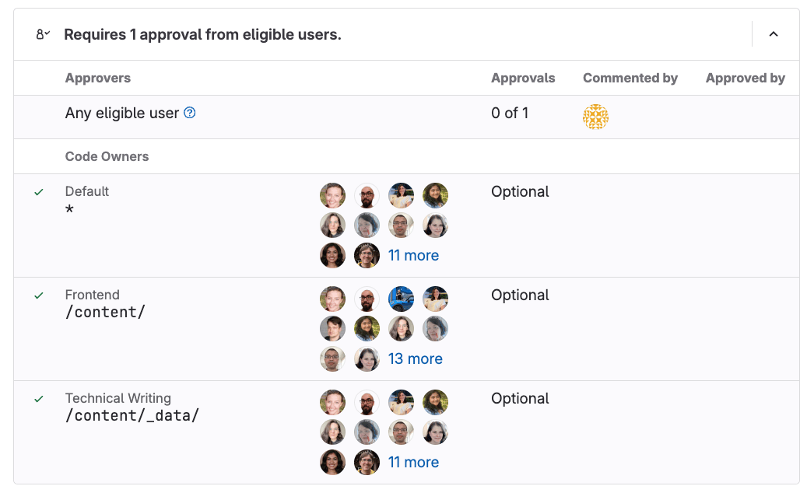

# `CODEOWNERS` syntax

DETAILS:
**Tier:** Premium, Ultimate
**Offering:** GitLab.com, Self-managed, GitLab Dedicated

The `CODEOWNERS` file uses a syntax to define ownership rules.
Each line in the file represents a rule, and specifies a file path pattern and one or more owners.
The key elements are:

- **File paths**: Specific files, directories, or wildcards.
- **Code Owners**: Use `@mentions` for users, groups, or roles.
- **Comments**: Lines starting with `#` are ignored.
- **Sections**: Optional groupings of rules, defined using `[Section name]`.

NOTE:
If an entry is duplicated in a section, [the last entry is used.](advanced.md#define-code-owners-for-specific-files-or-directories). Rules defined later in the file take precedence over earlier rules.

Here are some examples:

```plaintext
# Specify a default Code Owner for all files with a wildcard:
* @default-owner

# Specify multiple Code Owners to a specific file:
README.md @doc-team @tech-lead

# Specify a Code Owner to all files with a specific extension:
*.rb @ruby-owner

# Specify Code Owners with usernames or email addresses:
LICENSE @legal janedoe@gitlab.com

# Use group names to match groups and nested groups:
README @group @group/with-nested/subgroup

# Specify a Code Owner to a directory and all its contents:
/docs/ @all-docs
/docs/* @root-docs
/docs/**/*.md @root-docs

# Use a section to group related rules:
[Documentation]
ee/docs    @docs
docs       @docs

# Assign a role as a Code Owner:
/config/ @@maintainer
```

## Sections

In a `CODEOWNERS` file, sections are named areas that are analyzed separately,
and always enforced. Until you define a section, GitLab treats your entire `CODEOWNERS` file
as a single section.
Adding more sections changes how GitLab evaluates the file:

- GitLab treats [entries without sections](advanced.md#regular-entries-and-sections), including rules defined
  before the first section header, as if they were another, unnamed section.
- Each section enforces its rules separately.
- Only one Code Owner pattern per section is matched to a file path.
- Rules defined later in the file take precedence over earlier rules.

For example, in a `CODEOWNERS` file with sections that define the Code Owners of a `README` file:

```plaintext
* @admin

[README Owners]
README.md @user1 @user2
internal/README.md @user4

[README other owners]
README.md @user3
```

- The Code Owners for the `README.md` in the _root_ directory are:
  - `@admin`, from the unnamed section.
  - `@user1` and `@user2`, from `[README Owners]`.
  - `@user3`, from `[README other owners]`.
- The Code Owners for `internal/README.md` are:
  - `@admin`, from the unnamed section.
  - `@user4`, from the last entry in `[README Owners]`.
  - `@user3` from `[README other owners]`. (Both lines in `[README Owners]` match this file's name,
    but only the last line in the section is kept.)

To add a section to the `CODEOWNERS` file, enter a section name in square brackets,
followed by the files or directories, and users, groups, or subgroups:

```plaintext
[README Owners]
README.md @user1 @user2
internal/README.md @user2
```

Each Code Owner in the merge request widget is listed under a label.
The following image shows **Default**, **Frontend**, and **Technical Writing** sections:



For more section configuration options, see:

- [Default Code Owners and optional sections](advanced.md#default-code-owners-and-optional-sections)
- [Regular entries and sections](advanced.md#regular-entries-and-sections)
- [Sections with duplicate names](advanced.md#sections-with-duplicate-names)

### Section headings and names

Section headings must have a name.
Section names are case-insensitive, and [sections with duplicate names](advanced.md#sections-with-duplicate-names) are combined.
For protected branches only, they can:

- Require approval (default).
- Be optional (prefixed with `^`).
- Require a specific number of approvals. For more information, see [Group inheritance and eligibility](advanced.md#group-inheritance-and-eligibility) and [Approvals shown as optional](troubleshooting.md#approvals-shown-as-optional).
- Include default owners.

Examples:

```plaintext
# Required section
[Section name]

# Optional section
^[Section name]

# Section requiring 5 approvals
[Section name][5]

# Section with @username as default owner
[Section name] @username

# Section with @group and @subgroup as default owners and requiring 2 approvals
[Section name][2] @group @subgroup
```

### Set default Code Owner for a section

> - [Introduced](https://gitlab.com/gitlab-org/gitlab/-/issues/371711) in GitLab 15.11 [with a flag](../../../administration/feature_flags.md) named `codeowners_default_owners`. Disabled by default.
> - [Generally available](https://gitlab.com/gitlab-org/gitlab/-/merge_requests/115888) in GitLab 15.11. Feature flag `codeowners_default_owners` removed.

If multiple file paths inside a section share the same ownership, define default
Code Owners for the section.
All paths in that section inherit this default, unless you override the section
default on a specific line.

Default owners are applied when specific owners are not specified for file paths.
Specific owners defined beside the file path override default owners.

For example:

```plaintext
[Documentation] @docs-team
docs/
README.md

[Database] @database-team @agarcia
model/db/
config/db/database-setup.md @docs-team
```

In this example:

- `@docs-team` owns all items in the `Documentation` section.
- `@database-team` and `@agarcia` own all items in the `Database` section except
  `config/db/database-setup.md`, which has an override assigning it to `@docs-team`.

Compare this behavior to when you use [regular entries and sections together](advanced.md#regular-entries-and-sections),
when entries in sections don't override entries without sections.

### Optional sections

You can designate optional sections in your Code Owners file.
Optional sections enable you to designate responsible parties for various parts
of your codebase, but not require approval from them. This approach provides
a more relaxed policy for parts of your project that are frequently updated,
but don't require stringent reviews.

To treat the entire section as optional, prepend the section name with the caret `^` character.

In this example, the `[Go]` section is optional:

```plaintext
[Documentation]
*.md @root

[Ruby]
*.rb @root

^[Go]
*.go @root
```

The optional Code Owners section displays in merge requests under the description:


If a section is duplicated in the file, and one of them is marked as optional and the other isn't, the section is required.

Optional sections in the `CODEOWNERS` file are treated as optional only
when changes are submitted by using merge requests. If a change is submitted directly
to the protected branch, approval from Code Owners is still required, even if the
section is marked as optional.

## Add a role as a Code Owner

> - [Introduced](https://gitlab.com/gitlab-org/gitlab/-/issues/282438) in GitLab 17.7 [with a flag](../../../administration/feature_flags.md) named `codeowner_role_approvers`.
> - [Enabled on GitLab.com](https://gitlab.com/gitlab-org/gitlab/-/issues/497504) in GitLab 17.8.

FLAG:
The availability of this feature is controlled by a feature flag.
For more information, see the history.

You can add or set a role for direct project members as Code Owners:

- Use the `@@` prefix to set a role.
- Only Developer, Maintainer, and Owner roles are available.
- Roles are not inclusive of higher roles. For example, specifying `@@developer`
  does not include users with Maintainer or Owner roles.
- Only direct project members with the specified roles are eligible Code Owners.
- It is possible to specify plural roles. For example, `@@developers` is accepted.

The following example sets all direct project members with the Developer or Maintainer
role as Code Owners for `file.md`:

1. Open the `CODEOWNERS` file.
1. Add a line using the following pattern:

   ```plaintext
   file.md @@developer @@maintainer
   ```

1. Save the file.
1. Commit and merge the changes.

## Add a group as a Code Owner

To set the members of a group or subgroup as a Code Owner:

In the `CODEOWNERS` file, enter text that follows one of these patterns:

```plaintext
# All group members as Code Owners for a file
file.md @group-x

# All subgroup members as Code Owners for a file
file.md @group-x/subgroup-y

# All group and subgroup members as Code Owners for a file
file.md @group-x @group-x/subgroup-y
```

NOTE:
When [Global SAML group memberships lock](../../group/saml_sso/group_sync.md#global-saml-group-memberships-lock) is enabled, you cannot set a group or subgroup as a Code Owner. For more information, see [Incompatibility with Global SAML group memberships lock](troubleshooting.md#incompatibility-with-global-saml-group-memberships-lock).

If you encounter issues, refer to [User not shown as possible approver](troubleshooting.md#user-not-shown-as-possible-approver).

## Path matching

Paths can be absolute, relative, directory, wildcard, or globstar,
and are matched against the repository root.

### Absolute paths

Paths starting with `/` match from the repository root:

```plaintext
# # Matches only README.md in the root.
/README.md

# Matches only README.md inside the /docs directory.
/docs/README.md
```

### Relative paths

Paths without a leading `/` are treated as [globstar paths](#globstar-paths):

```plaintext
# Matches /README.md, /internal/README.md, /app/lib/README.md
README.md @username

# Matches /internal/README.md, /docs/internal/README.md, /docs/api/internal/README.md
internal/README.md
```

NOTE:
When using globstar paths, be cautious of unintended matches.
For example, `README.md` without a leading `/` matches any `README.md`
file in any directory or subdirectory of the repository.

### Directory paths

Paths ending with `/` match any file in the directory:

```plaintext
# This is the same as `/docs/**/*`
/docs/
```

### Wildcard paths

Use wildcards to match multiple characters:

```plaintext
# Any markdown files in the docs directory
/docs/*.md @username

# /docs/index file of any filetype
# For example: /docs/index.md, /docs/index.html, /docs/index.xml
/docs/index.* @username

# Any file in the docs directory with 'spec' in the name.
# For example: /docs/qa_specs.rb, /docs/spec_helpers.rb, /docs/runtime.spec
/docs/*spec* @username

# README.md files one level deep within the docs directory
# For example: /docs/api/README.md
/docs/*/README.md @username
```

### Globstar paths

Use `**` to match zero or more directories recursively:

```plaintext
# Matches /docs/index.md, /docs/api/index.md, and /docs/api/graphql/index.md.
/docs/**/index.md
```

## Entry owners

Entries must have one or more owners These can be groups, subgroups,
and users.

```plaintext
/path/to/entry.rb @group
/path/to/entry.rb @group/subgroup
/path/to/entry.rb @user
/path/to/entry.rb @group @group/subgroup @user
```

For more information on adding groups as Code Owners, see [Add a group as a Code Owner](#add-a-group-as-a-code-owner).

## Related topics

- [Code Owners](index.md)
- [Advanced `CODEOWNERS` configuration](advanced.md)
- [Merge request approvals](../merge_requests/approvals/index.md)
- [Protected branches](../repository/branches/protected.md)
- [Troubleshooting Code Owners](troubleshooting.md)
