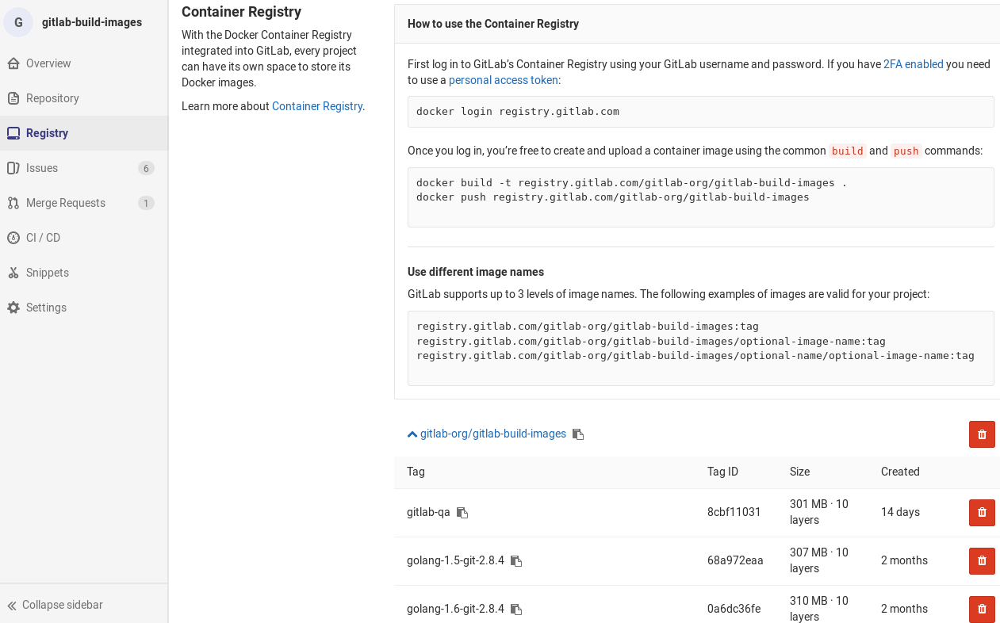
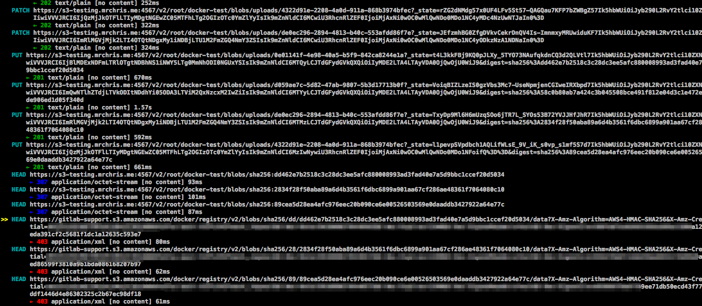

# GitLab Container Registry

>**Notes:**
> [Introduced][ce-4040] in GitLab 8.8.
- Docker Registry manifest `v1` support was added in GitLab 8.9 to support Docker
  versions earlier than 1.10.
- This document is about the user guide. To learn how to enable GitLab Container
  Registry across your GitLab instance, visit the
  [administrator documentation](../../administration/container_registry.md).
- Starting from GitLab 8.12, if you have 2FA enabled in your account, you need
  to pass a [personal access token][pat] instead of your password in order to
  login to GitLab's Container Registry.
- Multiple level image names support was added in GitLab 9.1

With the Docker Container Registry integrated into GitLab, every project can
have its own space to store its Docker images.

You can read more about Docker Registry at https://docs.docker.com/registry/introduction/.

## Enable the Container Registry for your project

NOTE: **Note:**
If you cannot find the Container Registry entry under your project's settings,
that means that it is not enabled in your GitLab instance. Ask your administrator
to enable it.

1. First, ask your system administrator to enable GitLab Container Registry
   following the [administration documentation](../../administration/container_registry.md).
   If you are using GitLab.com, this is enabled by default so you can start using
   the Registry immediately. Currently there is a soft (10GB) size restriction for 
   registry on GitLab.com, as part of the [repository size limit](repository/index.html#repository-size).
1. Go to your [project's General settings](settings/index.md#sharing-and-permissions)
   and enable the **Container Registry** feature on your project. For new
   projects this might be enabled by default. For existing projects
   (prior GitLab 8.8), you will have to explicitly enable it.
1. Hit **Save changes** for the changes to take effect. You should now be able
   to see the **Registry** link in the sidebar.



## Build and push images

>**Notes:**
- Moving or renaming existing container registry repositories is not supported
once you have pushed images because the images are signed, and the
signature includes the repository name.
- To move or rename a repository with a container registry you will have to
delete all existing images.


If you visit the **Registry** link under your project's menu, you can see the
explicit instructions to login to the Container Registry using your GitLab
credentials.

For example if the Registry's URL is `registry.example.com`, the you should be
able to login with:

```
docker login registry.example.com
```

Building and publishing images should be a straightforward process. Just make
sure that you are using the Registry URL with the namespace and project name
that is hosted on GitLab:

```
docker build -t registry.example.com/group/project/image .
docker push registry.example.com/group/project/image
```

Your image will be named after the following scheme:

```
<registry URL>/<namespace>/<project>/<image>
```

GitLab supports up to three levels of image repository names.

Following examples of image tags are valid:

```
registry.example.com/group/project:some-tag
registry.example.com/group/project/image:latest
registry.example.com/group/project/my/image:rc1
```

## Use images from GitLab Container Registry

To download and run a container from images hosted in GitLab Container Registry,
use `docker run`:

```
docker run [options] registry.example.com/group/project/image [arguments]
```

For more information on running Docker containers, visit the
[Docker documentation][docker-docs].

## Control Container Registry from within GitLab

GitLab offers a simple Container Registry management panel. Go to your project
and click **Registry** in the project menu.

This view will show you all tags in your project and will easily allow you to
delete them.

## Build and push images using GitLab CI

> **Note:**
This feature requires GitLab 8.8 and GitLab Runner 1.2.

Make sure that your GitLab Runner is configured to allow building Docker images by
following the [Using Docker Build](../../ci/docker/using_docker_build.md)
and [Using the GitLab Container Registry documentation](../../ci/docker/using_docker_build.md#using-the-gitlab-container-registry).

## Using with private projects

> Personal Access tokens were [introduced][ce-11845] in GitLab 9.3.
> Project Deploy Tokens were [introduced][ce-17894] in GitLab 10.7

If a project is private, credentials will need to be provided for authorization.
The preferred way to do this, is either by using a [personal access tokens][pat] or a [project deploy token][pdt].
The minimal scope needed for both of them is `read_registry`.

Example of using a personal access token:
```
docker login registry.example.com -u <your_username> -p <your_access_token>
```

## Troubleshooting the GitLab Container Registry

### Basic Troubleshooting

1. Check to make sure that the system clock on your Docker client and GitLab server have
   been synchronized (e.g. via NTP).

2. If you are using an S3-backed Registry, double check that the IAM
   permissions and the S3 credentials (including region) are correct. See [the
   sample IAM policy](https://docs.docker.com/registry/storage-drivers/s3/)
   for more details.

3. Check the Registry logs (e.g. `/var/log/gitlab/registry/current`) and the GitLab production logs
   for errors (e.g. `/var/log/gitlab/gitlab-rails/production.log`). You may be able to find clues
   there.

### Advanced Troubleshooting

>**NOTE:** The following section is only recommended for experts.

Sometimes it's not obvious what is wrong, and you may need to dive deeper into
the communication between the Docker client and the Registry to find out
what's wrong. We will use a concrete example in the past to illustrate how to
diagnose a problem with the S3 setup.

#### Unexpected 403 error during push

A user attempted to enable an S3-backed Registry. The `docker login` step went
fine. However, when pushing an image, the output showed:

```
The push refers to a repository [s3-testing.myregistry.com:4567/root/docker-test/docker-image]
dc5e59c14160: Pushing [==================================================>] 14.85 kB
03c20c1a019a: Pushing [==================================================>] 2.048 kB
a08f14ef632e: Pushing [==================================================>] 2.048 kB
228950524c88: Pushing 2.048 kB
6a8ecde4cc03: Pushing [==>                                                ] 9.901 MB/205.7 MB
5f70bf18a086: Pushing 1.024 kB
737f40e80b7f: Waiting
82b57dbc5385: Waiting
19429b698a22: Waiting
9436069b92a3: Waiting
error parsing HTTP 403 response body: unexpected end of JSON input: ""
```

This error is ambiguous, as it's not clear whether the 403 is coming from the
GitLab Rails application, the Docker Registry, or something else. In this
case, since we know that since the login succeeded, we probably need to look
at the communication between the client and the Registry.

The REST API between the Docker client and Registry is [described
here](https://docs.docker.com/registry/spec/api/). Normally, one would just
use Wireshark or tcpdump to capture the traffic and see where things went
wrong.  However, since all communication between Docker clients and servers
are done over HTTPS, it's a bit difficult to decrypt the traffic quickly even
if you know the private key. What can we do instead?

One way would be to disable HTTPS by setting up an [insecure
Registry](https://docs.docker.com/registry/insecure/). This could introduce a
security hole and is only recommended for local testing. If you have a
production system and can't or don't want to do this, there is another way:
use mitmproxy, which stands for Man-in-the-Middle Proxy.

#### mitmproxy

[mitmproxy](https://mitmproxy.org/) allows you to place a proxy between your
client and server to inspect all traffic. One wrinkle is that your system
needs to trust the mitmproxy SSL certificates for this to work.

The following installation instructions assume you are running Ubuntu:

1. Install mitmproxy (see http://docs.mitmproxy.org/en/stable/install.html)
1. Run `mitmproxy --port 9000` to generate its certificates.
   Enter <kbd>CTRL</kbd>-<kbd>C</kbd> to quit.
1. Install the certificate from `~/.mitmproxy` to your system:

    ```sh
    sudo cp ~/.mitmproxy/mitmproxy-ca-cert.pem /usr/local/share/ca-certificates/mitmproxy-ca-cert.crt
    sudo update-ca-certificates
    ```

If successful, the output should indicate that a certificate was added:

```sh
Updating certificates in /etc/ssl/certs... 1 added, 0 removed; done.
Running hooks in /etc/ca-certificates/update.d....done.
```

To verify that the certificates are properly installed, run:

```sh
mitmproxy --port 9000
```

This will run mitmproxy on port `9000`. In another window, run:

```sh
curl --proxy http://localhost:9000 https://httpbin.org/status/200
```

If everything is setup correctly, you will see information on the mitmproxy window and
no errors from the curl commands.

#### Running the Docker daemon with a proxy

For Docker to connect through a proxy, you must start the Docker daemon with the
proper environment variables. The easiest way is to shutdown Docker (e.g. `sudo initctl stop docker`)
and then run Docker by hand. As root, run:

```sh
export HTTP_PROXY="http://localhost:9000"
export HTTPS_PROXY="https://localhost:9000"
docker daemon --debug
```

This will launch the Docker daemon and proxy all connections through mitmproxy.

#### Running the Docker client

Now that we have mitmproxy and Docker running, we can attempt to login and push
a container image. You may need to run as root to do this. For example:

```sh
docker login s3-testing.myregistry.com:4567
docker push s3-testing.myregistry.com:4567/root/docker-test/docker-image
```

In the example above, we see the following trace on the mitmproxy window:



The above image shows:

* The initial PUT requests went through fine with a 201 status code.
* The 201 redirected the client to the S3 bucket.
* The HEAD request to the AWS bucket reported a 403 Unauthorized.

What does this mean? This strongly suggests that the S3 user does not have the right
[permissions to perform a HEAD request](http://docs.aws.amazon.com/AmazonS3/latest/API/RESTObjectHEAD.html).
The solution: check the [IAM permissions again](https://docs.docker.com/registry/storage-drivers/s3/).
Once the right permissions were set, the error will go away.

[ce-4040]: https://gitlab.com/gitlab-org/gitlab-ce/merge_requests/4040
[ce-11845]: https://gitlab.com/gitlab-org/gitlab-ce/merge_requests/11845
[ce-17894]: https://gitlab.com/gitlab-org/gitlab-ce/merge_requests/17894
[docker-docs]: https://docs.docker.com/engine/userguide/intro/
[pat]: ../profile/personal_access_tokens.md
[pdt]: ../project/deploy_tokens/index.md
