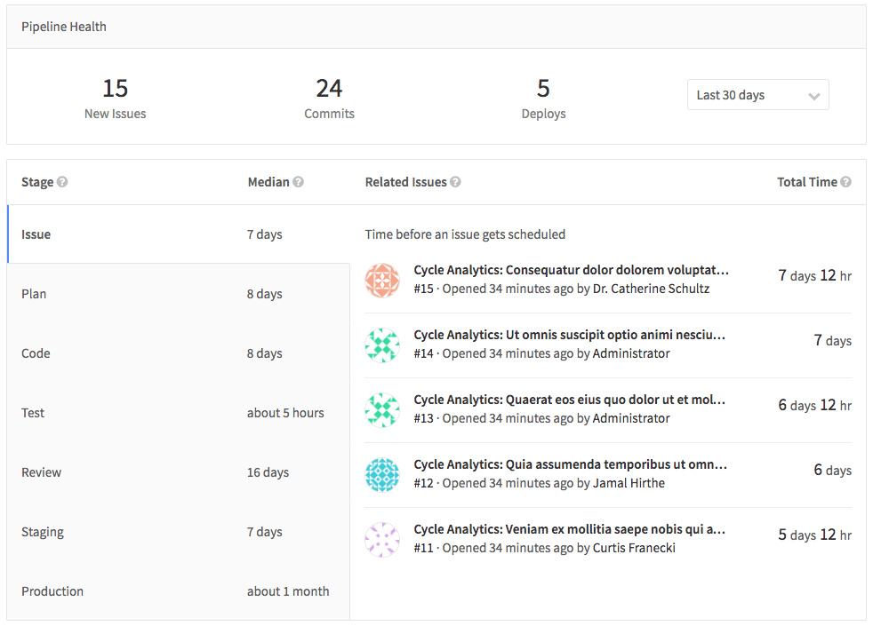

# Cycle Analytics

> [Introduced][ce-5986] in GitLab 8.12.
>
> **Note:**
This the first iteration of Cycle Analytics, you can follow the following issue
to track the changes that are coming to this feature: [#20975][ce-20975].

Cycle Analytics measures the time it takes to go from [an idea to production] for
each project you have. This is achieved by not only indicating the total time it
takes to reach at that point, but the total time is broken down into the
multiple stages an idea has to pass through to be shipped.

Cycle Analytics is that it is tightly coupled with the [GitLab flow] and
calculates a separate median for each stage.

## Overview

You can find the Cycle Analytics page under your project's **Pipelines > Cycle
Analytics** tab.

You can see that there are seven stages in total:

- **Issue** (Tracker)
    - Median time from issue creation until given a milestone or list label
      (first assignment, any milestone, milestone date or assignee is not required)
- **Plan** (Board)
    - Median time from giving an issue a milestone or label until pushing the
      first commit
- **Code** (IDE)
    - Median time from the first commit until the merge request is created
- **Test** (CI)
    - Median total test time for all commits/merges
- **Review** (Merge Request/MR)
    - Median time from merge request creation until the merge request is merged
      (closed merge requests won't be taken into account)
- **Staging** (Continuous Deployment)
    - Median time from when the merge request got merged until the deploy to
      production (production is last stage/environment)
- **Production** (Total)
   - Sum of all the above stages excluding the Test (CI) time

## How the data is measured

Cycle Analytics records cycle time so only data on the issues that have been
deployed to production are measured. In case you just started a new project and
you have not pushed anything to production, then you will not be able to
properly see the Cycle Analytics of your project.

Specifically, if your CI is not set up and you have not defined a `production`
[environment], then you will not have any data.

Below you can see in more detail what the various stages of Cycle Analytics mean.

| **Stage** | **Description** |
| --------- | --------------- |
| Issue     | Measures the median time between creating an issue and taking action to solve it, by either labeling it or adding it to a milestone, whatever comes first. The label will be tracked only if it already has an [Issue Board list][board] created for it. |
| Plan      | Measures the median time between the action you took for the previous stage, and pushing the first commit to the repository. To make this change tracked, the pushed commit needs to contain the [issue closing pattern], for example `Closes #xxx`, where `xxx` is the number of the issue related to this commit. If the commit does not contain the issue closing pattern, it is not considered to the measurement time of the stage. |
| Code      | Measures the median time between pushing a first commit (previous stage) and creating a merge request related to that commit. The key to keep the process tracked is include the [issue closing pattern] to the description of the merge request. |
| Test      | Measures the median time to run the entire pipeline for that project. It's related to the time GitLab CI takes to run every job for the commits pushed to that merge request defined in the previous stage. It is basically the start->finish time for all pipelines. `master` is not excluded. It does not attempt to track time for any particular stages. |
| Review    | Measures the median time taken to review the merge request, between its creation and until it's merged. |
| Staging   | Measures the median time between merging the merge request until the very first deployment to production. It's tracked by the [environment] set to `production` in your GitLab CI configuration. If there isn't a `production` environment, this is not tracked. |
| Production| The sum of all time taken to run the entire process, from issue creation to deploying the code to production. |

---

Here's a little explanation of how this works behind the scenes:

1. Issues and merge requests are grouped together in pairs, such that for each
   `<issue, merge request>` pair, the merge request has `Fixes #xxx` for the
   corresponding issue. All other issues and merge requests are **not** considered.

1. Then the <issue, merge request> pairs are filtered out. Any merge request
   that has **not** been deployed to production in the last XX days (specified
   by the UI - default is 90 days) prohibits these pairs from being considered.

1. For the remaining `<issue, merge request>` pairs, we check the information that
   we need for the stages, like issue creation date, merge request merge time,
   etc.

To sum up, anything that doesn't follow the [GitLab flow] won't be tracked at all.
So, if a merge request doesn't close an issue or an issue is not labeled with a
label present in the Issue Board or assigned a milestone or a project has no
`production` environment, the Cycle Analytics dashboard won't present any data
at all.

## Permissions

The current permissions on the Cycle Analytics dashboard are:

- Public projects - anyone can access
- Private/internal projects - any member (guest level and above) can access

You can [read more about permissions][permissions] in general.

## More resources

Learn more about Cycle Analytics in the following resources:

- [Cycle Analytics feature page](https://about.gitlab.com/solutions/cycle-analytics/)
- [Cycle Analytics feature preview](https://about.gitlab.com/2016/09/16/feature-preview-introducing-cycle-analytics/)
- [Cycle Analytics feature highlight](https://about.gitlab.com/2016/09/21/cycle-analytics-feature-highlight/)

[ce-5986]: https://gitlab.com/gitlab-org/gitlab-ce/merge_requests/5986
[ce-20975]: https://gitlab.com/gitlab-org/gitlab-ce/issues/20975
[GitLab flow]: ../../workflow/gitlab_flow.md
[permissions]: ../permissions.md
[environment]: ../../ci/yaml/README.md#environment
[board]: issue_board.md#creating-a-new-list
[idea to production]: https://about.gitlab.com/2016/08/05/continuous-integration-delivery-and-deployment-with-gitlab/#from-idea-to-production-with-gitlab
[issue closing pattern]: issues/automatic_issue_closing.md
