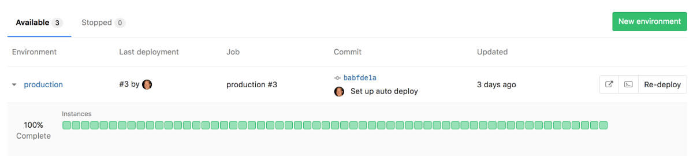
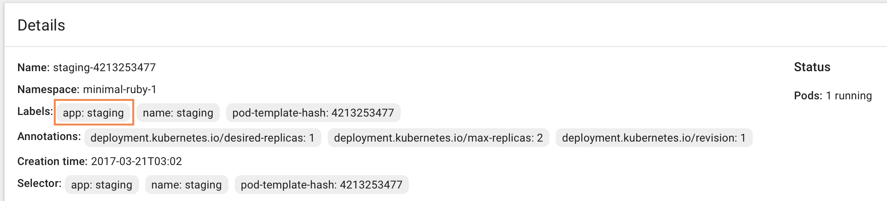

# Deploy Boards **(PREMIUM)**

> [Introduced][ee-1589] in [GitLab Premium][ee] 9.0.

GitLab's Deploy Boards offer a consolidated view of the current health and
status of each CI [environment] running on [Kubernetes], displaying the status
of the pods in the deployment. Developers and other teammates can view the
progress and status of a rollout, pod by pod, in the workflow they already use
without any need to access Kubernetes.

## Overview

With Deploy Boards you can gain more insight into deploys with benefits such as:

- Following a deploy from the start, not just when it's done
- Watching the rollout of a build across multiple servers
- Finer state detail (Succeeded, Running, Failed, Pending, Unknown)
- See [Canary Deployments](canary_deployments.md)

Here's an example of a Deploy Board of the production environment.

The squares represent pods in your Kubernetes cluster that are associated with
the given environment. Hovering above each square you can see the state of a
deploy rolling out. The percentage is the percent of the pods that are updated
to the latest release.

Since Deploy Boards are tightly coupled with Kubernetes, there is some required
knowledge. In particular you should be familiar with:

- [Kubernetes pods](https://kubernetes.io/docs/concepts/workloads/pods/pod/)
- [Kubernetes labels](https://kubernetes.io/docs/concepts/overview/working-with-objects/labels/)
- [Kubernetes namespaces](https://kubernetes.io/docs/concepts/overview/working-with-objects/namespaces/)
- [Kubernetes canary deployments](https://kubernetes.io/docs/concepts/cluster-administration/manage-deployment/#canary-deployments)

## Use cases

Since the Deploy Board is a visual representation of the Kubernetes pods for a
specific environment, there are lot of uses cases. To name a few:

- You want to promote what's running in staging, to production. You go to the
  environments list, verify that what's running in staging is what you think is
  running, then click on the [manual action](../../ci/yaml/README.md#whenmanual) to deploy to production.
- You trigger a deploy, and you've got lots of containers to upgrade so you know
  it'll take a while (you've also throttled your deploy to only take down X
  containers at a time). But you need to tell someone when it's deployed, so you
  go to the environments list, look at the production environment to see what
  the progress is in real-time as each pod is rolled.
- You get a report that something is weird in production, so you look at the
  production environment to see what is running, and if a deploy is ongoing or
  stuck or failed.
- You've got an MR that looks good, but you want to run it on staging because
  staging is set up in some way closer to production. You go to the environment
  list, find the [Review App][review apps] you're interested in, and click the
  manual action to deploy it to staging.

## Enabling Deploy Boards

To display the Deploy Boards for a specific [environment] you should:

1. Have [defined an environment](../../ci/environments.md#defining-environments) with a deploy stage.

1. Have a Kubernetes cluster up and running.

   NOTE: **Running on OpenShift:**
   If you are using OpenShift, ensure that you're using the `Deployment` resource
   instead of `DeploymentConfiguration`, otherwise the Deploy Boards won't render
   correctly. For more information, read the
   [OpenShift docs](https://docs.openshift.com/container-platform/3.7/dev_guide/deployments/kubernetes_deployments.html#kubernetes-deployments-vs-deployment-configurations)
   and [GitLab issue #4584](https://gitlab.com/gitlab-org/gitlab/issues/4584).

1. [Configure GitLab Runner][runners] with the [Docker][docker-exec] or
   [Kubernetes][kube-exec] executor.
1. Configure the [Kubernetes service][kube-service] in your project for the
   cluster. The Kubernetes namespace is of particular note as you will need it
   for your deployment scripts (exposed by the `KUBE_NAMESPACE` env variable).
1. Ensure Kubernetes annotations of `app.gitlab.com/env: $CI_ENVIRONMENT_SLUG`
   and `app.gitlab.com/app: $CI_PROJECT_PATH_SLUG` are applied to the
   deployments, replica sets, and pods, where `$CI_ENVIRONMENT_SLUG` and
   `$CI_PROJECT_PATH_SLUG` are the values of the CI variables. This is so we can
   lookup the proper environment in a cluster/namespace which may have more
   than one. These resources should be contained in the namespace defined in
   the Kubernetes service setting. You can use an [Autodeploy] `.gitlab-ci.yml`
   template which has predefined stages and commands to use, and automatically
   applies the annotations. Each project will need to have a unique namespace in
   Kubernetes as well. The image below demonstrates how this is shown inside
   Kubernetes.

   NOTE: **Note:**
   Matching based on the Kubernetes `app` label was removed in [GitLab
   12.1](https://gitlab.com/gitlab-org/gitlab/merge_requests/14020).
   To migrate, please apply the required annotations (see above) and
   re-deploy your application. If you are using Auto DevOps, this will
   be done automatically and no action is necessary.

   

Once all of the above are set up and the pipeline has run at least once,
navigate to the environments page under **Operations > Environments**.

Deploy Boards are visible by default. You can explicitly click
the triangle next to their respective environment name in order to hide them.

## Canary Deployments

A popular CI strategy, where a small portion of the fleet is updated to the new
version of your application.

[Read more about Canary Deployments.](canary_deployments.md)

## Further reading

- [GitLab Autodeploy][autodeploy]
- [GitLab CI environment variables][variables]
- [Environments and deployments][environment]
- [Kubernetes deploy example][kube-deploy]

[ee-1589]: https://gitlab.com/gitlab-org/gitlab/issues/1589 "Deploy Boards initial issue"
[ee]: https://about.gitlab.com/pricing/ "GitLab Enterprise Edition landing page"
[kube-deploy]: https://gitlab.com/gitlab-examples/kubernetes-deploy "Kubernetes deploy example project"
[kubernetes]: https://kubernetes.io "Kubernetes website"
[environment]: ../../ci/environments.md "Environments and deployments documentation"
[docker-exec]: https://docs.gitlab.com/runner/executors/docker.html "GitLab Runner Docker executor"
[kube-exec]: https://docs.gitlab.com/runner/executors/kubernetes.html "GitLab Runner Kubernetes executor"
[kube-service]: integrations/kubernetes.md "Kubernetes project service"
[review apps]: ../../ci/review_apps/index.md "Review Apps documentation"
[variables]: ../../ci/variables/README.md "GitLab CI variables"
[autodeploy]: ../../topics/autodevops/index.md#auto-deploy "GitLab Autodeploy"
[kube-image]: https://gitlab.com/gitlab-examples/kubernetes-deploy/container_registry "Kubernetes deploy Container Registry"
[runners]: ../../ci/runners/README.md
