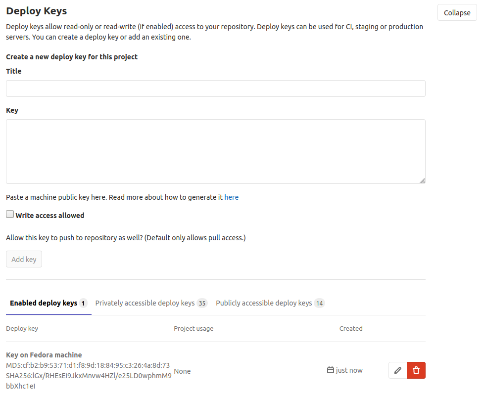
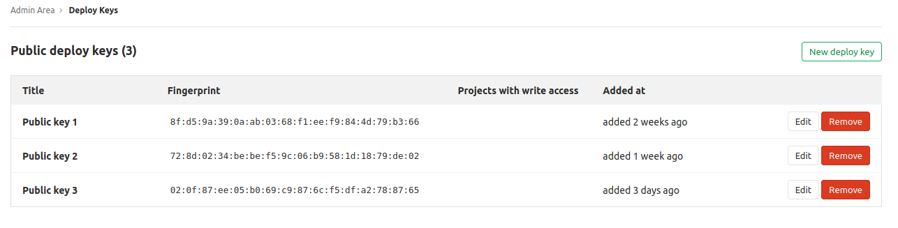

# Deploy keys

Deploy keys allow read-only or read-write access to your
repositories by importing an SSH public key into your GitLab instance.

This is useful, for example, for cloning repositories to your Continuous
Integration (CI) server. By using deploy keys, you don't have to set up a
fake user account.

There are two types of deploy keys:

- [Project deploy keys](#project-deploy-keys)
- [Public deploy keys](#public-deploy-keys)

## Key details on deploy keys

Deploy keys allow a remote machine (VM, physical, and so on) to access a GitLab
repository with just a few steps. If you want a remote machine to interact with a GitLab
repository in automation, it's a simple solution.

A drawback is that your repository could become vulnerable if a remote machine is compromised
by a hacker. You should limit access to the remote machine before a deploy key is
enabled on your repository. A good rule to follow is to provide access only to trusted users,
and make sure that the allowed users have at least the [Maintainer role](../../permissions.md)
in the GitLab project.

If this security implication is a concern for your organization,
[Deploy Tokens](../deploy_tokens/index.md) works as an alternative, but with more
security control.

## Deploy keys permissions

You can choose the access level of a deploy key when you enable it on a project:

- `read-only`: The deploy key can read a repository.
- `read-write`: The deploy key can read a repository and write to it.

Project maintainers and owners can activate and deactivate deploy keys.
They can also add their own deploy keys and enable them for this project.

When a `write-access` deploy key is used to push a commit, GitLab checks if
the **creator** of the deploy key has permission to access the resource. For example:

- When a deploy key is used to push a commit to a [protected branch](../protected_branches.md),
  the **creator** of the deploy key must have access to the branch.
- When a deploy key is used to push a commit that triggers a CI/CD pipelines, the **creator** of
  the deploy key must have access to the CI/CD resources (like protected environments, secret variables, and so on).
- If the **creator** of a deploy key does not have permissions to read a project's
  repository, the deploy key _might_ encounter an error during the process.

## Differences between deploy keys and deploy tokens

Both deploy keys and [deploy tokens](../deploy_tokens/index.md#deploy-tokens) can
help you access a repository, but there are some notables differences between them:

- Deploy keys are shareable between projects that are not related or don't even
  belong to the same group. Deploy tokens belong to either a project or
  [a group](../deploy_tokens/index.md#group-deploy-token).
- A deploy key is an SSH key you need to generate yourself on your machine. A deploy
  token is generated by your GitLab instance, and is provided to users only once
  (at creation time).
- A deploy key is valid as long as it's registered and enabled. Deploy tokens can
  be time-sensitive, as you can control their validity by setting an expiration date to them.
- You can't log in to a registry with deploy keys, or perform read / write operations
  on it, but this [is possible with deploy tokens](../deploy_tokens/index.md#gitlab-deploy-token).
- You need an SSH key pair to use deploy keys, but not deploy tokens.

## How to enable deploy keys

### Project deploy keys

[Project maintainers and owners](../../permissions.md#project-members-permissions)
can add or enable a deploy key for a project repository:

1. Navigate to the project's **Settings > Repository** page.
1. Expand the **Deploy keys** section.
1. Specify a title for the new deploy key and paste your public SSH key.
1. (Optional) Check **Grant write permissions to this key** to allow `read-write` access. Leave it unchecked for `read-only` access.

There are three lists of project deploy keys:

- Enabled deploy keys
- Privately accessible deploy keys
- Public accessible deploy keys

After you add a key, it's enabled for this project by default and it appears
in the **Enabled deploy keys** tab.

In the **Privately accessible deploy keys** tab, you can enable a private key which
has been already imported in a different project. If you have access to these keys,
it's because you have either:

- Previously uploaded the keys yourself in a different project.
- You are a maintainer or owner of the other project where the keys were imported.

In the **Publicly accessible deploy keys** tab, you can enable
keys that were [made available to your entire GitLab instance](#public-deploy-keys).

After a key is added, you can edit it to update its title, or switch between `read-only`
and `read-write` access.

NOTE:
If you have enabled a privately or publicly accessible or deploy key for your
project, and if you then update the access level for this key from `read-only` to
`read-write`, the change is only for the **current project**.

### Public deploy keys

Public deploy keys allow `read-only` or `read-write`
access to any repository in your GitLab instance. This is useful for integrating
repositories to secure, shared services, such as CI/CD.

Instance administrators can add public deploy keys:

1. On the top bar, select **Menu >** **{admin}** **Admin**.
1. On the left sidebar, select **Deploy Keys**.
1. Select **New deploy key**.

   Make sure your new key has a meaningful title, as it is the primary way for project
   maintainers and owners to identify the correct public deploy key to add. For example,
   if the key gives access to a SaaS CI/CD instance, use the name of that service
   in the key name if that is all the key is used for.

After adding a key, it's available to any shared systems. Project maintainers
or higher can [authorize a public deploy key](#project-deploy-keys) to start using it with the project.

NOTE:
The **Publicly accessible deploy keys** tab within Project's CI/CD settings only appears
if there is at least one Public deploy key configured.

Public deploy keys can provide greater security compared to project deploy keys, as
the administrator of the target integrated system is the only one who needs to know the key value,
or configure it.

When creating a Public deploy key, determine whether or not it can be defined for
very narrow usage, such as just a specific service, or if it needs to be defined for
broader usage, such as full `read-write` access for all services.

WARNING:
Adding a public deploy key does not immediately expose any repository to it. Public
deploy keys enable access from other systems, but access is not given to any project
until a project maintainer chooses to make use of it.

## How to disable deploy keys

[Project maintainers and owners](../../permissions.md#project-members-permissions)
can remove or disable a deploy key for a project repository:

1. Navigate to the project's **Settings > Repository** page.
1. Expand the **Deploy keys** section.
1. Select the **{remove}** or **{cancel}** button.

NOTE:
If anything relies on the removed deploy key, it will stop working once removed.

If the key is **publicly accessible**, it will be removed from the project, but still available under **Publicly accessible deploy keys**.

If the key is **privately accessible** and only in use by this project, it will deleted.

If the key is **privately accessible** and in use by other projects, it will be removed from the project, but still available under **Privately accessible deploy keys**.

## Troubleshooting

### Deploy key cannot push to a protected branch

If the owner of this deploy key doesn't have access to a [protected
branch](../protected_branches.md), then this deploy key doesn't have access to
the branch either. In addition to this, choosing the **No one** value in
[the "Allowed to push" section](../protected_branches.md#configure-a-protected-branch)
means that no users **and** no services using deploy keys can push to that selected branch.

Refer to [this issue](https://gitlab.com/gitlab-org/gitlab/-/issues/30769) for more information.
