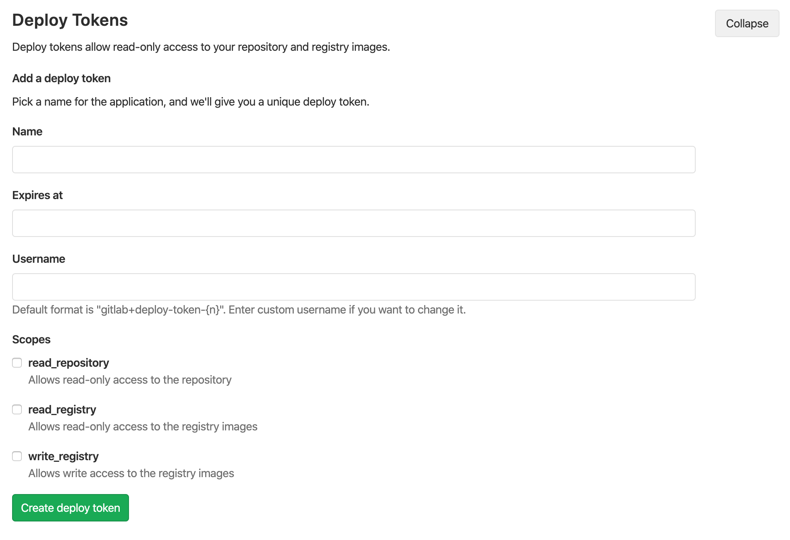

# Deploy Tokens

> [Introduced][ce-17894] in GitLab 10.7.

Deploy tokens allow to download (through `git clone`), or read the container registry images of a project without the need of having a user and a password.

Please note, that the expiration of deploy tokens happens on the date you define,
at midnight UTC and that they can be only managed by [masters](https://docs.gitlab.com/ee/user/permissions.html).

## Creating a Deploy Token

You can create as many deploy tokens as you like from the settings of your project: 

1. Log in to your GitLab account.
1. Go to the project you want to create Deploy Tokens for.
1. Go to **Settings** > **Repository**
1. Click on "Expand" on **Deploy Tokens** section
1. Choose a name and optionally an expiry date for the token.
1. Choose the [desired scopes](#limiting-scopes-of-a-deploy-token).
1. Click on **Create deploy token**.
1. Save the deploy token somewhere safe. Once you leave or refresh
   the page, **you won't be able to access it again**.



## Revoking a deploy token

At any time, you can revoke any deploy token by just clicking the
respective **Revoke** button under the 'Active deploy tokens' area.

## Limiting scopes of a deploy token

Deploy tokens can be created with two different scopes that allow various
actions that a given token can perform. The available scopes are depicted in
the following table.

| Scope | Description |
| ----- | ----------- |
| `read_repository` | Allows read-access to the repository through `git clone` |
| `read_registry` | Allows read-access to [container registry] images if a project is private and authorization is required. |

## Usage

### Git clone a repository

To download a repository using a Deploy Token, you just need to:

1. Create a Deploy Token with `read_repository` as a scope.
2. Take note of your `username` and `token`
3. `git clone` the project using the Deploy Token:


```bash
git clone http://<username>:<deploy_token>@gitlab.example.com/tanuki/awesome_project.git
```

Just replace `<username>` and `<deploy_token>` with the proper values

### Read container registry images

To read the container registry images, you'll need to:

1. Create a Deploy Token with `read_registry` as a scope.
2. Take note of your `username` and `token`
3. Log in to GitLab’s Container Registry using the deploy token:

```
docker login registry.example.com -u <username> -p <deploy_token>
```

Just replace `<username>` and `<deploy_token>` with the proper values. Then you can simply 
pull images from your Container Registry.

[ce-17894]: https://gitlab.com/gitlab-org/gitlab-ce/merge_requests/17894
[ce-11845]: https://gitlab.com/gitlab-org/gitlab-ce/merge_requests/11845
[container registry]: ../container_registry.md
