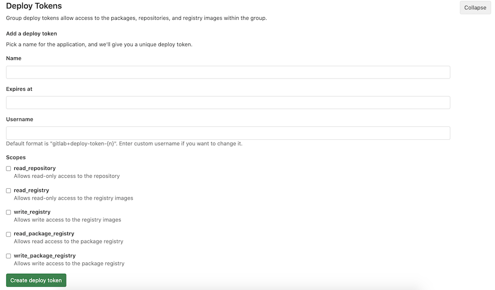

# Deploy tokens

> - [Introduced](https://gitlab.com/gitlab-org/gitlab-foss/-/merge_requests/17894) in GitLab 10.7.
> - [Moved](https://gitlab.com/gitlab-org/gitlab/-/issues/199370) from **Settings > Repository** in GitLab 12.9.
> - [Added `write_registry` scope](https://gitlab.com/gitlab-org/gitlab/-/issues/22743) in GitLab 12.10.
> - [Moved](https://gitlab.com/gitlab-org/gitlab/-/merge_requests/29280) from **Settings > CI/CD** in GitLab 12.10.1.
> - [Added package registry scopes](https://gitlab.com/gitlab-org/gitlab/-/issues/213566) in GitLab 13.0.

Deploy tokens allow you to download (`git clone`) or push and pull packages and
container registry images of a project without having a user and a password.

Deploy tokens can be managed by [maintainers only](../../permissions.md).

Deploy tokens cannot be used with the GitLab API.

If you have a key pair, you might want to use [deploy keys](../../project/deploy_keys/index.md)
instead.

## Creating a Deploy token

You can create as many deploy tokens as you need from the settings of your
project. Alternatively, you can also create [group-scoped deploy tokens](#group-deploy-token).

1. Sign in to your GitLab account.
1. Go to the project (or group) you want to create deploy tokens for.
1. Go to **Settings > Repository**.
1. Expand the **Deploy tokens** section.
1. Choose a name, expiry date (optional), and username (optional) for the token.
1. Choose the [desired scopes](#limiting-scopes-of-a-deploy-token).
1. Select **Create deploy token**.
1. Save the deploy token somewhere safe. After you leave or refresh
   the page, **you can't access it again**.



## Deploy token expiration

Deploy tokens expire at midnight UTC on the date you define.

## Revoking a deploy token

To revoke a deploy token, under the **Active deploy tokens** area,
select the respective **Revoke** button.

## Limiting scopes of a deploy token

Deploy tokens can be created with different scopes that allow various actions
that a given token can perform. The available scopes are depicted in the
following table along with GitLab version it was introduced in:

| Scope                    | Description | Introduced in GitLab Version |
|--------------------------|-------------|------------------------------|
| `read_repository`        | Allows read-access to the repository through `git clone` | 10.7 |
| `read_registry`          | Allows read-access to [container registry](../../packages/container_registry/index.md) images if a project is private and authorization is required. | 10.7 |
| `write_registry`         | Allows write-access (push) to [container registry](../../packages/container_registry/index.md). | 12.10 |
| `read_package_registry`  | Allows read access to the package registry. | 13.0 |
| `write_package_registry` | Allows write access to the package registry. | 13.0 |

## Deploy token custom username

> [Introduced](https://gitlab.com/gitlab-org/gitlab-foss/-/merge_requests/29639) in GitLab 12.1.

The default username format is `gitlab+deploy-token-{n}`. Some tools or
platforms may not support this format; in this case you can specify a custom
username to be used when creating the deploy token.

## Usage

### Git clone a repository

To download a repository using a deploy token:

1. Create a deploy token with `read_repository` as a scope.
1. Take note of your `username` and `token`.
1. `git clone` the project using the deploy token:

   ```shell
   git clone https://<username>:<deploy_token>@gitlab.example.com/tanuki/awesome_project.git
   ```

Replace `<username>` and `<deploy_token>` with the proper values.

### Read Container Registry images

To read the container registry images, you must:

1. Create a deploy token with `read_registry` as a scope.
1. Take note of your `username` and `token`.
1. Sign in to the GitLab Container Registry using the deploy token:

```shell
docker login -u <username> -p <deploy_token> registry.example.com
```

Replace `<username>` and `<deploy_token>` with the proper values. You can now
pull images from your Container Registry.

### Push Container Registry images

> [Introduced](https://gitlab.com/gitlab-org/gitlab/-/issues/22743) in GitLab 12.10.

To push the container registry images, you must:

1. Create a deploy token with `write_registry` as a scope.
1. Take note of your `username` and `token`.
1. Sign in to the GitLab Container Registry using the deploy token:

   ```shell
   docker login -u <username> -p <deploy_token> registry.example.com
   ```

Replace `<username>` and `<deploy_token>` with the proper values. You can now
push images to your Container Registry.

### Read or pull packages

> [Introduced](https://gitlab.com/gitlab-org/gitlab/-/issues/213566) in GitLab 13.0.

To pull packages in the GitLab package registry, you must:

1. Create a deploy token with `read_package_registry` as a scope.
1. Take note of your `username` and `token`.
1. For the [package type of your choice](../../packages/index.md), follow the
   authentication instructions for deploy tokens.

Example request publishing a NuGet package using a deploy token:

```shell
nuget source Add -Name GitLab -Source "https://gitlab.example.com/api/v4/projects/10/packages/nuget/index.json" -UserName deploy-token-username -Password 12345678asdf

nuget push mypkg.nupkg -Source GitLab
```

### Push or upload packages

> [Introduced](https://gitlab.com/gitlab-org/gitlab/-/issues/213566) in GitLab 13.0.

To upload packages in the GitLab package registry, you must:

1. Create a deploy token with `write_package_registry` as a scope.
1. Take note of your `username` and `token`.
1. For the [package type of your choice](../../packages/index.md), follow the
   authentication instructions for deploy tokens.

### Group deploy token

> [Introduced](https://gitlab.com/gitlab-org/gitlab/-/issues/21765) in GitLab 12.9.

A deploy token created at the group level can be used across all projects that
belong either to the specific group or to one of its subgroups.

<i class="fa fa-youtube-play youtube" aria-hidden="true"></i>
For an overview, see [Group Deploy Tokens](https://youtu.be/8kxTJvaD9ks).

The Group deploy tokens UI is now accessible under **Settings > Repository**,
not **Settings > CI/CD** as indicated in the video.

To use a group deploy token:

1. [Create](#creating-a-deploy-token) a deploy token for a group.
1. Use it the same way you use a project deploy token when
   [cloning a repository](#git-clone-a-repository).

The scopes applied to a group deploy token (such as `read_repository`)
apply consistently when cloning the repository of related projects.

### GitLab deploy token

> [Introduced](https://gitlab.com/gitlab-org/gitlab-foss/-/merge_requests/18414) in GitLab 10.8.

There's a special case when it comes to deploy tokens. If a user creates one
named `gitlab-deploy-token`, the username and token of the deploy token is
automatically exposed to the CI/CD jobs as CI/CD variables: `CI_DEPLOY_USER`
and `CI_DEPLOY_PASSWORD`, respectively.

After you create the token, you can sign in to the Container Registry by using
those variables:

```shell
docker login -u $CI_DEPLOY_USER -p $CI_DEPLOY_PASSWORD $CI_REGISTRY
```

NOTE:
The special handling for the `gitlab-deploy-token` deploy token is not
implemented for group deploy tokens. To make the group-level deploy token available for
CI/CD jobs, the `CI_DEPLOY_USER` and `CI_DEPLOY_PASSWORD` variables should be set under **Settings** to the name and token of the group deploy token respectively.
