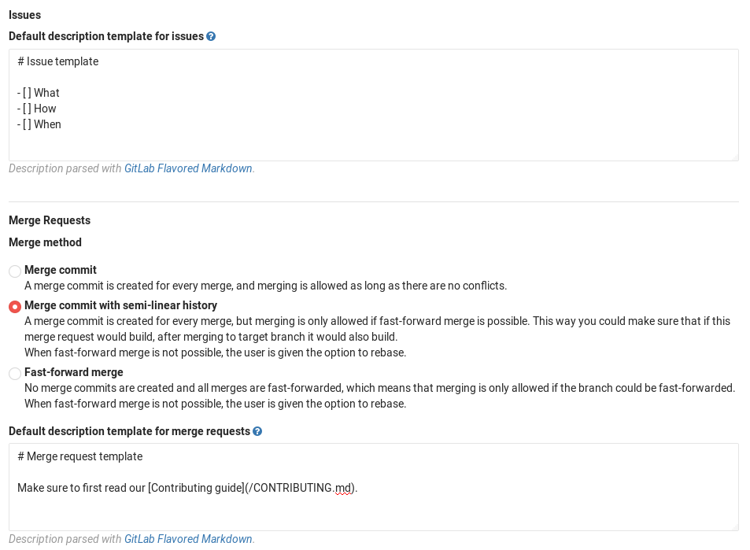

# Description templates

>[Introduced][ce-4981] in GitLab 8.11.

We all know that a properly submitted issue is more likely to be addressed in
a timely manner by the developers of a project.

Description templates allow you to define context-specific templates for issue
and merge request description fields for your project, as well as help filter
out a lot of unnecessary noise from issues.

## Overview

By using the description templates, users that create a new issue or merge
request can select a description template to help them communicate with other
contributors effectively.

Every GitLab project can define its own set of description templates as they
are added to the root directory of a GitLab project's repository.

Description templates must be written in [Markdown](../markdown.md) and stored
in your project's repository under a directory named `.gitlab`. Only the
templates of the default branch will be taken into account.

## Use-cases

- Add a template to be used in every issue for a specific project,
giving instructions and guidelines, requiring for information specific to that subject.
For example, if you have a project for tracking new blog posts, you can require the
title, outlines, author name, author social media information, etc.
- Following the previous example, you can make a template for every MR submitted
with a new blog post, requiring information about the post date, frontmatter data,
images guidelines, link to the related issue, reviewer name, etc.
- You can also create issues and merge request templates for different
stages of your workflow, e.g., feature proposal, feature improvement, bug report, etc.

## Creating issue templates

Create a new Markdown (`.md`) file inside the `.gitlab/issue_templates/`
directory in your repository. Commit and push to your default branch.

## Creating merge request templates

Similarly to issue templates, create a new Markdown (`.md`) file inside the
`.gitlab/merge_request_templates/` directory in your repository. Commit and
push to your default branch.

## Using the templates

Let's take for example that you've created the file `.gitlab/issue_templates/Bug.md`.
This will enable the `Bug` dropdown option when creating or editing issues. When
`Bug` is selected, the content from the `Bug.md` template file will be copied
to the issue description field. The 'Reset template' button will discard any
changes you made after picking the template and return it to its initial status.


## Setting a default template for issues and merge requests  **[STARTER**

>
**Notes:**
- This feature was introduced before [description templates](#overview) and is
  available in [GitLab Starter][products]. It can be enabled
  in the project's settings.
- Templates for issues were [introduced][ee-28] in GitLab EE 8.1.
- Templates for merge requests were [introduced][ee-7478ece] in GitLab EE 6.9.

The visibility of issues and/or merge requests should be set to either "Everyone
with access" or "Only team members" in your project's **Settings** otherwise the
template text areas won't show. This is the default behavior so in most cases
you should be fine.

Go to your project's **Settings** and fill in the "Default description template
for issues" and "Default description template for merge requests" text areas
for issues and merge requests respectively. Since GitLab issues and merge
request support [Markdown](../markdown.md), you can use special markup like
headings, lists, etc.



After you add the description, hit **Save changes** for the settings to take
effect. Now, every time a new issue or merge request is created, it will be
pre-filled with the text you entered in the template(s).

## Description template example

We make use of Description Templates for Issues and Merge Requests within the GitLab Community Edition project. Please refer to the [`.gitlab` folder][gitlab-ce-templates] for some examples.

> **Tip:**
It is possible to use [quick actions](./quick_actions.md) within description templates to quickly add labels, assignees, and milestones. The quick actions will only be executed if the user submitting the Issue or Merge Request has the permissions perform the relevant actions.

Here is an example for a Bug report template:

```
Summary

(Summarize the bug encountered concisely)


Steps to reproduce

(How one can reproduce the issue - this is very important)


Example Project

(If possible, please create an example project here on GitLab.com that exhibits the problematic behaviour, and link to it here in the bug report)

(If you are using an older version of GitLab, this will also determine whether the bug has been fixed in a more recent version)


What is the current bug behavior?

(What actually happens)


What is the expected correct behavior?

(What you should see instead)


Relevant logs and/or screenshots

(Paste any relevant logs - please use code blocks (```) to format console output,
logs, and code as it's very hard to read otherwise.)


Possible fixes

(If you can, link to the line of code that might be responsible for the problem)

/label ~bug ~reproduced ~needs-investigation
/cc @project-manager
/assign @qa-tester
```

[ce-4981]: https://gitlab.com/gitlab-org/gitlab-ce/merge_requests/4981
[gitlab-ce-templates]: https://gitlab.com/gitlab-org/gitlab-ce/tree/master/.gitlab
[ee-28]: https://gitlab.com/gitlab-org/gitlab-ee/merge_requests/28 "Merge Request for adding issues template"
[ee-7478ece]: https://gitlab.com/gitlab-org/gitlab-ee/commit/7478ece8b48e80782b5465b96c79f85cc91d391b "Commit that introduced merge requests templates"
[products]: https://about.gitlab.com/products/

