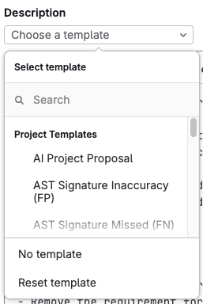
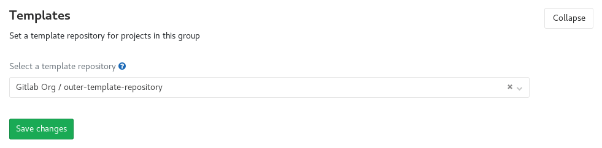



- Tier: Free, Premium, Ultimate
- Offering: GitLab.com, GitLab Self-Managed, GitLab Dedicated





- [Work item support](https://gitlab.com/gitlab-org/gitlab/-/issues/512208) introduced in GitLab 17.10.
- Support for epics [introduced](https://gitlab.com/groups/gitlab-org/-/epics/16088) in GitLab 17.10 [with a flag](../../administration/feature_flags/_index.md) named `work_item_epics`. Enabled by default. Introduced in [beta](../../policy/development_stages_support.md#beta).
- Support for epics [generally available](https://gitlab.com/gitlab-org/gitlab/-/issues/468310) in GitLab 18.1. Feature flag `work_item_epics` removed.



Description templates standardize and automate how issues and merge requests are created in GitLab.

Description templates:

- Create consistent layouts for issues and merge requests across projects.
- Provide specialized templates for different workflow stages and purposes.
- Support custom templates for projects, groups, and the entire instance.
- Auto-populate fields with variables and quick actions.
- Ensure proper tracking of bugs, features, and other work items.
- Format [Service Desk email responses](service_desk/configure.md#use-a-custom-template-for-service-desk-tickets).

You can define templates to use as descriptions
for your:

- [Issues](issues/_index.md)
- [Epics](../group/epics/_index.md) (requires [group-level description templates](#set-group-level-description-templates))
- [Tasks](../tasks.md)
- [Objectives and key results](../okrs.md)
- [Incidents](../../operations/incident_management/manage_incidents.md)
- [Service Desk tickets](service_desk/_index.md)
- [Merge requests](merge_requests/_index.md)

Projects inherit templates from their group and instance.

Templates must be:

- Saved with the `.md` extension.
- Stored in your project's repository in the `.gitlab/issue_templates` or `.gitlab/merge_request_templates` directory.
- Present on the default branch.

## Create a description template

Create a new description template as a Markdown (`.md`) file inside the `.gitlab/issue_templates/` directory in your repository.

To create a work item description template:

1. On the left sidebar, select **Search or go to** and find your project. If you've [turned on the new navigation](../interface_redesign.md#turn-new-navigation-on-or-off), this field is on the top bar.
1. Select **Code** > **Repository**.
1. Next to the default branch, select .
1. Select **New file**.
1. Next to the default branch, in the **File name** text box, enter `.gitlab/issue_templates/mytemplate.md`,
   where `mytemplate` is the name of your template.
1. Commit to your default branch.

To check if this has worked correctly:

1. [Create a new issue](issues/create_issues.md) or
   [create a new epic](../group/epics/manage_epics.md#create-an-epic).
1. See if you can find your description template in the **Choose a template** dropdown list.

## Create a merge request template

Similarly to issue templates, create a new Markdown (`.md`) file inside the
`.gitlab/merge_request_templates/` directory in your repository.
Unlike issue templates, merge requests have additional inheritance rules that depend on the contents
of commit messages and branch names.
For more information, see [creating merge requests](merge_requests/creating_merge_requests.md).

To create a merge request description template for a project:

1. On the left sidebar, select **Search or go to** and find your project. If you've [turned on the new navigation](../interface_redesign.md#turn-new-navigation-on-or-off), this field is on the top bar.
1. Select **Code** > **Repository**.
1. Next to the default branch, select .
1. Select **New file**.
1. Next to the default branch, in the **File name** text box, enter `.gitlab/merge_request_templates/mytemplate.md`,
   where `mytemplate` is the name of your merge request template.
1. Commit to your default branch.

To check if this has worked correctly, [create a new merge request](merge_requests/creating_merge_requests.md)
and see if you can find your description template in the **Choose a template** dropdown list.

## Use the templates

When you create or edit an issue or a merge request, it shows in the **Choose a template** dropdown list.

To apply a template:

1. Create or edit an issue, work item, or a merge request.
1. Select the **Choose a template** dropdown list.
1. If the **Description** text box hasn't been empty, to confirm, select **Apply template**.
1. Select **Save changes**.

When you select a description template, its content is copied to the description text box.

To discard any changes to the description you've made after selecting the template: expand the **Choose a template** dropdown list and select **Reset template**.





You can create shortcut links to create an issue using a designated template.
For example: `https://gitlab.com/gitlab-org/gitlab/-/issues/new?issuable_template=Feature%20proposal`. Read more about [creating issues using a URL with prefilled values](issues/create_issues.md#using-a-url-with-prefilled-values).



### Supported variables in merge request templates



- [Introduced](https://gitlab.com/gitlab-org/gitlab/-/merge_requests/89810) in GitLab 15.7.





This feature is available only for
[the default template](#set-a-default-template-for-merge-requests-and-issues).



When you save a merge request for the first time, GitLab replaces these variables in
your merge request template with their values:

| Variable                                | Description                                                                                                                                                 | Output example                                                                                                                                                                                   |
|-----------------------------------------|-------------------------------------------------------------------------------------------------------------------------------------------------------------|--------------------------------------------------------------------------------------------------------------------------------------------------------------------------------------------------|
| `%{all_commits}`                        | Messages from all commits in the merge request. Limited to 100 most recent commits. Skips commit bodies exceeding 100 KiB and merge commit messages.        | `* Feature introduced` <br><br> `This commit implements feature` <br> `Changelog:added` <br><br> `* Bug fixed` <br><br> `* Documentation improved` <br><br>`This commit introduced better docs.` |
| `%{co_authored_by}`                     | Names and emails of commit authors in a `Co-authored-by` Git commit trailer format. Limited to authors of 100 most recent commits in merge request.         | `Co-authored-by: Zane Doe <zdoe@example.com>` <br> `Co-authored-by: Blake Smith <bsmith@example.com>`                                                                                            |
| `%{first_commit}`                       | Full message of the first commit in merge request diff.                                                                                                     | `Update README.md`                                                                                                                                                                               |
| `%{first_multiline_commit}`             | Full message of the first commit that's not a merge commit and has more than one line in message body. Merge request title if all commits aren't multiline. | `Update README.md` <br><br> `Improved project description in readme file.`                                                                                                                       |
| `%{first_multiline_commit_description}` | Description (without the first line/title) of the first commit that's not a merge commit and has more than one line in message body.                        | `Improved project description in readme file.`                                                                                                                                                   |
| `%{source_branch}`                      | The name of the branch being merged.                                                                                                                        | `my-feature-branch`                                                                                                                                                                              |
| `%{target_branch}`                      | The name of the branch that the changes are applied to.                                                                                                     | `main`                                                                                                                                                                                           |

### Set instance-level description templates



- Tier: Premium, Ultimate
- Offering: GitLab Self-Managed, GitLab Dedicated



You can set a description template at the **instance level** for issues
and merge requests by using an [instance template repository](../../administration/settings/instance_template_repository.md).
You can also use the instance template repository for file templates.

You might also be interested in [project templates](../../administration/custom_project_templates.md)
that you can use when creating a new project in the instance.

### Set group-level description templates



- Tier: Premium, Ultimate
- Offering: GitLab.com, GitLab Self-Managed, GitLab Dedicated



With **group-level** description templates, you can select a project within the group to store
your templates. Then, you can access these templates in other projects in the group.
As a result, you can use the same templates in issues and merge requests in all the group's projects.

Prerequisites:

- You must have the Owner role for the group.
- The project must be a direct child of the group.

To re-use templates [you've created](description_templates.md#create-a-description-template):

1. On the left sidebar, select **Search or go to** and find your group. If you've [turned on the new navigation](../interface_redesign.md#turn-new-navigation-on-or-off), this field is on the top bar.
1. Select **Settings** > **General**.
1. Expand **Templates**.
1. From the dropdown list, select your template project as the template repository at group level.
1. Select **Save changes**.



You might also be interested in templates for various
[file types in groups](../group/manage.md#group-file-templates).

### Set a default template for merge requests and issues

In a project, you can choose a default description template for new issues and merge requests.
As a result, every time a new merge request or issue is created, it's pre-filled with the text you
entered in the template.

Prerequisites:

- On your project's left sidebar, select **Settings** > **General** and expand **Visibility, project features, permissions**.
  Ensure issues or merge requests are set to either **Everyone with access** or **Only Project Members**.

To set a default description template for merge requests, either:

- [Create a merge request template](#create-a-merge-request-template) named `Default.md` (case-insensitive)
  and save it in `.gitlab/merge_request_templates/`.
  The `Default.md` template does not take priority over the default template set in project settings.
  For more information, see [priority of default description templates](#priority-of-default-description-templates).
- Users on GitLab Premium and Ultimate: set the default template in project settings:

  1. On the left sidebar, select **Search or go to** and find your project. If you've [turned on the new navigation](../interface_redesign.md#turn-new-navigation-on-or-off), this field is on the top bar.
  1. Select **Settings** > **Merge requests**.
  1. In the **Default description template for merge requests** section, fill in the text area.
  1. Select **Save changes**.

To set a default description template for issues, either:

- [Create an issue template](#create-a-description-template) named `Default.md` (case-insensitive)
  and save it in `.gitlab/issue_templates/`.
  The `Default.md` template does not take priority over the default template set in project settings.
  For more information, see [priority of default description templates](#priority-of-default-description-templates).
- Users on GitLab Premium and Ultimate: set the default template in project settings:

  1. On the left sidebar, select **Search or go to** and find your project. If you've [turned on the new navigation](../interface_redesign.md#turn-new-navigation-on-or-off), this field is on the top bar.
  1. Select **Settings** > **General**.
  1. Expand **Default description template for issues**.
  1. Fill in the text area.
  1. Select **Save changes**.

Because GitLab merge request and issues support [Markdown](../markdown.md), you can use it to format
headings, lists, and so on.

You can also provide `issues_template` and `merge_requests_template` attributes in the
[Projects REST API](../../api/projects.md) to keep your default issue and merge request templates up to date.

#### Priority of default description templates

When you set [issue description templates](#set-a-default-template-for-merge-requests-and-issues)
in various places, they have the following priorities in a project.
The ones higher up override the ones below:

1. Template set in project settings.
1. `Default.md` (case-insensitive) from the parent group.
1. `Default.md` (case-insensitive) from the project repository.

Merge requests have [additional inheritance rules](merge_requests/creating_merge_requests.md)
that depend on the contents of commit messages and branch names.

## Example description template

We use description templates for issues and merge requests in the
[`.gitlab` folder](https://gitlab.com/gitlab-org/gitlab/-/tree/master/.gitlab) of the
GitLab project, which you can refer to for some examples.



It's possible to use [quick actions](quick_actions.md) in description templates to quickly add
labels, assignees, and milestones. The quick actions are only executed if the user submitting
the issue or merge request has the permissions to perform the relevant actions.



Here is an example of a bug report template:

```markdown
## Summary

<!-- HTML comments are not displayed -->
(Summarize the bug encountered concisely)

## Steps to reproduce

(How one can reproduce the issue - this is very important)

## Example Project

(If possible, create an example project here on GitLab.com that exhibits the problematic
behavior, and link to it here in the bug report.
If you are using an older version of GitLab, this will also determine whether the bug has been fixed
in a more recent version)

## What is the current bug behavior?

(What actually happens)

## What is the expected correct behavior?

(What you should see instead)

## Relevant logs and/or screenshots

(Paste any relevant logs - use code blocks (```) to format console output, logs, and code, as
it's very hard to read otherwise.)

## Possible fixes

(If you can, link to the line of code that might be responsible for the problem)

/label ~bug ~reproduced ~needs-investigation
/cc @project-manager
/assign @qa-tester
```
