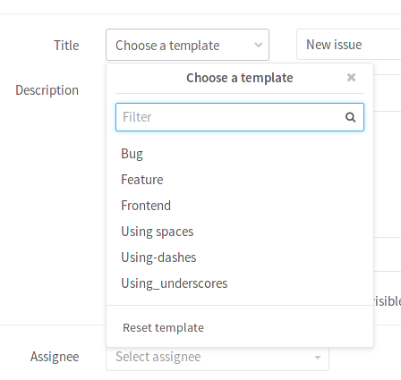
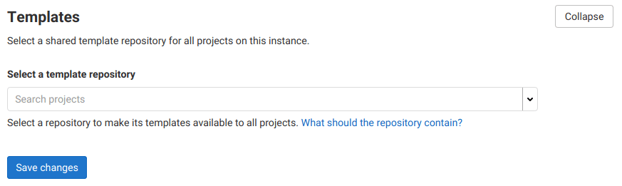

# Description templates **(FREE)**

We all know that a properly submitted issue is more likely to be addressed in
a timely manner by the developers of a project.

With description templates, you can define context-specific templates for issue and merge request
description fields for your project, and filter out unnecessary noise from issues.

By using the description templates, users that create a new issue or merge
request can select a description template to help them communicate with other
contributors effectively.

Every GitLab project can define its own set of description templates as they
are added to the root directory of a GitLab project's repository.

Description templates must be written in [Markdown](../markdown.md) and stored
in your project's repository in the `.gitlab` directory. Only the
templates of the default branch are taken into account.

To learn how to create templates for various file types in groups, visit
[Group file templates](../group/index.md#group-file-templates).

## Use cases

These are some situations when you might find description templates useful:

- You can create issues and merge request templates for different
  stages of your workflow, for example, feature proposal, feature improvement, or a bug report.
- Add a template to be used in every issue for a specific project,
  giving instructions and guidelines, requiring for information specific to that subject.
  For example, if you have a project for tracking new blog posts, you can require the
  title, outlines, author name, and author social media information.
- Following the previous example, you can make a template for every MR submitted
  with a new blog post, requiring information about the post date, front matter data,
  images guidelines, link to the related issue, reviewer name, and so on.
- You can also create issues and merge request templates for different
  stages of your workflow, for example, feature proposal, feature improvement, or a bug report.
- You can use an [issue description template](#create-an-issue-template) as a
  [Service Desk email template](service_desk.md#new-service-desk-issues).

## Create an issue template

Create a new Markdown (`.md`) file inside the `.gitlab/issue_templates/`
directory in your repository. Commit and push to your default branch.

To create a Markdown file:

1. In a project, go to **Repository**.
1. Next to the default branch, select the **{plus}** button.
1. Select **New file**.
1. Next to the default branch, in the **File name** field, add the name of your issue template.
   Make sure that your file has the `.md` extension, for
   example `feature_request.md` or `Feature Request.md`.
1. Commit and push to your default branch.

If you don't have a `.gitlab/issue_templates` directory in your repository, you need to create it.

To create the `.gitlab/issue_templates` directory:

1. In a project, go to **Repository**.
1. Next to the default branch, select the **{plus}** button.
1. Select **New directory**.
1. Name this new directory `.gitlab` and commit to your default branch.
1. Next to the default branch, select the **{plus}** button.
1. Select **New directory**.
1. Name your directory `issue_templates` and commit to your default branch.

To check if this has worked correctly, [create a new issue](issues/managing_issues.md#create-a-new-issue)
and see if you can choose a description template.

## Create a merge request template

Similarly to issue templates, create a new Markdown (`.md`) file inside the
`.gitlab/merge_request_templates/` directory in your repository. Commit and
push to your default branch.

## Use the templates

Let's take for example that you've created the file `.gitlab/issue_templates/Bug.md`.
This enables the `Bug` dropdown option when creating or editing issues. When
`Bug` is selected, the content from the `Bug.md` template file is copied
to the issue description field. The **Reset template** button discards any
changes you made after picking the template and returns it to its initial status.

NOTE:
You can create shortcut links to create an issue using a designated template.
For example: `https://gitlab.com/gitlab-org/gitlab/-/issues/new?issuable_template=Feature%20proposal`.



You can set description templates at various levels:

- The entire [instance](#set-instance-level-description-templates)
- A specific [group or subgroup](#set-group-level-description-templates)
- A specific [project](#set-a-default-template-for-merge-requests-and-issues)

The templates are inherited. For example, in a project, you can also access templates set for the
instance or the project's parent groups.

### Set instance-level description templates **(PREMIUM SELF)**

> - [Introduced](https://gitlab.com/gitlab-org/gitlab/-/merge_requests/52360) in GitLab 13.9.
> - [Feature flag removed](https://gitlab.com/gitlab-org/gitlab/-/issues/321247) in GitLab 14.0.

You can set a description template at the **instance level** for issues
and merge requests.
As a result, these templates are available in all projects within the instance.

Only instance administrators can set instance-level templates.

To set the instance-level description template repository:

1. On the top bar, select **Menu >** **{admin}** **Admin**.
1. On the left sidebar, select **Settings > Templates**.
1. Expand **Templates**
1. From the dropdown, select your template project as the template repository at instance level.
1. Select **Save changes**.



Learn more about [instance template repository](../admin_area/settings/instance_template_repository.md).

### Set group-level description templates **(PREMIUM)**

> - [Introduced](https://gitlab.com/gitlab-org/gitlab/-/merge_requests/52360) in GitLab 13.9.
> - [Feature flag removed](https://gitlab.com/gitlab-org/gitlab/-/issues/321247) in GitLab 14.0.

With **group-level** description templates, you can store your templates in a single repository and
configure the group file templates setting to point to that repository.
As a result, you can use the same templates in issues and merge requests in all the group's projects.

To re-use templates [you've created](../project/description_templates.md#create-an-issue-template):

1. Go to the group's **Settings > General > Templates**.
1. From the dropdown, select your template project as the template repository at group level.
1. Select **Save changes**.


### Set a default template for merge requests and issues **(PREMIUM)**

In a project, you can choose a default description template for new issues and merge requests.
As a result, every time a new merge request or issue is created, it's pre-filled with the text you
entered in the template.

The visibility of issues or merge requests should be set to either "Everyone
with access" or "Only Project Members" in your project's
**Settings / Visibility, project features, permissions** section. Otherwise, the
template text areas don't show. This is the default behavior, so in most cases
you should be fine.

To set a default description template for merge requests:

1. Go to your project's **Settings**.
1. Select **Expand** under the **Merge requests** header.
1. Fill in the **Default description template for merge requests** text area.
1. Select **Save changes**.

To set a default description template for issues:

1. Select **Expand** under **Default issue template**.
1. Fill in the **Default description template for issues** text area.

Because GitLab merge request and issues support [Markdown](../markdown.md), you can use it to format
headings, lists, and so on.

[GitLab versions 13.10 and later](https://gitlab.com/gitlab-org/gitlab/-/issues/885)
provide `issues_template` and `merge_requests_template` attributes in the
[Projects API](../../api/projects.md) to help you keep your templates up to date.

## Description template example

We use description templates for issues and merge requests in the
[`.gitlab` folder](https://gitlab.com/gitlab-org/gitlab/-/tree/master/.gitlab) of the
GitLab project, which you can refer to for some examples.

NOTE:
It's possible to use [quick actions](quick_actions.md) in description templates to quickly add
labels, assignees, and milestones. The quick actions are only executed if the user submitting
the issue or merge request has the permissions to perform the relevant actions.

Here is an example of a bug report template:

```markdown
## Summary

(Summarize the bug encountered concisely)

## Steps to reproduce

(How one can reproduce the issue - this is very important)

## Example Project

(If possible, please create an example project here on GitLab.com that exhibits the problematic
behavior, and link to it here in the bug report.
If you are using an older version of GitLab, this will also determine whether the bug has been fixed
in a more recent version)

## What is the current bug behavior?

(What actually happens)

## What is the expected correct behavior?

(What you should see instead)

## Relevant logs and/or screenshots

(Paste any relevant logs - please use code blocks (```) to format console output, logs, and code, as
it's very hard to read otherwise.)

## Possible fixes

(If you can, link to the line of code that might be responsible for the problem)

/label ~bug ~reproduced ~needs-investigation
/cc @project-manager
/assign @qa-tester
```
