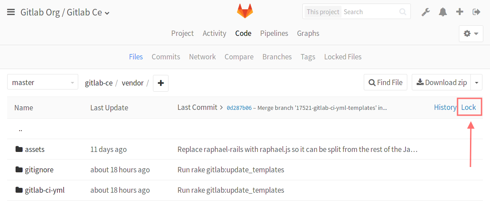
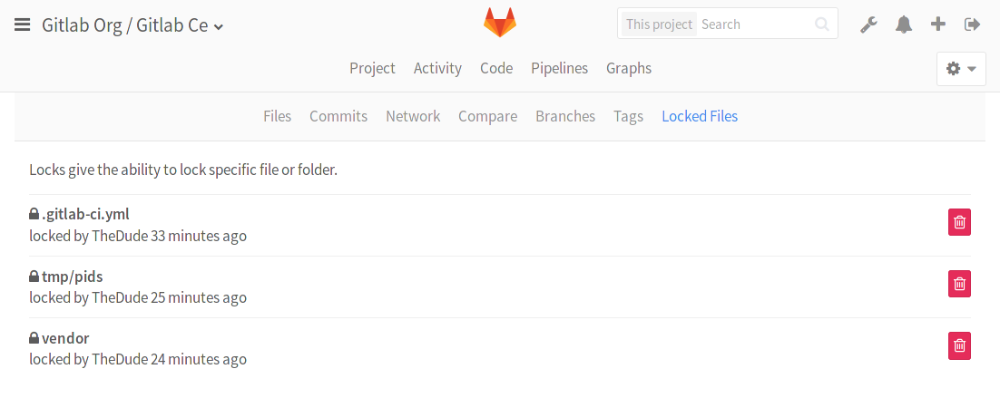

# File Lock

>**Note:**
This feature was [introduced][ee-440] in GitLab EE 8.9.

---

>**Note:**
This feature needs to have a license with the "File Lock" option enabled. If
you are using Enterprise Edition but you don't see the "Lock" button,
ask your GitLab administrator. Check GitLab's [pricing page] for more information.

GitLab gives you the ability to lock any file or folder in the repository tree
reserving you the right to make changes to that file or folder. **Locking only
works for the default branch you have set in the project's settings** (usually
`master`).

The file locking feature is useful in situations when:

- Multiple people are working on the same file and you won't to avoid merge
  conflicts.
- Your repository contains binary files in which situation there is no easy
  way to tell the diff between yours and your colleagues' changes.

---

If you lock a file or folder, then you are the only one who can push changes to
the repository where the locked objects are located. Locked folders are locked
recursively.

Locks can be created by any person who has [push access] to the repository; i.e.,
developer and higher level. Any user with master permissions can remove any
lock, no matter who is its author.

## Locking

To lock a file, navigate to the repository tree under the **Code > Files** tab,
pick the file you want to lock and hit the "Lock" button.

---

To lock an entire folder look for the "Lock" link next to "History".

---

After you lock a file or folder, it will appear as locked in the repository
view.

---

To unlock it follow the same procedure or see the following section.

## Viewing/Managing existing locks

To view or manage every existing lock, navigate to the
**Project > Code > Locked Files** section. Only the user that created the lock
and Masters are able to remove the locked objects.

[ee-440]: https://gitlab.com/gitlab-org/gitlab-ee/merge_requests/440 "File Lock"
[pricing page]: https://about.gitlab.com/pricing
[push access]: ../../permissions/permissions.md
